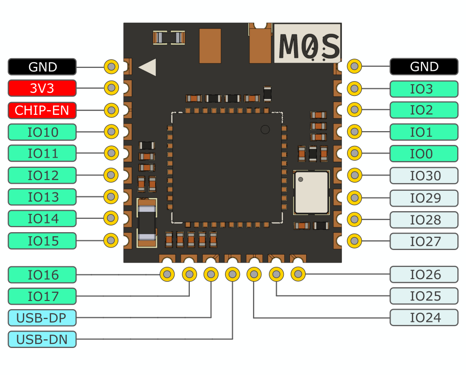

## 模块概述

Sipeed M0S 模块是基于[博流智能科技](http://www.bouffalolab.com/)的 BL616 芯片所设计的一款适用于超低功耗应用 IOT 模块，支持 Wifi6、蓝牙 5.2 和 zigbee 等无线协议，默认最高主频 320MHz，模块极小的封装体积和芯片多种低功耗模式和多种唤醒源满足不同的低功耗场景。

购买链接：[淘宝](https://item.taobao.com/item.htm?id=697403593463)

## 模块特点

- 无线三模一体： WiFi6 / 蓝牙 5.2 / Zigbee
- 高主频：默认最高 320MHz 
- 低功耗：WiFi6 低功耗特性
- DSP 加速：支持 RISC-V P 扩展指令集，可在 TinyMaix 推理框架中获得近一倍加速
- 高速 USB：支持 USB2.0 HS OTG， 高达 480Mbps
- 丰富外设接口：支持 RGB LCD，DVP Camera，以太网 RMII，SDIO 等
- 小体积：10mmx11mm 面积上集成了陶瓷天线，并全引脚引出

## 模块参数

<table>
    <thead>
        <tr>
            <th colspan = "2" > M0S 模块 </th>
        </tr>
    </thead>
    <tbody>
    <tr>
        <td rowspan="5" style="white-space:nowrap">主控 BL616 处理器</td>
    </tr>
    <tr>
        <td>RISC-V CPU：默认 RV32GCP@320MHz </td>
    </tr>
    <tr>
        <td>内置 480KB SRAM + 4MB Flash</td>
    </tr>
    <tr>
        <td>无线： - 支持 Wi-Fi6 - 支持 Bluetooth 5.2 Dual-mode(BT+BLE) - 支持 Zigbee </td>
    </tr>
    <tr>
      <td>USB 2.0 HS OTG</td>
    </tr>
    <tr>
        <td rowspan="2" style="white-space:nowrap"> 板载部件 </td>
    </tr>
    <tr>
        <td>陶瓷天线</td>
    </tr>
    </tbody>
    <tr>
        <td rowspan="4" style="white-space:nowrap"> 其他说明 </td>
    </tr>
    <tr>
        <td>
        尺寸：10mm (W) x 11mm (H)
        </td>
    </tr>
    <tr>
      <td>
        封装库文件 (KiCAD)：<a href="https://dl.sipeed.com/shareURL/Maix-Zero/M0S/M0S/4_Package">点击跳转</a>
      </td>
    </tr>
    <tr>
      <td>
        3D 模型文件下载：<a href="https://dl.sipeed.com/shareURL/Maix-Zero/M0S/M0S/3_3D_file">点击跳转</a>
      </td>
    </tr>
    </tbody>
</table>

## 引脚分布

## 产品对比

| 型号         |       M0S 模块        |   ESP32-S3 N4 模块   |
| ------------ | :-------------------: | :------------------: |
| 主控         |    BL616(RV32GCP)     |    ESP32-S3 (LX7)    |
| 频率         |        320MHz         |        240MHz        |
| SRAM         |         480KB         |        520KB         |
| Flash        |        4MByte         |        4MByte        |
| Wifi         |         WiFi6         |        WiFi4         |
| 蓝牙         |         BT5.2         |         BT5          |
| USB          | USB2.0 HS OTG 480Mbps | USB2.0 FS OTG 12Mbps |
| IIC/UART/SPI |          有           |          有          |
| DVP Camera   |          Yes          |         Yes          |
| 尺寸         |      10mm x 11mm      |    18mm x 25.5mm     |
| 模型平台     |  TinyMaix + MaixHub   |         ---          |

## 配套底板

<table>
    <thead>
        <tr>
            <th colspan = "2" > M0S Dock </th>
        </tr>
    </thead>
    <tbody>
    <tr>
        <td> 核心 x 1 </td>
        <td> M0S 模块 </td>
    </tr>
    <tr>
        <td> 按键 x 1 </td>
        <td> 按住按键后给板子通电来烧录板卡 </td>
    </tr>
    <tr>
        <td> LED x 3 </td>
        <td> 一个电源 LED，两个用户自定义 LED </td>
    </tr>
    <tr>
        <td> TypeC 接口 x 1 </td>
        <td> 用来下载固件或实现其他 USB 功能 </td>
    </tr>
    <tr>
        <td> 外接 IO x 10 </td>
        <td> 八个引出到排针  两个位于 TypeC 接口旁边 </td>
    </tr>
    <tr>
        <td> 原理图 </td>
        <td> <a href="https://dl.sipeed.com/shareURL/Maix-Zero/M0S/M0S_Dock/2_Schematic"> 点我 </a></td>
    </tr>
    </tbody>
</table>

## 软件描述

<table>
    <thead>
        <tr>
            <th colspan = "2" > M0S 模块 </th>   
        </tr>
    </thead>
    <tbody>
        <tr>
          <td>OS</td>
          <td>· 完备支持FreeRTOS </td>
        </tr>
        <tr>
          <td>开发方式</td>
          <td>· 原生C SDK · MaixHAL C 模块 · PikaPython </td>
        </tr>
        <tr>
          <td>固件下载</td>
          <td>· 串口下载 · USB 下载</td>
        </tr>
        <tr>
          <td>AI 推理框架</td>
          <td>· TinyMaix 推理框架</td>
        </tr>
        <tr>
          <td>AI 模型下载</td>
          <td>· <a href="https://maixhub.com/"> MaixHub </td>
        </tr>
        <tr>
          <td>Sipeed 参考示例</td>
          <td>· https://github.com/sipeed/M0S_BL616_example</td>
        </tr>
    </tbody>
</table>

## 相关资料

- [M0S 规格书](https://dl.sipeed.com/shareURL/Maix-Zero/M0S/M0S/1_Specification)
- [M0S 原理图](https://dl.sipeed.com/shareURL/Maix-Zero/M0S/M0S/2_Schematic)
- [M0S 封装库](https://dl.sipeed.com/shareURL/Maix-Zero/M0S/M0S/4_Package)
- [3D 模型文件](https://dl.sipeed.com/shareURL/Maix-Zero/M0S/M0S/3_3D_file)
- [博流官方文档](https://dev.bouffalolab.com/home/)
- [BL616 数据手册](https://gitee.com/wonderfullook/bl_docs/tree/main/BL616_DS/zh_CN) (gitee)
- [BL616 参考手册](https://gitee.com/wonderfullook/bl_docs/tree/main/BL616_RM/zh_CN) (gitee)

---

- [M0S Dock 规格书](https://dl.sipeed.com/shareURL/Maix-Zero/M0S/M0S_Dock/1_Specification)
- [M0S Dock 原理图](https://dl.sipeed.com/shareURL/Maix-Zero/M0S/M0S_Dock/2_Schematic)

---

- SDK : https://github.com/bouffalolab/bl_mcu_sdk (github)
- SDK : https://gitee.com/bouffalolab/bl_mcu_sdk) (gitee)
- SDK 使用指南: https://bl-mcu-sdk.readthedocs.io/zh_CN/latest/index.html
- [Examples](https://github.com/sipeed/M0s_BL616_example)（github）

---

- 交流 QQ 群：`816177882` 。[点我加群](https://jq.qq.com/?_wv=1027&k=CSnLIADN)
- 论坛：[bbs.sipeed.com](https://bbs.sipeed.com/)

## 注意事项

<table>
    <tr>
        <th>项目</th>
        <th>注意事项</th>
    </tr>
    <tr>
        <td>静电防护</td>
        <td>请避免静电打到 PCBA 上；接触 PCBA 之前请把手的静电释放掉</td>
    </tr>
    <tr>
        <td>容忍电压</td>
        <td>请不要让 GPIO 的实际工作的电压超过额定值，否则会引起 PCBA 的永久性损坏 </td>
    </tr>
    <tr>
        <td>插拔</td>
        <td>请完全断电后才进行插拔操作</td>
    </tr>
    <tr>
        <td>避免短路</td>
        <td>请在上电过程中，避免任何液体和金属触碰到 PCBA 上的元件的焊盘，否则会导致路，烧毁 PCBA</td>
    </tr>
</table>

## 联系方式

M0S 模块可以在多种场景实现客户不同方面的需要，技术支持和商业合作请联系使用邮箱 [support@sipeed.com](support@sipeed.com)