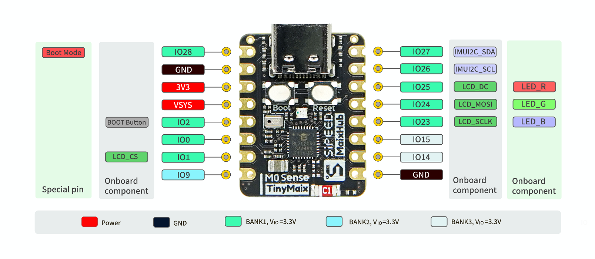

## 概述

Sipeed M0sense 是基于[博流智能科技](http://www.bouffalolab.com/)的 BL702 芯片所设计的一款 AIOT 开发板，主控芯片为 Risc-V 架构，支持低功耗蓝牙。板载一个 8P FPC 接口来连接 LCD 屏幕，额外配备了 1 个麦克风、1 个 RGB LED 和一颗六轴传感器芯片，引出了一路 USB 2.0 FS 到 Type-C 座子。

购买链接：暂无

## 特点

- 主芯片 BL702 RISC-V 144MHz
- 支持蓝牙规范 5.0/ 蓝牙低功耗 BLE
- 板载显示屏接口（可选配 0.68 寸 80x160 显示屏）
- 板载 1 个模拟麦克风、1 个 RGB LED、1 个 IMU
- 引出一路 USB 2.0 FS 到 USB Type-C 接口

## 参数

<table>
    <thead>
        <tr>
            <th colspan = "2" > M0sense 开发板 </th>   
        </tr>
    </thead>
    <tbody>
    <tr>    
        <td rowspan="6" style="white-space:nowrap">主控 BL702 处理器</td>
    </tr>
    <tr>
        <td>32 bits RISC-V with FPU (Max Freq 144MHz)</td>
    </tr>
    <tr>
        <td>132KB RAM，192KB ROM, 512KB Flash</td>
    </tr>
    <tr>
        <td>
        · 2 个 32 位通用定时器      
        · 8 个 DMA 通道            
        · 1 个 SPI 主/从机         
        · 2 个 UART               
        · 1 个 I2C 主机            
        · 1 个 I2S 主/从机         
        · 5 个 PWM 通道            
        · 12 位通用 ADC            
        · 10 位通用 DAC            
        </td>
    </tr>
    <tr>
        <td>无线： 
            · 支持 2.4Ghz 蓝牙规范 V5.0 
            · 蓝牙低功耗 1Mbps 和 2Mbps
        </td>
    </tr>
    <tr>
        <td>
            USB 2.0 FS 引出到 USB Type-C 接口用来下载固件
        </td>
    </tr>
    <tr>    
        <td rowspan="6" style="white-space:nowrap"> 板载部件 </td>
    </tr>
    <tr>
        <td>显示屏接口（可选配 0.96 寸 80x160 显示屏）</td>
    </tr>
    <tr>
        <td>板载 1 个模拟麦克风</td>
    </tr>
    <tr>
        <td>1 个 RGB LED</td>
    </tr>
    <tr>
        <td>1 个 6 轴 IMU（QMI8658A）</td>
    </tr>
    <tr>
        <td>陶瓷天线</td>
    </tr>
    </tbody>
</table>

## 对比

<table>
  <thead>
    <tr>
      <th>项目</th>
      <th>Arduino Nano 33 BLE SENSE</th>
      <th>Sipeed M0sense</th>
    </tr>
  </thead>
  <body>
    <tr>
      <td> MCU </td>
      <td>nRF52840 (Cortex M4)</td>
      <td>BL702 (RV32)</td>
    </tr>
    <tr>
      <td>Freq</td>
      <td>64MHz</td>
      <td>144MHz</td>
    </tr>
    <tr>
      <td>SRAM</td>
      <td>256KB</td>
      <td>132KB</td>
    </tr>
    <tr>
      <td>蓝牙</td>
      <td>支持</td>
      <td>支持</td>
    </tr>
    <tr>
      <td>IIC/UART/SPI</td>
      <td>有</td>
      <td>有</td>
    </tr>
    <tr>
      <td>LED</td>
      <td>单色</td>
      <td>RGB 三色</td>
    </tr>
    <tr>
      <td>MIC</td>
      <td>有</td>
      <td>有</td>
    </tr>
    <tr>
      <td>IMU</td>
      <td>有</td>
      <td>有</td>
    </tr>
    <tr>
      <td>其他传感器</td>
      <td>APDS9960，LPS22HB，HTS221</td>
      <td></td>
    </tr>
    <tr>
      <td>LCD</td>
      <td></td>
      <td>可选 0.96 寸屏幕</td>
    </tr>
    <tr>
      <td>USB</td>
      <td>有</td>
      <td>有</td>
    </tr>
    <tr>
      <td>尺寸</td>
      <td>45mm x 18mm</td>
      <td>23mm x 18mm</td>
    </tr>
    <tr>
      <td>模型平台</td>
      <td>TFLite-Micro + edge impulse</td>
      <td>TinyMaix + MaixHub</td>
    </tr>
    <tr>
      <td>价格</td>
      <td>$40</td>
      <td>$4</td>
    </tr>
  </body>
</table>

## 资料

- [规格书](https://dl.sipeed.com/shareURL/Maix-Zero/Maix-Zero/1_Specification)
- [原理图](https://dl.sipeed.com/shareURL/Maix-Zero/Maix-Zero/2_Schematic)
- [位号图](https://dl.sipeed.com/shareURL/Maix-Zero/Maix-Zero/3_Bit_number_map)
- [尺寸图](https://dl.sipeed.com/shareURL/Maix-Zero/Maix-Zero/4_Dimensional_drawing)
- [3D 模型文件](https://dl.sipeed.com/shareURL/Maix-Zero/Maix-Zero/5_3D_file)

---

- [SDK](https://github.com/bouffalolab/bl_mcu_sdk) (Github) 
- 交流 QQ 群：`592731168` 。[点我加群](https://jq.qq.com/?_wv=1027&k=uyKNhTeu)
- 论坛：[bbs.sipeed.com](bbs.sipeed.com)

## 引脚

## 联系

M1s 模组可以在多种场景实现客户不同方面的需要，技术支持和商业合作请联系使用邮箱 [support@sipeed.com](support@sipeed.com)
