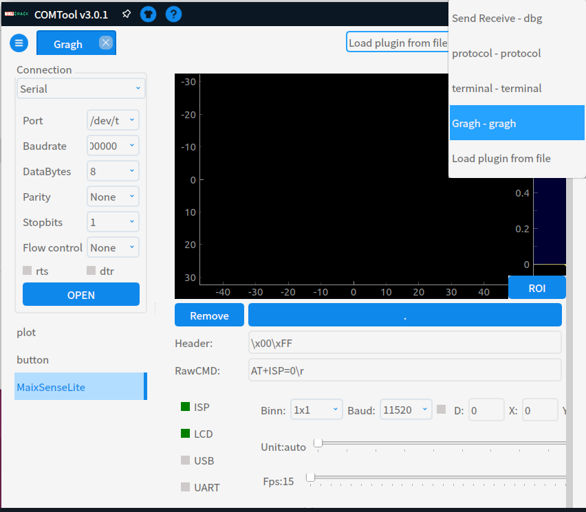
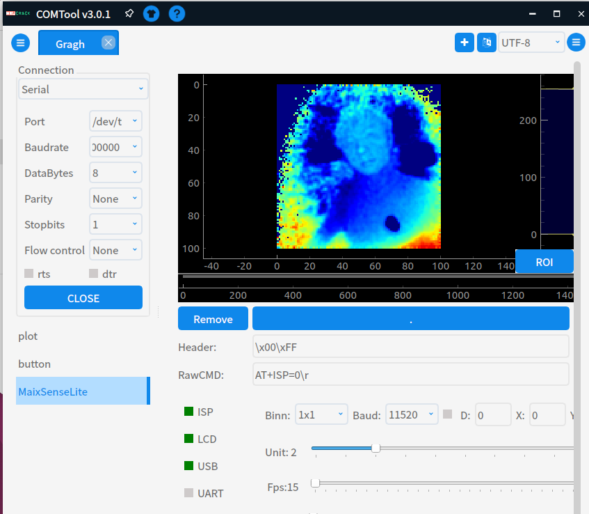

# MetaSense-A010

|     时间      | 负责人 |   更新内容   |
| :-----------: | :----: | :----------: |
| 2022年8月12日 | yuexin | 初次编写文档 |

## 概述

MetaSense-A010 是由 Sipeed 所推出的一款基于炬佑 100x100 TOF 模组+ BL702 极致性价比的 TOF 模组，最大支持 100x100 的分辨率和 8 位精度，并且自带的 240×135 的 LCD 显示屏可实时预览 color map 后的深度图。

### TOF 简介

TOF 是一种测距的方法，通过测量超声波/微波/光等信号在发射器和反射器之间的“飞行时间”来计算出两者之间的距离。能够实现 TOF 测距的传感器就是 TOF 传感器。种类较多，使用较多的是通过红外或者激光进行测距的 TOF 传感器。

## 相关参数

| 条目         | 参数                                                               | 补充 |
| :----------- | :----------------------------------------------------------------- | :--- |
| 接口         | 1.25mm 串口连接器 \*1 Type-C USB2.0 \*1                        |      |
| 分辨率       | TOF：100x100@30fps                                                 |      |
| 视场角       | RGB：无 TOF：70°(H) * 60°(V)                                   |      |
| 激光发射器   | 940nm VCSEL                                                         |      |
| 测量范围     | 0.2-2.5m                                                          |      |
| 测量精度     | <=1%/cm                                                            |      |

### 接口说明

这款模组对外开放有 USB type-c 接口和 1.0mm 4pin 母座，USB 提供了单路虚拟串口，而 4pin 母座提供了 uart。USB 虚拟串口和 uart 都能获取深度图数据，可进行自定义设置，用户可以使用任意 linux 板卡或者单片机进行二次开发。

### 注意事项

uart 最高可达 3M 的波特率，如果需要 100×100 19fps（最高分辨率最高帧率）的深度图时请尽量使用高波特率，否则会有卡顿现象产生。

## 例程指南

### 流程

- 本机预览
- 上位机软件包
- PC 预览与微调
  
### 本机预览
把设备使用 type-c 线与电脑连接，可在设备上自带 LCD 屏实时预览 color map 后的深度伪彩图
   
### 上位机软件包
使用 PC 预览前先安装 COMTOOL 软件包，

### PC 预览和微调
1. 设备通过 type-c 接口连接电脑后，可以识别到 /dev/ttyUSBx（Linux）或 COMx（Windows）
2. 打开 COMTOOL 后，在右上角添加 Graph，左侧选择 Port 和对应波特率（忽略 USB 串口，可任意选择高波特率），点击 open 后可接收大量数据。

3. 若显示部分为黑无图，则双击左下角 MaixSenseLite 打开上图所示端口，设定 Header 为 \x00\xFF 即可正确解析图像数据并观察到深度图，可以直观感受二维平面图像上的深度。

  
