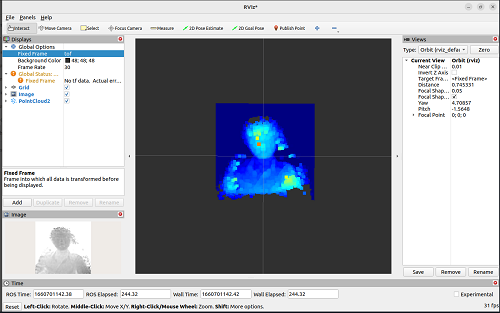

# MetaSense-A010

|     时间      | 负责人 |   更新内容   |
| :-----------: | :----: | :----------: |
| 2022年8月12日 | yuexin | 初次编写文档 |


## 产品概述

产品图


MetaSense-A010 是由 Sipeed 所推出的一款基于炬佑 100x100 TOF 模组+ BL702 极致性价比的 TOF 3D 传感器模组，最大支持 100x100 的分辨率和 8 位精度，并且自带的 240×135 的 LCD 显示屏可实时预览 color map 后的深度图。

**资料汇总**

硬件规格书：
硬件接线图：

## 产品开箱指南

### 快速上手的准备工作

这款设备采用串口协议对外提供接口和传输数据，物理接口对外提供了 type-c（虚拟串口）及 1.0mm 的 4pin 母座（UART）都能获取深度图数据，可自定义设置，用户可以使用任意 linux 板卡或者单片机进行二次开发。

- 接线示例说明
通过 type-c 接口连接电脑后，可以识别到 /dev/ttyUSBx（Linux）或COMx（Windows）。
通过 usb2ttl 模块按照硬件引脚图连接4pin母座（硬件引脚图：屏幕正面朝上）。
硬件引脚图


- COMTOOL 软件包安装
Windows 系统：下载压缩包后解压安装即可。
Linux 系统：不提供软件压缩包，需用户自行编译。

注意：Win 7 及以下系统需装驱动，可自行前往 FTDI 官网下载。
### 上电互动预览

将设备通电后，可在设备上自带 LCD 屏实时预览 color map 后的深度伪彩图


### PC 预览和微调

1. 使用 PC 预览前先安装 COMTOOL 上位机软件包
2. 打开 COMTOOL 软件后，如果软件上方无 Graph 的话，可在右上角 + 号处添加 Graph 。
3. 左侧选择 Port 和对应波特率（忽略 USB 串口，可任意选择高波特率），选择 MaixSenseLite 后点击 open 后再勾选下方 USB 即可接收大量数据。

4. 设定 Header 为 \x00\xFF 即可正确解析图像数据并观察到深度图，可以直观感受二维平面图像上的深度。


### 互动配置说明

COMTOOL 上位机的配置控件说明
- Header 设置识别包头
- RawCMD 用户可以手动发送指令（USB 和 UART 串口行为相同）
- ISP 启动停止
- LCD 显示自带屏的开启关闭
- USB 串口传输深度图开启关闭
- UART 串口传输深度图开启关闭
- ANTIMMI 自动抗多机干扰开启关闭（易受干扰，关闭的效果都要更好些）
- Binn 可下拉设置 BINNING，Baud 设置 UART 波特率
- X，Y 设置坐标，D左侧多选框开启关闭显示 ( x，y ) 处据该摄像头的距离，位于 D 右侧
- Unit 设置量化单位（16位量化到8位，比例缩小，设置太小会只能看清很近处的影像）
- FPS 设置出图帧率（不宜过高，根据对接设备的性能合理设置即可，减小帧率可以减少传输数据量）
- Ev 曝光间隙控制（最左代表 AE，其他是固定曝光时间）


## 案例：3D 识别人脸

1. 简易介绍


## 案例：检测运动物体

1. 简易介绍
2. 视频

## 案例：接入 MCU 

简单介绍

demo 暂未开源，待整理公开

## 二次开发：接入 ROS
### 接入 ROS1 

1. 准备工作 
2. 安装运行
我们提供了 ROS1 的接入功能包，用户需要在运行 ROS1 的系统上编译安装。

```bash

#解压缩sipeed_tof_ms_a010.zip，并进入目录
git switch ros1 #切换到ros1分支
source /opt/ros/*/setup.sh
catkin_make
source devel/setup.sh
rosrun sipeed_tof_ms_a010 a010_publisher _device:="/dev/ttyUSB0"
#之后终端会持续刷新显示[sipeed_tof]: Publishing，即正常工作

```
3. RQT 查看帧率
4. RVIZ预览
打开 rviz，左下角 Add，选择 By topic，选中 PointCloud2 或 /depth 下的 Image 添加。
如下图，Display/Global Options/Fixed Frame 需要修改成 “tof”，才能正常显示点云。
根据添加的内容，左侧会显示 Image，中间则显示点云。
- 伪彩点云


### 接入 ROS2 

1. 准备工作 
2. 安装运行
我们提供了ros2的接入功能包，用户需要在运行ROS2的系统上编译安装。

```bash
#解压缩 sipeed_tof_ms_a010.zip，并进入目录
source /opt/ros/*/setup.sh
colcon build #如提示缺少colcon时需要sudo apt install python3-colcon-ros
ros2 run sipeed_tof_ms_a010 publisher --ros-args -p device:="/dev/ttyUSB0"
source install/setup.sh
```
#之后终端会持续刷新显示[sipeed_tof]: Publishing，即正常工作。
3. RQT 查看帧率


4. RVIZ2 预览
打开 rviz2，左下角 Add，选择 By topic，选中 PointCloud2或/depth 下的 Image 添加。如图，Display/Global Options/Fixed Frame 需要修改成 “tof”，才能正常显示点云,根据添加的内容，左侧会显示Image，中间则显示点云。
- 伪彩点云


## 二次开发：文本协议
