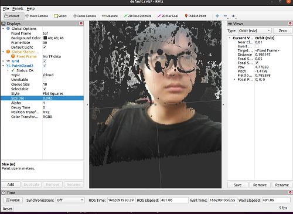

# MetaSense-A075V

|     时间      | 负责人 |   更新内容   |
| :-----------: | :----: | :----------: |
| 2022年8月10日 | yuexin | 初次编写文档 |


## 产品概述
产品图

MetaSense-A075V 是由 Sipeed 所推出的一款具有 RGB 功能的 3D TOF 摄像机模组。
该模组可以实现免驱的即插即用，实现实时彩色 3D 显示。


**资料汇总**

硬件规格书：
硬件接线图：

## 产品开箱指南
### 快速上手的准备工作

**接线说明**：
**安装驱动**：上电前一定要确保网络环境中没有使用 192.168.233.0/24  的地址段，MS-A075V 会使用 RNDIS 并设置自己的 ip 地址为 http://192.168.233.1 Windows 系统需安装驱动才可正常运行。
  
  [点击下载 Windows 驱动](https://dl.sipeed.com/shareURL/MetaSense/Drivers)
  [点击查看 Windows 安装驱动方法](./install_drivers.md)

### 网页上位机预览互动
1. 把设备使用 type-c 线与电脑链接，MS-A075V 的风扇会开始工作，产品正面镜头处就会闪烁红灯。
2. 此时可打开浏览器输入 http://192.168.233.233 预览 3D 点云图，上电后有延迟需等待一段时间后，系统和程序才会启动完成。
3. 使用网页上位机快速预览 演示图（正面和侧面）： 
<html>
  
  
</html>

4. 可选预览深度伪彩点云，右上角打开交互面板，第一行取消勾选 RGB_Map 即可。


### 互动配置
1. 上位机交互面板提供了一系列配置和功能，可以实时预览变动的效果。


现简单说明一下各个控件的功能。
- **RGB_Map** 多选框 开关 RGB 映射，即关闭时只显示深度伪彩点云，打开时显示 RGB 映射点云。
- **colorMap** 下拉栏 提供了几个伪彩映射选项(即 cmap )，推荐使用 jet，RGB_Map 关闭时有效。
- **deepRangeMax** 和 **deepRangeMin** 滑动条是设定 cmap 的映射范围的，即只有位于 deepRangeMin 和 deepRangeMax 之间的数值（深度值）会通过 cmap，RGB_Map 关闭时有效。
- **NormalPoint** 多选框 开关显示正常点（TOF 成像会有无效点，对应的相反描述），需要打开。
- **OE_Points** 多选框 开关显示OE点，建议关闭。
- **UE_Points** 多选框 开关显示UE点，建议关闭。
- **Bad_Points** 多选框 开关显示无效点，建议关闭。
- **SpatialFilter** 多选框 开关空间滤波，基于下面的 SpatialFilterSize 值和 SpatialFilterType 指定的算法进行处理。
- **TemporalFilter** 多选框 开关时间滤波，基于下面的TemporalFilteralpha 值做了一个时间上的平均。
- **TemporalFilteralpha** 滑动条 设定时间滤波所需时长，适中即可，可自行尝试体验其它效果。
- **SpatialFilterType** 下拉栏 设定空间滤波算法，提供高斯滤波（Gaussian）和双边滤波（Bilateral），双边滤波性能要求较高，不建议使用。
- **SpatialFilterSize** 滑动条 设定空间滤波所需范围，适中即可，可自行尝试体验其它效果。
- **FlyingPointFilter** 多选框 开关飞点过滤，基于下面的 FlyingPointThreshold 值作为过滤阈值，超过阈值的将被过滤掉，建议适中配置，否则有效点也会被剔除。

### 保存数据

网页版上位机控件栏最下方提供了两个按钮
**SaveRaw**：可保存一帧 raw 数据，用户如果需要使用深度或 IR 或 RGB 数据进行二次开发，则需要了解 raw 数据结构。不过我们同时提供了一个详细的 jupyter notebook 供用户和开发者使用和了解 raw 数据的处理过程。
**SavePointCloud**：可保存一帧3D点云图，保存格式为 pcd，同样可以通过上述提供的脚本预览。
注意：raw 数据可通过开放的接口获取，开发者进行解析即可基于此二次开发，但点云（pointcloud）是基于 raw 数据和相机内参进行计算得到的，无相应接口提供。


## 案例：检测体积
1. 简易介绍
2. 源文件
3. 效果图及视频


## 案例：避障小车
简易介绍说明

暂未开源 待整理公开

## 案例：检测人流
简易介绍说明 
视频：
暂未开源 待整理公开


## 二次开发：接入 ROS
### 接入 ROS1

1. 准备工作
2. 安装运行
我们提供了ros1 的接入功能包，用户需要在运行 ROS1 的系统上编译安装，链接：

```bash
#解压缩sipeed_tof_ms_a010.zip，并进入目录
git switch ros1 #切换到 ros1 分支
source /opt/ros/*/setup.sh
catkin_make
source devel/setup.sh
rosrun sipeed_tof_cpp publisher
```

之后终端会持续刷新命令行

3. RQT 查看帧率

4. RVIZ 预览
打开 rviz，左下角 Add，选择 By topic，选中 PointCloud2 或/ depth 下的 Image 添加。
如下图，Display/Global Options/Fixed Frame 需要修改成 “tof”，才能正常显示点云。
根据添加的内容，左侧会显示 Image，中间则显示点云。



### 接入 ROS2
1. 准备工作
2. 安装运行
我们提供了ros2的接入功能包，用户需要在运行ROS2的系统上编译安装。

``` bash

#压缩sipeed_tof_cpp.zip，并进入目录
source /opt/ros/*/setup.sh
colcon build #如提示缺少colcon时需要sudo apt install python3-colcon-ros
source install/setup.sh
ros2 run sipeed_tof_cpp publisher
#之后终端会持续刷新显示[sipeed_tof]: Publishing，即正常工作
``` 

3. RQT 查看帧率


4. RVIZ2 预览
打开 rviz2，左下角 Add，选择 By topic，选中 PointCloud2 或 /depth、/intensity、/rgb 下的 Image 添加。如图，Display/Global Options/Fixed Frame 需要修改成 “tof”，才能正常显示点云。
根据添加的内容，左侧会显示 Image，中间则显示点云。

- 伪彩点云和 RGBD融合点云
<html>
  
  
</html>

## 二次开发：SDK 支持

### python SDK

这是基于 `python 3` 软件开发工具包，MS-A075V 对外开发了 `http` 接口，我们可通过 `http` 请求获取到原生数据（包括深度图，`ir`图，`rgb` 图），为了方便用户理解数据包的结构及获取还有解码的相关逻辑，因此我们提供封装了 `http` 请求和原生数据的解码相关函数，用户基于此可进行二次开发。

**SDK 获取方式**：
**使用方式**：安装 jupyter 后连接相机打开我们提供的 SDK：toturial.py 即可。

### 解包推流 

1. 源文件
2. 效果图及视频

