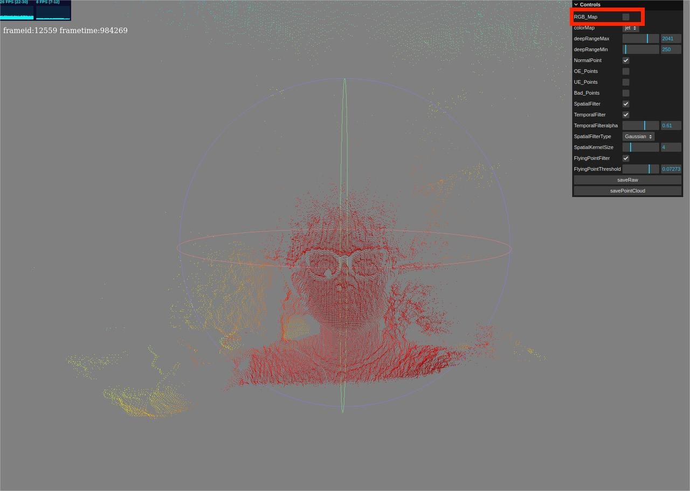
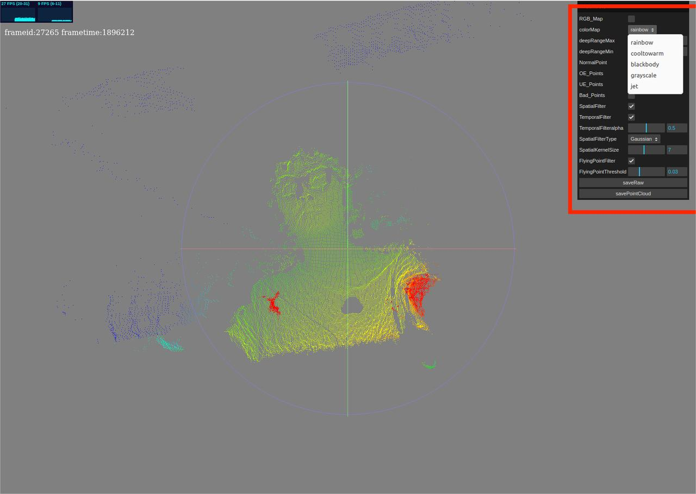

# MetaSense-A075V

|     时间      | 负责人 |   更新内容   |
| :-----------: | :----: | :----------: |
| 2022年8月10日 | yuexin | 初次编写文档 |

## 概述

MetaSense-A075V 是由 Sipeed 所推出的一款具有 RGB 功能的 3D TOF 摄像机模组。
该模组可以实现免驱的即插即用，实现实时彩色 3D 显示。

### TOF 简介

TOF 是一种测距的方法，通过测量超声波/微波/光等信号在发射器和反射器之间的“飞行时间”来计算出两者之间的距离。能够实现 TOF 测距的传感器就是 TOF 传感器。种类较多，使用较多的是通过红外或者激光进行测距的 TOF 传感器。

## 相关参数

| 条目         | 参数                                                               | 补充 |
| :----------- | :----------------------------------------------------------------- | :--- |
| 接口         | 1.25mm 串口连接器 \*1  Type-C USB2.0 \*1                        |      |
| 分辨率       | RGB：1600x1200@30fps TOF：320x240@60fps                         |      |
| 视场角       | RGB：120° TOF：55°(H)*72°(H)                                      |      |
| TOF 像素尺寸 | 15um                                                               |      |
| 激光发射器   | 940nm,3W                                                           |      |
| 测量范围     | 0.15-1.5m                                                          |      |
| 测量精度     | &lt;=1%/cm                                                            |       |

## 使用目录

### 流程
- 注意事项
- 例程指南
- 互动配置
  
### 注意事项

上电前一定要确保网络环境中没有使用 192.168.233.0/24  的地址段，MS-A075V 会使用 RNDIS 并设置自己的 ip 地址为 192.168.233.233 ，Windows 系统需安装驱动才可正常运行。
  
  [点击下载 Windows 驱动](https://dl.sipeed.com/shareURL/MetaSense/Drivers)
  [点击查看 Windows 安装驱动方法](./install_drivers.md)

### 例程指南

1. 把设备使用 type-c 线与电脑链接，MS-A075V 的风扇会开始工作，产品正面镜头处就会闪烁红灯。
2. 此时可打开浏览器输入 http://192.168.233.233 预览 3D 点云图，上电后有延迟需等待一段时间后，系统和程序才会启动完成。
3. 使用网页上位机快速预览 演示图（正面和侧面）： 
<html>
  
  
</html>

4. 可选预览深度伪彩点云，右上角打开交互面板，第一行取消勾选 RGB_Map 即可。

### 互动配置
1. 上位机交互面板提供了一系列配置和功能，可以实时预览变动的效果。

现简单说明一下各个控件的功能。
- RGB_Map 多选框 开关 RGB 映射，即关闭时只显示深度伪彩点云，打开时显示 RGB 映射点云。
- colorMap 下拉栏 提供了几个伪彩映射选项(即 cmap )，推荐使用 jet，RGB_Map 关闭时有效。
- deepRangeMax 和 deepRangeMin 滑动条是设定 cmap 的映射范围的，即只有位于 deepRangeMin 和 deepRangeMax 之间的数值（深度值）会通过 cmap，RGB_Map 关闭时有效。
- NormalPoint 多选框 开关显示正常点（TOF 成像会有无效点，对应的相反描述），需要打开。
- OE_Points 多选框 开关显示OE点，建议关闭。
- UE_Points 多选框 开关显示UE点，建议关闭。
- Bad_Points 多选框 开关显示无效点，建议关闭。
- SpatialFilter 多选框 开关空间滤波，基于下面的 SpatialFilterSize 值和 SpatialFilterType 指定的算法进行处理。
- TemporalFilter 多选框 开关时间滤波，基于下面的TemporalFilteralpha 值做了一个时间上的平均。
- TemporalFilteralpha 滑动条 设定时间滤波所需时长，适中即可，可自行尝试体验其它效果。
- SpatialFilterType 下拉栏 设定空间滤波算法，提供高斯滤波（Gaussian）和双边滤波（Bilateral），双边滤波性能要求较高，不建议使用。
- SpatialFilterSize 滑动条 设定空间滤波所需范围，适中即可，可自行尝试体验其它效果。
- FlyingPointFilter 多选框 开关飞点过滤，基于下面的 FlyingPointThreshold 值作为过滤阈值，超过阈值的将被过滤掉，建议适中配置，否则有效点也会被剔除。
  
## 相关问题

### 无设备显示

要确保设备供电充足：对于台式机建议使用主机背部的 USB 接口；使用 USB hub 的话建议使用带有额外供电的；另外建议使用 USB 3.0 的数据口，因为 USB 2.0 驱动供电可能不足。