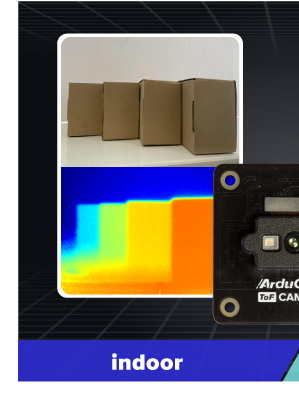
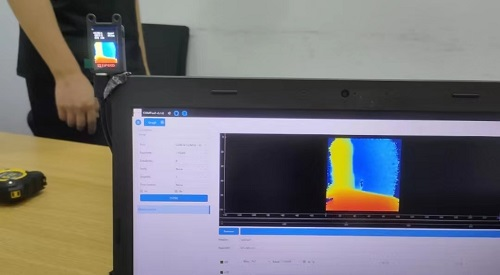
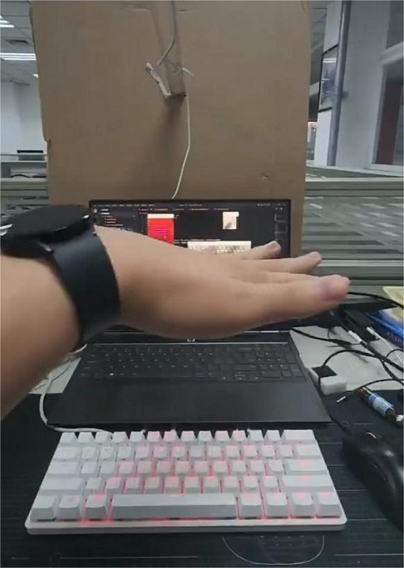

## MetaSense 是什么?

MetaSense 系列摄像头模组分为 MetaSense-A075V 和 MetaSense-A010 两款产品。
- MS-A010 是由 Sipeed 所推出的一款由 BL702 + 炬佑 100x100 TOF 模组所组成的极致性价比的 TOF 3D 传感器模组，最大支持 100x100 的分辨率和 8 位精度，并且带有 240×135 的 LCD 显示屏可实时预览 color map 后的深度图。
- 而 MS-A075V 是一款具有 RGB 功能的 3D TOF 摄像机模组，该模组可以实现免驱的即插即用，实现实时彩色 3D 显示。

购买方式：众筹预售购买连接

|              |
MateSense-010
 | 
MateSense-A075V
 | 
| :----------- |:----------------------------------------------- | :------------------------------------------------- | 
|              |                |                   | 
| 接口         | 1.25mm 串口连接器 \*1 Type-C USB2.0 \*1       | 1.25mm 串口连接器 \*1  Type-C USB2.0 \*1         |
| 分辨率       |TOF：100x100@30fps                               | RGB：1600x1200@30fps TOF：320x240@60fps         | 
| 视场角       |RGB：无 TOF：70°(H) * 60°(V)                  | RGB：120° TOF：55°(H)*72°(H)                    | 
| 
TOF 像素尺寸
 |                                                 | 15um                                               | 
| 激光发射器   |40nm VCSEL                                       | 940nm,3W                                           | 
| 测量范围     |0.2-2.5m                                         | 0.15-1.5m                                          | 
| 测量精度     |&lt;=1%/cm                                       | &lt;=1%/cm                                         | 

相关交流社区及社群：

## MetaSense 能做什么？

### 案例：远中近物体实拍

### 案例：人流统计

高精度，大分辨率的实时监测人流走动的情况统计。

### 案例：小车避障

可搭载于小车移动并判断画面是否有障碍物，模组自带 LCD 屏幕精准显示距离并做出反应规避障碍物。

### 案例：键盘灯跟随

实现超酷炫的键盘灯跟随，实时跟踪手部的位置，再根据手部的位置映射键盘灯。

### 案例：体积测量

通过 SDK 获取到的相机内参后计算出初略的点云，做累加得到全部的总体积，达到体积测量的效果。

### 案例：外接 MCU

MS-A010 拥有强大的兼容性，基于串口协议，可外接 K210 bit 这样的单片机开发板或树莓派之类的 linux 开发板来进行二次开发

### 案例：接入 ROS1 + ROS2

双支持 ROS 系统，开放 ROS1+ROS2 接入功能包，可快速获得深度数据及深度图。
<html>
  
  
</html>

## 快速了解 TOF 技术

1. TOF: Time of flight（飞行时间）它是一种测距的方法，通过测量超声波/微波/光等信号在发射器和反射器之间的“飞行时间”来计算出两者之间的距离。能够实现 TOF 测距的传感器就是 TOF 传感器。种类较多，使用较多的是通过红外或者激光进行测距的 TOF 传感器。
2. RGBD：RGB 摄像头加 TOF 深度摄像头组成的一整个模组。图源自[百度](https://baike.baidu.com/item/TOF/19952376?fr=aladdin)。

## 更多
关于 MS-010 更详细的资料获取：
关于 MS-075 更详细的资料获取：