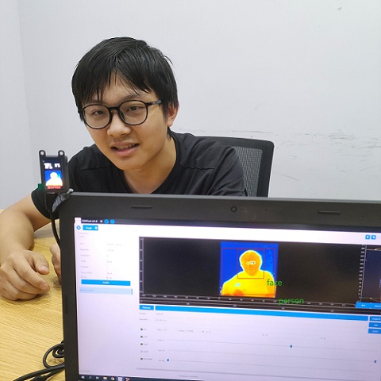
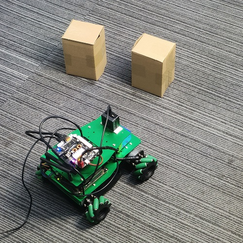
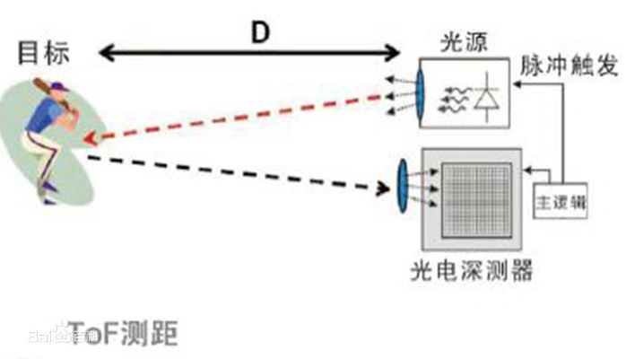

购买方式：众筹预售购买连接
## MetaSense 是什么?

（简易介绍+可应用案例场景图粗略介绍）
MetaSense 系列摄像头模组主要分为 MetaSense-A075V 和 MetaSense-A010 两款产品。

|              |
MateSense-010
 | 
MateSense-A075V
 | 
| :----------- |:----------------------------------------------- | :------------------------------------------------- | 
|              |                |                   | 
| 接口         | 1.25mm 串口连接器 \*1 Type-C USB2.0 \*1       | 1.25mm 串口连接器 \*1  Type-C USB2.0 \*1         |
| 分辨率       |TOF：100x100@30fps                               | RGB：1600x1200@30fps TOF：320x240@60fps         | 
| 视场角       |RGB：无 TOF：70°(H) * 60°(V)                  | RGB：120° TOF：55°(H)*72°(H)                    | 
| 
TOF 像素尺寸
 |                                                 | 15um                                               | 
| 激光发射器   |40nm VCSEL                                       | 940nm,3W                                           | 
| 测量范围     |0.2-2.5m                                         | 0.15-1.5m                                          | 
| 测量精度     |&lt;=1%/cm                                       | &lt;=1%/cm                                         | 

相关交流社区及社群：

## MetaSense 能做什么？

### 人流统计
简易介绍：

### 人脸识别
简易介绍：

### 体积测量
简易介绍：

### 小车避障
简易介绍：

### 运动物体检测
简易介绍：

### 接入 ROS1 + ROS2
<html>
  
  
</html>

## 快速了解 TOF 技术

1. TOF: Time of flight（飞行时间）它是一种测距的方法，通过测量超声波/微波/光等信号在发射器和反射器之间的“飞行时间”来计算出两者之间的距离。能够实现 TOF 测距的传感器就是 TOF 传感器。种类较多，使用较多的是通过红外或者激光进行测距的 TOF 传感器。
2. RGBD：RGB 摄像头加 TOF 深度摄像头组成的一整个模组。图源自[百度](https://baike.baidu.com/item/TOF/19952376?fr=aladdin)。

## 更多
关于 MS-010 更详细的资料获取：
关于 MS-075 更详细的资料获取：