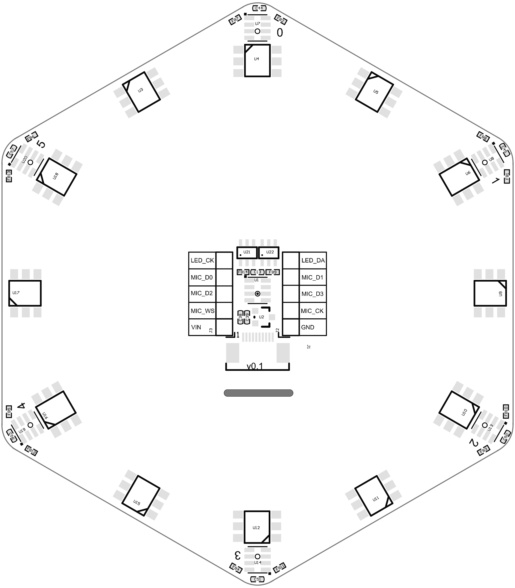

# MicArray 麦克风阵列

## 概述


7个MEMS麦克风 : MSM261S4030H0
12个SK9822 LED
支持 2*5P 2.54mm 端子和 10P 0.5mm FPC 连接器

## 麦克风阵列介绍

- MEMS 麦克风 :6 个 MSM261S4030H0 组成阵列
- 灵敏度 : -26(dB,dBFS @1kHz 1Pa)
- 信噪比 : 57dB(20kHz bandwidth, A-weighted)
- 尺寸 :78.1*88.8mm
- 灯光 :12 个 LED 组成一个环形 LED 阵列 多个 LED 通过双信号线级联
- 8 Bit(256 级) 可调颜色,5Bit (32 级)亮度调节 连接器 :支持 2*5P 2.54mm 端子和 10P 0.5mm FPC 连接器

## 参数
| 功能特点 | 参数 |
| --- | --- |
| 声压级 | 140 dB SPL |
| 灵敏度 | -26(dB,dBFS @1kHz 1Pa) |
| 信噪比 | 57 dB (20kHz bandwidth,A-weighted) <br>THD<1% (100dB SPL @1kHz S=Nom,Rload>2k ) |
| 时钟频率 | 1.0-4.0Mhz(正常模式) <br>150-800khz(低功耗模式) |

## 模块引脚定义

| 引脚序号 | 引脚名称 | 类型 | 引脚说明 | 
| --- | --- | --- | --- |
| 1 | VIN | VCC | 模块电源输入正 |
| 2 | GND | G | 模块电源地 |
| 3 | MIC_D0 | I/O | 0号麦克风和1号麦克风的I²S 接口的串行数据输出 |
| 4 | MIC_D1 | I/O | 2号麦克风和3号麦克风的I²S 接口的串行数据输出 |
| 5 | MIC_D2 | I/O | 4号麦克风和5号麦克风的I²S 接口的串行数据输出 |
| 6 | MIC_D3 | I/O | 中心麦克风的I²S 接口的串行数据输出 |
| 7 | MIC_WS | I/O | I²S 接口的串行数据字选择 |
| 8 | MIC_CK | I/O | I²S 接口的串行数据时钟 |
| 9 | LED_CK | I/O | LED 的 I²C 接口的串行数据时钟 |
| 10 | LED_DA | I/O | LED 的 I²C 接口的串行数据输出 |



## 例程代码

### 接线

杜邦线接法

| 麦克风阵列 | 开发板上的对应管脚 | 代码中所对应的参数 |
| ---- | ---- | ---- |
| VIN | 3.3v/5v | —— |
| GND | GND | —— |
| LED_CK | I/O 口 | sk9822_clk |
| LED_DA | I/O 口 | sk9822_dat |
| MIC_D0 | I/O 口 | i2s_d0 |
| MIC_D1 | I/O 口 | i2s_d1 |
| MIC_D2 | I/O 口 | i2s_d2 |
| MIC_D3 | I/O 口 | i2s_d3 |
| MIC_WS | I/O 口 | i2s_ws |
| MIC_CK | I/O 口 | i2s_sclk |

> 因为 K210 的 FPIOA 的特性,支持每个外设随意映射到任意引脚,所以上面表格中的 `I/O 口` 每个人依据自身喜好和板子上引脚数字自行设定即可，具体可看下方代码下面的相关说明

### python代码
```python
from Maix import MIC_ARRAY as mic
import lcd

lcd.init()
mic.init()
#mic.init(i2s_d0=23, i2s_d1=22, i2s_d2=21, i2s_d3=20, i2s_ws=19, i2s_sclk=18, sk9822_dat=24, sk9822_clk=25)

while True:
    imga = mic.get_map()
    b = mic.get_dir(imga)
    a = mic.set_led(b,(0,0,255))
    imgb = imga.resize(160,160)
    imgc = imgb.to_rainbow(1)
    a = lcd.display(imgc)
mic.deinit()

```
需要自行根据自己的连接的管脚号，对应着修改`mic.init(i2s_d0=23, i2s_d1=22, i2s_d2=21, i2s_d3=20, i2s_ws=19, i2s_sclk=18, sk9822_dat=24, sk9822_clk=25)`里面的参数。比如如果将麦克风阵列上的 `MIC_D0` 与 K210 板子上面的标号为 25 的引脚相连，那么对应在代码中的参数需要修改为 `i2s_d0=25`，其他七个引脚也是同理。因为每个人的配置是不同的，所以使用杜邦线的话没有固定的连接说明，个人自行修改引脚参数，并且不要忘记删掉`mic.init(...)`前面的注释。


## 资料
[麦克风阵列硬件资料](https://dl.sipeed.com/shareURL/MAIX/HDK/Sipeed-R6+1_MicArray)

## 更多使用方法

请移步到[论坛](https://bbs.sipeed.com)上查看

## 常见问题

### 出现报错信息


更换其他IO管脚即可
