# 麦克风阵列 UAC 驱动板 MA-USB8（使用指南）

## 产品概览

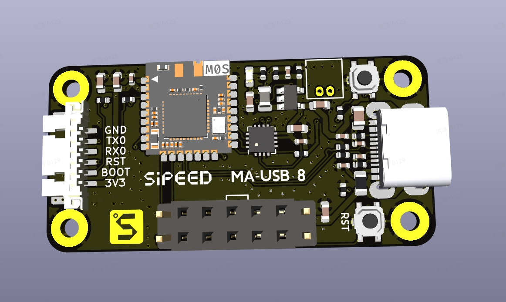

MA-USB8 是一块为麦克风阵列提供 USB 音频与串口数据接口的驱动板，可通过 UAC2.0 传输 8 通道采集音频和 2 通道播放音频，并通过 CDC ACM 或物理 UART 输出声源定位热力图。标准板使用直径 80 mm 的六麦阵列（D80）固件。

- UAC2.0（USB Audio Class）：8 通道，PCM S16_LE，48 kHz
- UAC2.0 播放：2 通道，PCM S16_LE，48 kHz
- CDC ACM（USB 虚拟串口）：输出 16×16 原始声场热力图
- UART：以 2,000,000 bps 输出 16×16 原始或文本声场热力图

UAC 通道定义如下：

| 通道 | 数据 |
| --- | --- |
| CH0～CH5 | PEC 采集的原始有符号 16-bit PCM |
| CH6 | CH0～CH5 按所选方向延时求和后的全频段波束合成输出 |
| CH7 | 保留的 PEC 第八采集通道，不作为六麦阵列的有效麦克风通道 |

所有通道的采样率均为 48 kHz。UAC 传输期间，CH6 对应的 PEC 原始数据会被波束合成结果覆盖。

USB 高速采集端点的间隔为 0.5 ms，标称每包 384 字节（24 帧）。PEC 的实际采样时钟略快于标称 48 kHz，固件会根据 FIFO 水位在 384 与 400 字节包长之间切换，以吸收长期时钟偏差。设备由 USB 总线供电，描述符申报最大电流为 500 mA。

### 阵列参数与波束方向

当前算法使用 PCM 通道 0～5 对应的六个外圈麦克风，不使用中心麦克风。算法表中的六麦角度顺序为 `90°, 30°, 330°, 270°, 210°, 150°`。标准 D80 阵列的半径为 40 mm；D107 派生版本的半径为 53.5 mm，并使用单独生成的 GCC-PHAT 时延矩阵和波束延迟。

串口命令 `0..9,A,B` 选择 0～11 共 12 个波束档位，软件中的相邻档位按 30° 连续推进。当前版本已修复奇偶档位的方向旋转错位，但以下物理关系仍需使用固定声源夹具逐档验证：

- 软件通道与丝印 U1～U6 的绝对对应关系；
- 物理 0° 的基准位置；
- 档位相对物理阵列的顺时针或逆时针方向。

完成验证前，不应把命令编号直接解释为某个丝印麦克风或绝对物理角度。物理编号和板上位置可参见[麦克风阵列模块](./micarray.md)的点位图。CH6 是波束合成输出，不代表第 7 个物理麦克风。

> 本文是 MA-USB8 的使用指南，覆盖从接线、验证设备、音频录制、波束成形到如何读取/解析声场热力图与常见故障排查。

## 快速上手

### 硬件接线与基础准备

1. 准备 5V/USB2.0 数据线。
2. 将 MA-USB8 通过 USB 连接 PC（或杜邦线连接到 MCU 主板）。
3. 选择一种模式：
   - 首选：USB（UAC2.0 音频 + CDC ACM 串口）—— 在 PC 上同时获取多通道音频与声场帧。
   - 备用：物理 UART / USB 转串口（2,000,000 bps，8N1）—— 在 MCU 或嵌入式场景下获取声场帧。

建议在 PC 主机上安装 [Audacity](https://www.audacityteam.org/download/) 常用音频处理软件。

继续前请检查：
- 确认 USB 数据线连接牢靠、设备上电（LED 是否闪烁），并使用 PC 的设备管理/终端确认出现 `/dev/ttyACM0` 或 Windows 下出现 `MA-USB8` 设备。
- 如果在 Windows 下使用 [Audacity](https://www.audacityteam.org/download/) 录音，请先打开设备管理或 [Audacity](https://www.audacityteam.org/download/) 的设置确认 MA-USB8 可见。

### 验证设备（Linux）

设备的 USB VID:PID 为 `359f:3400`，产品名为 `SipeedUSB MicArray`。插入设备后运行：

```bash
dmesg | tail
lsusb
arecord -l
pactl list short sources
```

系统应识别 UAC2.0 音频接口和 `/dev/ttyACM0` 一类的 CDC ACM 设备。实际编号可能不是 0，请以命令输出为准。

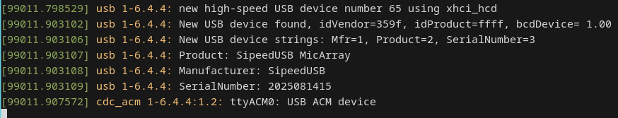
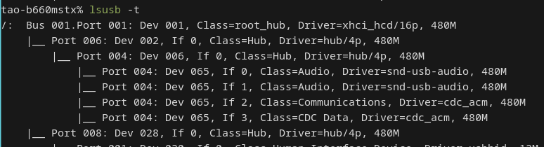

### 验证设备（Windows）
在设备管理器中可看到音频接口 MicArray（UAC2.0）和虚拟串口 USB 串行设备（CDC ACM）。如需录制 8 通道音频，请在录音软件中选择 MicArray，并将格式设置为 8 通道、PCM 16-bit、48 kHz。

如果录音软件只能选择 1 或 2 通道，请参见[Windows 只能选择 1 或 2 通道](#Windows-只能选择-1-或-2-通道)。

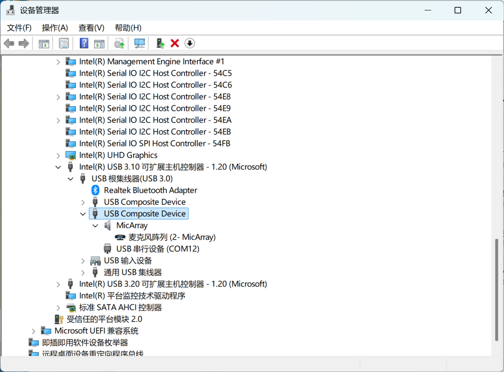

### 录音：录制 8 通道音频（UAC2.0）
下面给出 Linux CLI 与 Audacity 的常见步骤。

#### Linux（命令行，arecord 示例）
1. 确认设备 `arecord -l`。记下 card:id，例如 hw:1,0。
2. 使用 arecord 录制：
```bash
arecord -D hw:1,0 -f S16_LE -c 8 -r 48000 -t wav -d 10 test_8ch.wav
```
这条命令录制 10 秒的 8 通道 WAV（PCM S16_LE，48 kHz）。

3. （可选）使用 sox 提取指定通道（如 CH6）进行回放或分析：
```bash
sudo apt install sox
sox test_8ch.wav ch6.wav remix 7  # sox 的通道编号从 1 开始，7 表示第 7 个通道 (0-based->1-based 转换)
aplay ch6.wav
```

> 注意：硬件编号与通道索引关系与系统环境有关，录制或回放时请根据 `arecord -l`/`aplay -l` 输出确认硬件编号。如果无法访问串口设备，请参见[Linux 无法访问串口设备](#Linux-无法访问串口设备)。

#### Audacity（GUI）
1. 打开 Audacity -> 编辑 -> 首选项 -> 设备，选择 MA-USB8 采集设备。
2. 在录音通道处选择 8 通道。
3. 开始录制，你会看到多通道波形，停止后可以选择某一路音轨听/导出。

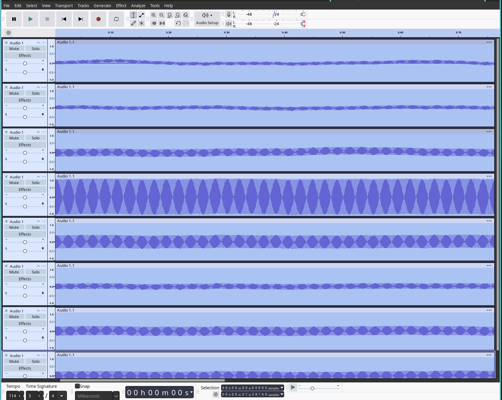

**Windows 下请选择 WASAPI；如果仍然只有 1 或 2 通道，请参见[Windows 只能选择 1 或 2 通道](#Windows-只能选择-1-或-2-通道)。**
<div style="display: flex; justify-content: space-between;">
  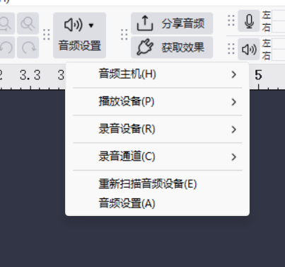
  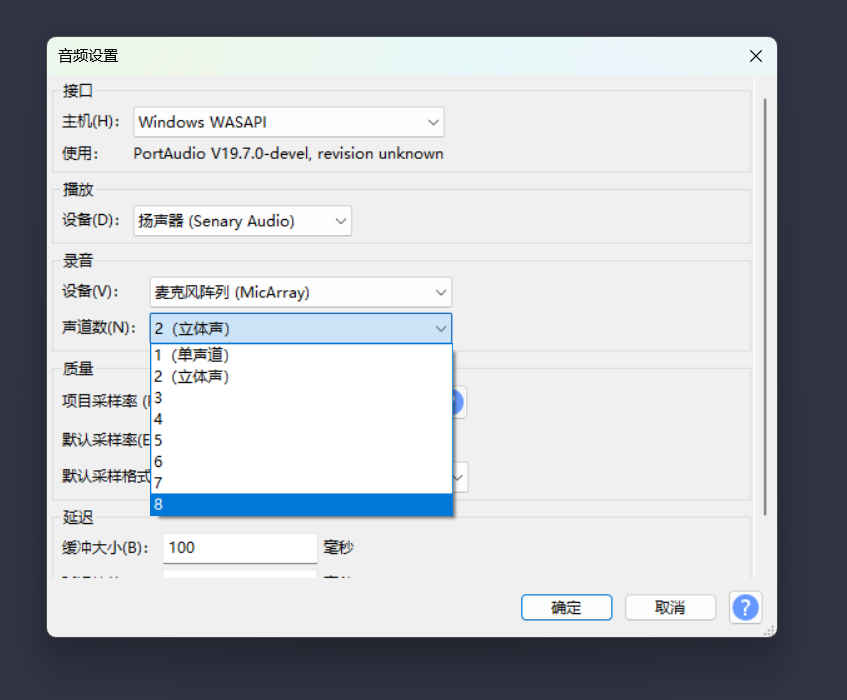
</div>

### 播放：输出 2 通道音频

UAC2.0 播放接口支持 2 通道、PCM 16-bit、48 kHz。固件将 USB 左右声道的原始交错数据送入 I2S0，不做单声道混合，也不固定选择其中一个声道。

I2S0 引脚与格式如下：

| 信号 | GPIO |
| --- | --- |
| DATA | GPIO27 |
| BCLK | GPIO28 |
| LRCLK | GPIO29 |

数据格式为 left-justified。若驱动板后级只连接一个扬声器，实际播放左声道还是右声道由硬件接线决定。

## 波束成形（Beamforming）示例
MA-USB8 支持 12 个波束档位（`0..9,A,B`），相邻档位相差 30°。

示例：选择波束档位 0，并在输出通道 CH6 获取波束合成后的音频：
1. 打开串口（ttyACM0）：
```bash
minicom -D /dev/ttyACM0 -H
```
2. 在 minicom 中直接输入字符 `0`，选择波束档位 0。
3. 在音频软件（[Audacity](https://www.audacityteam.org/download/) / arecord）中监听或录制 CH6。

默认档位为 0。档位的绝对物理角度尚未完成夹具验证，参见[阵列参数与波束方向](#阵列参数与波束方向)。

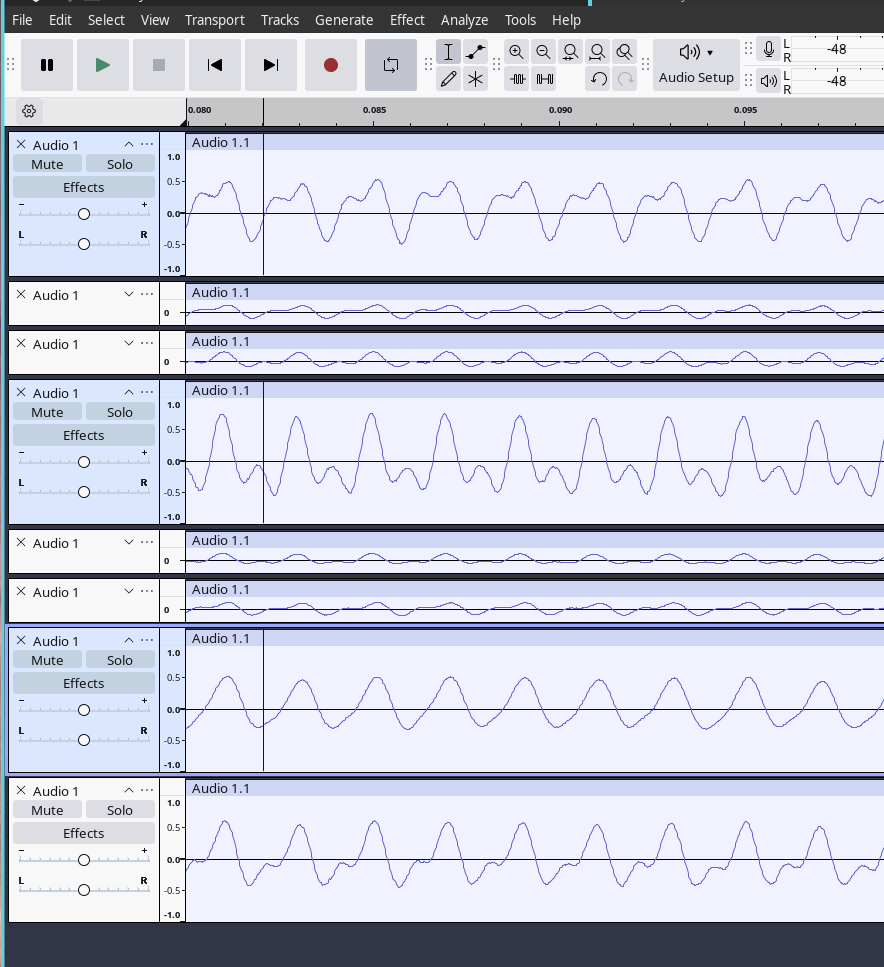

## 读取并解析声场热力图（CDC ACM / UART）

驱动板通过 CDC ACM（`/dev/ttyACM0`）或 UART（2,000,000 bps）输出声场热力图，两个接口的默认显示方式不同：

- CDC ACM 连续输出原始二进制数据。每帧包含 16 字节帧头和 256 字节数据，详见 [Hotmap Frame 格式](#Hotmap-Frame-格式（开发者视角）)。
- UART 默认输出原始二进制数据。在串口中输入大写 `F` 后，开启 16×16 文本热力图；再输入大写 `C`，开启伪彩显示。输入小写 `f`、`c` 可分别关闭对应功能，详见[完整指令表](#完整指令表（开发者）)。

热力图使用六麦 GCC-PHAT/SRP 类定位处理，输出 16×16 灰度图。固件对每个像素应用 `3/4` 历史值加 `1/4` 当前帧的 EMA，以减少画面闪动。热力图自动跟随声源；波束档位命令只改变 UAC CH6，不控制热力图方向。

### 通过 minicom / picocom 观察（快速）

CDC ACM 默认输出二进制帧，直接使用普通终端查看会显示乱码。如需检查原始数据，可使用：

```bash
minicom -D /dev/ttyACM0 -H
```

UART 使用 picocom，波特率固定为 2,000,000 bps：

```bash
picocom -b 2000000 /dev/ttyUSB0
```

打开 picocom 后输入大写 `F`，将原始二进制流切换为 16×16 文本热力图；需要伪彩显示时，再输入大写 `C`。

如果串口没有数据或输出乱码，请分别参见[CDC ACM 不输出热力图](#CDC-ACM-不输出热力图)和[UART 输出乱码或无法显示](#UART-输出乱码或无法显示)。

<figure>
  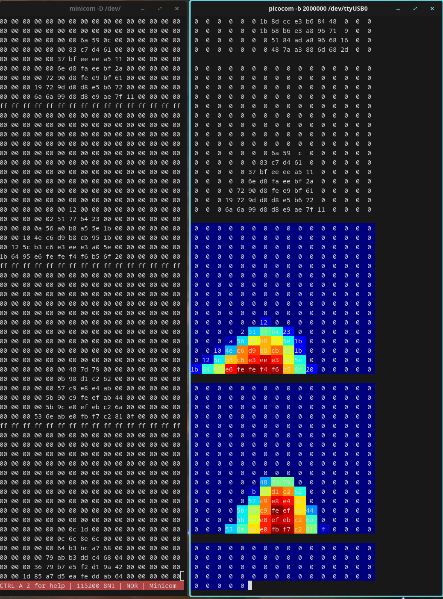
  <figcaption>左：CDC ACM 原始二进制帧的十六进制预览。右：UART 开启 16×16 打印后，从普通文本热力图切换到伪彩热力图的过程。</figcaption>
</figure>

<div style="display: flex; gap: 2%; flex-wrap: wrap;">
  <figure style="flex: 1 1 260px; margin: 0;">
    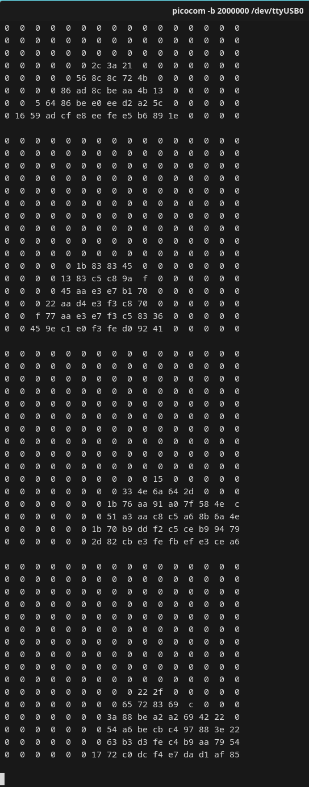
    <figcaption>UART 16×16 文本热力图：输入 <code>F</code> 开启。</figcaption>
  </figure>
  <figure style="flex: 1 1 260px; margin: 0;">
    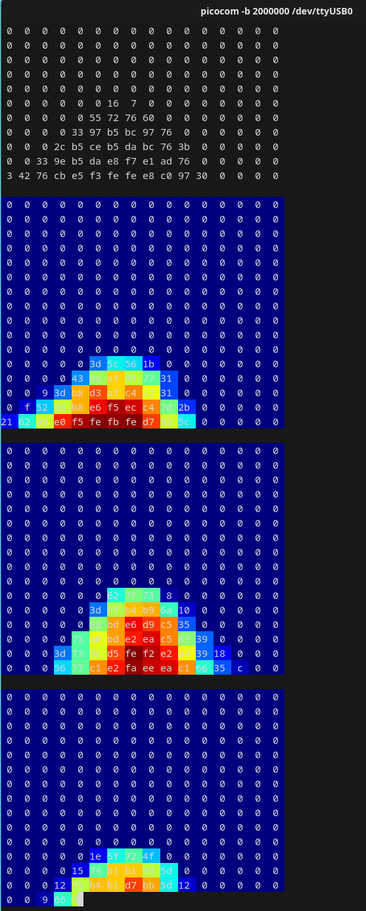
    <figcaption>UART 伪彩热力图：开启 16×16 打印后输入 <code>C</code>。</figcaption>
  </figure>
</div>

### MCU 解析串口数据帧

在 MCU 端解析时，先查找连续 16 个 `0xFF`，再把后续 256 字节按 16×16 行优先顺序解析。协议没有帧序号、时间戳或 CRC；CDC 忙时固件可能丢弃热力图帧，接收端应依靠下一组帧头重新同步。

## 常用串口命令 (用户速查)
下面摘录最常用且对普通用户最有用的串口命令，便于现场调试：

- 设置波束档位（0..9, A, B）：向串口直接输入字符，例如 `0`、`3` 或 `A`。
- 打开/关闭 LED 指示灯：输入 `e` / `E` （小写关，大写开）。
- 切换 UART 热力图打印：输入 `f` 关闭、`F` 开启 16×16 ASCII 打印。
- 调整定位阈值：输入 `t` / `T`，每次降低/提高 50，范围为 0～2000。
- 恢复主要运行标志并选择波束档位 0：输入 `R`。

更多详细指令及行为参见本文末的“开发者参考”中的完整指令表。

### 示例：设置并验证波束方向
1. 在串口中输入 `3`，选择波束档位 3。
2. 在 Audacity 中监听 CH6：你应该在 CH6 听到来自目标方向的声音被增强，或在系统中录制 CH6 再回放分析。

## 常见问题与故障排查

### Windows 只能选择 1 或 2 通道

先选择 `WASAPI`，再进入“设置 → 系统 → 声音 → 输入 → MicArray”，将“音频增强（Audio Enhancements）”设为“关闭”，然后重新打开录音软件。Windows 的 Voice Clarity 等音频增强可能限制应用可用的录音通道数。

### Linux 无法访问串口设备

无法访问 `/dev/ttyACM0` 或 `/dev/ttyUSB0` 时，可将当前用户加入 `plugdev` 组，然后重新登录：

```bash
sudo usermod -a -G plugdev $USER
```

也可以创建 udev 规则（示例，替换 vendor/product id）：

```bash
# /etc/udev/rules.d/99-ma-usb8.rules
SUBSYSTEM=="tty", ATTRS{idVendor}=="359f", ATTRS{idProduct}=="3400", MODE="0666", GROUP="plugdev"
```

### CDC ACM 不输出热力图

确认设备同时处于 CDC ACM/UAC 模式，而不是仅用作 UAC 音频。关闭其他占用该串口的软件，然后重新打开串口。

### UART 输出乱码或无法显示

确认波特率为 `2000000 bps`，并使用 `picocom -b 2000000`、`minicom -b 2000000` 等工具。Windows 下需要安装正确的 USB 串口驱动（CH340/CH341/CH552 等）。

## 固件升级

本页只提供标准 D80 板固件：

### MA-USB8 D80（2026-08-13）

- 适用阵列：标准 D80 板，半径 40 mm、直径 80 mm
- 文件：[MA-USB8-D80-260813.bin](../../assets/modules/micarray_usbboard_bl616/firmware/MA-USB8-D80-260813.bin)
- 文件大小：4079640 字节
- SHA-256：`bf9f644783023a0bbe0fffb17c1da325c8756fb5b36c0fb9211f81e5e2f3ce01`

该文件是整合烧录镜像，请直接按照下方步骤升级。

不要将该固件用于 D107 阵列。

升级步骤：

1. 下载固件并核对文件大小或 SHA-256。
2. 按照[固件刷写教程](../logic_analyzer/combo8/update_firmware.html#Burn-firmware)连接设备、进入烧录模式并写入固件。
3. 烧录完成后重新插拔设备。
4. 在 Linux 下使用 `lsusb -v` 和 `arecord -l`，或在 Windows 声音设置中确认 MicArray 已提供 8 通道、PCM 16-bit、48 kHz 格式。
5. 如果 Windows 录音软件仍然只能选择 1 或 2 通道，请参见[Windows 只能选择 1 或 2 通道](#Windows-只能选择-1-或-2-通道)。

升级前请记录当前固件版本和设备描述符，便于升级失败时核对设备状态。固件升级过程中不要断开 USB 连接或关闭烧录工具。

### 当前版本限制

- 最终固件不包含 AEC，也没有 AEC 启用或停用指令。
- 热力图帧在 CDC 忙时可能丢失，协议没有帧序号、时间戳或 CRC。
- 物理 0°、丝印 U1～U6 与软件通道的最终映射仍需固定声源夹具验证。
- 播放数据保持双声道；单扬声器产品使用哪个声道取决于后级硬件接线。

---
## 开发者参考（协议与完整指令表）

以下内容针对需要二次开发或深入调试的用户；普通用户可以忽略其中的协议细节。

### Hotmap Frame 格式（开发者视角）
| frame | bytes     | value |
| ----- | --------- | ----- |
| head  | 16        | 16 × 0xFF |
| data  | 16 × 16   | 每点 1 字节 (0-255)，按行优先 (HxW) | 

说明：总长度为 16 + 256 = 272 字节；head 用于对齐与帧头检测，payload 为 256 字节，每个字节表示该网格点的强度（0 最小，255 最大）。

### 定位算法参数

当前定位使用六麦 GCC-PHAT/SRP 类处理：512 点 FFT、15 对麦克风和 16×16 栅格。初始化参数为 `ma_sound2map_init(100, 2000, ...)`；在 48 kHz 采样率和 512 点 FFT 下，每个频点间隔为 93.75 Hz。结合当前低端严格排除逻辑，实际使用 FFT bins 2～21，即 187.5～1968.75 Hz。时延计算使用声速 340000 mm/s。

### 完整指令表（开发者）
| 指令 | 输入(小/大写: 关/开) | 默认值 | 作用 | 输入源 |
| - | - | - | - | - |
| 设置 UAC CH6 波束档位 | 0,1,..9,A,B | 0 | 选择 0～11 共 12 个档位，相邻档位相差 30°；绝对物理方向尚待验证，CH6 输出合成音频 | 任意（串口/CDC） |
| 修改声源定位激活阈值(t,T) | t, T | 650 | t: -50, T: +50, 阈值可调范围: 0~2000 | 任意（串口/CDC） |
| UART 声源定位图伪彩映射开关 (c/C) | c, C | c | `C` 开启、`c` 关闭热力图伪彩，需要先开启 16×16 文本输出 | 仅 UART |
| UART 打印内部调试信息 (d/D) | d, D | d | `D` 开启、`d` 关闭调试日志 | 仅 UART |
| LED 自动方向显示 (e/E) | e, E | E | `E` 开启、`e` 关闭 LED 自动方向显示 | 任意 |
| LED 手动环移 | <, > | - | LED 自动方向显示关闭后，手动移动 LED | 任意 |
| UART 16×16 文本输出 (f/F) | f, F | f | `F` 开启、`f` 关闭 16×16 文本热力图 | 仅 UART |
| 恢复默认设置 (R) | R | - | 恢复主要运行标志的默认值，并选择波束档位 0 | 任意 |

### udev 与权限建议
若运行 Linux 且经常使用串口，建议为设备创建 udev 规则来简化权限管理：

```bash
# /etc/udev/rules.d/99-ma-usb8.rules
SUBSYSTEM=="tty", ATTRS{idVendor}=="359f", ATTRS{idProduct}=="3400", MODE="0666", GROUP="plugdev"
```

### 串口/USB 注意事项
- CDC ACM（/dev/ttyACM0）在 Linux 下通常为内核 cdc_acm 驱动映射；若发现与 UAC 音频冲突，请先确认没有其他程序占用端口。
- UART/TTY（/dev/ttyUSB0）一般由 USB转串口芯片（CH34x、CH340、CH552）驱动映射。
