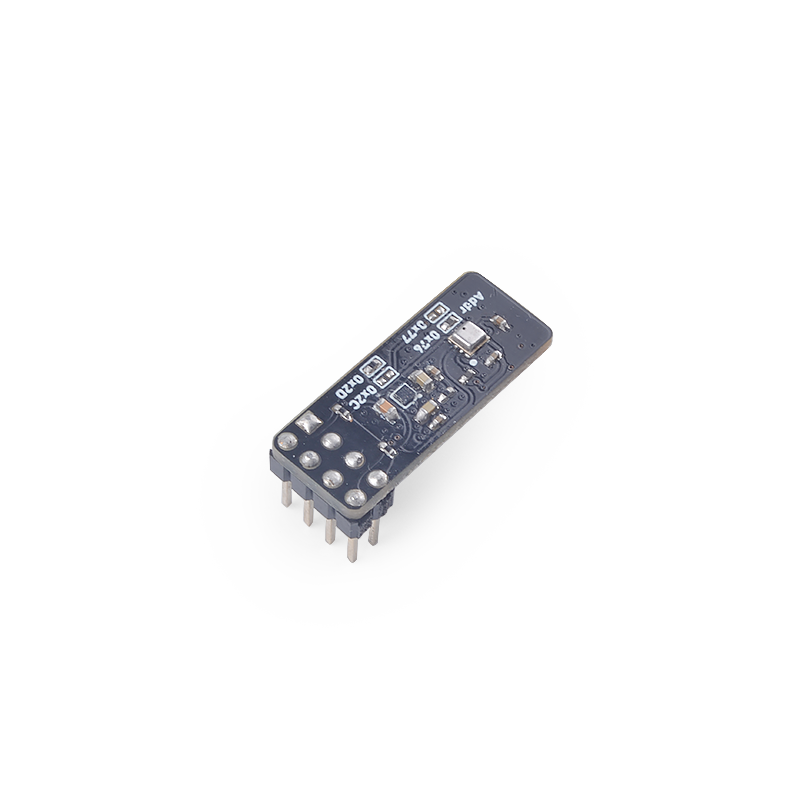
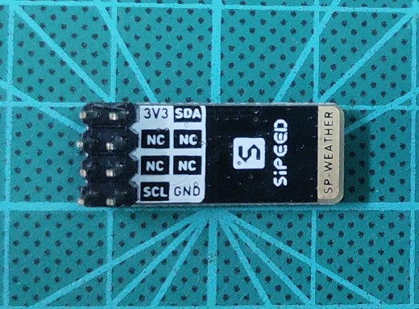
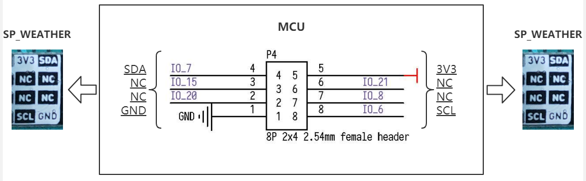
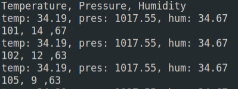
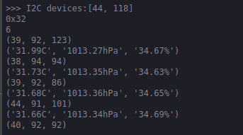
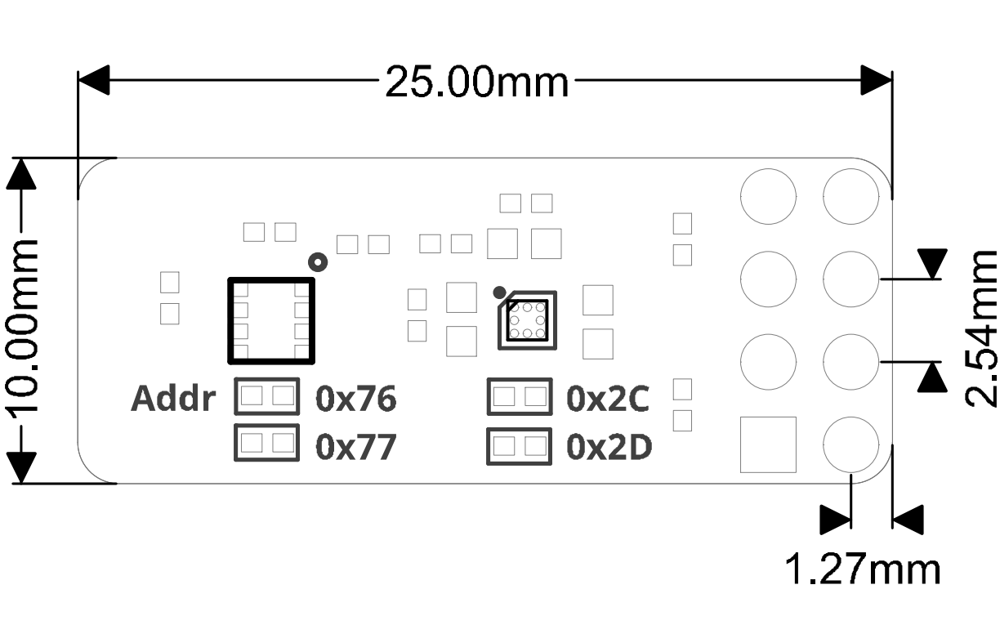

# SPMOD - Weather


## 概述




## SPMOD - Weather 介绍

特性：

- 采用 **Sipeed-SPMOD** 接口(2*4PIN 2.54mm 排针)，统一 MaixPy 开发板接口
- 通过SP-MOD I2C接口连接
- 磁性传感器：QMC7983是一个内置灵敏度补偿与NTC的三轴磁性传感器，I2C接口输出（最高频率400KHz），具有出色的动态范围和精度以及超低的功耗
- 磁感应量程：±30 高斯
- 温湿度气压传感器：BME280是同时集成了温湿度与气压传感器的数字传感器
- 模块尺寸：25.0\*10\*2.9mm


## 传感器特性：

| 磁性传感器 | QMC7983 |
| --- | --- |
| 工作电压 | 2.6V~3.6V |
| 工作电流 | 70uA |
| 休眠电流 | <1uA |
| 磁感应量程 | ±30 高斯 |
| 精度 | 每 LSB 1mG|
| RMS 噪声 | 2 mG |
| 对外接口 |I2C，默认地址 0x2C,可通过选择电阻调节 |

-----

| 温湿度气压传感器 | BME280 |
| --- | --- |
| 工作电压 | 1.71V~3.6V |
| 工作电流 | <633uA |
| 休眠电流 | <5uA |
| 湿度传感器的关键参数： | --- |
| 响应时间（𝜏63％）| 1s |
| 精度公差 | ±3％ 相对湿度 |
| 磁滞 | < 2％ 相对湿度 |
| 气压力传感器的关键参数： | --- |
| RMS 噪声 | 0.2 Pa（等效 到海拔 1.7 厘米） |
| 偏移温度系数 | ±1.5 Pa/K（等效温度变化 1°C 时，达到海拔 ±12.6 cm1s） |
| 对外接口 | I2C，默认地址 0x76, 可通过选择电阻调节 |

###  SPMOD_Weather 模块引脚定义：

| 引脚序号 | 引脚名称 | 类型 | 引脚说明      |
| -------- | -------- | ---- | ------------- |
| 1  | GND | G  | 模块电源地 |
| 2  | NC | NC  | 悬空引脚，无功能 |
| 3  | NC | NC  | 悬空引脚，无功能 |
| 4  | SDA | I/O  | 模块I2C串行数据引脚 |
| 5  | 3V3 | V  | 模块电源输入正 |
| 6  | NC | NC  | 悬空引脚，无功能 |
| 7  | NC | NC  | 悬空引脚，无功能 |
| 8  | SCL | I  | 模块I2C串行时钟引脚 |



## 接线方式



|  MCU:FUN(IO)  | SP_RFID |
| :-----------: | :-----: |
| I2C:SDA(IO_7) |   SDA   |
|   NC(IO_15)   |   NC    |
|   NC(IO_20)   |   IRQ   |
|   NC(IO_21)   |   NC    |
| GPIOHS(IO_8)  |   SHT   |
| I2C:SCL(IO_6) |   SCL   |
|   2.8~3.5V    |  3.3V   |
|      GND      |   GND   |

## 使用例程

* 流程
  1. 初始化  weather=SPWeather(i2c=i2c_bus) # create sp_weather
    while 1:
        time.sleep_ms(500)
        print(weather.qmc_read_xyz) # QMC7983 read data
        print(weather.bme_values) # BME280 read data
  2. 校准(可选)
  3. 读取距离(多种模式可选)

### C 示例：

```c

    fpioa_set_function(Weather_SCL, FUNC_I2C0_SCLK + Weather_I2C_DEVICE * 2); // Weather_SCL: 6;
    fpioa_set_function(Weather_SDA, FUNC_I2C0_SDA + Weather_I2C_DEVICE * 2); // Weather_SDA: 7;

    maix_i2c_init(Weather_I2C_DEVICE, 7, 400000); // Weather_I2C_DEVICE: 0;

    rslt = qmc_init(); // Magnetic sensor QMC7983 init
    rslt = bme280_init(&dev); // Temperature, humidity and pressure sensors BME280 init
    stream_sensor_data_normal_mode(&dev); // read and print sensor data

```

### MaixPy 例程：

```python

    i2c_bus = I2C(I2C.I2C0, freq=100*1000, scl=6, sda=7) # scl: io_6, sda: io_7

    weather=SPWeather(i2c=i2c_bus) # create sp_weather
    while 1:
        time.sleep_ms(500)
        print(weather.qmc_read_xyz) # QMC7983 read data
        print(weather.bme_values) # BME280 read data

```

## 运行环境

|  语言  |  开发板  | SDK/固件版本 |
| :----: | :------: | :--- |
|   C    | MaixCube | kendryte-standalone-sdk v0.5.6 |
| MaixPy | MaixCube | maixpy v0.5.1 |

## 运行结果

* C

    

* MaixPy

    

## 参考设计

- SPMOD_Weather 尺寸图：



-----

## 资源链接

| 资源 | --- |
| --- | --- |
| 官网 | www.sipeed.com |
| SIPEED 官方淘宝店 |[sipeed.taobao.com](sipeed.taobao.com) |
|Github | [https://github.com/sipeed](https://github.com/sipeed) |
|BBS | [http://bbs.sipeed.com](http://bbs.sipeed.com) |
|MaixPy 文档官网 | [http://maixpy.sipeed.com](http://wiki.sipeed.com/maixpy) |
|Sipeed 模型平台 | [https://maix.sipeed.com](https://maix.sipeed.com) |
|SDK 相关信息 | [https://dl.sipeed.com/MAIX/SDK](https://dl.sipeed.com/MAIX/SDK) |
|HDK 相关信息 | [https://dl.sipeed.com/MAIX/HDK](https://dl.sipeed.com/MAIX/HDK) |
|E-mail(技术支持和商业合作) | [Support@sipeed.com](mailto:support@sipeed.com) |
|telgram link | https://t.me/sipeed |
|MaixPy AI QQ 交流群（四群）| 862340358|

