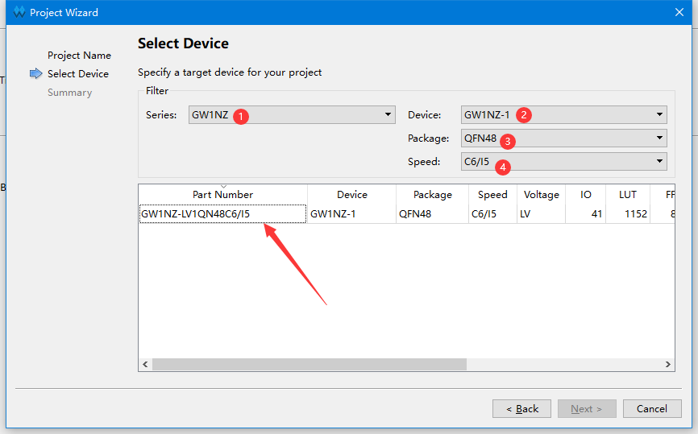
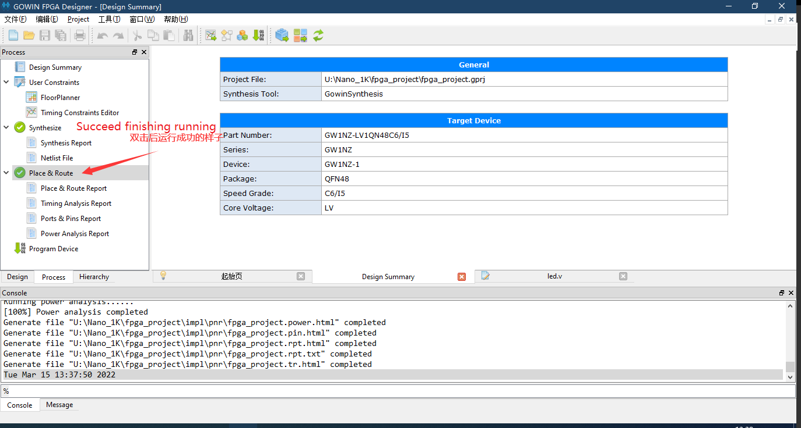
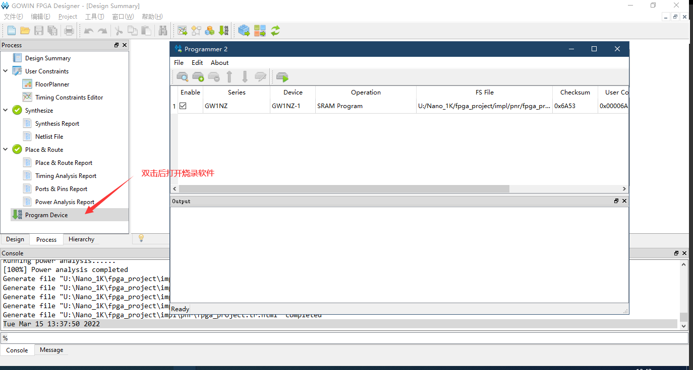

> 编辑于2022年4月13日

## 新建项目

新建工程：File-->NEW-->FPGA Design Project-->OK
    

弹出的选项框选择存储路径和工程名称（路径和文件名称要求是英文路径）
    

选择对应的型号：
    

## 编写代码

新建工程之后接下来进行代码编辑，在Design工作栏内新建“Verilog File”,如下图所示：
    

为文件命名（要求写英文名，不然后续综合很容易报错）；
   一般来说文件名称应该和文件内容模块名称相同
    

双击文件，可以在右侧的编辑框中进行代码的编写。
    

以流水灯为例，将下方的“LED例程代码”粘贴到自己的文件中，也可以自己编写自己的代码。

```verilog
module led (
    input sys_clk,          // clk input
    input sys_rst_n,        // reset input
    output reg [2:0] led    // 110 B, 101 G,001 R
);

reg [23:0] counter;

always @(posedge sys_clk or negedge sys_rst_n) begin
    if (!sys_rst_n)
        counter <= 24'd0;
    else if (counter < 24'd1349_9999)       // 0.5s delay
        counter <= counter + 1'b1;
    else
        counter <= 24'd0;
end

always @(posedge sys_clk or negedge sys_rst_n) begin
    if (!sys_rst_n)
        led <= 3'b110;
    else if (counter == 24'd1349_9999)       // 0.5s delay
        led[2:0] <= {led[1:0],led[2]};
    else
        led <= led;
end

endmodule

 ```

## 综合、约束、布局布线

### 综合

保存编辑的代码后转到“Process”界面下，对编辑好的代码进行综合，即双击“Systhesize”
    

运行之后如没有报错而且 Synthesize 变成下图里的图标
     

说明前面编辑的代码无误；如果有错，根据错误提示进行改正即可。

### 约束

- 此处未涉及时钟约束

想让 Fpga 实现代码的功能，必须将代码中涉及的 端口 绑定到 Fpga 实际的引脚上。
如下图，在左边的工作区点击 process，然后双击 FloorPlanner
   
   
在工程中第一次点击，可能会提示创建文件，点击确定即可
   

nano 1k的rgb led电路图如下所示
        

对于交互式管脚约束有下图中的两种方法
- 将对应的端口拖拽到芯片引脚上
- 在IO约束中输入端口对应的引脚编号

因此在打开的界面中按照序号的顺序来进行相应的操作（两种方式选择一种即可）
    

关于 FloorPlanner 更多的相关说明，可以参考 [SUG935-1.3_Gowin设计物理约束用户指南.pdf](http://cdn.gowinsemi.com.cn/SUG935-1.3_Gowin%E8%AE%BE%E8%AE%A1%E7%89%A9%E7%90%86%E7%BA%A6%E6%9D%9F%E7%94%A8%E6%88%B7%E6%8C%87%E5%8D%97.pdf)。里面的内容都很有用

**完成约束后记得保存~**


### 布局布线

到“Process”下运行“Place&Route”，即运行管脚布局布线，运行结果如下图所示：
    

如果没有成功运行，那自己修修。

## 烧录

- 成功完成上面步骤后就已经生成高云的比特流文件了，可以进行下面的步骤来将文件烧录到板子了。

接下来是连接板子，烧录固件。在Process界面双击`Program Device` 后打开烧录工具
    

可以从下面的图中选择烧录模式；再此以烧录到SRAM作为示例


接下来选择运行即可验证程序。有固化需求的自行选择下载到flash即可。

点灯验证到此结束。


<p id="back">
    <a href="#" onClick="javascript :history.back(-1);">返回上一页(Back)</a>
</p>