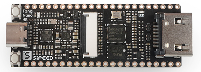

# Tang Nano 4K 

## Tang Nano 4K 开发板
Tang Nano 4K是基于[高云半导体](http://www.gowinsemi.com.cn/)的小蜜蜂系列 GW1NSR-LV4C 设计的简约型开发板。开发板设计小巧精致，将芯片的所有资源都引出，板载Type-C、USB-JTAG、DVP、HDMI座子及其电路等，并把所有IO资源引出，方便开发者拓展使用，非常适用于小型数字逻辑的设计和实验。

## 产品参数
Tang Nano 4K开发板板载的GW1NSR-LV4C，是一款系统级封装芯片，内部集成了GW1NS系列可编辑逻辑器件产品和PSRAM存储芯片。

- 下表为与前代同系列产品对比图

| 型号             | Tang Nano           | Tang Nano 4K      |
| ---------------- | ------------------- | ----------------- |
| FPGA芯片         | GW1N-1-LV           | GW1NSR-LV4C       |
| 逻辑单元         | 1152                | 4608              |
| 寄存器           | 864                 | 3456              |
| 硬核处理器       | 无                  | Coetex m3         |
| Block SRAM(bits) | 72K                 | 180K              |
| 用户闪存(bits)   | 96K                 | 256K              |
| 锁相环PLL        | 1                   | 2                 |
| I/O Bank 总数    | 4                   | 4                 |
| 最多用户I/O数    | 41                  | 44                |
| 显示屏接口       | 标准40P RGB LCD接口 | HDMI接口          |
| 摄像头接口       | None                | 常见的DVP顺序接口 |
| 尺寸             | 58.4mm\*21.3mm      | 60mm\*22.86mm     |
| 下载接口         | USB Type-C接口      | USB Type-C接口    |

## 开发环境

特别注意：
使用ide的时候版本需要>= v1.9.7.01 Beta
- 安装IDE的方法[参考](./../Tang-Nano-Doc/get_started/install-the-ide.md)

## 下载方式

- Tang Nano开发板板载BL702芯片，为GW1NSR提供JTAG调试功能，开发板可以直接连接电脑使用GOWIN programmer进行下载比特流，不需要额外的调试器。

## 资料

[相关例程](./../Tang-Nano-Doc/examples.md#板型)
[Tang nano 4K 资料库](https://dl.sipeed.com/shareURL/TANG/Nano%204K)
