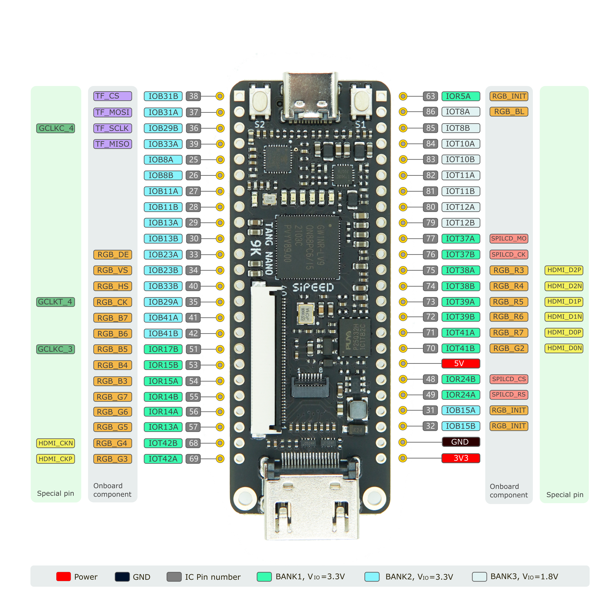

# Tang Nano 9K

>  编辑时间 2022年1月13日

## **简介**

Tang Nano 9K是基于高云GW1NR-9 FPGA芯片设计的精简型开发板。它搭载的HDMI连接器、RGB接口屏幕连接器、SPI屏幕连接器、SPI FLASH和6个LED使得用户可以方便且快速地进行FPGA验证，RISC-V软核验证和功能样机验证。GW1NR-9拥有的8640 LUT4 逻辑单元除了可以用来设计各种复杂的逻辑电路，还可以运行完整的PicoRV软核，满足了用户学习FPGA、验证软核和深度设计的各种需求。

## **产品参数**
| 类别 |数值 |
| --------------------------------- | ------------------------------------------------------------ |
| 逻辑单元(LUT4)                    | 8640                                                         |
| 寄存器(FF)                        | 6480                                                         |
| 分布式静态随机存储器  SSRAM(bits) | 17280                                                        |
| 块状静态随机存储器  B-SRAM(bits)  | 468K                                                         |
| 块状静态随机存储器数目BSRAM（个） | 26                                                           |
| 用户闪存(bits)                    | 608K                                                         |
| PSRAM(bits)                       | 64M                                                          |
| 高性能DSP模块                     | 支持9x9,18x18,36x36bit的乘法运算和54bit累加器                |
| 乘法器  (18 x 18 Multiplier)      | 20                                                           |
| SPI FLASH                         | 32M-bit                                                      |
| 灵活的PLL资源                     | 2个锁相环（PLLs）                                            |
| 显示屏幕接口                      | HDMI接口, SPI屏幕接口和RGB屏幕接口                           |
| 调试器                            | 板载BL702芯片，为GW1NR-9提供USB-JTAG下载和USB-UART串口打印功能 |
| IO                                | • 支持4mA、8mA、16mA、24mA等驱动能力   • 对每个I/O提供独立的Bus Keeper、上拉/下拉电阻及Open Drain输出选项 |
| 连接器                            | TF卡座子, 2x24P  2.54mm 排针焊盘                             |
| 按键                              | 2个用户可编程按键                                            |
| LED                               | 板载6个可编程LED                                             |

## **适用人群**

| 用法     | FPGA                             | MCU                                | FPGA+MCU                     |
| :---- | :---------- | :------------- | :----------------- |
| 语言     | Verilog HDL/Verilog         | C/C++               | Verilog HDL/Verilog ，  C/C++                |
| 简介     | 上板验证用户HDL | 用户将软核的比特流文件下载到芯片后可将 GW1NR-9当做普通的MCU来使用  | 烧入软核后可以进行双核开发 |
| 适用人群 | 初学者，FPGA开发者        | RISC-V开发者，Cortex-M开发者          | 资深软硬件工程师             |

## **上手指引**

1. 下载我们打包好的用户指南文档：[下载站](https://dl.sipeed.com/shareURL/TANG/Nano%209K/6_Chip_Manual/CN/%E9%80%9A%E7%94%A8%E6%8C%87%E5%BC%95) （下文提到的所有pdf文件都在这里）

2. 安装IDE和填写正确的License：[点击这里](https://wiki.sipeed.com/soft/Tang/zh/Tang-Nano-Doc/get_started/install-the-ide.html)

3. 阅读第一步下载的文件里面的：SUG100-2.6_Gowin云源软件用户指南.pdf

4. 阅读这个[教程](./examples/LED.md)完成点灯实验。

    建议新手在完成这一步之后，自己重新独立新建项目、编写代码，完成这个实验，并且按自己的想法修改点灯程序，增强对FPGA和硬件描述语言的理解。
    建议在这个过程阅读以下内容，阅读完才进入下一步：
    - Verilog代码规范（自行搜索，从初学就培养良好的代码规范是非常必要的）

下面的这些内容对于初学者来说是非常有用的，对未来深入学习 FPGA 很有帮助。

   - [SUG100-2.6_Gowin云源软件用户指南.pdf](http://cdn.gowinsemi.com.cn/SUG100-2.6_Gowin%E4%BA%91%E6%BA%90%E8%BD%AF%E4%BB%B6%E7%94%A8%E6%88%B7%E6%8C%87%E5%8D%97.pdf)
   - [SUG949-1.1_Gowin_HDL编码风格用户指南.pdf](http://cdn.gowinsemi.com.cn/SUG949-1.1_Gowin_HDL%E7%BC%96%E7%A0%81%E9%A3%8E%E6%A0%BC%E7%94%A8%E6%88%B7%E6%8C%87%E5%8D%97.pdf)
   - [UG286-1.9.1_Gowin时钟资源(Clock)用户指南.pdf]
   - [SUG940-1.3_Gowin设计时序约束用户指南.pdf](http://cdn.gowinsemi.com.cn/SUG940-1.3_Gowin%E8%AE%BE%E8%AE%A1%E6%97%B6%E5%BA%8F%E7%BA%A6%E6%9D%9F%E7%94%A8%E6%88%B7%E6%8C%87%E5%8D%97.pdf)
   - [SUG502-1.3_Gowin_Programmer用户指南.pdf](http://cdn.gowinsemi.com.cn/SUG502-1.3_Gowin_Programmer%E7%94%A8%E6%88%B7%E6%8C%87%E5%8D%97.pdf)
   - [SUG114-2.5_Gowin在线逻辑分析仪用户指南.pdf](http://cdn.gowinsemi.com.cn/SUG114-2.5_Gowin%E5%9C%A8%E7%BA%BF%E9%80%BB%E8%BE%91%E5%88%86%E6%9E%90%E4%BB%AA%E7%94%A8%E6%88%B7%E6%8C%87%E5%8D%97.pdf)

上面的都已经打包进了下载站[点我跳转](https://dl.sipeed.com/shareURL/TANG/Nano%209K/6_Chip_Manual/CN/%E9%80%9A%E7%94%A8%E6%8C%87%E5%BC%95)。可以点击压缩包全都下载下来

其他学习链接：
+ 在线免费教程：[菜鸟教程](https://www.runoob.com/w3cnote/verilog-tutorial.html)（学习Verilog）
+ 在线免费FPGA教程：[Verilog](https://www.asic-world.com/verilog/index.html)
+ 在线高云官方视频教程：[点击这里](http://www.gowinsemi.com.cn/video_complex.aspx?FId=n15:15:26)

5. 按照这个[教程](./examples/LCD.md)进行5寸RGB屏驱动实验（其他尺寸屏幕自行修改一下）。
   如果用户自行无法完成这个实验，可以下载我们[9K例程](https://github.com/sipeed/TangNano-9K-example)（适配9K板子+5寸屏）查看哪个步骤没做正确

    注意：屏幕接线时需要注意排线的1脚对应连接器旁的1脚丝印

    需要阅读的文档：
    - rPLL IP核的说明文档：在IDE里>Tools>IP Core Generator>Hard Module>CLOCK>rPLL>点击弹出界面右下角的Help按键就会弹出说明文档
        

        
点开查看说明位置

        
        

    - SUG284-2.1E_Gowin IP Core Generator User Guide.pdf 
    - [5寸屏规格书](https://dl.sipeed.com/fileList/TANG/Nano%209K/6_Chip_Manual/EN/LCD_Datasheet/5.0inch_LCD_Datashet%20_RGB_.pdf)：(主要是获取CLK是33.3Mhz这个信息)

6. 驱HDMI屏讲解（待更新）

## 例程汇总

- LED drive ：[点我](./examples/LED.md) 

- RGB LCD display : [点我](./examples/LCD.md)

- PicoRV源工程 : https://github.com/YosysHQ/picorv32 

- litex在9K上使用示例：即将更新

- PicoRV 在9K上运行的工程：<https://github.com/sipeed/TangNano-9K-example/tree/main/picotiny>

- HDMI显示工程：<https://github.com/sipeed/TangNano-9K-example/tree/main/picotiny>

## **硬件资料汇总**

规格书、原理图、尺寸图、3D文件等均可在这里找到：[点击这里](https://dl.sipeed.com/shareURL/TANG/Nano%209K)

## **注意事项**

1. 如果有什么疑问，欢迎加群 `834585530`, 或者去[论坛](bbs.sipeed.com)发帖

2. 如果使用programmer时候出现了红色的错误（比如找不到设备下载失败等），建议查看相关问题 [点我](./../Tang-Nano-Doc/questions.md)

3. 避免使用JTAG、MODE、DONE等引脚。如果一定要使用这些引脚，请查看《UG292-1.0原理图指导手册》

4. 请注意避免静电打到PCBA上；接触PCBA之前请把手的静电释放掉

5. 每个GPIO的工作电压已经在原理图中标注出来，请不要让GPIO的实际工作的电压超过额定值，否则会引起PCBA的永久性损坏

6. 在连接FPC软排线的时候，请确保排线无偏移、完整地插入到排线中

7. 请在上电过程中，避免任何液体和金属触碰到PCBA上的元件的焊盘，否则会导致短路，烧毁PCBA

 