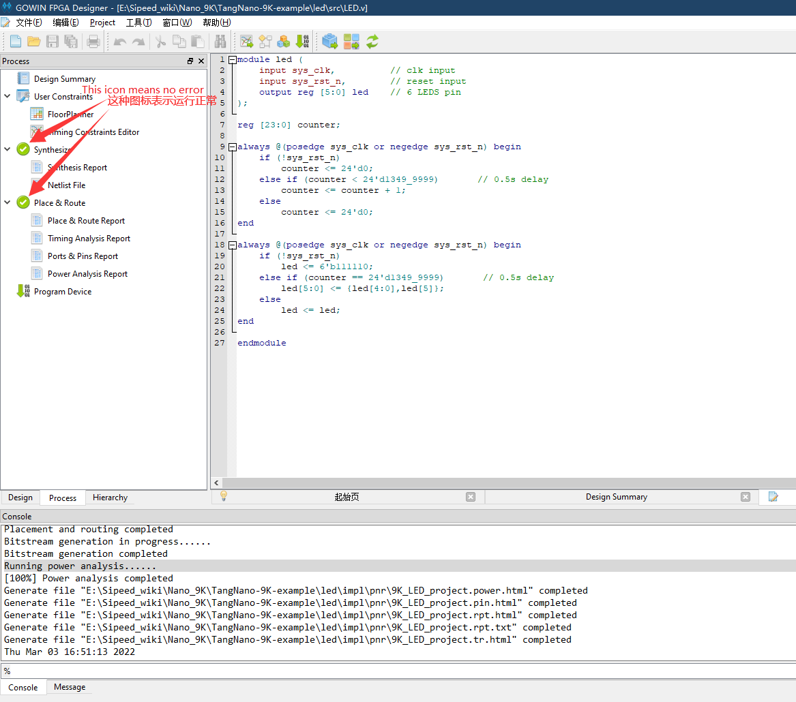

> 编辑于2022年4月12日

## 新建项目

新建工程：File-->NEW-->FPGA Dsign Project-->OK


弹出的选项框选择存储路径和工程名称（路径和文件名称要求是英文路径）


选择合适的型号：


## 准备代码
    
新建好工程之后接下来进行代码编辑，可以在下图箭头指示的地方新建“Verilog File”


为文件命名（要求写英文名，不然后续综合很容易报错）


双击文件，可以在右侧的编辑框中进行代码的编写。


以编辑流水灯为例，将下方的“LED例程代码”粘贴到自己的文件中，也可以自己编写自己的代码，例程代码地址：
<https://github.com/sipeed/TangNano-9K-example>
使用git clone后可以在 led/src/LED.v 文件夹内找到代码

```verilog
module led (
    input sys_clk,          // clk input
    input sys_rst_n,        // reset input
    output reg [5:0] led    // 6 LEDS pin
);

reg [23:0] counter;

always @(posedge sys_clk or negedge sys_rst_n) begin
    if (!sys_rst_n)
        counter <= 24'd0;
    else if (counter < 24'd1349_9999)       // 0.5s delay
        counter <= counter + 1'b1;
    else
        counter <= 24'd0;
end

always @(posedge sys_clk or negedge sys_rst_n) begin
    if (!sys_rst_n)
        led <= 6'b111110;
    else if (counter == 24'd1349_9999)       // 0.5s delay
        led[5:0] <= {led[4:0],led[5]};
    else
        led <= led;
end

endmodule

 ```

上面代码完成后需要在 Project->Configuration->Place&Route->Dual-Purpose Pin 中将`Use DONE as regular IO`勾选上，不然下面的综合会报错。


## 综合、约束、布局布线

### 综合

保存编辑的代码后转到“Process”界面下，对编辑好的代码进行综合，即双击“Systhesize”


运行的结果如下图出现 
 

且下方结果栏不出现任何从报错，说明前面编辑的代码无误，如果有错，根据错误提示进行改正即可。

### 约束

- 此处没有涉及时钟约束

想让 Fpga 实现代码的功能，必须将代码中涉及的 端口 绑定到 Fpga 实际的引脚上。

如下图，在左边的工作区点击 process，然后双击 FloorPlanner


接下来通过双击Process界面里的FloorPlanner来设置管脚约束（前面的综合如果运行失败，这一步无法进行），第一次打开会弹出缺少.cst文件.选择“OK”即可；


nano 9k的led电路图如下所示


对于交互式管脚约束有下图中的两种方法
- 将对应的端口拖拽到芯片引脚上
- 在IO约束中输入端口对应的引脚编号

因此在打开的界面中按照序号的顺序来进行相应的操作 


关于 FloorPlanner 更多的相关说明，可以参考 [SUG935-1.3_Gowin设计物理约束用户指南.pdf](http://cdn.gowinsemi.com.cn/SUG935-1.3_Gowin%E8%AE%BE%E8%AE%A1%E7%89%A9%E7%90%86%E7%BA%A6%E6%9D%9F%E7%94%A8%E6%88%B7%E6%8C%87%E5%8D%97.pdf)。里面的内容都很有用

### 布局布线

> 未开启管脚复用会提示 error2017， 前文提到过启用方法

到“Process”下运行“Place&Route”，即运行布局布线，运行结果如下图所示：


## 烧录

双击 Programmer 打开下载软件


接下来是连接板子，烧录固件，可参照下图选择版型：


以烧录进SRAM为例进行说明，如下图：
设置下载方式：

进行下载：


有固化需求的话设置下载到flash即可

结果显示：


点灯验证到此结束。

<p id="back">
    <a href="#" onClick="javascript :history.back(-1);">返回上一页(Back)</a>
</p>

