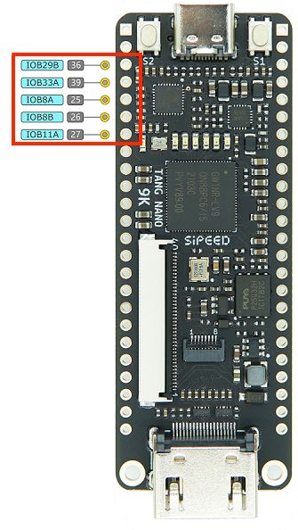

This is part 3 in our Tang Nano 9K series. In this article we will be starting a mini-project creating an OLED text engine core. 

This series will go through the entire process from concept to implementation to demonstrate not just the code but also the design process and considerations taken when creating a multi-component system.
 - Part 1 (this part) - will be an intro on the HW and creating the base driver so that we can display something to the screen.
 - Part 2 - will go over displaying text on our base OLED core including how to map ascii character codes to the screen data and using custom fonts.Part 3 - will wrap up the project taking everything we did in the previous parts in-order to build a reusable dynamic text engine that can be used by other cores to display their own data onto the screen.

To follow along you will need a Tang Nano 9K and a 128x64 pixel screen with an SSD1306 driver using its 4-wire SPI configuration (the screen itself should have 7 pins). We will be using a 0.96" OLED screen matching these requirements, you can get these along with a breadboard jumpers and the tang nano from our store <a href="https://store.lushaylabs.com/collections/all-products?ref=lushay-labs">here</a>.

## The Plan

In this part we are not going to think about the overall architecture or how the screen will communicate with the rest of the system. We will only be worried about being able to drive the screen using the FPGA - building the physical driver for the OLED screen.

To do this we first need to better understand how the screen works and how it expects to be communicated with. The screen we are using has an SSD1306 IC driver so we can go over its datasheet to get the information we need.

[SSD1306 Datasheet](https://dl.sipeed.com/fileList/others/ssd1306/SSD1306.pdf)

## The SSD1306 Driver

This driver IC is the interface between you and the actual OLED's underlying display. An OLED consists of many LEDs which need to be controlled individually to produce the desired picture. The driver is what connects to these LEDs and provides an interface where you can send it commands or data in-order to update the display. Looking at the block diagram in the datasheet we can see how it works internally:


Looking at the left side, we have a microcontroller which is what we will be communicating with. The pins we care about are the the first three and D0 and D1, the first three are reset, chip select and data/command flag and D0 is our SPI clock and D1 is our SPI data.

All the other pins are used for alternate communication methods, like if interfacing with the screen over parallel connection. But since we are using the driver in it's 4-wire SPI mode we only need the 5 pins listed above.

The MCU receives data from us, and then will decide whether the data is a command meant to control the display, or whether it was pixel data meant to update the contents of the display.

Pixel data gets stored in the Graphics RAM which stores the contents for the entire display, the RAM propagates through the display driver to the actual pins controlling the individual OLEDs. The benefits of using a screen buffer in ram like this is that the screen can be updated independently of the device controlling it, and also you can just send an update to change a part of the image and the screen will remember the rest of the image.

If the DC (data/command) flag was set to be a command, then the data will go to the command decoder to process and perform the command that you sent.

Each "transmission" to the screen is a single byte, and if the data/command pin is set low that byte will be interpreted as a command and if set high the byte will be sent to the graphics ram to the current screen position stored in the ssd1306's memory.

### How Data is Stored

The screen itself we are using has 128 x 64 pixels or 8192 individual pixels. The SSD1306 lets us configure how the ram is mapped to the display, but in general each byte controls a vertical line of 8 pixels. This means to control each of the 64 pixels in each column we need to set 8 bytes (again each byte controls 8 vertical pixels). The first byte will control the top left column, then we will increment by one and update the 8 pixels to the right and so on until we wrap around to the second row of 8 pixel columns:


> 128 bytes per row 8 rows, each byte controlling 8 vertical pixels

In the example above we sent 136 bytes with 0xFF (binary 11111111) this will result in the top row of 8 pixels being lit up across the whole screen, and in the first 8 columns we will have the top 16 pixels lit up. The least significant bit is the top pixel and the most significant bit is the bottom in each column, so a byte like 01010111 would create a column of pixels like the following: 


### Command Bytes

Like mentioned above the device has a set of commands that we can send it to do certain things. Inside the datasheet linked above we can see multiple tables including commands like the following:


Each row contains a command and shows the byte or bytes (for multi byte commands) that need to be sent. A 1 or 0 means that bit needs to be a one or zero and when there is a parameter it will be marked with numbered letters and referenced on the right.

For example to invert the screen (3rd command in the picture) we can see that we need to send 1010011x where the last bit can be either a one or zero. If we set it to a zero the command will set the display to normal mode, where a pixel set to zero will be off and a pixel set to 1 in the ram will be on. If we instead send a 1 as the last bit of the command, the screen will be inverted and a zero in RAM will cause a pixel to be lit up.

We won't go through all the commands individually but by following the same approach you can decipher the rest of the command tables.

In order to use the OLED display we first need to perform an initialization sequence where we send it all the commands required to setup all the configuration of the OLED. Once initialized we can start sending it pixel data and see the screen update.

The last thing we need to go over before getting into the code is to go over the communication protocol itself, which in our case is SPI.

## SPI

We will be communicating with the OLED screen over SPI. SPI is a serial protocol where 2 devices communicate with a data line for each direction and a common clock line. There are multiple modes in SPI, depending on whether you read on the rising / falling edge and whether the idle state of the clock is high or low.

Multiple SPI devices can be connected together over the same wires and then each of the devices will have a separate chip select pin (CS) with which you can choose which device you are currently communicating with.

With the SSD1306 driver we are using an extra wire to tell the device if the current byte being sent is data or a command. This is not part of the SPI protocol but is part of our communication interface we are building.

From the datasheet we can see an example of how to communicate with the driver in this 4-wire SPI mode:


The first line in the image is the chip select pin. Like mentioned above this pin signifies that we are currently communicating with this device, kind of like an enable pin. We pull it low at the start of our communication and put it back high when done.

The next line is the Data/Command Flag, this can be either high or low, a high value means it is pixel data and a low value signifying a command.

The third line just shows a combination of the data / clock pins just to show that multiple bytes can be sent without needing to change the chip select each time.

Next we have a zoom-in of how a single byte looks when being sent. The first of these lines is the clock pin the second is the data pin. We see here the clock pin can either be high or low while idle, but more importantly we see that the data should be updated on the falling edge and it will be read on the rising edge. We also see that the most significant bit of the byte we are sending should be sent first.

With all that information we have everything we need to start building a driver core to interface with the OLED display.
## Creating the Driver core

Like always to get started we can create a new project / folder in VSCode containing a constraints file with the tangnano9K pins we will be using, a verilog file for our driver core module and a Makefile to make building easier.
### Boilerplate

**Constraints File**

For the constraints file we can create a `tangnano9k.cst` file with the following:


If creating manually it would look like this

```txt
IO_LOC "clk" 52;
IO_PORT "clk" PULL_MODE=UP;

IO_LOC "io_cs" 36;
IO_PORT "io_cs" IO_TYPE=LVCMOS33 PULL_MODE=DOWN DRIVE=8;
IO_LOC "io_dc" 39;
IO_PORT "io_dc" IO_TYPE=LVCMOS33 PULL_MODE=DOWN DRIVE=8;
IO_LOC "io_reset" 25;
IO_PORT "io_reset" IO_TYPE=LVCMOS33 PULL_MODE=DOWN DRIVE=8;
IO_LOC "io_sdin" 26;
IO_PORT "io_sdin" IO_TYPE=LVCMOS33 PULL_MODE=DOWN DRIVE=8;
IO_LOC "io_sclk" 27;
IO_PORT "io_sclk" IO_TYPE=LVCMOS33 PULL_MODE=DOWN DRIVE=8;
```

We define the clock pin and we define the 5 pins we will need for interfacing with the OLED driver:
1. Chip Select `io_cs`
2. Data / Command `io_dc`
3. Reset Pin `io_reset`
4. SPI Data In to OLED `io_sdin`
5. SPI clock `io_sclk`

I chose these pins just because they are consecutive there is no special function and any other 3.3v pins could have been chosen.



**Makefile**

This is only if you are not using the Lushay Code extension and instead run the toolchain manually. For the Makefile just create a file called `Makefile` with our standard project boilerplate:

```makefile
BOARD=tangnano9k
FAMILY=GW1N-9C
DEVICE=GW1NR-LV9QN88PC6/I5

all: screen.fs

# Synthesis
screen.json: screen.v
	yosys -p "read_verilog screen.v; synth_gowin -top screen -json screen.json"

# Place and Route
screen_pnr.json: screen.json
	nextpnr-gowin --json screen.json --freq 27 --write screen_pnr.json --device ${DEVICE} --family ${FAMILY} --cst ${BOARD}.cst

# Generate Bitstream
screen.fs: screen_pnr.json
	gowin_pack -d ${FAMILY} -o screen.fs screen_pnr.json

# Program Board
load: screen.fs
	openFPGALoader -b ${BOARD} screen.fs -f


# Generate Simulation
screen_test.o: screen.v screen_tb.v
	iverilog -o screen_test.o -s test screen.v screen_tb.v

# Run Simulation
test: screen_test.o
	vvp screen_test.o

# Cleanup build artifacts
clean:
	rm screen.vcd screen.fs screen_test.o

.PHONY: load clean test
.INTERMEDIATE: screen_pnr.json screen.json screen_test.o
```

For a better explanation on this makefile format you can take a look at our installation guide [here](./../1_installation_getting_started/installation_getting_started.md) where we go more in depth into this template.

## Implementing the Driver Core

With the setup out of the way we can start implementing our driver with a verilog module.

To use the screen like we saw above, we need to first initialize it, it is also recommended to reset the screen after its power stabilizes, this is to make sure it is in its proper reset state. So we will first wait a bit of time, then reset the screen, once reset we will send it all the initialization commands required to set it up and then the screen should be ready to start receiving and displaying pixel data.

So our state machine will have the following steps:
1. Power Initialization Wait / Reset
2. Load Init Command Byte
3. Send Byte over SPI
4. Check Where to go from Sending
5. Load Pixel Data Byte

The first stage will cover the power reset mentioned above, next we will have a state where we load the next command byte in the init sequence.

Technically the next state would be to send the command byte over SPI, but there is no real difference between sending a command byte or sending a pixel byte so state 3 can be used for both. The only difference is which state to go to after sending the byte. In the case where there are more commands to send we would like to go to the state to load the next command otherwise we want to go to the state to load the next pixel byte. So step 4 will just check if there are more commands and if so go back to step 2 otherwise go to step 5. And step 5 just loads a pixel byte and links back to send it with step 3.


We can create a file called `screen.v` with the following module outline:

```v
module screen
#(
  parameter STARTUP_WAIT = 32'd10000000
)
(
    input clk,
    output io_sclk,
    output io_sdin,
    output io_cs,
    output io_dc,
    output io_reset
);
  localparam STATE_INIT_POWER = 8'd0;
  localparam STATE_LOAD_INIT_CMD = 8'd1;
  localparam STATE_SEND = 8'd2;
  localparam STATE_CHECK_FINISHED_INIT = 8'd3;
  localparam STATE_LOAD_DATA = 8'd4;
  
  
endmodule
```

This is an empty module receiving the inputs we defined in the constraints file and defining the 5 states listed above. `STARTUP_WAIT` is an external parameter which is the number of clock cycles to wait before resetting the screen. It is an external parameter instead of a local parameter so that in simulation testing we don't have to wait as long.

Next we can add some registers:

```v
  reg [32:0] counter = 0;
  reg [2:0] state = 0;
  
  reg dc = 1;
  reg sclk = 1;
  reg sdin = 0;
  reg reset = 1;
  reg cs = 0;
  
  reg [7:0] dataToSend = 0;
  reg [3:0] bitNumber = 0;  
  reg [9:0] pixelCounter = 0;
```

We need a counter to count clock cycles and a register for the current state. Next we have a register for each of the inputs to drive them. Both the clock and reset pins are high on idle and `dc` we could have chosen either.

Finally we have a register for the current byte we will be sending, a register to remember which bit of the current byte we are on and a register to keep track of which pixel of the screen we are on.

Next let's create a register for holding all the init command bytes. We have a total of 15 init commands which take up a total of 23 bytes (some of the commands are 2 bytes).

```v
localparam SETUP_INSTRUCTIONS = 23;
  reg [(SETUP_INSTRUCTIONS*8)-1:0] startupCommands = {
    8'hAE,  // display off

    8'h81,  // contast value to 0x7F according to datasheet
    8'h7F,  

    8'hA6,  // normal screen mode (not inverted)

    8'h20,  // horizontal addressing mode
    8'h00,  

    8'hC8,  // normal scan direction

    8'h40,  // first line to start scanning from

    8'hA1,  // address 0 is segment 0

    8'hA8,  // mux ratio
    8'h3f,  // 63 (64 -1)

    8'hD3,  // display offset
    8'h00,  // no offset

    8'hD5,  // clock divide ratio
    8'h80,  // set to default ratio/osc frequency

    8'hD9,  // set precharge
    8'h22,  // switch precharge to 0x22 default

    8'hDB,  // vcom deselect level
    8'h20,  // 0x20 

    8'h8D,  // charge pump config
    8'h14,  // enable charge pump

    8'hA4,  // resume RAM content

    8'hAF   // display on
  };
  reg [7:0] commandIndex = SETUP_INSTRUCTIONS * 8;
```

Besides for the init commands we also have a register which will remember which command we are currently on. Because the concat operator `{` and `}` place the most significant byte first, the first byte we write is actually placed at the end. We could have reversed the order we wrote the init commands and then started `commandIndex` at zero, but I think it is clearer to write the commands in order and then just start the current bit index at the last bit number.

Next let's connect all the input wires to the registers we created for them. We could have also added the keyword `reg` to the input parameters themselves in which case it would have automatically created a register for us, but to make it more pronounced I separated it into two steps.

```v
  assign io_sclk = sclk;
  assign io_sdin = sdin;
  assign io_dc = dc;
  assign io_reset = reset;
  assign io_cs = cs;
```

### The State Machine

For the state machine, let's work only on the rising edge of our clock to make things simpler.

```v
  always @(posedge clk) begin
    case (state)
    	// states here
    endcase
  end
```

Next let's go through each of the states of our state machine one by one:

**Load Init Command**

```v
STATE_INIT_POWER: begin
    counter <= counter + 1;
    if (counter < STARTUP_WAIT)
        reset <= 1;
    else if (counter < STARTUP_WAIT * 2)
        reset <= 0;
    else if (counter < STARTUP_WAIT * 3)
        reset <= 1;
    else begin
        state <= STATE_LOAD_INIT_CMD;
        counter <= 32'b0;
    end
end
```

Here we start with the reset set to 1 which is it's idle state and we wait a bit of time for the power to become stable. Then we wait the same period again this time reseting the screen by pulling the reset pin low. Finally we return the pin to high wait again a small amount to make sure the screen is ready to start receiving commands and move onto the next state resetting the counter to zero.

The default `STARTUP_WAIT` is set to 10,000,000 so with a 27Mhz crystal we are looking at about a third of a second per step so for all three steps about a second.

**Load Init Command**

```v
STATE_LOAD_INIT_CMD: begin
    dc <= 0;
    dataToSend <= startupCommands[(commandIndex-1)-:8'd8];
    state <= STATE_SEND;
    bitNumber <= 3'd7;
    cs <= 0;
    commandIndex <= commandIndex - 8'd8;
end
```

Here we set the data / command bit to zero to signify that we are sending a command. We load the next command from the register we created with all the init command bytes. The syntax used here with the minus sign after the MSB tells it that we will not be placing the least significant bit but instead the length.

Usually we use the syntax `[MSB:LSB]` to access memory here we are using `[MSB-:LEN]` there is also the option with the a plus instead of a minus for `[LSB+:LEN]`

Next we set the state to the send state as that is where we want to go next after loading a command byte. We set the bit number to the last bit as we saw from the datasheet we are sending most significant bit first in the SPI communication.

Chip select is also set low to tell the screen we want to communicate with it now which essentially enables the screen to receive data over the SPI connection. The last line decrement the `commandIndex` by 8 as we have handled those 8 bits by loading them into `dataToSend`.

**Sending a byte**

```v
STATE_SEND: begin
    if (counter == 32'd0) begin
        sclk <= 0;
        sdin <= dataToSend[bitNumber];
        counter <= 32'd1;
    end
    else begin
        counter <= 32'd0;
        sclk <= 1;
        if (bitNumber == 0)
            state <= STATE_CHECK_FINISHED_INIT;
        else
            bitNumber <= bitNumber - 1;
    end
end
```


In order to simplify the implementation we will only be using the rising edge of our own clock, but the clock signal in SPI requires us to do things on both the rising and falling edge of the clock. So to get around this we will just use two of our clock cycles for each bit, one where the SPI clock will be pulled low and one where the SPI clock will be pulled high.

In the first block we are setting the SPI clock low, and from the datasheet we saw we are supposed to change the data on the SPI data pin on the falling edge so we do that as-well.

On the second clock cycle of this state we will then reset the counter and pull the clock high, pulling it high will tell the screen to read the bit that we put on the data pin in the previous clock cycle. Lastly we check if we are already on the last bit, if so we go on to the next state, otherwise we decrement the `bitNumber` register to move to the next bit and continue sending in the current state.

**Check Finished Init**

```v
STATE_CHECK_FINISHED_INIT: begin
    cs <= 1;
    if (commandIndex == 0)
        state <= STATE_LOAD_DATA; 
    else
        state <= STATE_LOAD_INIT_CMD; 
end
```

In this stage we are pulling the chip select high to tell the screen we are finished (not mandatory as we could have sent multiple bytes on the same chip select pulse). Next we check if `commandIndex` is 0 which would mean we sent all the commands and can move from here to loading the next pixel byte, otherwise go back and load the next command byte.

**Load Pixel Data**

```v
STATE_LOAD_DATA: begin
    pixelCounter <= pixelCounter + 1;
    cs <= 0;
    dc <= 1;
    bitNumber <= 3'd7;
    state <= STATE_SEND;
    if (pixelCounter < 136)
        dataToSend <= 8'b01010111;
    else
        dataToSend <= 0;
end
```

The last state loads the pixel bytes one at a time. We start by incrementing the `pixelCounter` to track which screen pixels we are. Next we set chip select to zero to re-enable the screen communication. Data / Command flag is set to 1 to signify we will be sending data now not commands.

Next we reset the bit number back to the last bit and the state we set back to the "send byte" state to send the next pixel byte.

We don't currently have any image to display, so as an example to make sure everything is working we can simply use the byte example from above as a test where we send the screen 136 bytes of 01010111.

We never need to reset pixelCounter since there are exactly 1024 bytes which exactly fits into 10 bits, so the `pixelCounter` register will automatically roll-over back to zero on its own.

That should be everything required to get the screen working, programming the Tang Nano 9K by clicking on the "FPGA Toolchain" button from the bottom bar and then selecting "Build and Program" from the menu. (Or `make load` if running manually). With our tangnano programmed you should get something like the following:


## Loading An Image

In terms of Verilog, loading an image instead of our two static rows of lines is pretty easy. We first need a memory where we can store all our bytes:


```v
reg [7:0] screenBuffer [1023:0];
initial $readmemh("image.hex", screenBuffer);
```


Our memory has 1024 slots each of which hold a single byte. The second lines tells the toolchain to load a file called `image.hex` into this memory.

And then we can change the last if / else of our load pixel state to the following:

```v
dataToSend <= screenBuffer[pixelCounter];
```

So our entire state should look like this:

```v
STATE_LOAD_DATA: begin
    pixelCounter <= pixelCounter + 1;
    cs <= 0;
    dc <= 1;
    bitNumber <= 3'd7;
    state <= STATE_SEND;
    dataToSend <= screenBuffer[pixelCounter];
end
```

Some would say the code is even simpler now. The trouble comes more in how to create the file `image.hex`. We know each byte needs to represent 8 vertical pixels and we need to scan across the image from the top left in rows of 8 pixels. So the task of loading an image is more a task of converting an image into the format we need in-order to display it. Luckily we can create a simple node.js script to do the conversion for us.

### Preparing the Image Data

To begin with we first need a png image with the same size as the screen - 128 x 64 pixels in size. Since the screen only has a single color we will only be using the transparency value of a PNG image to determine whether or not to turn on a pixel.

To convert our image we will be using a node.js library to parse the image called `pngjs`. To install the library you can run the following command from the project directory:

```javascript
npm i pngjs
```

Next let's create a script called `generate_image.js` with the following:

```javascript
const fs = require("fs");
const PNG = require("pngjs").PNG;

fs.createReadStream("image.png")
  .pipe(new PNG())
  .on("parsed", function () {
    const bytes = [];

    for (var y = 0; y < this.height; y+=8) {
      for (var x = 0; x < this.width; x+=1) {
        let byte = 0;

        for (var j = 7; j >= 0; j -= 1) {
            let idx = (this.width * (y+j) + x) * 4;
            if (this.data[idx+3] > 128) {
                byte = (byte << 1) + 1;
            } else {
                byte = (byte << 1) + 0;
            }
        }

        bytes.push(byte);
      }
    }
    const hexData = bytes.map((b) => b.toString('16').padStart(2, '0'));
    fs.writeFileSync('image.hex', hexData.join(' '));
});
```

We start by including the library along with the filesystem package to load the file.

The next line creates a read stream to load the image (named `image.png`) and then pipes it to a PNG instance from the `pngjs` library and the next block will be called once the entire image is ready and loaded in memory.

Inside this `parsed` block we have three nested `for` loops, the outer one is to go over the vertical lines, as you can see from the end of the line, we skip each time by 8 lines as each 8 lines are stored in a single byte.

The next `for` loop is for going through all the columns nothing special here. The final `for` loop is for incrementing through each of the 8 pixels in a vertical column. Each time we complete the inner-loop it means we have gone through 8 vertical pixels and we can store a new byte moving onto the next vertical column in our row.

We start the internal loop at the last bit so that we can shift each of the bits into `byte` from the right.

Going through the internal loop we are simply getting the index for the current pixel. `this.data` is a long array of bytes where for each pixel we have 4 bytes, one for red, one for green, one for blue and one for the alpha channel. So the first line calculates this offset by figuring out which byte we are, this is the number of complete rows (or y offset) multiplied by 128 (the screen width) plus the current x offset. We then multiply by 4 since each pixel is 4 bytes (RGBA).

Once we have the offset we check if the transparency (or 4th byte in our 4 byte pixel) is greater then 128 (out of 256) so if it is 50% or more transparent we will put a zero and the pixel will be turned off, otherwise we will put a 1 and the pixel will be highlighted.

Other then that we have these two lines:

```javascript
const hexData = bytes.map((b) => b.toString('16').padStart(2, '0'));
fs.writeFileSync('image.hex', hexData.join(' '));
```

Where we take each of our bytes and convert them to hex (base 16) and we pad them from the left with zeros so that each byte will be exactly 2 hex characters.

The final line outputs the hex data into a file called `image.hex` separating each hex byte with a space.

With our hex file created and our code updated we should be able to reprogram our FPGA and get something like the following:


## Conclusion

In this part we have created the physical driver core to interface with the 0.96" OLED display and we have covered loading a simple image to it. In the next part we will take it a step further and "generate" the screen buffer on chip by converting ascii text into pixels implementing text and fonts into our core.

Thank you for reading, if you have any questions or comments feel free to leave them below or message us on twitter <a href="https://twitter.com/LushayLabs?ref=lushay-labs">here</a>.

To get any of the items used in this tutorial like the screen / tang nano or breadboard you can go to lushaylabs store <a href="https://store.lushaylabs.com/collections/all-products?ref=lushay-labs">here</a> .

As always all the examples can be found on github by following this <a href="https://github.com/lushaylabs/tangnano9k-series-examples?ref=lushay-labs">link</a>