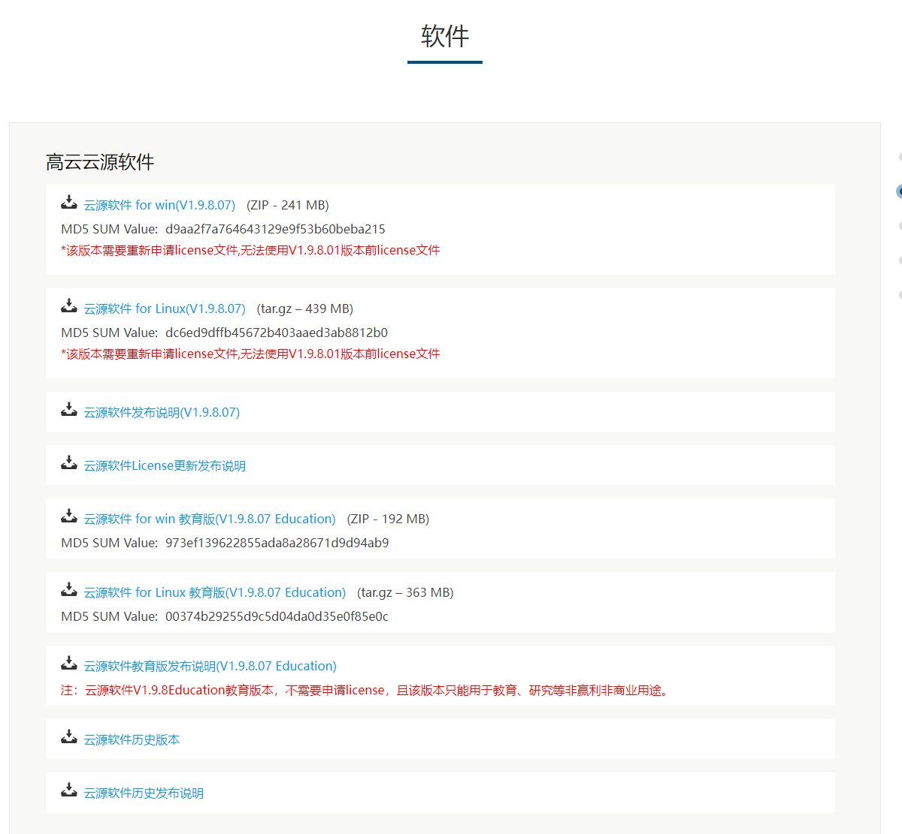

使用高云的FPGA需要用到GOWIN这个软件，对应的软件文档链接：
<http://www.gowinsemi.com.cn/down.aspx?FId=n14:14:26>


- 用户安装请根据自己电脑系统进行IDE选择，例如Windows系统的用户用选择带有Win版本的IDE。
- 不推荐使用教育版本，教育版本安装之后可选芯片仅包含教育使用芯片型号，可选型号稀少。
- 经测试V1.9.8.1版本可用 [GAO](http://cdn.gowinsemi.com.cn/SUG114-2.5_Gowin%E5%9C%A8%E7%BA%BF%E9%80%BB%E8%BE%91%E5%88%86%E6%9E%90%E4%BB%AA%E7%94%A8%E6%88%B7%E6%8C%87%E5%8D%97.pdf)
- **网络版license仅适用于1.9.8之前的版本**


## 安装软件

此处以安装 **Gowin_V1.9.8_win** 为例进行安装示范。
其他版本用户根据需要自己选择安装。
- 下文中有关联网激活ide的方式仅限于1.9.8之前的版本

云源软件链接 http://www.gowinsemi.com.cn/faq.aspx



> 由于高云的IDE在不断的更新中，上图为2021年11月30号截图

进入链接后选择“云源软件历史版本”，往下拉找到历史版本中最新版本进行下载，下载到本地的文件夹是一个压缩包格式的文件，进行解压后得到安装包“Gowin_V1.9.8_win.exe”，直接双击开始进行安装：

<html>
<div class="imbox">
    
    
<style>
.imbox{
     display:flex;
     flex-direction: row;
     }
</style>
</div>
</html>

- 下图的两个都需要安装上


- 下图的安装路径个人按照自己需要设置
  


- 安装中...


- 下面这一步不要更改任何东西，按照默认的点击`Finish`就行


- 上面的`Finish`后会出现下面的内容，这是安装驱动的。

<html>
<div class="imbox">
    
    
<style>
.imbox{
     display:flex;
     flex-direction: row;
     }
</style>
</div>
</html>

- 这里需要选择接受协议才能继续安装
  
<html>
<div class="imbox">
    
    
<style>
.imbox{
     display:flex;
     flex-direction: row;
     }
</style>
</div>
</html>

- 点击完成后桌面上会出现下面的图标
  


到这里我们就完成了软件的安装

## 拓展

获取 license 然后到使用 IDE 可能要花费时间。在这期间可以看看高云的官当文档。下面简单说明

在 IDE 的安装路径下主要有如下内容：IDE 文件夹、Programmer 文件夹、uninst.exe；

- **IDE** 文件夹：这里主要说一下里面的 **doc** 文件夹，用户在安装完之后可以在这个文件夹里面看到高云提供的大多数文档高云，主要内容如下图所示：


- Programmer 文件夹：里面是烧录软件，也有相关的文档。


一般来说建议把这个删掉。替换成特定版本的（这样能减少不少问题）。 可以在这里下载：[点我跳转](https://dl.sipeed.com/shareURL/TANG/programmer)

- uninst.exe：卸载IDE

## license 激活

接下来是进行 **license** 的申请，有两种方式：

### 使用单机版 license (需要自己申请 license)

- 有两种方法申请license

#### 向高云官方申请

点击链接且填写完毕后等待即可 http://www.gowinsemi.com.cn/faq_view.aspx

#### 向sipeed发邮件申请

- 通常邮件会在周二和周五回复

sipeed 回复的邮件不支持 V1.9.8 和 V1.9.8之前的版本。
需要的话可用在线license

发送申请邮件到 support@sipeed.com 来申请license，标题为 [Apply Tang Lic]MAC: xxxxxx ，内容模板如下：

```
公司名称:
公司网站:
部门:
联系人姓名:
联系人电话:
联系人邮箱:
联系人省份:
计算机MAC地址:
license类型:共享型 仅本机
操作系统类型:Windows Linux
代理商推荐:群策电子 致远达科技 算科电子 欣华隆科技 北高智科技 晶立达科技 其他
```

打开高云 IDE 的时候，在弹出的 license 管理中，选择自己本地 license 的文件


下面是另一种添加方法， 使用 sipeed 的 license 服务器联网激活

### 使用 sipeed 的 license 服务器联网激活

> 在线许可服务器仅适用于 GoWin V1.9.8 及更低版本

这种方式配置简单，不过没有网络的情况下无法使用软件。

安装好软件并打开后，软件会提示需要 license，在弹出框中填入服务器地址 `45.33.107.56` 即可，端口：10559


在此主要以“Use Floating License server”一栏进行测试


输入后点击“Save”,在联网的情况下重新打开应用可以直接进入使用界面：


到此，安装结束。

## 相关文档

+ [高云软件简介和安装](http://cdn.gowinsemi.com.cn/%E9%AB%98%E4%BA%91%E8%BD%AF%E4%BB%B6%E7%AE%80%E4%BB%8B%E5%92%8C%E5%AE%89%E8%A3%85.pdf)

## Burn in linux

[Linux系统下烧录方法](./flash_in_linux.md)