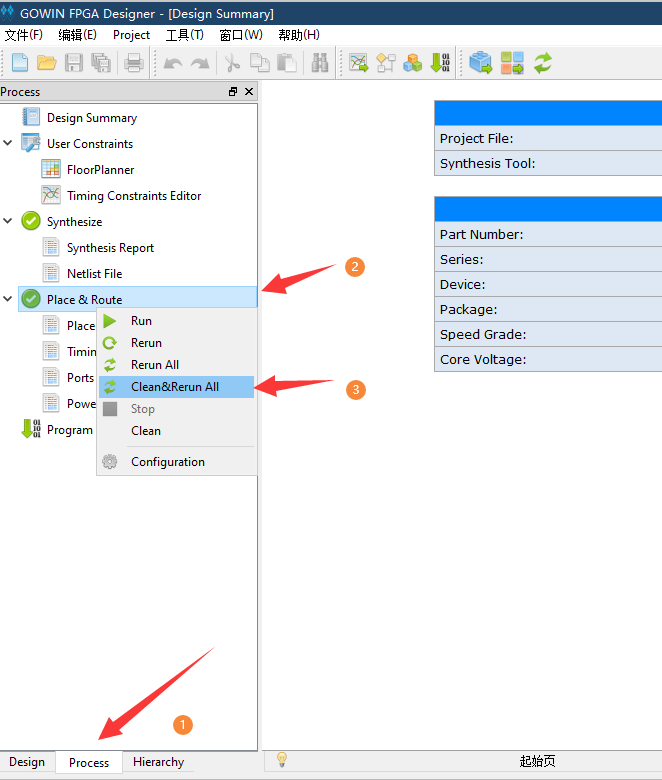

# 使用github例程

- 首先获得仓库文件 https://github.com/sipeed/Tang-Nano-examples

- 打开 Tang-Nano-examples\example_led\led_prj 目录下的 led_prj.gprj 文件

- 在process界面右键选择 clean&Rerun all
    
    
- 紧接着会报错（这是历史问题，有兴趣可以自己查查）。
  顶部菜单栏 Project -> Configuration -> Syntheize 选择 GowinSyntheize 后点击**确定**，然后重新在 Place&Route 右键 clean&Rerun all
   
  
- 然后是进行连接板子，烧录固件。在Process界面双击`Program Device` 后打开烧录工具
   
   
- 接下来选择sram烧录即可验证程序。
    

    <a href="#" onClick="javascript :history.back(-1);">返回上一页(Back)</a>

