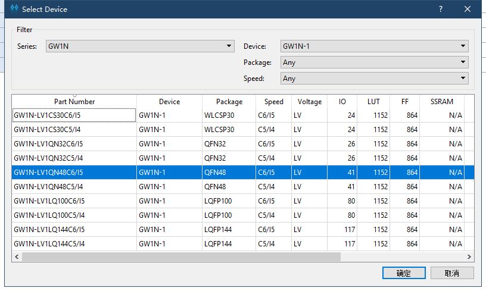
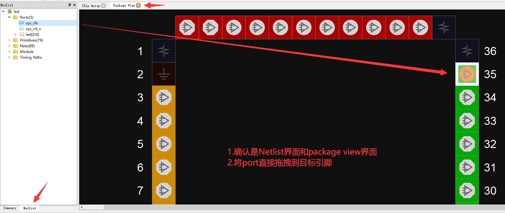
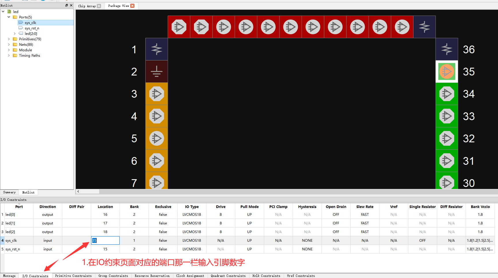

# 自己点灯

## 新建项目

新建工程：File-->NEW-->FPGA Design Project-->OK
    

弹出的选项框选择存储路径和工程名称（路径和文件名称要求是英文路径）
    

选择对应的型号：
    
    
## 编写代码

新建好工程之后接下来进行代码编辑，在Design工作栏内新建“Verilog File”,如下图所示：
    
    
为文件命名（要求写英文名，不然后续综合很容易报错）； 
   一般来说对于verolog文件建议文件名称与文件module名称应当相同
    

双击新建的 .v 文件，可以在右侧的编辑框中编写代码。
    


以流水灯为例；将下方的代码粘贴到自己的文件中，也可以自己编写代码。

```verilog
module led (
    input sys_clk,
    input sys_rst_n,
    output reg [2:0] led // 110 B, 101 R, 011 G
);

reg [23:0] counter;

always @(posedge sys_clk or negedge sys_rst_n) begin
    if (!sys_rst_n)
        counter <= 24'd0;
    else if (counter < 24'd1199_9999)       // 0.5s delay
        counter <= counter + 1'b1;
    else
        counter <= 24'd0;
end

always @(posedge sys_clk or negedge sys_rst_n) begin
    if (!sys_rst_n)
        led <= 3'b110;
    else if (counter == 24'd1199_9999)       // 0.5s delay
        led[2:0] <= {led[1:0],led[2]};
    else
        led <= led;
end

endmodule

 ```

## 综合、约束、布局布线

### 综合

保存编辑的代码后转到“Process”界面下，对编辑好的代码进行综合，即双击“Systhesize”
    

运行之后如没有报错而且 Synthesize 变成下图里的图标
     

说明前面编辑的代码无误；如果有错，根据错误提示进行改正即可。        

### 约束

- 此处未涉及时钟约束

想让 Fpga 实现代码的功能，必须将代码中涉及的 端口 绑定到 Fpga 实际的引脚上。

如下图，在左边的工作区点击 process，然后双击 FloorPlanner


接下来通过 双击 Process 界面里的FloorPlanner来设置管脚约束。第一次打开会弹出缺少.cst文件.选择“OK”即可；
    

nano 的 rgb led电路图如下所示
    

整个项目需要约束的引脚如下

| port      | I/O    | pin | desc       |
| --------- | ------ | --- | ---------- |
| sys_clk   | input  | 35  | 时钟输入脚  |
| sys_rst_n | input  | 15  | 系统复位脚  |
| led[0]    | output | 16  | 绿灯       |
| led[1]    | output | 17  | 蓝灯       |
| led[2]    | output | 18  | 红灯       |

对于交互式管脚约束有下图中的两种方法
- 将对应的端口拖拽到芯片引脚上
- 在IO约束中输入端口对应的引脚编号

在打开的界面中按照序号的顺序来进行相应的操作（两种方式选择一种即可）



- 直接编写约束文件方法用户自行研究

关于 FloorPlanner 更多的相关说明，可以参考 [SUG935-1.3_Gowin设计物理约束用户指南.pdf](http://cdn.gowinsemi.com.cn/SUG935-1.3_Gowin%E8%AE%BE%E8%AE%A1%E7%89%A9%E7%90%86%E7%BA%A6%E6%9D%9F%E7%94%A8%E6%88%B7%E6%8C%87%E5%8D%97.pdf)。里面的内容都很有用

### 布局布线

到“Process”下运行“Place&Route”，即运行管脚布局布线，运行结果如下图所示：
    
    
## 烧录

接下来是连接板子，烧录固件。在Process界面双击 `Program Device` 后打开烧录工具
    

可以在图中进行相应的修改
    

接下来选择sram烧录即可验证程序。
    
    
点灯验证到此结束。

<p id="back">
    <a href="#" onClick="javascript :history.back(-1);">返回上一页(Back)</a>
</p>