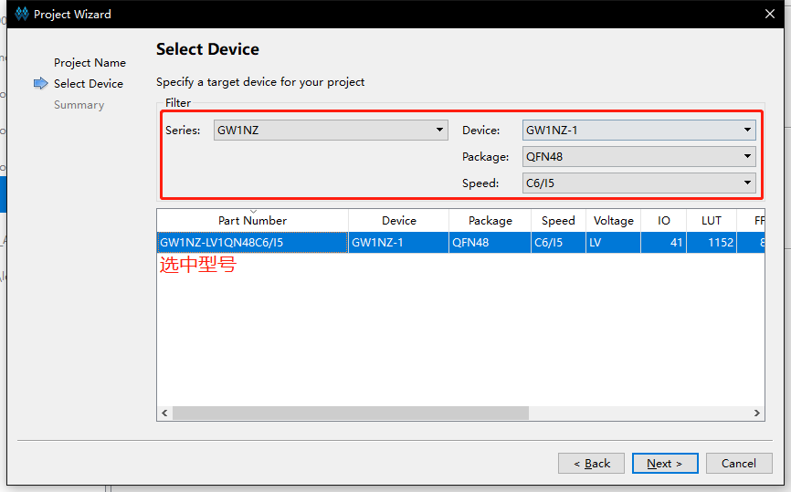
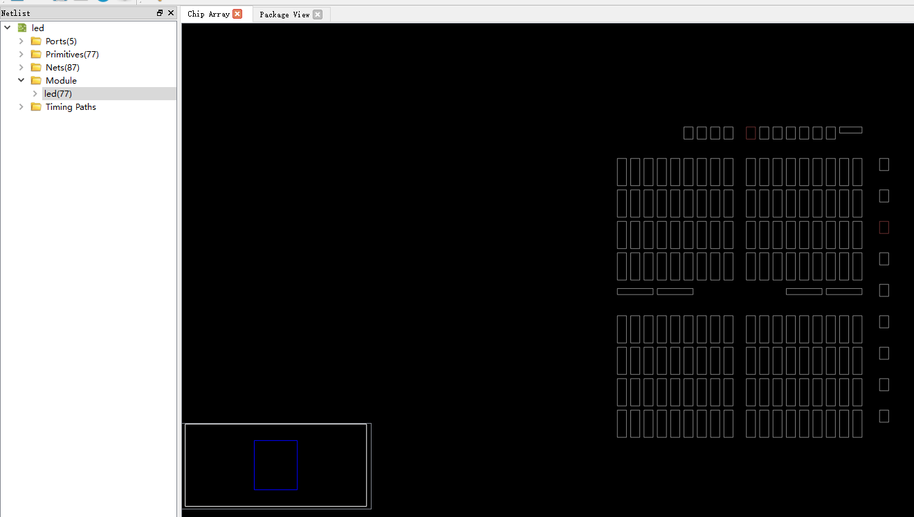
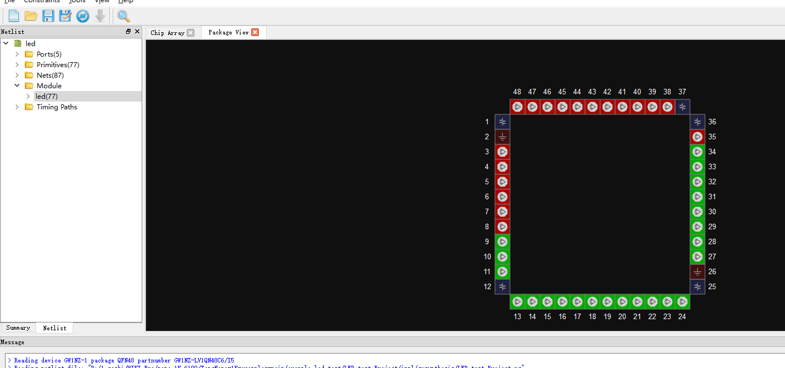
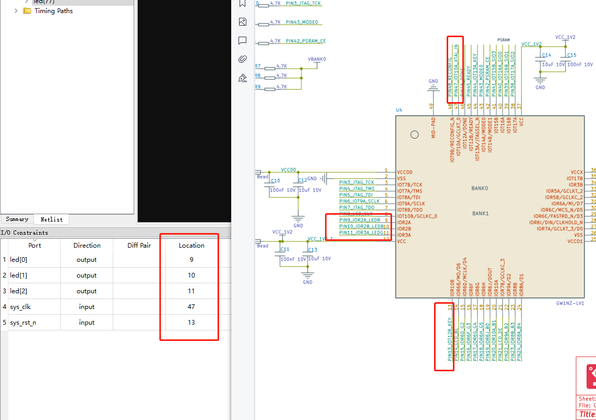
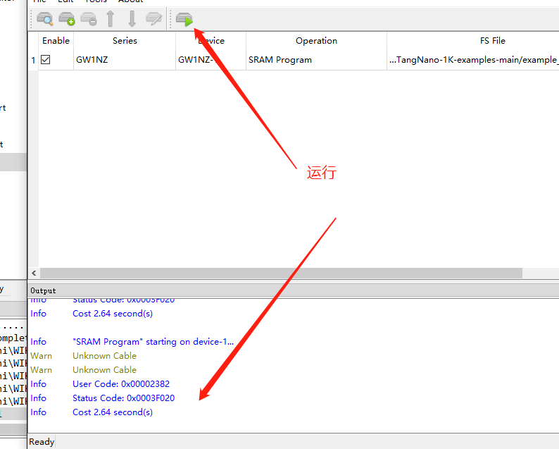
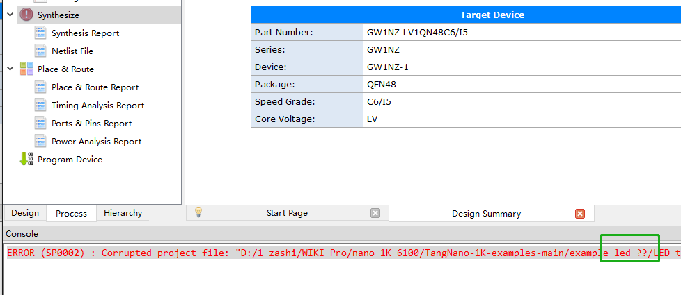
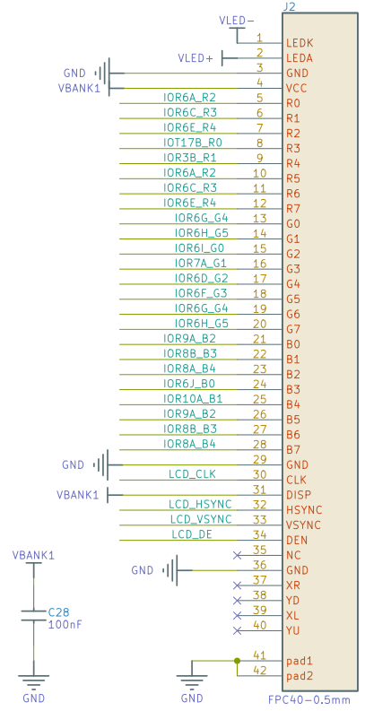
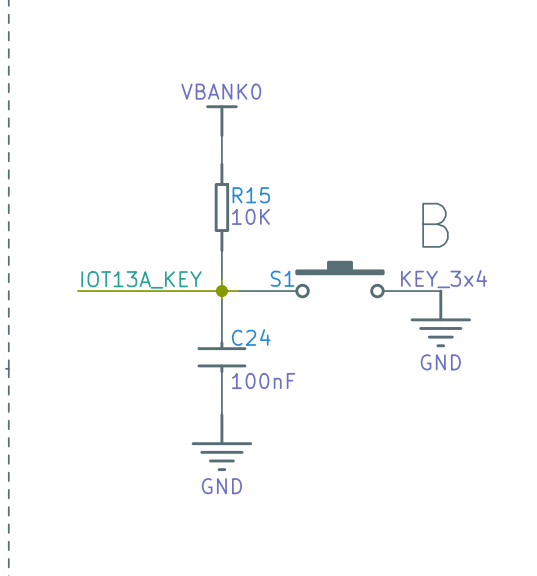
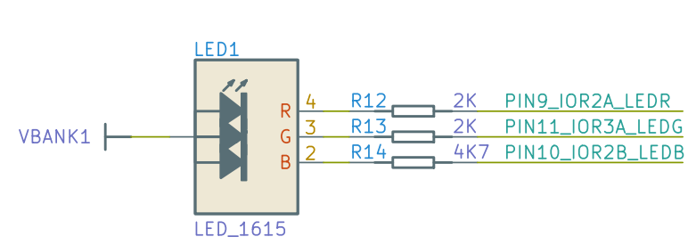

# 一些例程

## 点灯LED

1. 新建工程：File-->NEW-->FPGA Dsign Project-->OK
    

2. 弹出的选项框选择存储路径和工程名称（路径和文件名称要求是英文路径）
    

3. 选择合适的型号：
    

4. 新建好工程之后接下来进行代码编辑，在Design工作栏内新建“Verilog File”,如下图所示：
    
5. 为文件命名（要求写英文名，不然后续综合很容易报错）
    
6. 双击文件，可以在右侧的编辑框中进行代码的编写。以编辑流水灯为例，将下方的“LED例程代码”粘贴到自己的文件中，也可以自己编写自己的代码，例程代码地址：<https://github.com/sipeed/TangNano-1K-examples>

    ```v
    module led (
        input sys_clk,
        input sys_rst_n,
        output reg [2:0] led // 110 R, 101 B, 011 G
    );

    reg [31:0] counter;

    always @(posedge sys_clk or negedge sys_rst_n) begin
        if (!sys_rst_n) begin
            counter <= 31'd0;
            led <= 3'b110;
        end
        else if (counter < 31'd1350_0000)       // 0.5s delay
            counter <= counter + 1'b1;
        else begin
            counter <= 31'd0;
            led[2:0] <= {led[1:0],led[2]};
        end
    end

    Endmodule

    ```

7. 代码编辑结束后转到“Process”界面下，对编辑好的代码进行综合，即运行“Systhesize”
    
    运行的结果如上图出现  的形状，且下方结果栏不出现任何从报错，说明前面编辑的代码无误，如果有错，根据错误提示进行改正即可。

8. 接下来通过  打开“FloorPlanner”实现管脚约束（前面的综合如果运行失败，这一步无法进行），第一次打开会弹出缺少.cst文件：
    
    选择“OK”即可；
    初始界面如图：
9. 将界面转到“Package View”界面，点击下方“I/O Constraints”编辑引脚数据，如下图所示：
    
    引脚情况：
    
    引脚分布情况：

| PORT | I/O | PIN | DESE |
| --- | --- | --- | --- |
| SYS_CLK | INPUT | 47 | 47 |
| SYS-RST-N | INPUT | 13 | --- |
| LED[0] | OUTPUT | 9 | --- |
| LED[1] | OUTPUT | 10 | --- |
| LED[2] | OUTPUT | 11 | --- |

10.将界面转到“Package View”界面，点击下方“I/O Constraints”编辑引脚数据，如下图所示：


11.到“Process”下运行“Place&Route”，即运行管脚布局布线，运行结果如下图所示：


12.接下来是进行连接板子，烧录固件，可参照下图选择版型：


13.以烧录进SRAM为例进行说明，如下图：


最后运行：


14、结果显示：
【此处放置LED闪烁动图】

15、解说烧录到FLASH中的方式：


点灯步骤到此结束。


> 说明：
> 01、只测试过下载站下班的版本以及1.9.8版本测试正常，其他版本需用户自行确认。
> 02、不要使用中文路径-->错误：


## 驱屏教程

例程代码地址：<https://github.com/sipeed/TangNano-1K-examples>



引脚分布情况：

| PORT | I/O | PIN | DESE |
| --- | --- | --- | --- |
| KEY | INPUT | 13 | 47  |
| LCD_B[0] | INPUT | 19 | --- |
| LCD_B[1] | OUTPUT | 20 | --- |
| LCD_B[2] | OUTPUT | 22 | --- |
| LCD_B[3] | OUTPUT | 23 | --- |
| LCD_B[4] | OUTPUT | 24 | --- |
| LCD_CLK | OUTPUT | 8 | --- |
| LCD_DEN | OUTPUT | 21 | --- |
| LCD_G[0] | OUTPUT | 28 | --- |
| LCD_G[1] | OUTPUT | 27 | --- |
| LCD_G[2] | OUTPUT | 15 | --- |
| LCD_G[3] | OUTPUT | 16 | --- |
| LCD_G[4] | OUTPUT | 17 | --- |
| LCD_G[5] | OUTPUT | 18 | --- |
| LCD_HYNC | OUTPUT | 33 | --- |
| LCD_R[0] | OUTPUT | 15 | --- |
| LCD_R[2] | OUTPUT | 34 | --- |
| LCD_R[3] | OUTPUT | 31 | --- |
| LCD_R[4] | OUTPUT | 30 | --- |
| LCD_R[4] | OUTPUT | 29 | --- |
| LCD_SYNC | OUTPUT | 32 | --- |
| LED_B | OUTPUT | 10 | --- |
| LED_G | OUTPUT | 11 | --- |
| LED_R | OUTPUT | 9 | --- |
| XTAL_IN | INPUT | 47 | --- |
| nRST | INPUT | 44 | --- |

详细代码和工程建立步骤请参照LED点灯例程。
