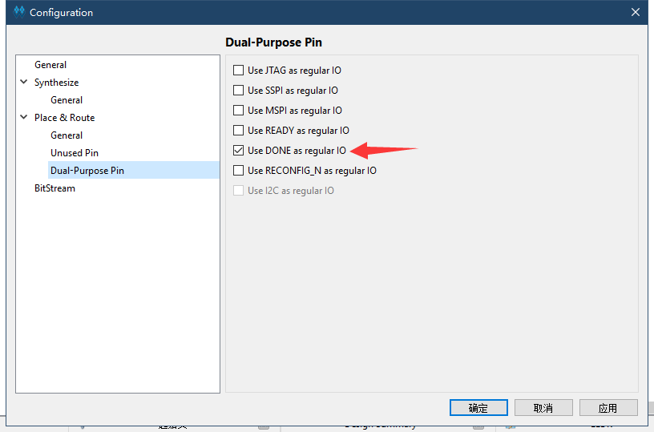
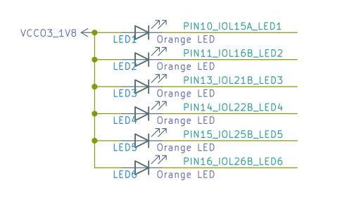
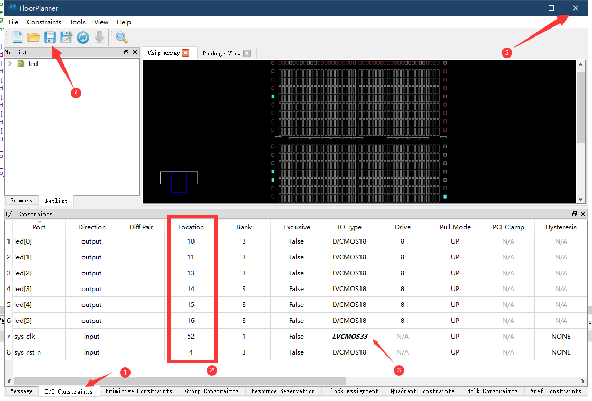
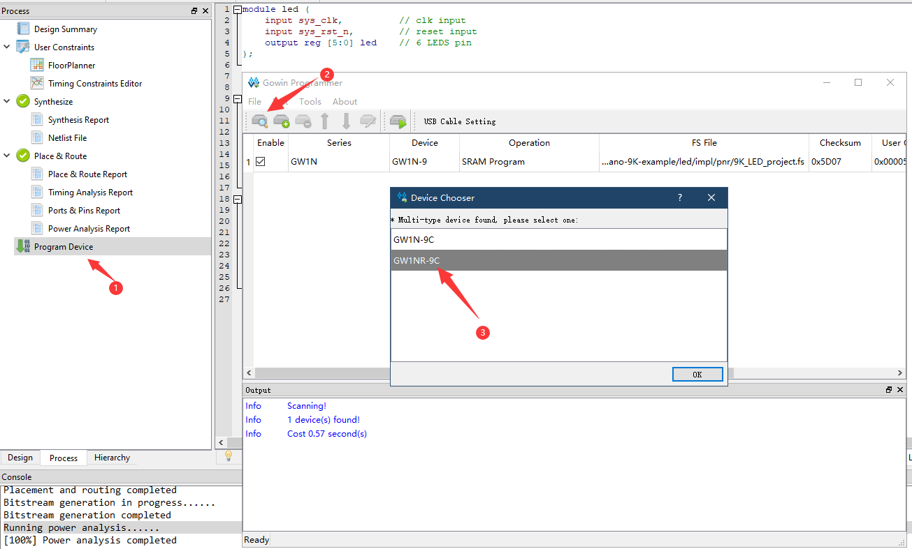

1. 新建工程：File-->NEW-->FPGA Dsign Project-->OK
    

2. 弹出的选项框选择存储路径和工程名称（路径和文件名称要求是英文路径）
    

3. 选择合适的型号：
    
    
4. 新建好工程之后接下来进行代码编辑，在Design工作栏内新建“Verilog File”,如下图所示：
    
5. 为文件命名（要求写英文名，不然后续综合很容易报错）
    
    
6. 双击文件，可以在右侧的编辑框中进行代码的编写。以编辑流水灯为例，将下方的“LED例程代码”粘贴到自己的文件中，也可以自己编写自己的代码，例程代码地址：<https://github.com/sipeed/TangNano-9K-example>
使用git clone后可以在 led/src/LED.v 文件夹内找到代码

```verilog
module led (
    input sys_clk,          // clk input
    input sys_rst_n,        // reset input
    output reg [5:0] led    // 6 LEDS pin
);

reg [23:0] counter;

always @(posedge sys_clk or negedge sys_rst_n) begin
    if (!sys_rst_n)
        counter <= 24'd0;
    else if (counter < 24'd1349_9999)       // 0.5s delay
        counter <= counter + 1;
    else
        counter <= 24'd0;
end

always @(posedge sys_clk or negedge sys_rst_n) begin
    if (!sys_rst_n)
        led <= 6'b111110;
    else if (counter == 24'd1349_9999)       // 0.5s delay
        led[5:0] <= {led[4:0],led[5]};
    else
        led <= led;
end

endmodule

 ```

7. 上面代码完成后需要在 Project->Configuration->Place&Route->Dual-Purpose Pin 中将`Use DONE as regular IO`勾选上，不然下面的综合会报错。
   

8. 代码编辑结束后转到“Process”界面下，对编辑好的代码进行综合，即运行“Systhesize”
    
    运行的结果如上图出现  的形状，且下方结果栏不出现任何从报错，说明前面编辑的代码无误，如果有错，根据错误提示进行改正即可。

9.  接下来通过  双击Process界面里的FloorPlanner来设置管脚约束（前面的综合如果运行失败，这一步无法进行），第一次打开会弹出缺少.cst文件.选择“OK”即可；
    

10. nano 9k的led电路图如下所示
    
    因此在打开的界面中按照序号的顺序来进行相应的操作
    

11. 到“Process”下运行“Place&Route”，即运行管脚布局布线，运行结果如下图所示：
    

12. 接下来是进行连接板子，烧录固件，可参照下图选择版型：
    

13. 以烧录进SRAM为例进行说明，如下图：
    设置下载方式：
    
    进行下载：
    

14. 结果显示：
    

点灯验证到此结束。


说明：
> 01、只测试过下载站下载的版本以及1.9.8版本测试正常，其他版本需用户自行确认。
> 02、不要使用中文路径，会导致错误：
> 

