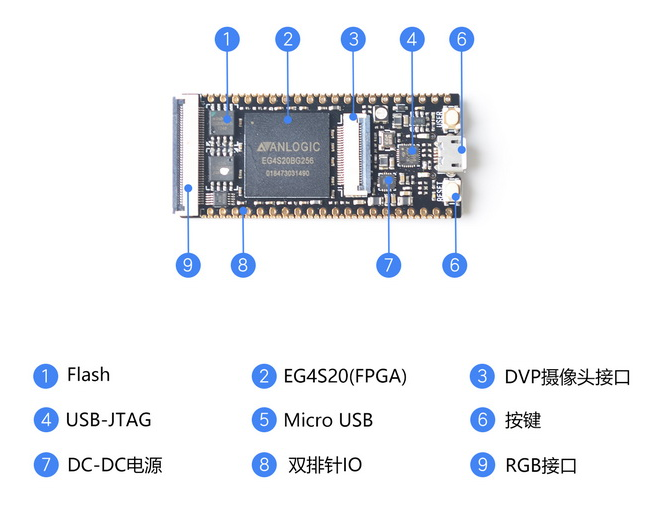

# Tang Primer

> 已停产

## 介绍
Lichee Tang Primer是基于安路科技的EG4S20BG256 FPGA芯片设计的简约型开发板。开发板设计小巧精致，将芯片的所有资源都引出，板载Micro-USB、USB-JTAG、TF卡槽、DVP摄像头接口、RGB(可接LCD屏、VGA等外设)等，并把部分IO资源引出，非常方便开发者拓展使用，开放RISC-V IP内核。

## 管脚定义

## 参数

| 项目                            | 参数                                           |
| ------------------------------- | ---------------------------------------------- |
| FPGA芯片                        | EG4S20BG256                                    |
| 逻辑单元数量                    | 23520                                          |
| 寄存器数量(FF)                  | 19600                                          |
| Total Configuration SRAM (bits) | 4,988,928                                      |
| EM SDR SDRAM                    | 2M X 32bits                                    |
| 锁相环PLL                       | 1                                              |
| I/O Bank总数                    | 1                                              |
| 最多用户I/O数                   | 193                                            |
| 核电压                          | 1.2V                                           |
| 板载FPC40P座                    | 可接RGB LCD、VGA转接口、高速DAC等模块          |
| 板载FPC20P座                    | 可接DVP摄像头、高速ADC模块                     |
| 引出IO                          | 标准2.54mm和半邮票孔接口，引出芯片大部分IO资源 |
| 板载IIC电阻触摸芯片屏控制器     | NS2009                                         |

## 产品技术支持

Tang Permier开发板可以在多种场景实现客户不同方面的需要，在AIoT上已经广泛的使用，品质和性能在行业内已经有非常好的口碑，专业的技术团队为广大客户解决硬件设计和软件功能上的各种各样问题。专业技术支持和更详细资料请联系商务support@sipeed.com。

## 资料
[烧录相关使用](/soft/Tang/zh/index_bak.md)
[资料下载](https://dl.sipeed.com/shareURL/TANG/Primer)
