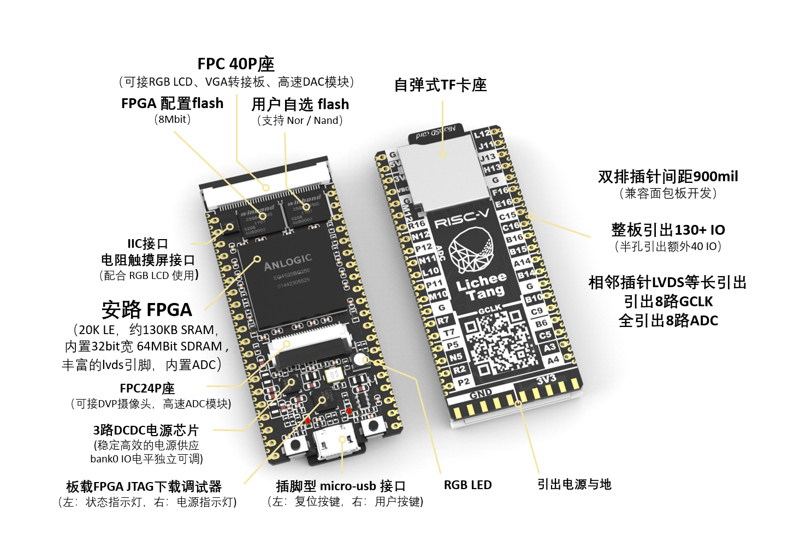

# 荔枝糖 全流程指南

荔枝糖，一款极致打磨的国产开源RISC-V开发板。

荔枝糖萌生于国内芯片振荡之潮，历经三个月的生长与蜕变，终于在七月，登上开源的舞台。

荔枝糖不仅担起开源开发者们的期待，更志向于在国内推广RISC-V架构相关的开发与教育，向世界介绍中国的一款优秀开发板。

荔枝糖使用 安路科技(Anlogic Technologies) 的 EG4S20 作为核心单元, **20K逻辑单元(LUT4/LUT5混合架构)，约130KB SRAM，内置32bit位宽 64MBit SDRAM，丰富的LVDS引脚，内置12-bit 1MSPS ADC**，这为荔枝糖提供了无限的可能性：
-   FPC40P座，可接 RGB LCD，VGA转接板，高速DAC模块
-   FPC24P座，可接DVP摄像头，高速ADC模块
-   I2C接口的电阻触摸屏控制器，配合RGB LCD使用
-   3路DCDC电源芯片，稳定高效的电源供应，Bank0 IO电平独立可调
-   FPGA 配置Flash，8Mbit
-   用户Flash，nor/nand可选
-   板载FPGA JTAG下载调试器
-   RGB LED
-   相邻插针LVDS等长引出，引出8路GCLK，全引出8路ADC。
-   双排插针间距900mil， **兼容面包板开发** 
-   半孔引出额外 **40 IO**，整板引出 **130+ IO** 。

您可能需要这些来进一步了解荔枝糖： 

- EG4S20Datasheet [点我](https://dl.sipeed.com/shareURL/TANG/Primer/HDK/Datasheet/)里面的`EG4S20_DataSheet_V1.4.pdf`

- 荔枝糖原理图 [点我](https://dl.sipeed.com/shareURL/TANG/Primer/HDK)里面的`LicheeTang_RV(Schematic).pdf`

荔枝糖仍在不断地成长，对于外观、电路设计、文档内容甚至于荔枝糖的发展方向，
我们欢迎您到[荔枝糖 | 建议与讨论帖](https://bbs.sipeed.com/cate/30/seq/1) 提出您宝贵的建议。

同时欢迎各位加入荔枝派交流群 `834585530` 或者 [荔枝派Telegram电报群](https://t.me/sipeed)与众多开发者、爱好者即时交流。

另外，FPGA开发环境TD (Tang Dynasty) 可在如下网址下载：
- [https://eyun.baidu.com/s/3i6FbQzr](https://eyun.baidu.com/s/3i6FbQzr)
- [https://dl.sipeed.com/shareURL/TANG/Primer/IDE](https://dl.sipeed.com/shareURL/TANG/Primer/IDE)
