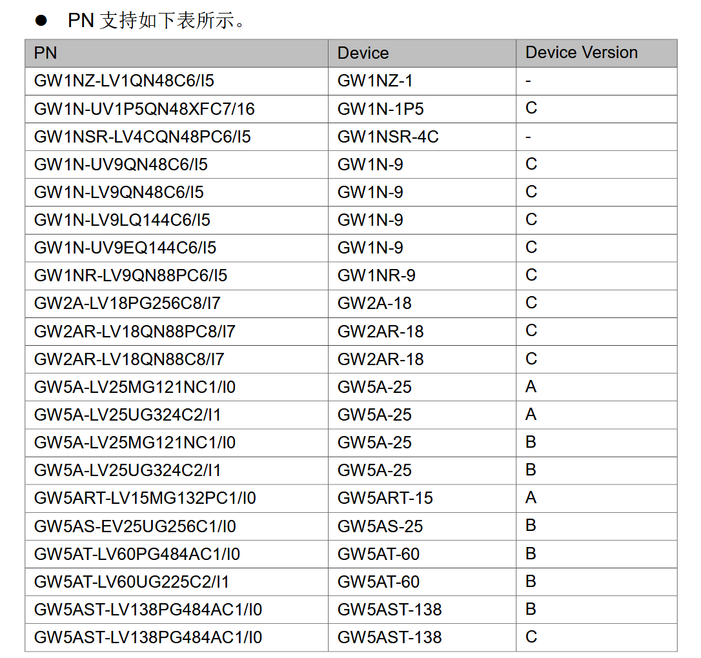
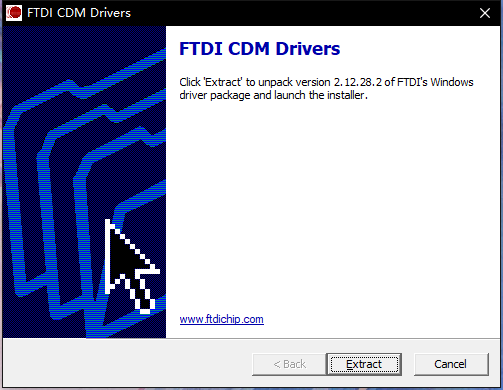
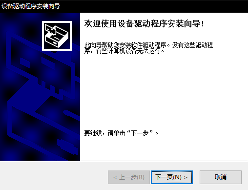
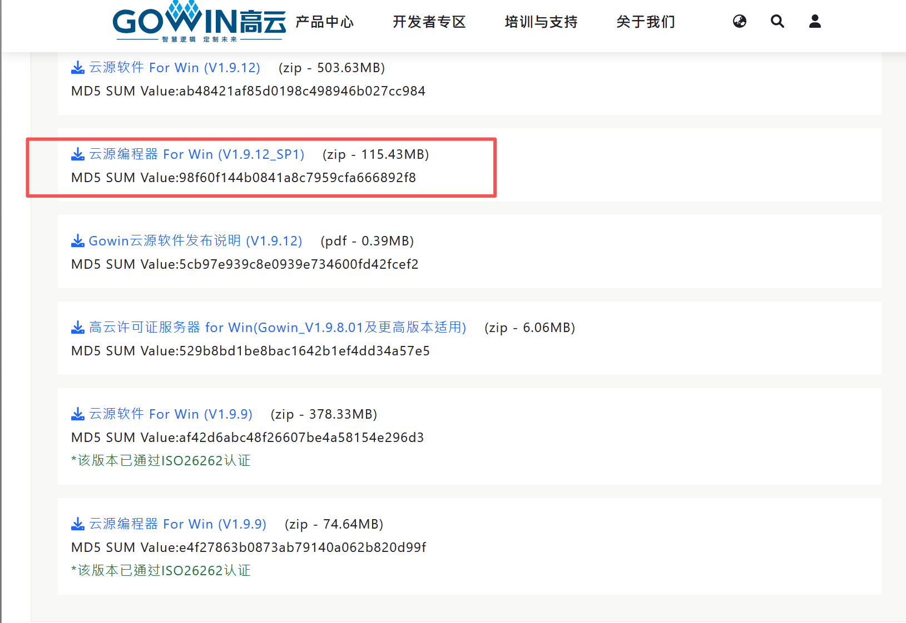
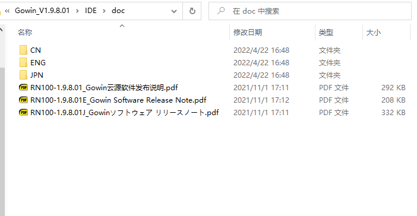

使用高云半导体的 FPGA 需要用到 GOWIN 这个软件，对应的软件文档链接：
<http://www.gowinsemi.com.cn/down.aspx?FId=n14:14:26>

- 根据自己系统选择安装对应版本的 IDE
- 对于 Linux 系统下载固件可以使用 Openfpgaloader，可以查看本页底部的 [Linux 下烧录](#burn-in-linux) 来进行烧录操作。

## 安装软件

### 下载软件

前往 http://www.gowinsemi.com.cn/faq.aspx 下载 IDE。

由于高云半导体的IDE在不断的更新中，下图为 2023 年 05 月 25 日截图

---

IDE 分为商业版和教育版：

商业版的 IDE 需要 license，需要向高云半导体官方自行申请。

教育版 IDE 不需要 license，直接点击下载就可以了。

教育版所支持的器件如下：

高云半导体的IDE在不断的更新中，上图为 2023 年 05 月 25 日截图。

| 芯片名称                  | 芯片系列  | 芯片型号      | 适用板卡           |
| ------------------------ | --------- | -----------  | ----------------- |
| GW1NZ-LV1QN48C6/I5       | GW1NZ     |GW1NZ         | Nano 1K           |
| GW1NSR-LV4CQN48PC6/I5    | GW1NSR    |GW1NSR-4C     | Nano 4K           |
| GW1NR-LV9QN88PC6/I5      | GW1NR     |GW1NR-9C      | Nano 9K           |
| GW2AR-LV18QN88C8/I7      | GW2AR     |GW2AR-18C     | Nano 20K          |
| GW2A-LV18PG256C8/I7      | GW2A      |GW2A-18C      | Primer 20K        |
| GW5AT-LV15MG132C1/I0     | GW5AT     |GW2A-15A      | Primer 15K        |
| GW5A-LV25MG121NC1/I0     | GW5A      |GW5A-25A      | Primer 25K        |
| GW5AT-LV60PG484AC1/I0    | GW5AT     |GW5AT-60B     | NEO/Console 60K   |
| GW5AST-LV138PG484AC1/I0  | GW5AST    |GW5AST-138B/C | NEO/Console 138K  |
| GW5AST-LV138FPG676AC1/I0 | GW5AST    |GW5AST-138B/C | Mega 138K Pro     |

上表中的板卡，除了 **Mega 138K Pro** 以外，均可在教育版的 IDE 中使用。

~~对于购买了 Tang Nano （板载 jtag 芯片为 CH552），目前需要使用商业版的 IDE 且需要自行向高云半导体官方申请 license。~~
**Tang Mega 138K Pro** 目前需要使用商业版的 IDE 且需要自行向高云半导体官方申请 license。

- **注意事项**
    - 目前138K 的两种封装（PG484A 和 FPG676A）在2025年7月后芯片型号均由GW5AST-138B变更为GW5AST-138C，老的B步进的FPGA原厂已停产。
    - C步进的138K在IDE中需要选择 **Device Version: C**，不然无法使用SSRAM & 可能会有奇怪的兼容性问题。

- **如何分辨器件辨步进**
    - FPGA镭雕印记的第三行第五位，如果是字母 **C** 就是**Device Version: C**，如果是字母 **B** 就是**Device Version: B**。
    - 这个方法适用于所有的 **GOWIN FPGA**。

    <!DOCTYPE html>
    <html lang="zh-CN">
    <head>
      <meta charset="UTF-8">
      <title>CSS Indentation</title>
      
    </head>
    <body>
      

        
点击此处查看138K-C PG484A器件版本印记

        
      

    </body>
     
    </html>

    <!DOCTYPE html>
    <html lang="zh-CN">
    <head>
      <meta charset="UTF-8">
      <title>CSS Indentation</title>
      
    </head>
    <body>
      

        
点击此处查看138K-B PG484A器件版本印记

        
      

    </body>
     
    </html>

    <!DOCTYPE html>
    <html lang="zh-CN">
    <head>
      <meta charset="UTF-8">
      <title>CSS Indentation</title>
      
    </head>
    <body>
      

        
点击此处查看138K-B FPG676A器件版本印记

        
      

    </body>
     
    </html>

### 开始安装

#### Linux 系统

Linux 版本 IDE 下载解压后，打开 `IDE/bin` 文件夹，然后可执行文件 `gw_ide` 就在所解压路径的 `/IDE/bin/` 文件夹中，用命令行来运行即可；运行软件失败的话记得改软件的可执行权限 `chmod + x`。

#### Windows 系统

下载相应的 IDE 之后所得到的是一个压缩包程序；对于 Windows 版本的解压后里面是一个可执行程序，双击安装继续下面的步骤就行。下面的所有安装步骤均为 Windows 平台：

    
    

下图的两个都需要安装上。其中的 Gowin 为 IDE 本体， 另一个 programmer 相关的是烧录软件。

因为我们的下载器与 IDE 附带安装的 Programmer 可能不太兼容，使用中有问题的话可以前往 <a href="./../questions.html#下载失败" target="blank">programmer 相关里的下载失败</a> 来查看对应方法。

<!-- 由于我们所提供下载器会与新版的 IDE 不太兼容，因此建议前往 <a href="./../questions.html#下载失败" target="blank">programmer 相关里的下载失败</a> 来查看对应方法。 -->

下图的安装路径个人按照自己需要设置
  

安装中...

下面这一步不要更改任何东西，按照默认的点击`Finish`就行，紧接着就是安装相关的驱动

上面的`Finish`后会出现下面的内容，这是安装驱动的。

<html>

    
    

</html>

这里需要选择接受协议才能继续安装
  
<html>

    
    

</html>

点击完成后桌面上会出现下面的图标
  

到这里我们就完成了软件的安装

## 使用 IDE

### license 相关

教育版本的 IDE 直接运行即可；商业版的 IDE 需要自行前往 [点我](http://www.gowinsemi.com.cn/faq_view.aspx) 申请 license 后才能使用，其中申请license 时 MAC 最好填写本机的以太网网卡地址，避免以后可能因部分设置而导致 MAC 地址改变 license 验证失败。

### 验证 license

打开高云半导体 IDE 的时候，在弹出的 license 管理中，选择自己本地 license 的文件，验证保存即可。

然后就可以开始使用高云半导体 IDE 了。

### Programmer

<!-- 在烧录 FPGA 的时候可能因为安装 IDE 时所安装的 Programmer 软件不兼容我们所提供的下载器，因此对于 Windows 用户要求使用我们所提供的特定版本的 Programmer 软件，[点我](https://dl.sipeed.com/shareURL/TANG/programmer)跳转下载即可； -->

如果下载固件失败的话，可以手动下载一下 Programmer 软件（云源编程器）来试试 [跳转地址](https://www.gowinsemi.com.cn/software/1)

对于 Linux 用户可以用 Openfpgaloader, 查看本页最底部的相关说明即可。

## 拓展

License 可以在高云官网申请，或者使用Sipeed提供的在线Lic服务，在IDE中选择Float Lic，填写以下信息即可：
~~~

---Server 01---
ip: 106.55.34.119
port: 10559

~~~
如果上面的IP不能工作, 尝试使用 "gowinlic.sipeed.com" 域名对应的IP.

获取 license 可能需要等待一段时间。在此期间可以看看高云半导体的官方文档。下面简单说明一下：

在 IDE 的安装路径下主要有如下内容：IDE 文件夹、Programmer 文件夹、uninst.exe；

**IDE** 文件夹：这里主要说一下里面的 **doc** 文件夹，用户在安装完之后可以在这个文件夹里面看到高云提供的大多数文档高云半导体，主要内容如下图所示：

**Programmer** 文件夹：里面是烧录软件，也有相关的文档。

**uninst.exe**：卸载IDE

<!-- ## 其他安装方法

下面是高云半导体官方所提供的 IDE 安装方法，有需要的话可以自行查阅

+ [高云半导体软件简介和安装](http://cdn.gowinsemi.com.cn/%E9%AB%98%E4%BA%91%E8%BD%AF%E4%BB%B6%E7%AE%80%E4%BB%8B%E5%92%8C%E5%AE%89%E8%A3%85.pdf) -->

## Burn in linux

[Linux系统下烧录方法](./flash_in_linux.md)
