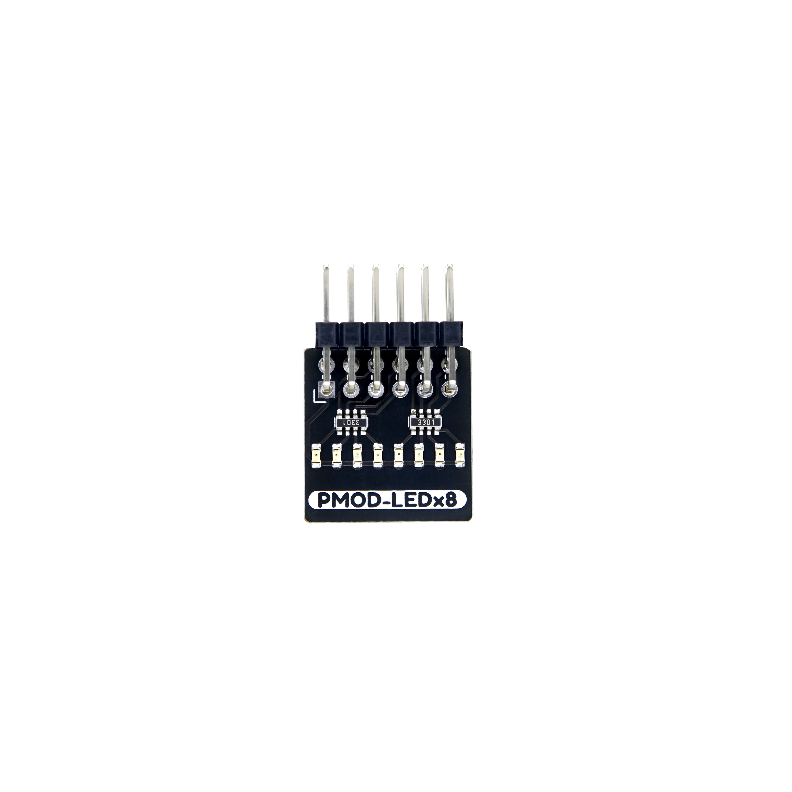
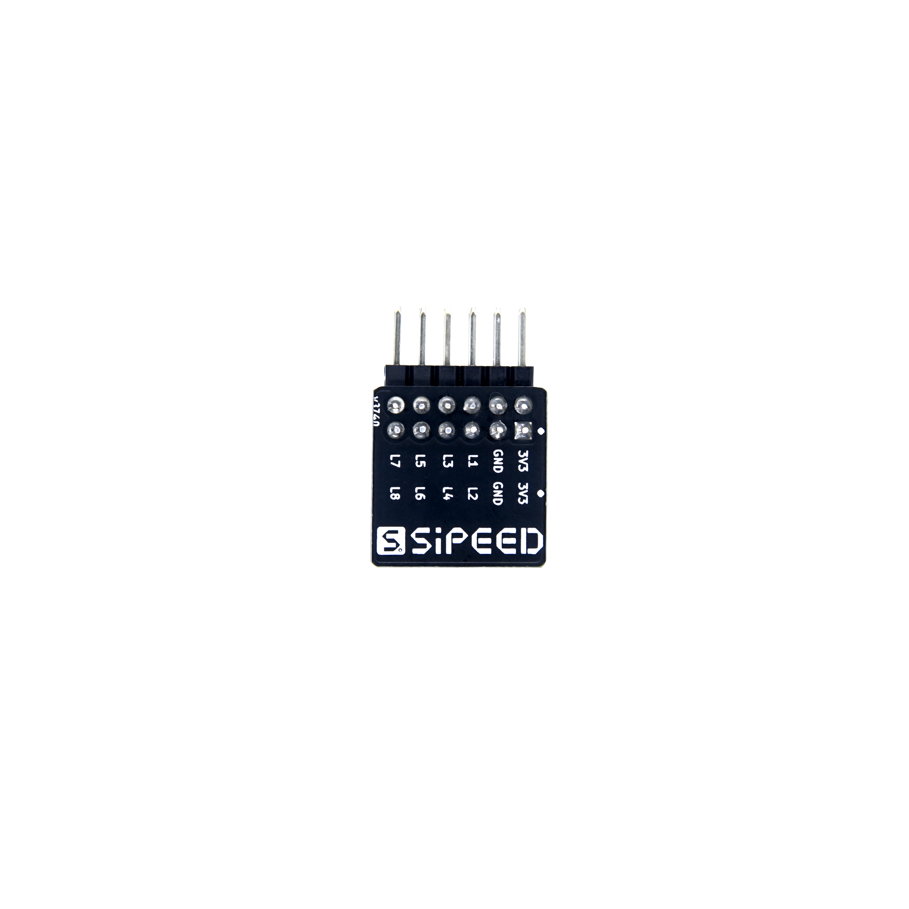
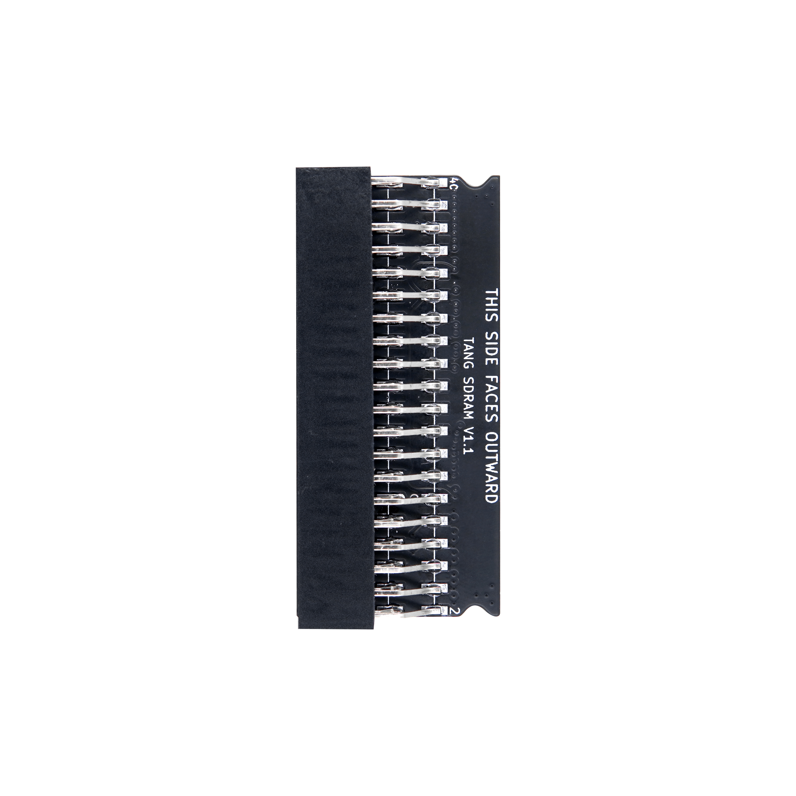

# TANG PMOD

## 概述

TANG PMOD 模組是相容于 **Digilent Pmod™** 接口标准的FGPA拓展模块，可用于包含此接口的FPGA 开发板的功能扩展，如[Tang Mega 138K Pro Dock]() 和 [Tang Primer 25K Dock]() 等。 

不同的模组提供不同的拓展功能，模组间可以任意组合搭配以实现各种需要的功能。

    
    
    

购买链接：[淘宝](https://item.taobao.com/item.htm?spm=a1z10.5-c-s.w4002-24984936573.29.19b22db2a329yr&id=746293292946)

## PMOD_LEDx8
简介：8个IO对应8个LED
例程：[pmod_digitalTube-2bit](https://github.com/sipeed/TangPrimer-25K-example/tree/main/pmod_digitalTube-2bit)

    
    

## PMOD_BTN4+4
简介：4个按键+四位拨码开关
例程：[pmod_digitalTube-2bit](https://github.com/sipeed/TangPrimer-25K-example/tree/main/pmod_digitalTube-2bit)

## PMOD_DTx2

简介：2位8段数码管
例程：[pmod_digitalTube-2bit](https://github.com/sipeed/TangPrimer-25K-example/tree/main/pmod_digitalTube-2bit)

## PMOD_DVI
简介：HDMI输出/输入（需要使用LVDS差分对）
例程：[nestang-25k](https://github.com/sipeed/TangPrimer-25K-example/tree/main/nestang-25k)

## PMOD_DVP
简介：8位DVP，支持M12镜头
例程：[Coming soon..](https://github.com/sipeed/TangPrimer-25K-example/tree/main)

## PMOD_TF-CARD
简介：支持标准TF卡，带插拔检测
例程：[nestang-25k](https://github.com/sipeed/TangPrimer-25K-example/tree/main/nestang-25k)

## PMOD_HUB75E
简介：支持hub75e标准点阵
例程：[pmod_hub75e](https://github.com/sipeed/TangPrimer-25K-example/tree/main/pmod_hub75e)

## PMOD_DS2x2

简介：支持支持两个DS2手柄（没有震动）
例程：[nestang-25k](https://github.com/sipeed/TangPrimer-25K-example/tree/main/nestang-25k)

# TANG 40P MODULE

## 概述

TANG 40P MODULE 模組是**部分相容**于DE10-Nano 40P接口标准的FGPA拓展模块，可用于包含此接口的FPGA 开发板的功能扩展。由于引脚数目更多，因此可以连接如双颗粒SDRAM模组和\*DVP双目摄像模组等更为复杂的模组。

## TANG_SDRAM

简介：32MB x2 16bit 143MHz SDRAM 
例程：[nestang-25k](https://github.com/sipeed/TangPrimer-25K-example/tree/main/nestang-25k)
原理图：[Tang_sdram_xsds_V1.1_Schematic](http://dl.sipeed.com/fileList/TANG/PMOD/Tang_sdram_xsds_V1.1_Schematic.pdf)

\*注意，本模块不相容于Mister SDRAM V3.0，请仔细核对相应原理图
（差异在40P排母的第29和30脚）

## 硬件资料

原理图等均可在这里找到：[点击这里](https://dl.sipeed.com/shareURL/TANG/Pmod)

### 公开例程
github 链接： https://github.com/sipeed/TangPrimer-25K-example

## 交流方式

- **交流论坛: [maixhub.com](maixhub.com/discussion)**
- **QQ 交流群：[834585530](https://jq.qq.com/?_wv=1027&k=wBb8XUan)**
- 直接本页下方留言
- 商业邮箱 : [support@sipeed.com](support@sipeed.com)

## 相关问题

### 更多问题及其解决办法前往[相关问题](./../Tang-Nano-Doc/questions.md)查看
