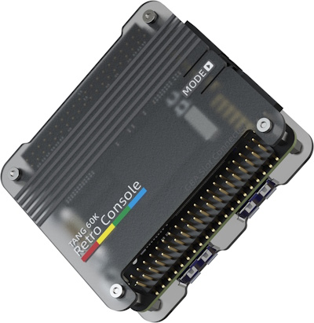
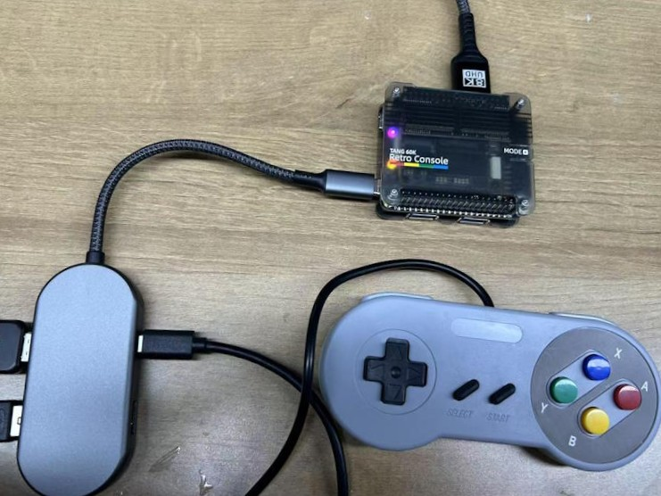
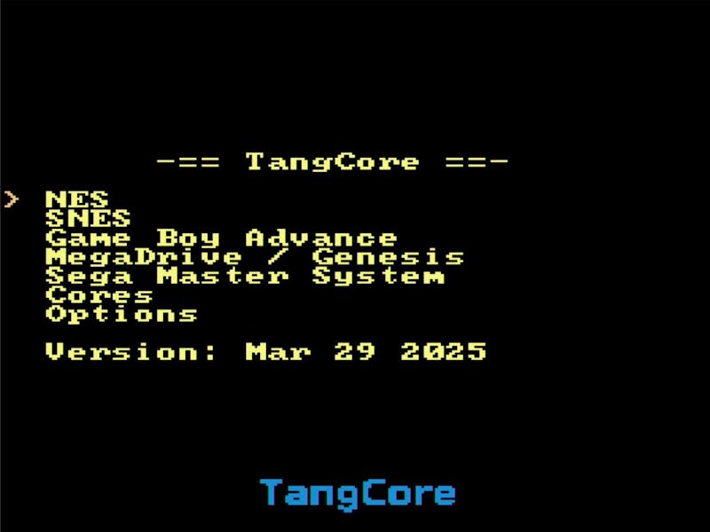

## 产品概述

- 发售日期：2025年4月中旬
- ~~预购链接：[**点我**](https://sipeed.com/tangconsole)~~（预购已结束，敬请期待零售版本）
- **开发板关内容：**[**点我**](./mega-console.md)
- **Tang Core** 的开发者文档：[**点我**](https://nand2mario.github.io/tangcore/)

## 板卡特点
<details>
  <summary><font color="#4F84FF">点击查看详情</font></summary>
  <br>

- 兼容多种SOM (**[Mega 138k](./../tang-mega-138k/mega-138k.md)** & **[Mega 60k](./../*tang-mega-60k/mega-60k.md)**)

- 支持多种[**Tang Core**](https://github.com/nand2mario/tangcore)模拟器核心
    - **NESTang** - Nintendo Entertainment System
    - **SNESTang**  - Super Nintendo Entertainment System
    - **GBATang** - Game Boy Advance
    - **MDTang** - Sega Genesis/Mega Drive
    - **SMSTang** - Sega Master System
    - **更多核心仍在开发中，将会陆续上线**

- 板载BL616 MCU
    - 运行[**TangCore firmware for BL616**](https://github.com/nand2mario/firmware-bl616/)
    - 支持模拟器核心快速切换
    - ~~支持uSD卡存储~~(仍在调试中)
    - **支持USB OTG**（目前需要带供电的OTG转接头或HUB）
        - **USB OTG存储**（存放游戏ROM和模拟器核心，以及模拟器BIOS）
        - **USB HID手柄** 
    - 可作为FPGA的调试器
- 板载两个USB-A，可用于直接连接支持的USB手柄

- 支持DS2手柄（需要[**PMOD_DS2x2**](../tang-PMOD/FPGA_PMOD.md#pmod_ds2x2)）

</details>

## 产品外观

<details>
  <summary><font color="#4F84FF">点击查看详情</font></summary>
  <br>

  - **Tang Retro Console Premium** (60k version)  
    

  - **Tang Retro Console** (60k version)  
    
</details>

## 架构框图

<details>
  <summary><font color="#4F84FF">点击查看详情</font></summary>
  <br>
  
  此处以60k SOM举例，138k同理

  

  
  
  

</details>

## 硬件参数

<details>
  <summary><font color="#4F84FF">点击查看详情</font></summary>

  ### 核心板（SOM）参数

  请根据实际安装的SOM，参考如下连接：  
  - **[Tang Mega 138k](./../tang-mega-138k/mega-138k.md#核心板参数) 核心板**  
  - **[Tang Mega 60k](./../tang-mega-60k/mega-60k.md#核心板参数) 核心板**

  ### 底板参数

  - 请参考**开发板关内容：**[**点我**](./mega-console.md#底板参数)

</details>

***

## 上手使用

此处以**Tang Retro Console**为例，讲解如使用Tang Console进行游玩

### 准备工作

  需要准备的东西如下：

  - [x] Tang Console，138k或60k均可
  - [x] USB 2.0驱动器，或者SD卡+读卡器（推荐格式FAT32/exFAT，≤32GB）
  - [x] USB-C OTG 转换器，带有电源传输（推荐使用套餐中的USB-C读卡器）
  - [x] 可用的GBA原机BIOS（gba_bios.bin）
  - [x] 最新的[**TangCore Release Package**](https://github.com/nand2mario/tangcore/releases)
  - [x] 想要游玩的游戏ROM（Tang Retro Console Premium套餐包含的uSD卡中已有演示游戏）

  ### 安装MCU固件

   - 对于已购买任何套餐Tang Console的用户来说，这一步不是必须的，因为出厂时已经完成

   - 后续如有固件更新，请参考此处进行更新：[**点我**](../common-doc/update_debugger.md#tang-core-的额外说明)

   ### 存储介质准备

   无论是采用SD卡还是USB驱动器，需要确保其容量≤32GB 同时格式化为FAT32/exFAT。
   存储介质的内容如下方所示：
   ```
   📁 /                
     ├── 📁 cores/            # 来自Tang Core发布版本的 `cores` 目录
     │    ├── 📁 console60k/
     │    └── 📁 console138k/
     ├── 📁 nes/              # .nes rom 目录
     ├── 📁 snes/             # .smc/.sfc 目录
     ├── 📁 gba/
     │    └── 🗎 gba_bios.bin  # GBA BIOS 档案
     ├── 📁 genesis/          # .bin/.md 目录
     └── 📁 sms/              # .sms 目录
   ```
   > ⚠ Console会过滤游戏ROM的后缀名，请务必将游戏ROM改成对应的后缀名 ⚠

   存储介质的内容不区分 **138k console** 和  **60k console**。其中 **`gba_bios.bin`** 需要用户自行下载后放入。

   将想要游玩的游戏ROM放入对应的目录中即可。

   ### 硬件组装

   ❗注意：请先组装好所有配件再接通电源！

   1. **早鸟版本推荐的方式**（这种方式的全部配件都包含于 **Tang Console Retro Premium** 中）

        
        
        > 左侧：USB-OTG读卡器+USB-C电源 | 下方：USB手柄 **P1** | 上方： HDMI输出

        - 这种方式的好处是简洁，缺点是USB手柄这样接不太稳定
        
        - 如遇到USB手柄不识别（尤其是在切换完毕模拟器core的时候），需要用户手动多拔插USB手柄几次
        
        - ***零售版 Console** 可以不使用 OTG 读卡器，将uSD卡装入机身自带的卡槽即可。因为 **零售版 Console** 机身自带的卡槽通过MUX连接到了 **BL616***

        <br>

   2. **零售版本推荐的方式**

        <details>
        <summary><font color="#4F84FF">点击查看详情</font></summary>
        <br>
        
        
        > 左下：USB-OTG | 左上：USB-C电源 | 下方：USB手柄 **P1** | 上方： HDMI输出

        - 这种方式的好处是最简洁，缺点是USB手柄这样接不太稳定
        
        - 如遇到USB手柄不识别（尤其是在切换完毕模拟器core的时候），需要用户手动多拔插USB手柄几次
        
        - 手柄既可以连接到Console本身的USB连接器，也可以通过USB-OTG连接到BL616

        - USB-OTG转换器不是必须的，取决于你的用途

        </details>
        <br>

   3. **nand2mario**的方式
        <details>
        <summary><font color="#4F84FF">点击查看详情</font></summary>
        <br>
        
        
        > 左侧：OTG USB驱动器+USB-C供电 | 右侧： DS2 PMOD+DS2手柄 | 顶部: HDMI输出
        
        - 这种方式的好处是稳定，缺点是太臃肿

        - 如想要连接更加简洁，请尝试使用无线DS2手柄，并更换更小尺寸的USB驱动器

        </br>
        </details>
        <br>

   4. USB OTG HUB的方式 {#USB_OTG_HUB}
        <details>
        <summary><font color="#4F84FF">点击查看详情</font></summary>
        <br>
        
        
        > 左侧：USB-C OTG HUB+USB驱动器+USB-C供电+USB手柄 **P1** | 顶部: HDMI输出
        
        - 这种方式的好处比较稳定，缺点是十分臃肿 & USB HUB 可能有兼容性问题

        - 已测试的USB HUB的兼容性列表：[点我](https://github.com/nand2mario/tangcore/wiki/Compatible-USB-Hubs)

        </br>
        </details>
        <br>
        
    
### 上电开机

1. 先按照上一步中组装好机器，然后再接通电源；

2. 等待一段时间，主菜单会出现；
    
    <details>
    <summary><font color="#4F84FF">点击查看详情</font></summary>
       <br>
       
    </details>
    <br>

3. 使用游戏手柄进行导航，上下移动游标，左右进行翻页，`B`或`3`键确定，`A`或`2`键返回，在 `..`上按下`B`键可以返回上级菜单
    
    <details>
    <summary><font color="#4F84FF">点击查看详情</font></summary>
       <br>
       
    </details>
    <br>

4. 选中一个模拟器标题，如**SNES**，按`B`键进入二级菜单，选择要游玩的游戏ROM，再次按下`B`键进入游戏

    <details>
    <summary><font color="#4F84FF">点击查看详情</font></summary>
       <br>
       
    </details>
    <br>

5. HDMI输出会暂时消失，稍等片刻出现ROM加载画面，此时画面下方的标题会变成对应模拟器的名称（本例中为 **SnesTang**）

    <details>
    <summary><font color="#4F84FF">点击查看详情</font></summary>
       <br>
       
    </details>
    <br>

6. 稍等片刻ROM加载完毕后就会进入游戏，通常此时按下 `start` 键就可以开始游戏
 
    <details>
    <summary><font color="#4F84FF">点击查看详情</font></summary>
       <br>
       
    </details>
    <br>

7. 在游戏中可以按 `→` + `select` 返回主菜单

8. 部分游戏ROM可能并不完全被模拟器兼容。如果遇到了问题，给Console重新上电即可

### 其他资源

- 安装文档原文： [**点我**](https://nand2mario.github.io/tangcore/user-guide/installation/)
- 特别鸣谢：**[fjpolo](https://github.com/fjpolo/GBTang)** | **[harbaum](https://github.com/harbaum/MiSTeryNano)** | **[nand2mario](https://github.com/nand2mario)** | **[pgate1](https://github.com/pgate1/SNES_on_FPGA)** 
  
  
  > 以上排名不分先后

## 交流方式

- **交流论坛:[maixhub.com/discussion](https://maixhub.com/discussion)**
- **QQ 交流群：[834585530](https://jq.qq.com/?_wv=1027&k=wBb8XUan)**
- 电报群组：[t.me/sipeed](t.me/sipeed)
- Discord：[https://discord.gg/V4sAZ9XWpN](https://discord.gg/V4sAZ9XWpN)
- 直接本页下方留言

## 注意事项

<table>
    <tr>
        <th>事项</th>
        <th>注意事项</th>
    </tr>
    <tr>
        <td>供电电压</td>
        <td>Tang Console 使用的 电源电压是 <b>DC +5V</b> 
        <br>请避免供电电压超过<b>+5.5V</b>或低于<b>+3.4V</b>
        <br>请使用输出能力至少为<b>5V/2A</b>的<b>USB 适配器</b>供电</br></td>
    </tr>
    <tr>
        <td>静电</td>
        <td>请避免静电打到 PCBA 上，如非必要请勿随意自行拆解装置的外壳
        <br>如需拆卸外壳，在接触 PCBA 之前请把手的静电释放掉，比如用自来水洗手</td>
    </tr>
    <tr>
        <td>容忍电压</td>
        <td>使用 GPIO 排针引脚进行外部通信时，要确保 IO 电压是 3.3V，过高的电压会永久损坏 PCBA 
        <br>非专业用户请勿使用排针连接官方配件以外的任何设备或模组</td>
    </tr>
    <tr>
        <td>FPC 座子</td>
        <td>在连接 FPC 软排线的时候，请确保排线无偏侈地完整地插入到排线中
        <br>在通电之前请仔细核对两端FPC 连接器的 <b>1号PIN</b> 的方向是否正确</td>
    </tr>
    <tr>
        <td>插拔</td>
        <td>除了USB-A手柄和USB驱动器/读卡器
        <br>请完全断电后才进行配件的插拔操作</td>
    </tr>
        <tr>
        <td>USB手柄</td>
        <td>USB-A手柄连接到Console正面的USB-A时不太稳定
        <br>如遇USB手柄无法操作，请多插拔几次</td>
    </tr>
    <tr>
        <td>避免短路</td>
        <td>请在上电过程中，避免任何液体和金属触碰到 PCBA 上的元件的焊盘，否则会导致路，烧毁 PCBA</td>
    </tr>
</table>

## 联系

技术支持和商业合作请联系邮箱 [support@sipeed.com](support@sipeed.com)

## 常见问题

### USB手柄无法操作

<details>
<summary><font color="#4F84FF">点击查看详情</font></summary>
<br>
 
 1. 请重新拔插USB手柄后再尝试操作；
 2. Console正面的USB-A手柄的稳定性会在之后的固件更新中解决；
 3. 目前最稳定连接方式为PMOD DS2手柄；
 4. 请注意USB接口的丝印标记，位于右侧的标记为P2的手柄，有些游戏只能使用P1的手柄进行操作（使用DS2手柄时同理）；
 </details>

### 按下MODE键后UI消失

<details>
<summary><font color="#4F84FF">点击查看详情</font></summary>
<br>

 1. 目前是已知问题，会在未来的固件更新中解决；
 2. 如果画面中游标 `>` 还在，可以尝试用手柄操作翻页或返回上级等操作强迫UI刷新；

 </details>

### 上电后显示 `Waiting for USB drive...`

<details>
<summary><font color="#4F84FF">点击查看详情</font></summary>
<br>

 1. 如果使用了USB HUB，这可能意味着HUB不兼容；
 2. 请确保正确连接了USB驱动器/读卡器；
 3. 请确保USB驱动器/读卡器的容量 **≤32GB**，且格式化为 **FAT32/exFAT**；

    

 </details>

 ### GBATang提示 `Cannot find /gba_bios.bin...`

<details>
<summary><font color="#4F84FF">点击查看详情</font></summary>
<br>

 1. 这意味着 **USB驱动器/存储卡** 中的`/GBA`目录下缺失了GBA原始的BIOS，可能会引起一些ROM的兼容性问题；
 2. 因为版权问题，我们无法向您提供这份档案，您需要自行寻找`gba_bios.bin`并放入相应的位置；

    

 </details>

  ### 主菜单画面中的 ***`Options`*** 选项无法进入

<details>
<summary><font color="#4F84FF">点击查看详情</font></summary>
<br>

 1. 这是因为 **[nand2mario](https://github.com/nand2mario)** 尚未实现这一部分的功能；
 2. 此功能会造之后的更新中逐步实现；

 </details>

### 更多问题及其解决办法前往Tang Core的文档中的 [Troubleshooting](https://nand2mario.github.io/tangcore/user-guide/troubleshooting/) 页面查看

如果你不幸遇到了一个全新的问题，欢迎向我们反馈。

反馈方式请参考 [**这里**](#交流方式)。
