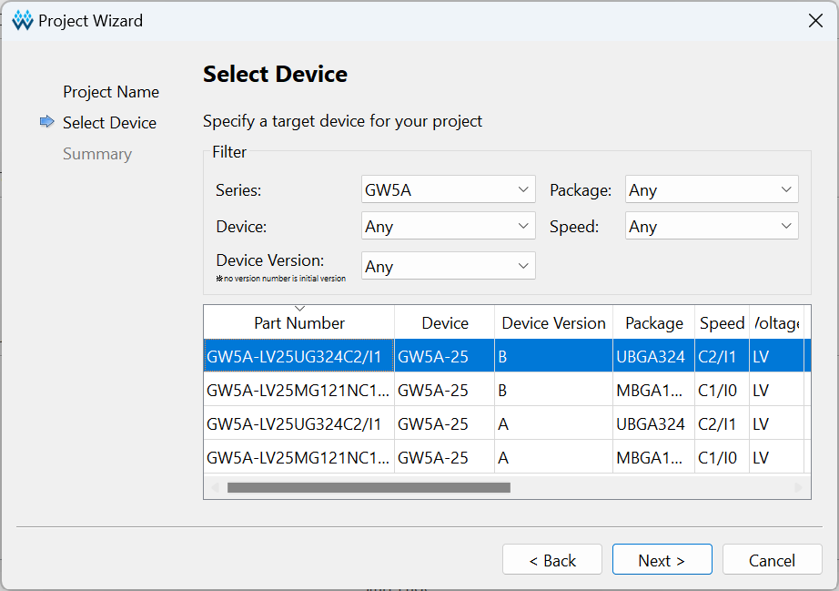
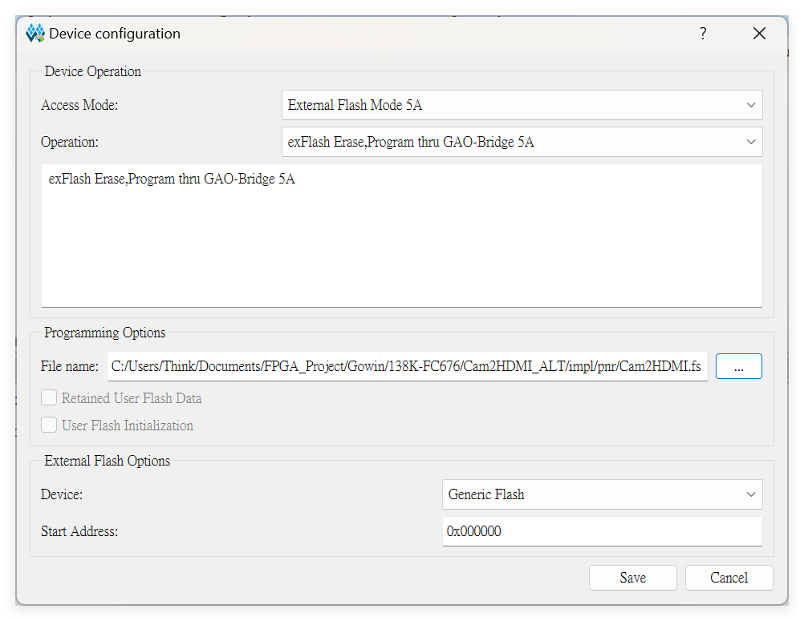

## 产品概述

## 板卡特点

## 产品外观

## 硬件参数

### 核心板（SOM）参数

请根据实际安装的SOM，参考如下连接：
- **[Tang Mega 138k](./../tang-mega-138k/mega-138k.md#核心板参数) 核心板**
-  **[Tang Mega 60k](./../tang-mega-60k/mega-60k.md#核心板参数) 核心板**

### 底板参数

| 项目                 | 数量     | 备注                                              |
| :------------------  | ----     | ------------------------------------------------ |
| LEDs                 | 2(3+3)   | 电源指示灯x3 + 用户指示灯x3 (共计2颗RGB LED)      |
| Buttons              | 2+1      | 用户按键x2 + MODE（reconfig）按键x1               |
| PCIe                 | 1        | 1通道 8/5Gbps (取决于核心板)                      |
| USB3                 | 2        | SERDES 通道，超速 @ 5Gbps (设备模式)              |
| USB2                 | 1        | IO Soft-PHY，高速 @ 480Mbps (设备模式)            |
| DVI(HDMI)            | 1        | 兼容HDMI， 支持TX， 可通过修改实现RX               |
| PMOD                 | 2        | 标准间距（800mil），支持双PMOD模组                 |
| ADC                  | 2        | 两组独立输入通道（其中一组用于锂电池电压测量）      |
| RGB 接口             | 1        | 40P 0.5mm间距FPC，支持RGB88，支持RGB转VGA模组      |
| microSD 插槽         | 1        | 支持4-bit SDIO/MMC 或 SPI 模式                    |
| 电池连接器           | 1        | 支持 3.7V 锂离子电池， 内置电池充放电管理           |
| 风扇连接器           | 1        | 支持5V直流风扇，最大功率1W                         |
| 扬声器连接器         | 1        | 支持2W扬声器，单声道输出                           |
| MS5351               | 1        | 为 Serdes 提供 RefClk，通过板载调试器的 UART 控制 |
| USB JTAG & UART      | 1        | 板载调试器支持FPGA编程，并提供UART功能             |
| 2x20P 排针连接器     | 2        | 独立的2x20P排针，最多提供2x38个IO，可通过修改兼容DE10-Nano Kit |

## 硬件资料

~~[板卡规格书](https://dl.sipeed.com/shareURL/TANG/Console/01_Specification)~~
[板卡原理图](https://dl.sipeed.com/shareURL/TANG/Console/02_Schematic)
[PCB BOM](https://dl.sipeed.com/shareURL/TANG/Console/03_Designator_drawing)
[板卡尺寸图](https://dl.sipeed.com/shareURL/TANG/Console/04_Mechanical_drawing)
[板卡 3D 模型](https://dl.sipeed.com/shareURL/TANG/Console/05_3D_file)
[部分芯片手册](https://dl.sipeed.com/shareURL/TANG/Console/07_Datasheet)
[全引脚约束](https://dl.sipeed.com/shareURL/TANG/Console/08_Misc)

## 上手使用
注意60K目前未被教育版支持，需要下载 V1.9.10.01 或更新版本的商业版IDE使用。 
V1.9.10.02版本的Programmer存在严重问题，无法正常下载本产品。 
如需将码流下载到flash中固化，推荐使用 **exFlash Erase,Program thru GAO-Bridge 5A** 模式（需要≥V1.9.10.03）。
Lic 可以在高云官网申请，或者使用Sipeed提供的在线Lic服务，在IDE中选择Float Lic，填写以下信息即可：
~~~
---Server 01---
ip: 45.33.107.56
port: 10559

---Server 02---
ip: 106.55.34.119
port: 10559
~~~
如果上面的IP不能工作, 尝试使用 "gowinlic.sipeed.com" 域名对应的IP.

安装 IDE [点我](https://wiki.sipeed.com/hardware/zh/tang/common-doc/get_started/install-the-ide.html)

例程代码（Github）： 
  - [60K](https://github.com/sipeed/TangMega-60K-example)
  - [138K](https://github.com/sipeed/TangMega-138K-example)
  - [TangCores](https://github.com/nand2mario/tangcores)
  - [snestang](https://github.com/nand2mario/snestang)
  - [nestang](https://github.com/nand2mario/nestang)
  - [gbatang](https://github.com/nand2mario/gbatang)

    特别鸣谢：**[nand2mario](https://github.com/nand2mario)**  

***

### 其他学习资源

- 在线免费教程：[Verilog 教程](https://www.runoob.com/w3cnote/verilog-tutorial.html)（学习Verilog）
- 在线免费 FPGA 教程：[Verilog](https://www.asic-world.com/verilog/index.html) （英文网站）
- Verilog 刷题网站：[HDLBits](https://hdlbits.01xz.net/wiki/Main_Page)（英文网站）
- 在线高云半导体可参考视频教程：[点击这里](http://www.gowinsemi.com.cn/video_complex.aspx?FId=n15:15:26)

## 交流方式

- **交流论坛: [maixhub.com/discussion](https://maixhub.com/discussion)**
- **QQ 交流群：[834585530](https://jq.qq.com/?_wv=1027&k=wBb8XUan)**
- 直接本页下方留言
- 商业邮箱 : [support@sipeed.com](support@sipeed.com)

## 注意事项

<table>
    <tr>
        <th>事项</th>
        <th>注意事项</th>
    </tr>
    <tr>
        <td>芯片型号</td>
        <td>Tang Mega 60K 使用的 FPGA 芯片具体型号是 <b>GW5AT-LV60PG484A</b>  在 IDE 中选择封装型号 <b>PBG484A</b> </td>
    </tr>
    <tr>
        <td>静电</td>
        <td>请避免静电打到 PCBA 上；接触 PCBA 之前请把手的静电释放掉</td>
    </tr>
    <tr>
        <td>容忍电压</td>
        <td> 使用 GPIO 排针引脚进行外部通信时，要确保 IO 电压是 3.3V，过高的电压会永久损坏 PCBA </td>
    </tr>
    <tr>
        <td>FPC 座子</td>
        <td>在连接 FPC 软排线的时候，请确保排线无偏侈地完整地插入到排线中</td>
    </tr>
    <tr>
        <td>PCIe 金手指</td>
        <td>在测试 PCIe 金手指时候，确保是主机端与板卡都处于关机或者未通电的状态，否则可能会因为插入过程中的易位导致金手指短路。</td>
    </tr>
    <tr>
        <td>插拔</td>
        <td>请完全断电后才进行插拔操作</td>
    </tr>
    <tr>
        <td>避免短路</td>
        <td>请在上电过程中，避免任何液体和金属触碰到 PCBA 上的元件的焊盘，否则会导致路，烧毁 PCBA</td>
    </tr>
</table>

## 联系

Tang Mega 60K 可以在多种场景实现客户不同方面的需要，技术支持和商业合作请联系邮箱 [support@sipeed.com](support@sipeed.com)

## 常见问题

### 板子电源指示灯亮了，Programmer提示No USB Cable Connection

1. 请检查USB线是否正确接入标记为 **MCU** 的USB-C连接器
2. 尽量避免使用机箱前面板的USB连接器和没有独立供电的USB HUB
3. 检查自己是否正确安装FT2232的驱动：出现USB Serial Converter A/B

4. 通常情况下Windows会在联网后自动安装相应驱动。如果想要手动处理，请前往[相关问题](./../common-doc/questions.md)查看相关内容

5. 尝试更新板载下载器的固件，请参考这里 **[【点我跳转】](./../common-doc/update_debugger.md)**

### IDE找不到型号GW5AT-LV60PG484A 或 GW5AST-LV138PG484A

1. 教育版不支持60K和138K，请更换商业版。如下图所示即为教育版（不支持60K）；

2. IDE版本过老，必须更新IDE ≥ 1.9.10.01。

### 如何下载到外部 FLASH（固化） {#burn_flash}

1. 进行如下选项设置：

### 烧录后没反应或者引脚现象不对

1. 首先确定IDE选择了正确的型号 
- 对于60K，**GW5AT-LV60PG484AC1/10**，下图中的每一个参数都要求一致；

    
- 对于138K，**GW5AST-LV138PG484AC1/10**，下图中的每一个参数都要求一致；

2. 然后检查自己的代码和对应的仿真波形是否满足要求，使用云源软件（GOWIN IDE）的GAO工具可以进行片上仿真。更多详情请参考GOWIN文档[SUG100](https://cdn.gowinsemi.com.cn/SUG100-4.0_Gowin%E4%BA%91%E6%BA%90%E8%BD%AF%E4%BB%B6%E7%94%A8%E6%88%B7%E6%8C%87%E5%8D%97.pdf)中关于GAO工具的描述。

### 更多问题及其解决办法前往[相关问题](./../common-doc/questions.md)查看
