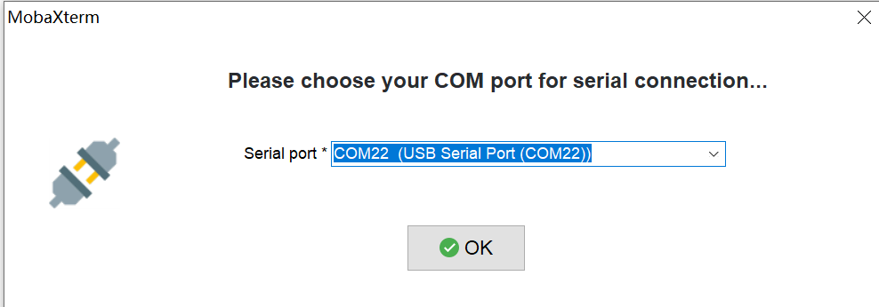
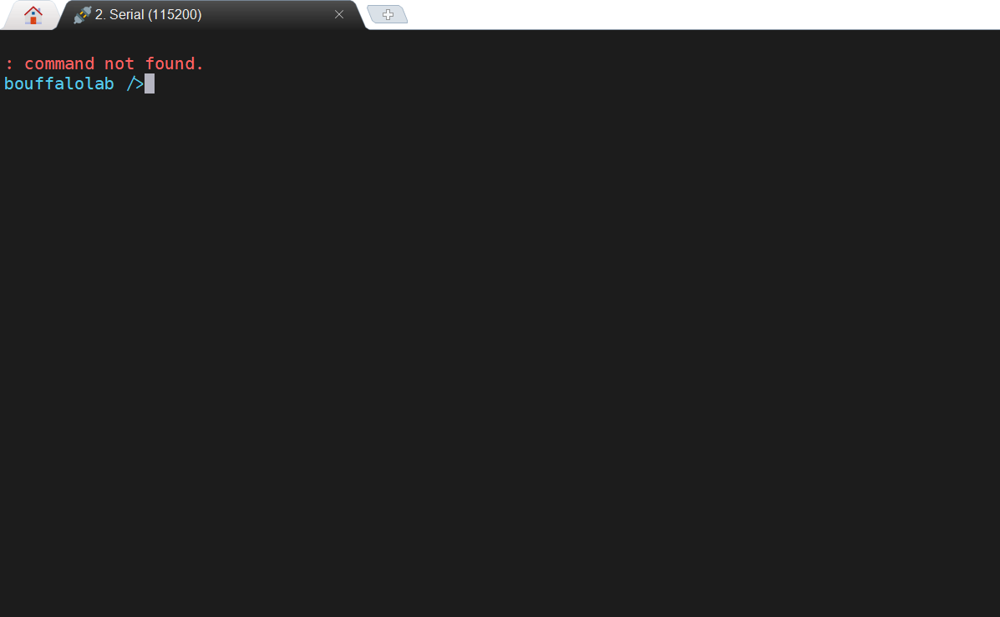
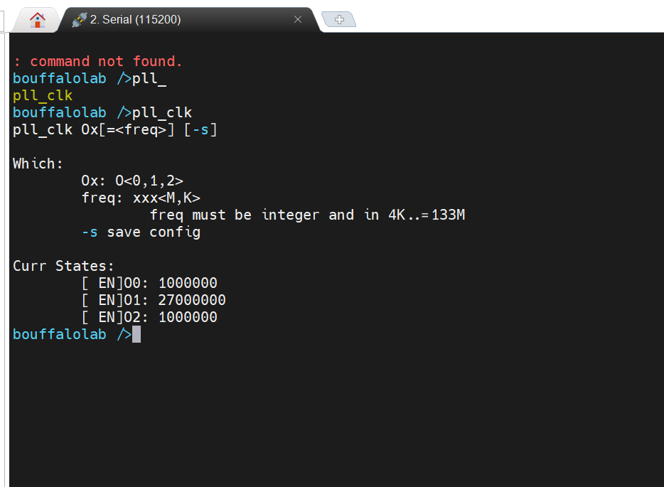
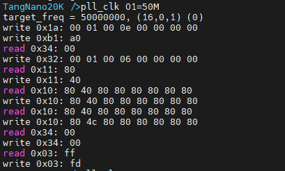

# 上手使用

使用 Mobaxterm，添加 串口(Serial) 会话 (Session)，设置波特率为打开 115200，打开板子的串口。

在会话窗口依次按下 `Ctrl + x`、`Ctrl + c`、`Enter` 后进入板卡的命令终端。

输入 `pll_clk` （支持 tab 自动补全） 可以看到当前配置 MS5351 时钟发生器的配置情况.

上面中可以看到 `O0` `O1` `O2` 前面都是 DIS，说明三个时钟都被关闭了。

使用命令 `pll_clk O1=50M` 可以配置 ms5351 的 O1 输出 50M 频率。

三路时钟目前都正常被配置了。使用命令 `pll_clk O1` 可以来关闭 `O1` 时钟配置，剩余两个始终同理。拓展命令 `-s` 标识保存当前配置，下次上电加载当前保存配置。

