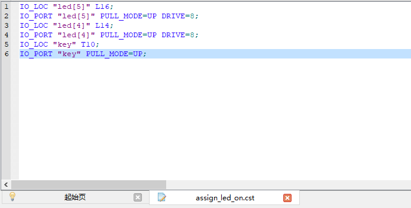

## 原理

从 [原理图](https://dl.sipeed.com/shareURL/TANG/Primer_20K/02_Schematic) 中，可以知道以下信息：

### 按键电路：

根据 DOCK 底板原理图，可以看出当板载按键按下时，对应的 FPGA 引脚会为低电平输入。

| 板载按键电路原理图 | 板载按键与 FPGA 连接引脚图 |
|---|---|
| |  |

### LED 电路:

根据 LED 电路，可以知道当 FPGA 引脚为低电平的时候对应连接的 LED 会亮起来。

| 板载自定义 LED 电路原理图 | 板载自定义 LED 与 FPGA 连接引脚图 |
|---|---|
| |  |

所以直接将按键引脚的逻辑电平输出为 LED 的引脚裸机电平就可以点亮 LED 灯。

## 操作

### 引脚复用

LED5 复用了 SSPI 引脚，需要手动前往 Project->Configuration->Place&Route->Dual-Purpose Pin 中，勾选 `Use SSPI as regular IO`


**后续文章中不再重复描述步骤，仅说明复用管脚，用户自行前往设置启用管脚复用。**

### 端口和引脚

| Port | Direction | Location |
| --- | --- | --- |
| key | input | T10 |
| led[5] | output | L16 |
| led[4] | output | L14 |

### 代码

.. tabset::

    ## key_led_on.v
    Verilog文件；
    定义了一个按键输入端口，和两个输出端口。将输入端口的 IO 电平状态输出到两个输出端口。 
    此处使用了位拓展语法。   
    ```verilog
    module key_led_on(
        input key,
        output [5:4] led
    );
        assign led[5:4] = {2{key}};
    endmodule
    ```

    ## key_led_on.cst
    物理约束文件；
    将 verilog 代码里的端口绑定到 FPGA 引脚上面
    ```txt
    IO_LOC "led[5]" L16;
    IO_PORT "led[5]" PULL_MODE=UP DRIVE=8;
    IO_LOC "led[4]" L14;
    IO_PORT "led[4]" PULL_MODE=UP DRIVE=8;
    IO_LOC "key" T10;
    IO_PORT "key" PULL_MODE=UP;
    ```

#### 代码用法

**仅本次说明，后续章节除了特定内容外，不再做说明。**

根据文件里所描述的文件类型，创建对应的文件，并且把文件内容复制进去。

---

发现这是一个 `物理约束文件`

新建一个 `物理约束文件`

将文件内容内容复制进去

接着保存这个文件。

---

将所有代码中涉及到的文件创建、复制内容且保存后，就可以进行综合、布局布线操作来生成下载固件了。

具体创建工程操作参考 [Tang Primer 20K Dock 亮一个灯](./assign_led.md)

## 效果

按下 S0 按键，LED4 和 LED5 亮。松开 S0 按键，LED4 和 LED5 灭。

|松开 S0 按键|按下 S0 按键|
|---|---|
|||

<p id="back">
    <a href="#" onClick="javascript :history.back(-1);">返回上一页(Back)</a>
</p>
