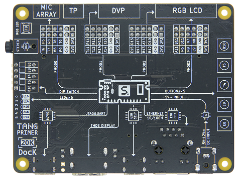
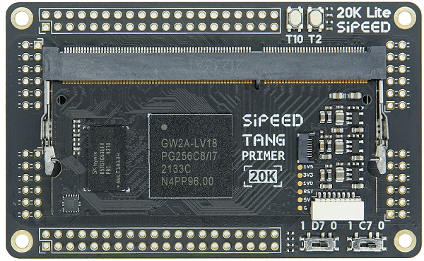
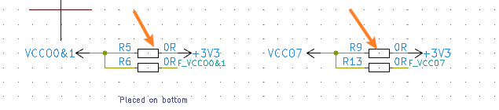
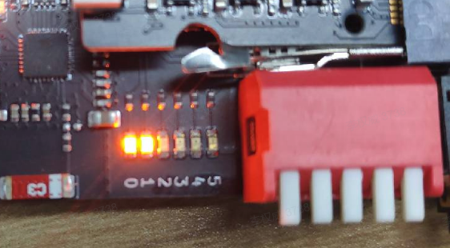
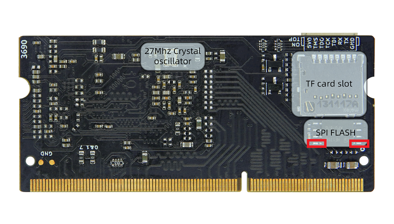

# Tang Primer 20K

## 概述

Tang Primer 20K 是基于 [GW2A-V18PG256C8IC8I7](http://www.gowinsemi.com.cn/prod_view.aspx?TypeId=10&amp;FId=t3:10:3&amp;Id=167#GW2A) 所设计的一款 DDR3 sodimm 封装的核心板，额外准备了两个底板，分别为 Dock 底板和 Lite 底板。

## 核心板

### 外设框图

    
    

### 相关参数

<table>
	<thead>
		<tr>
			<th style="text-align:center">项目</th>
			<th style="text-align:center">参数</th>
			<th style="text-align:center">补充</th>
		</tr>
	</thead>
	<tbody>
		<tr>
			<td style="text-align:left">主控</td>
			<td style="text-align:left"><a href="http://www.gowinsemi.com.cn/prod_view.aspx?TypeId=10&amp;FId=t3:10:3&amp;Id=167#GW2A">GW2A-LV18PG256C8IC8I7</a>
			</td>
			<td style="text-align:left">
				<table>
					<tr>
						<td>逻辑单元(LUT4)</td>
						<td>20736</td>
					</tr>
					<tr>
						<td>寄存器(FF)</td>
						<td>15552</td>
					</tr>
					<tr>
						<td>分布式静态随机存储器S-SRAM(bits)</td>
						<td>41472</td>
					</tr>
					<tr>
						<td>块状静态随机存储器B-SRAM(bits)</td>
						<td>828K</td>
					</tr>
					<tr>
						<td>块状静态随机存储器数目B-SRAM(个)</td>
						<td>46</td>
					</tr>
					<tr>
						<td>乘法器(18x18 Multiplier)</td>
						<td>48</td>
					</tr>
					<tr>
						<td>锁相环(PLLs)</td>
						<td>4</td>
					</tr>
					<tr>
						<td>I/O Bank 总数</td>
						<td>8</td>
					</tr>
				</table>
			</td>
		</tr>
		<tr>
			<td style="text-align:left">内存</td>
			<td style="text-align:left">128M DDR3</td>
			<td style="text-align:left">128Meg x 16</td>
		</tr>
		<tr>
			<td style="text-align:left">Flash</td>
			<td style="text-align:left">32Mbits NOR Flash</td>
			<td style="text-align:left">下载方式参考底部相关问题</td>
		</tr>
		<tr>
			<td style="text-align:left">调试接口</td>
			<td style="text-align:left">Jtag + Uart</td>
			<td style="text-align:left">JST SH1.0 8Pins 连接器</td>
		</tr>
		<tr>
			<td style="text-align:left">SD 卡槽</td>
			<td style="text-align:left">一个</td>
			<td style="text-align:left">推拉式</td>
		</tr>
		<tr>
			<td style="text-align:left">显示接口</td>
			<td style="text-align:left">8Pins spi lcd 连接器</td>
			<td style="text-align:left"></td>
		</tr>
		<tr>
			<td style="text-align:left">整体封装</td>
			<td style="text-align:left">204P DDR3 Sodimm 金手指</td>
			<td style="text-align:left"></td>
		</tr>
		<tr>
			<td style="text-align:left">可用 IO</td>
			<td style="text-align:left">一共 117 个</td>
			<td style="text-align:left"></td>
		</tr>
	</tbody>
</table>

## 底板对比

### Dock 底板产品图

其中 LED2 和 LED3 所对应的引脚编号为 N16 和 N14。查阅右图左方，已标明。

### Lite 底板产品图

底板 R8 与 P9 之间为 P8 引脚。参考右图左上方，已标明

### 外设参数对比

<table>
	<thead>
		<tr>
			<th rowspan="2" colspan="2">项目</th>
			<th colspan="2">Dock</th>
			<th colspan="2">Lite</th>
		</tr>
		<tr>
			<th>数量</th>
			<th>补充说明</th>
			<th>数量</th>
			<th>补充说明</th>
		</tr>
	</thead>
	<body>
		<tr>
			<td colspan="2">RGB 接口</td>
			<td>1</td>
			<td>RGB565 40P FPC 连接器</td>
			<td></td>
			<td></td>
		</tr>
		<tr>
			<td colspan="2">DVP 接口</td>
			<td>1</td>
			<td>24P FPC 连接器</td>
			<td></td>
			<td></td>
		</tr>
		<tr>
			<td colspan="2">麦克风阵列接口</td>
			<td>1</td>
			<td>10P FPC 连接器</td>
			<td></td>
			<td></td>
		</tr>
		<tr>
			<td colspan="2">触摸接口</td>
			<td>1</td>
			<td>4P FPC 连接器</td>
			<td></td>
			<td></td>
		</tr>
		<tr>
			<td colspan="2">PMOD 接口</td>
			<td>4</td>
			<td></td>
			<td>4</td>
			<td></td>
		</tr>
		<tr>
			<td colspan="2">3.5mm 耳机接口</td>
			<td>1</td>
			<td>使用 LPA4809MSF 驱动</td>
			<td></td>
			<td></td>
		</tr>
		<tr>
			<td colspan="2">拨码开关</td>
			<td>1</td>
			<td>5P 拨码开关</td>
			<td></td>
			<td></td>
		</tr>
		<tr>
			<td colspan="2">滑动开关</td>
			<td>1</td>
			<td>切换板载 USB 功能</td>
			<td>2</td>
			<td>用户自定义功能</td>
		</tr>
		<tr>
			<td style="white-space:nowrap" rowspan="2">Type-C 接口</td>
			<td style="white-space:nowrap">USB-JTAG&UART</td>
			<td>1</td>
			<td>板载 BL702 芯片用来 下载比特流并提供串口功能</td>
			<td></td>
			<td></td>
		</tr>
		<tr>
			<td>自定义 USB</td>
			<td>1</td>
			<td>USB3317 芯片与滑动开关 来自定义该 USB 接口功能</td>
			<td></td>
			<td></td>
		</tr>
		<tr>
			<td colspan="2">无线天线</td>
			<td>1</td>
			<td>使用 BL702 芯片的无线功能</td>
			<td></td>
			<td></td>
		</tr>
		<tr>
			<td colspan="2">按键</td>
			<td>6</td>
			<td>一个用来烧录 BL702, 剩下五个用户自定义功能</td>
			<td>2</td>
			<td></td>
		</tr>
		<tr>
			<td colspan="2">LED</td>
			<td>6</td>
			<td></td>
			<td></td>
			<td></td>
		</tr>
		<tr>
			<td colspan="2">HDMI 接口</td>
			<td>1</td>
			<td></td>
			<td></td>
			<td></td>
		</tr>
		<tr>
			<td colspan="2">以太网接口</td>
			<td>1</td>
			<td>TL8201F 芯片实现以太网功能</td>
			<td></td>
			<td></td>
		</tr>
		<!-- <tr>
			<td colspan="2">RGB LED</td>
			<td>1</td>
			<td>WS2812 灯珠</td>
			<td></td>
			<td></td>
		</tr> -->
	</body>
</table>

## 硬件资料汇总

规格书、原理图、尺寸图等均可在这里找到：[点击这里](https://dl.sipeed.com/shareURL/TANG/Primer_20K)

## 上手指引
   
1. 安装 IDE ：[点击这里](./../Tang-Nano-Doc/get_started/install-the-ide.md)

2. 查看 [上手指南](./start.md) 来避免一些问题，并且从那里面可以开始进行代码实战。

3. 如果进行完上面的点灯操作后后感觉有压力，可以自己查漏补缺：
   可以在下面的这些网站学习 Verilog:
	+ 在线免费教程：[Verilog 教程](https://www.runoob.com/w3cnote/verilog-tutorial.html)（学习Verilog）
	+ 在线免费 FPGA 教程：[Verilog](https://www.asic-world.com/verilog/index.html) （英文网站）
	+ Verilog 刷题网站：[HDLBits](https://hdlbits.01xz.net/wiki/Main_Page)（英文网站）
	+ 在线高云半导体视频教程：[点击这里](http://www.gowinsemi.com.cn/video_complex.aspx?FId=n15:15:26)

   对 IDE 使用有疑问的话，可以查看官方的一些文档来熟悉相关内容
   - [SUG100-2.6_Gowin云源软件用户指南.pdf](http://cdn.gowinsemi.com.cn/SUG100-2.6_Gowin%E4%BA%91%E6%BA%90%E8%BD%AF%E4%BB%B6%E7%94%A8%E6%88%B7%E6%8C%87%E5%8D%97.pdf)
   - [SUG949-1.1_Gowin_HDL编码风格用户指南.pdf](http://cdn.gowinsemi.com.cn/SUG949-1.1_Gowin_HDL%E7%BC%96%E7%A0%81%E9%A3%8E%E6%A0%BC%E7%94%A8%E6%88%B7%E6%8C%87%E5%8D%97.pdf)
   - <a href="http://cdn.gowinsemi.com.cn/UG286-1.9.1_Gowin%E6%97%B6%E9%92%9F%E8%B5%84%E6%BA%90(Clock)%E7%94%A8%E6%88%B7%E6%8C%87%E5%8D%97.pdf">UG286-1.9.1_Gowin时钟资源(Clock)用户指南.pdf</a>
   - [SUG940-1.3_Gowin设计时序约束用户指南.pdf](http://cdn.gowinsemi.com.cn/SUG940-1.3_Gowin%E8%AE%BE%E8%AE%A1%E6%97%B6%E5%BA%8F%E7%BA%A6%E6%9D%9F%E7%94%A8%E6%88%B7%E6%8C%87%E5%8D%97.pdf)
   - [SUG502-1.3_Gowin_Programmer用户指南.pdf](http://cdn.gowinsemi.com.cn/SUG502-1.3_Gowin_Programmer%E7%94%A8%E6%88%B7%E6%8C%87%E5%8D%97.pdf)
   - [SUG114-2.5_Gowin在线逻辑分析仪用户指南.pdf](http://cdn.gowinsemi.com.cn/SUG114-2.5_Gowin%E5%9C%A8%E7%BA%BF%E9%80%BB%E8%BE%91%E5%88%86%E6%9E%90%E4%BB%AA%E7%94%A8%E6%88%B7%E6%8C%87%E5%8D%97.pdf)

   上面的所有文档都已经打包进了下载站[点我跳转](https://dl.sipeed.com/shareURL/TANG/Primer_20K/07_Chip_manual/CN/%E9%80%9A%E7%94%A8%E6%8C%87%E5%BC%95)，需要的话可以点击压缩包全都下载下来。

## 例程汇总

### 公开例程

github 链接： https://github.com/sipeed/TangPrimer-20K-example

### 部分教程

- Lite 底板点灯 ：<a href="https://wiki.sipeed.com/news/others/20k_lite_start/20k_lite_start.html" target="blank">点我跳转</a>
- Dock 底板例程指南: [点我跳转](./example.md)

## 交流方式

- **交流论坛: [bbs.sipeed.com](https://bbs.sipeed.com)**
- **QQ 交流群：[834585530](https://jq.qq.com/?_wv=1027&k=wBb8XUan)**
- 直接本页下方留言
- 商业邮箱 : [support@sipeed.com](support@sipeed.com)

## 补充说明

对于板子上的 bank 0、bank 1、bank 7 这 3 个 bank 电压，默认所接的是 3.3V，对应的 bank IO 会对外输出 3.3V 电压。如果需要输入自定义的 IO bank 电压，请拆除 R5 和 R9，请参考对应 Assembly [点我跳转](https://dl.sipeed.com/shareURL/TANG/Primer_20K/03_Bit_number_map) 图来确定 R5 和 R9 的位置。

对应核心板原理图上在金手指处的说明如下

## 相关问题

### Dock 底板不工作

拨下 1 号拨码开关以使能核心板，不然底板会不工作且 LED0 和 LED1 常亮。

| 使能核心板 | 未使能核心板 |
| --- | --- |
|  |   |

<!--  -->

### 如何下载到外部 FLASH

进行如下选项设置：

### 烧录后没反应或者引脚现象不对

首先确定选择了正确的型号，下图中的每一个参数都要求一致

然后检查自己的代码和对应的仿真波形是否满足要求

### 成功烧录过一次外部 Flash 后 Programmer 软件无法再烧录

注意描述是成功烧录过一次 Flash。

这种情况默认为启用了错误的引脚复用而导致下载器不能再识别到 FPGA 的 JTAG。可以短接 Flash 的 1、4 引脚，让芯片上电时不能正常读 FLASH 。

### 更多问题及其解决办法前往[相关问题](./../Tang-Nano-Doc/questions.md)查看