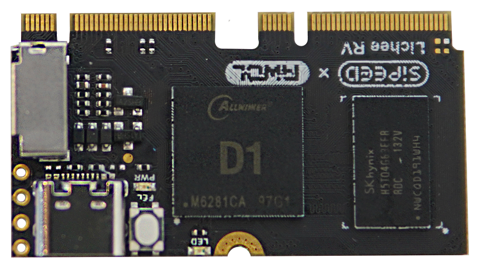

> 编辑与2022年3月11日

- Lichee 是 [Sipeed](https://www.sipeed.com/) 推出的开源产品，是为了能让用户获得优廉的linux设备，实战linux底层相关的内容的产品。

目前LicheePi相关核心板部分参数对比表格如下：

| 类别 | Lichee RV |Lichee Zero Plus|Lichee Zero|Lichee nano|
| :--- | :--- | :--- | :--- | :--- |
| SOC | Allwinner D1 | Allwinner S3 | Allwinner V3s | Allwinner F1c100s |
| CPU架构 |玄铁 C906 | Cortex™-A7  | Cortex™-A7 |  ARM 926EJS  |
|运行频率|1GHz|1.2GHz|1.2GHz(max)|600MHz(max)|
| RAM | 512MB DDR3 | 128Mbyte DDR3 |  64MB DRAM | 32MB DDR |
|FLASH|可选SD-nand|可选SD Nand、 SPI Nor Flash 或者eMMC |预留 SOP8 SPI Flash 焊盘|板载 16MB NOR FLASH|
| TF连接器 | 有|有|有|有|

- 上述的款型都可以通过sd卡启动系统
- 其他参数过多，版面放不下，需要的话麻烦自行对比一下。

## Lichee 核心版照片(Linux)
### Lichee Zero

### Lichee Nano

### Lichee Zero Plus

### Lichee RV

