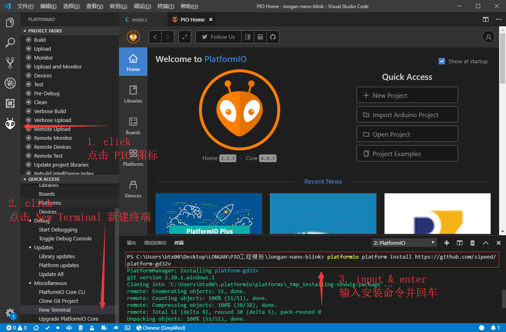
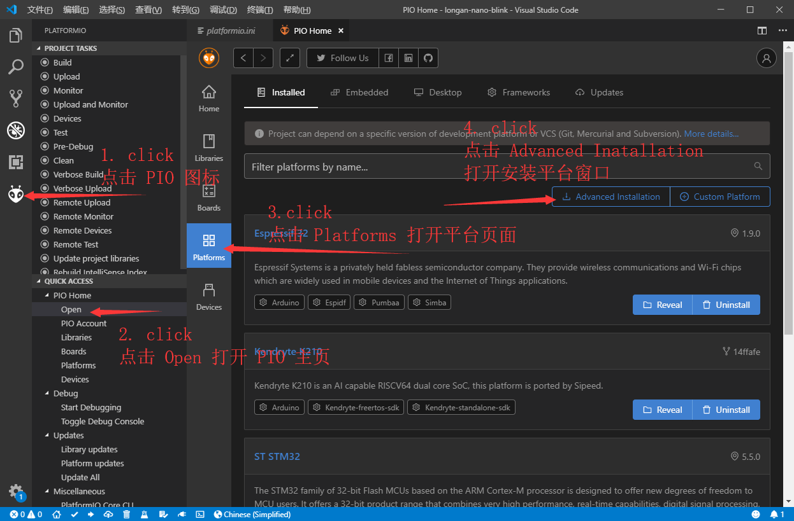
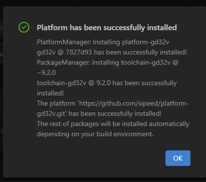

PIO 配置
=====

## 安装 VS-CODE
VS CODE 是一款比较常用的开发工具。前往[VScode官网](https://code.visualstudio.com/ "VScode官网")，下载安装对应操作系统版本的安装包即可。

## 安装 PIO 插件
打开 VSCode -> 点击左侧扩展 -> 搜索 PlatformIO -> 点击安装插件 -> 等待安装完成 -> 重启 VSCODE


## 安装 GD32V 平台定义

PIO 目前提供**命令行**与**图形界面**两种方式来安装。下面将分别介绍：
（PS : 推荐命令行，因为能看到下载进度条。）

### 命令行

点击PIO图标 -> 点击左下方的New Terminal-> 在终端窗口中执行下面的安装指令

* 发布版 （稳定版本）
```
platformio platform install gd32v
```

* 开发版（与Github同步）
```
platformio platform install https://github.com/sipeed/platform-gd32v
```


注：受国内网络环境影响，安装过程需要较长时间，请耐心等待。


### 图形界面

打开VS CODE -> 点击左侧 PIO 图标 -> 点击左下方的 Open 选项 -> 点击 Platforms 页面 -> 点击 Advanced Installation 打开添加窗口


在打开的窗口中输入下面的网址
```
https://github.com/sipeed/platform-gd32v.git
```

点击 Install 即可添加完成。


耐心等待即可安装成功。 （安装失败多为网络原因， 请更换网络环境后再次尝试）

