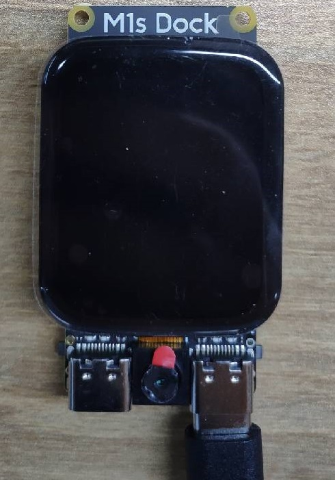

这里说明一下摄像头和屏幕的拆装方法，并补充下外壳的安装方法。

## 拆卸屏幕

默认发货的板卡的摄像头和屏幕是同一方向的，有时候因为一些原因比如调整摄像头方向需要拆卸屏幕，这里写一下注意事项。

| 屏幕与摄像头同向                                              | 摄像头放在背部                                        |
| ------------------------------------------------------------- | ----------------------------------------------------- |
|  |  |

屏幕与板卡是通过泡沫胶粘在一起的，因此拆卸屏幕的时候需要撕开泡沫胶。这时需要注意应该对屏幕背板的金属层用力，而不是扣屏幕边缘。

<table>
    <tr>
        <td></td>
        <td></td>
        <td>旁边两张图可以看到 屏幕与板子是通过泡沫胶粘在一起的</td>
    </tr>
</table>
<table>
    <tr>
        <td></td>
        <td>中间为屏幕背板金属层， 旁边的黑色部分为屏幕边缘， 拆卸的时候后需要对屏幕背板金属层用力</td>
    </tr>
</table>
<table>
    <tr>
        <td></td>
        <td>打开后注意屏幕与板子的连接方式如左图所示， 不要连接反了</td>
    </tr>
</table>

## 更换摄像头方向

进行完前面的[拆卸屏幕](#拆卸屏幕)后，可以将摄像头调整的前后方向了。
唯一要注意的就是在连接摄像头排线的时候别接反了。

<table>
    <tr>
        <td></td>
        <td>连接的时候注意将摄像头上的 1 与板子上的 1 对上就行</td>
    </tr>
</table>

## 安装外壳

在购买 M1s Dock 的时候可以选购外壳，这里补充一下组装方法。

摄像头有两个方向可以自行选择，下面会进行说明。

拆成散件，首先要讲板子的屏幕和摄像头都拆下来，并且把外壳打开。参考下图排布方式。

摄像头有前后两种组装方式，分别是摄像头拍摄方向与屏幕相同和拍摄方向与屏幕相反。

### 屏幕与摄像头方向相同

<table>
    <tr>
        <td></td>
        <td></td>
        <td>首先将摄像头嵌入在外壳里面，正常组装上之后摄像头会被轻微固定在外壳上，确保安装的时候无偏移，摄像头居中。</td>
    </tr>
</table> 
<table>
    <tr>
        <td></td>
        <td></td>
        <td>板子与屏幕连接好后，将屏幕穿过外壳</td>
    </tr>
</table> 
<table>
    <tr>
        <td>旋转外壳使板子上的 TF 卡槽 与外壳上的 SiPEED logo 同方向</td>
        <td>将两个 TypeC 口对准壳子上的孔，准备安装板子进外壳</td>
        <td>按压箭头指向的地方，首次按压的时候有一点紧，注意对准 TypeC 口。安装板子进入外壳</td>
    </tr>
    <tr>
        <td></td>
        <td></td>
        <td></td>
    </tr>
</table> 
<table>
    <tr>
        <td></td>
        <td></td>
        <td>将摄像头排线弯曲，注意不是折叠，是弯曲。穿过板子的预留孔，连接上背面的座子。</td>
    </tr>
</table> 
<table>
    <tr>
        <td>使用壳子上的双面胶固定好屏幕，背板固定在背部，注意背板的预留摄像头孔应对着模组。</td>
        <td></td>
        <td></td>
    </tr>
</table> 

到此就已经组装完毕了。

### 屏幕与摄像头方向不同

<table>
    <tr>
        <td></td>
        <td></td>
        <td>首先将摄像头和屏幕安装到板子上，摄像头应与模组同方向</td>
    </tr>
</table> 
<table>
    <tr>
        <td>将板子穿过壳子</td>
        <td>最终结果如下</td>
        <td>调整方向让板子的 TF 卡槽与壳子上的 SiPEED logo 方向相同</td>
    </tr>
    <tr>
        <td></td>
        <td></td>
        <td></td>
    </tr>
</table> 
<table>
    <tr>
        <td>将两个 TypeC 口对准壳子上的孔，准备自装板子进外壳</td>
        <td>按压箭头指向的地方，首次按压的时候有一点紧，注意对准 TypeC 口。安装板子进入外壳</td>
    </tr>
    <tr>
        <td></td>
        <td></td>
    </tr>
</table> 
<table>
    <tr>
        <td colspan="3">将摄像头穿过外壳，慢慢的滑动外壳来刚好将摄像头固定在板子模组上</td>
    </tr>
    <tr>
        <td></td>
        <td></td>
        <td></td>
    </tr>
</table>

安装好屏幕，到这里就已经完成组装了。

## 拆卸外壳

首先在屏幕背面，使用镊子或其他工具翘起来外壳，将其取下。

使用镊子，在外壳 Logo 处的哪个孔哪里，把板子从外壳中翘出来。

然后对屏幕的背板用力，将屏幕顶出外壳

到此拆卸外壳结束。