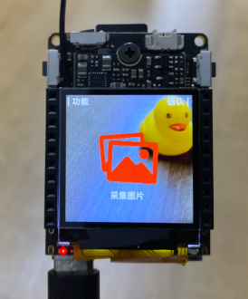

你没看错，接触这款开发板的第一件事情，竟然是可以直接训练 AI 模型！

在进行写代码开发前，让我们一起来**零代码**体验一下训练一个自己的物体检测 AI 模型，并且快速部署到 Maix-II-Dock。

## AI 物体检测模型简介

**目标**：
顾名思义，就是用 AI 来检测物体，比如检测人脸、玩具、卡片、车辆、水果等等。

开发板（设备）通过摄像头拍摄到画面（图片），然后通过 AI 模型来检测画面中的物体，包括坐标、大小、物体名称，然后将检测结果显示在屏幕上。

**原理**：
利用了一个叫作 YOLOv2 的物体检测模型和方法，具体怎么做到的这里先不管，后期再学习，先把它当成一个黑盒，输入图片，输出检测结果。
而 MAIX-II 拥有硬件神经网络加速单元，可以非常快速地运行这个模型，可以实时检测画面中的物体。

## MaixHub 简介

MaixHub 是由 Sipeed 推出的 AI 平台和分享社区，可以在线训练 AI 模型，不需要开发基础，也不需要昂贵的机器，并且可以免费使用，非常适合 AI 初学者体验学习，也适合简单场景应用快速落地。

同时也是开发者分享社区，可以在上面找到很多大家分享的模型，以及开发经验等等。

## 准备工作

* 确保开发板连接好了 WiFi 天线，因为需要连接互联网。
* 准备好一个能够连接互联网的 WiFi 环境，比如路由器，手机热点等。
* 确保在上一篇文档[烧录系统](./flash.md)中已经烧录了**最新**的文件名带有`maixhub`字样的镜像，这样上电启动后会自动进入 MaixHub APP 界面，如下：

> 另外你也可以手动[下载最新的 MaixHub APP](https://maixhub.com/app/1) 手动更新，方法见链接里面的文档说明。

然后可以看到界面可以切换功能，可以先切换语言选择中文，然后有其它功能比如**WiFi**、**采集图片**、**部署模型**等等。

* 进入 WiFi 界面，根据提示在浏览器打开 [maixhub.com/wifi](https://maixhub.com/wifi)，填写 WiFi 的 SSID 和密码生成二维码，然后开发板扫描二维码连接 WiFi。

## 如何在 MaixHub 训练自己的 AI 模型及部署到 Maix-II-Dock

* 访问[MaixHub](https://maixhub.com/)， 注册登录账号。
* 成功登录后，首页有**AI知识** 和 **视频教程**，可以观看并学习使用。

这里写一下主要的步骤，大家可以看 MaixHub 的教程以及自行举一反三摸索。
* 创建在线训练项目，选择**图像检测**。
* 创建数据集，选择开发板（设备）的**采集图片**功能上传图片，尽量多采集图片，尽量多覆盖使用场景。
* 标注数据集。
* 创建训练任务，等待云端训练完成。
* 开发板（设备）打开**部署模型**功能，扫码部署模型。
* 摄像头对着被检测的物体，查看检测效果。

## 将识别结果通过串口发送到单片机

下载模型，里面有`main.py`程序，里面有串口发送结果的代码，通过引脚`G6`（`TX`）发送数据，波特率为`115200`。
将所有文件放再在 U盘`app/`目录下替换原有文件（没有`app`目录则手动新建一个），重启开发板即可自动运行。

