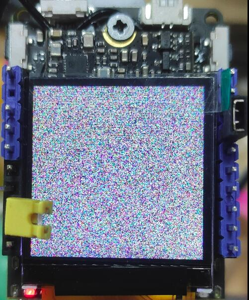
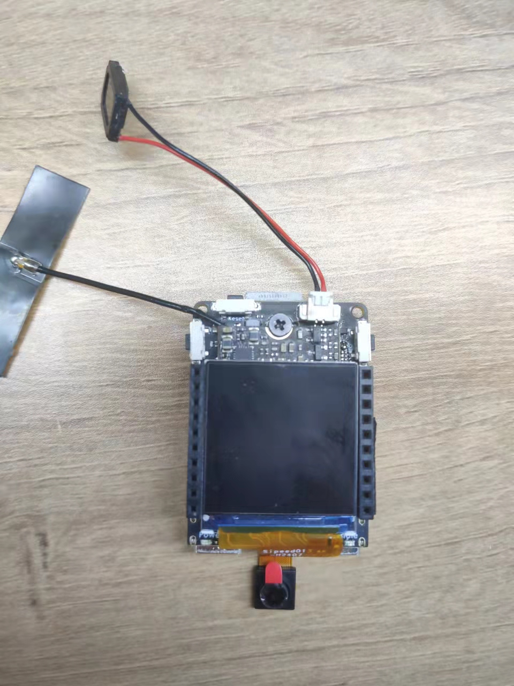

> 编辑于 2022年8月23日

这里讲述 V831 开发板的一些额外使用事项和相关解决方法

以下替换设备相关操作完成后，名称为 `maixhub` 的镜像里的 app 应用不再可用


## 测试屏幕方法

- 请测试前观察系统上电后屏幕是否会闪烁一次；这表示屏幕已经通电、驱动起来，并对其复位（RST）后产生的。

在 Linux Shell 运行 `cat /dev/urandom > /dev/fb0` 就会输入随机数据到 fb0 产生雪花屏了，这表示屏幕显示是正常的。

<center></center>

<details>
  <summary>帧缓冲相关知识</summary>
   帧缓冲（framebuffer）是 Linux 为显示设备提供的一个接口，把显存抽象后的一种设备。
   它允许上层应用程序在图形模式下直接对显示缓冲区进行 读写操作。framebuffer 是 LCD 对应的一种 HAL（硬件抽象层），提供抽象的，统一的接口操作，用户不必关心硬件层是怎么实施的。这些都是由 Framebuffer 设备驱动来完成的。帧缓冲设备对应的设备文件为 /dev/fb*，如果系统有多个显示卡，Linux下还可支持多个帧缓冲设备，最多可达 32 个，分别为 /dev/fb0 到 /dev/fb31，而 /dev/fb 则为当前缺省的帧缓冲设备，通常指向 /dev/fb0，在嵌入式系统中支持一个显示设备就够了。帧缓冲设备为标准字 符设备，主设备号为 29 ，次设备号则从 0 到 31 。分别对应 /dev/fb0-/dev/fb31 。
</details>


## 切换屏幕

目前开发板支持的屏幕有 1.3寸、2.4寸、2.8寸 的 IPS 屏，且只是支持在[我们淘宝](https://sipeed.taobao.com/)上售卖的显示屏；对于别的屏幕有需求的，可以走商务通道进行定制。

### 准备

- 需要切换的屏幕与对应的转接板
- 开发板
- 最新[系统镜像](./flash.md)

### 屏幕连接

开发板可以直接与 1.3寸 屏幕连接，但是与 2.4寸 或 2.8寸 屏幕连接的话需要使用转接板

转接板上的接口一个 1 的标识符，是来确保不被反插的。屏幕排线上的 1 要和转接板、开发板的上 1 相位置对应。

屏幕标识的 1 如下所示

<html>
    
    
</html>

转接板上面的 1 如下所示


板子上的 1 如下所示


具体接线参考下面两张图

<html>
    
    
</html>

### 切换设备树

- update_dtb 程序是给 Allwinner tina linux 专门写的应用。
- 编译好的设备树文件，可以在[下载站](https://dl.sipeed.com/shareURL/MaixII/MaixII-Dock/SDK/Toolchain)中进行下载

该设备树文件是通过内核编译出来的，不推荐个人用户自行编译。设备树文件命名规则如下：

| 文件名字 | 可用屏幕 | 可用摄像头 |
| :----: | :----: | :---: |
| sipeed_2.8_240x320_vs3205.dtb | 2.8寸 | vs3205 |
| sipeed_2.8_240x320_sp2305.dtb | 2.8寸 | sp2305 |
| sipeed_2.4_240x320_vs3205.dtb | 2.4寸 | vs3205 |
| sipeed_2.4_240x320_sp2305.dtb | 2.4寸 | sp2305 |
| sipeed_1.3_240x240_vs3205.dtb | 1.3寸 | vs3205 |
| sipeed_1.3_240x240_sp2305.dtb | 1.3寸 | sp2305 |
| sipeed_1.3_240x240_ov2685.dtb | 1.3寸 | ov2685 |

将设备树文件存放到开发板中在电脑中显示的虚拟U盘中。
接着在 adb 终端里面执行下面命令

```bash
sync  #刷新一下文件
update_dtb /dev/mmcblk0 /root/sipeed_240x240_vs3205.dtb
reboot #重启设备来更新配置
```

即可切换设备树。

- 如果发现屏幕显示效果不对 说明选错了对应的设备树文件。重新换成正确的设备树即可

这里贴一张正常显示的图样


## 更换摄像头

目前 MaixII-Dock 开发板目前支持的摄像头有 sp2305、vs3205、ov2685（只支持在官方店上再售卖的摄像头，有别的摄像头需求可以进行商务定制），摄像头之间的切换同样时需要更换设备树文件，更换方式上面的更换屏幕一样的。

### 准备

- 需要切换的摄像头模块
- 开发板
- 最新的[系统镜像](./flash.md)
- 编译好的设备树文件，可以在[下载站](https://dl.sipeed.com/shareURL/MaixII/MaixII-Dock/SDK/Toolchain)中进行下载

### 连接摄像头

> **注意的是要摄像头的接法，不要把摄像头给接反了，摄像头的底板上有一个白点，开发板卡上也有一个白点，这两个白点要在同一边。如果接反了，摄像头烧毁了请自行再买一个吧**

<html>
<div class="imbox">
    
    
</div>
</html>

### 切换设备树

> update_dtb 程序是给 Allwinner tina linux 专门写的小工具。

将设备树文件存放到开发板中在电脑中显示的虚拟U盘中。
接着在 adb 终端里面执行下面命令

```bash
sync  #刷新一下文件
update_dtb /dev/mmcblk0 /root/sipeed_240x240_vs3205.dtb
reboot #重启设备来更新配置
```

即可切换设备树，该设备树文件是通过内核编译出来的，不推荐个人用户自行编译

| 文件名字 | 可用屏幕 | 可用摄像头 |
| :----: | :----: | :---: |
| sipeed_2.8_240x320_vs3205.dtb | 2.8寸 | vs3205 |
| sipeed_2.8_240x320_sp2305.dtb | 2.8寸 | sp2305 |
| sipeed_2.4_240x320_vs3205.dtb | 2.4寸 | vs3205 |
| sipeed_2.4_240x320_sp2305.dtb | 2.4寸 | sp2305 |
| sipeed_1.3_240x240_vs3205.dtb | 1.3寸 | vs3205 |
| sipeed_1.3_240x240_sp2305.dtb | 1.3寸 | sp2305 |
| sipeed_1.3_240x240_ov2685.dtb | 1.3寸 | ov2685 |

## 编译链

在[下载站](https://dl.sipeed.com/shareURL/MaixII/MaixII-Dock/SDK/Toolchain)里有一个名为 `toolchain-sunxi-musl-pack-2021-01-09.tar.xz` 的文件，这是在 Linux 系统下为 V831 所使用的编译链。

有需求的可以自行尝试，但是对于 V831 还是推荐使用 MaixPy3 和 MaixHub。


## 怎么样使用 USB 摄像头

M2Dock 有两个 TypeC 接口。其中一个标识有 UART，作为板子与电脑进行串口通信的接口。另一个口有 OTG 标识，默认是作为 USB 从机来使用的，比如我们能够在电脑上使用 `adb` 来操作 M2Dock 就是因为这个接口默认是从机模式。

需要注意的是 M2Dock 系统默认将 OTG 标识设置为 adb 设备，可以在 PC 端通过 `adb` 命令来操作板子，也可以通过使得电脑上的 jypyter 通过 `adb forward` 功能在板子上运行 python 代码。

想要连接摄像头，需要手动更改这个端口为主机模式。从板子上的 USB UART 来操作板子，并执行下面的命令就可以将 OTG 口作为主机模式使用。

要注意的是之子那个下面的命令后，板子上将与电脑通过 USB OTG 口进行通信。

```bash
echo "usb_host" > /sys/devices/platform/soc/usbc0/otg_role
```

接着就能向通常的 linux 系统一样操作 /dev 目录下的摄像头了。

## 如何将 USB OTG 口作为从机

M2Dock 默认的 OTG 口就是 USB 从机设备了，要是有因为其他原因需要重新设置成从机设备的话，在 M2Dock 上执行下面的命令就可以了。

```bash
echo "usb_device" > /sys/devices/platform/soc/usbc0/otg_role
```

