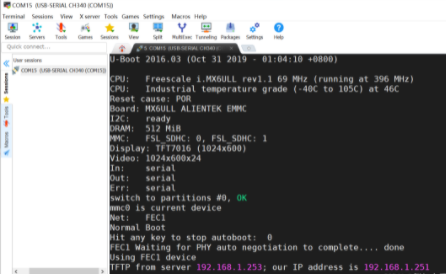

## 连接电脑


如图，有两个 Type-C 口，一个 `USB UART`，一个 `USB OTG`。

两者都可以给板子 5V 供电。

`USB UART` 是 板子的系统交互串口转 USB，连接此接口可以通过电脑的串口终端工具和开发板交互。
`USB OTG` 是 `USB` 从机接口，连接此接口可以通过电脑的 `adb` 工具和开发板交互。

在前面文档中已经烧录了系统，现在只需要讲电脑与板子`USB OTG`口连接起来即可，等待开机，等一会儿，电脑会出现一个 `U盘`。
> 如果开发板屏幕已经有画面了，但是电脑没有弹出 U盘，可以在电脑`设备管理器`中卸载`Android Device` -> `Android ADB Interface`，注意勾选`删除此设备的驱动软件`。
> 如果还没出现则拔掉开发板重新插上尝试，一般都是 `ADB` 驱动问题。
> 
> 

在 U盘 里面我们可以看到一个 `app` 文件夹，默认是[MaixHub APP](https://maixhub.com/app/1) 应用，上电会自动执行`app`目录下的`main.py`或者`main.sh`文件，可以在此目录下替换自己的应用。
> 在给开发板断电前，一定要记得**弹出 U盘**，否则会损坏开发板文件系统导致文件系统只读（只读后可以通过烧录系统来恢复）。

## 在 Linux shell 执行命令

保证前面 U盘 会出现的情况下，我们可以通过 ADB 来和开发板进行交互。

ADB 程序在 windows 下需要手动安装， Linux 或者 MacOS，一般直接内置 adb 命令。


Windows 安装 ADB 有两种方法：
1. 直接下载 [ADB driver](https://adbdriver.com/downloads/) 安装（不需要使用 Python 开发可以用这种方式）。
2. 直接安装 [MaixPy3 IDE](https://dl.sipeed.com/shareURL/MaixII/MaixPy3-IDE)([百度网盘连接](https://pan.baidu.com/s/1d5zbIDSOBUvIta_rRhLx_A)) 会同时自动安装 adb 驱动。


然后键盘`Win+R`输入 `cmd`进入终端，输入`adb shell`即可进入开发板的 shell 环境。
然后我们就可以执行`Linux`命令了，比如`ls`查看目录下文件，`cd /root`进入到`/root`目录，执行`Python`文件用`python3 main.py`等。
比如我看看`/root`目录下有什么文件：

```bash
root@sipeed:/# ls /root
app
```
可以看到和 U盘一样的 `app` 文件夹。
> 更多 Linux 常用命令可自行学习，注意 这里的 Linux 实际上是一个定制版本的 OpenWrt 系统，叫作 Tina Linux，所以有些命令和 PC 的 Linux 可能会有写差异。


## 通过串口与 shell 交互

除了通过 ADB 交互，开发板的另一个串口也可以用来交互。
* 板子 USB UART 口连接电脑
* 使用串口终端软件，比如 putty 或者 mobaxterm， 具体教程查看【<a href='https://wiki.sipeed.com/hardware/zh/maixII/M2/tools/mobaxterm.html' target=_blank>如何使用 mobaxterm</a>】




## Python 开发

### Hello world

通过上面的终端交互的方法：
```
cd /root
vim hello.py
```
然后输入`i`进入编辑模式，输入下面的代码：
```python
print("Hello world")
```
然后按`ESC`退出编辑模式，输入`:wq`保存并退出。
然后执行`python3 hello.py`即可看到输出`Hello world`。

### MaixPy3 开发


MaixPy3 提供了大量的易用 API，这里可以先测试一下摄像头和屏幕：
基于上面的 hello world 代码，我们创建一个`camera_show.py`：

```python
from maix import camera, display
while 1:
   img = camera.capture()
   display.show(img)
```

在执行代码之前，确保屏幕和摄像头没有程序在使用，比如默认的`MaixHub APP`，可以操作按钮选择`退出`功能来退出`MaixHub APP`。

然后在终端执行`python3 camera_show.py` 就可以在屏幕看到摄像头的画面了。

更多使用方法参考 [MaixPy3 文档](/maixpy3)


## M2Dock 联网

M2Dock 带有 2.4G 无线模组，可以用来连接 2.4G 频段的无线网络。

**推荐**：可以用 [MaixHub APP](https://maixhub.com/app/1) 扫码连接。

也可以通过以下方式在命令行连接。
v0.5.4 版本系统镜像和之前的镜像联网方法未兼容，根据烧录的镜像版本选择对应的联网方法：

* v0.5.4
.. details::, 点击展开
      在 0.5.4 的镜像中，移除了之前编辑配置文件然后再连接网络的方法，改为用命令行来连接无线网络。

      可以看到板子中内置了许多 wifi 相关的命令（按 TAB 补全剩余命令，没有就自己手动敲完整）

      

      这里只使用 `wifi_connect_ap_test` 命令来连接无线网络，在使用之前可以先直接执行 `wifi_scan_results_test` 命令来扫描周围网络，确定板子可以识别到目标无线网络。

      使用下面的命令来连接名称为 `Sipeed_Guest`， 且密码为 `qwert123` 的无线网络。

      ```bash
      wifi_connect_ap_test Sipeed_Guest qwert123
      ```

      

      在连接的信息中可以看到 `192.168.3.158` 这串数字，这是板子在当前网络环境中的 IP 地址。

      执行 `ifconfig` 命令可以看到 wlan0 的 IP 地址为 `192.168.3.158`，与连接 WiFi 时候的信息一样。

      


* v0.5.4 前

.. details::, 点击展开
      开发板上的 OTG 接口与电脑连接之后，就会在资源管理器中得到一个 U 盘 设备。通过编辑器打开里面名为 `wpa_supplicant.conf` 文件

      

      可以看到里面有 `yourWIFIname` 和 `yourWIFIpassword` 两项，将他们更改成你想要连接的无线网络和对应的无线网络密码并保存后，使用电脑系统自带的弹出 U 盘操作方式来移除 U 盘，这样可以避免损坏 U 盘的文件系统。接着在 m2dock 命令行终端执行 `reboot` 命令来重启板卡，开机后就自动连接 WiFi 了。

      


## Opkg 软件包管理器

在命令行可以通过包管理器命令安装新的软件。

Opkg 是一个轻量快速的套件管理系统，类似 Ubuntu 下面的 apt 工具， 目前已成为 Opensource 界嵌入式系统标准。常用于 路由、 交换机等 嵌入式设备中，用来管理软件包的安装升级与下载。

### 相关常用命令

- opkg update 更新可以获取的软件包列表
- opkg upgrade 对已经安装的软件包升级
- opkg list 获取软件列表
- opkg install 安装指定的软件包
- opkg remove 卸载已经安装的指定的软件包

例如：

```bash
root@sipeed:/# opkg list 
MaixPy3 - 0.2.5-1
alsa-lib - 1.1.4.1-1
busybox - 1.27.2-3
busybox-init-base-files - 167-1612350358
ca-certificates - 20160104
curl - 7.54.1-1
dropbear - 2015.71-2
e2fsprogs - 1.42.12-1
eyesee-mpp-external - 1.0-1
eyesee-mpp-middleware - 1.0-1
eyesee-mpp-system - 1.0-1
```

## Python 包管理器

[pip](https://pypi.org/project/pip/) 是 Python 包管理工具，该工具提供了对 Python 软件包的查找、下载、安装、卸载的功能。

### pip换源

对于国内可能只接访问 pypi.org 速度比较慢，用国内的镜像源可以加速 pip 安装。

### 临时使用

```python
pip install -i https://pypi.tuna.tsinghua.edu.cn/simple package-name
```

package-name 更换成你想要安装的包名

### 设为默认

升级 pip 到最新的版本 (>=10.0.0) 后进行配置：

```python
pip install -i https://pypi.tuna.tsinghua.edu.cn/simple pip -U
```

设置清华镜像源为默认：

```python
pip config set global.index-url https://pypi.tuna.tsinghua.edu.cn/simple
```
