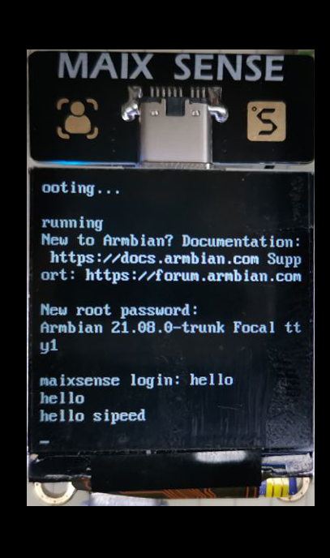
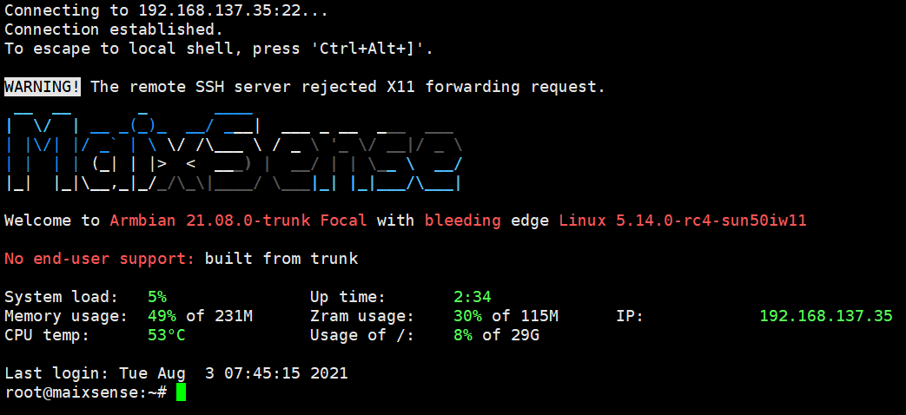
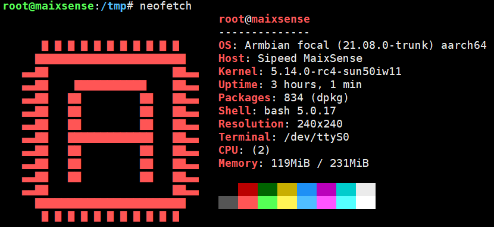
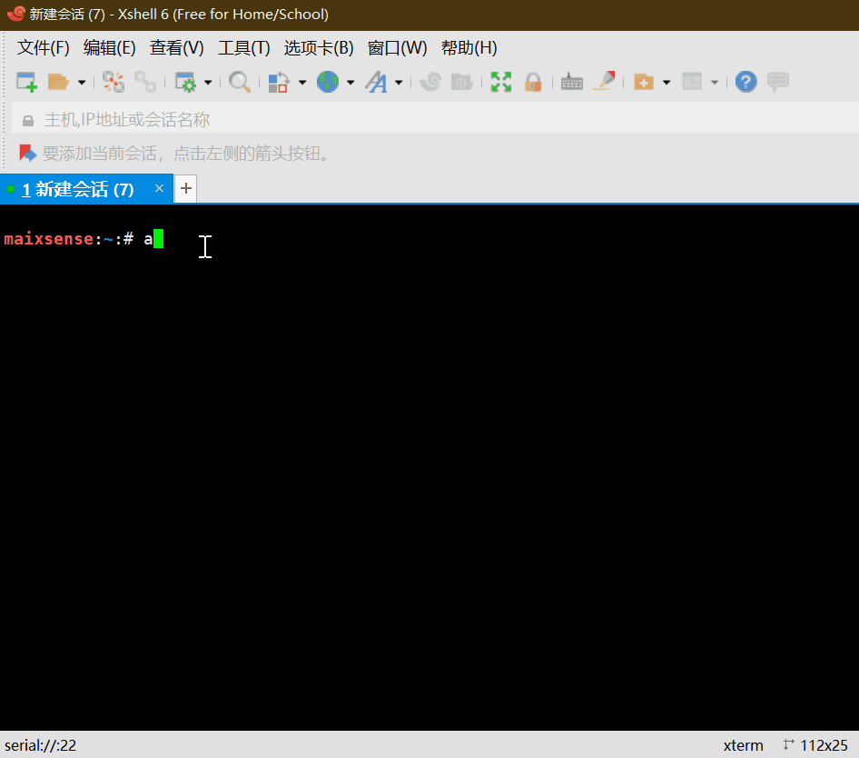
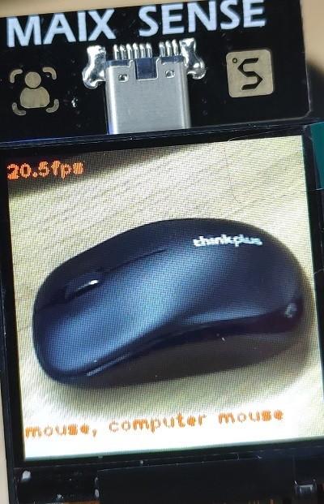

# 硬件测试

## 测试屏幕

可以使用`echo "hello sipeed" > /dev/tty0` 重定向信息到屏幕上。



## 测试摄像头

armbian 内置了 ffmpeg ，可以快速捕捉 sensor 数据并输出到屏幕上

使用如下命令快速捕捉 sensor 并输出到屏幕上

    ffmpeg -i /dev/video0 -vframes 1  -s 240*240 -pix_fmt rgb565le  -vf transpose=2,transpose=2 -f fbdev /dev/fb0


## 测试网络

使用 `nmtui` 指令可以进入可视化的配网界面，
选择 Activate a connection ， 选择对应的 WIFI名称 ，输入连接密码，确认即可。


设置完毕后使用 ifconfig 查看本机操作，然后就可以使用 ssh 等操作了。



也可以使用apt下载各种应用

```bash
sudo apt install neofetch armbian-config
```



如果遇到终端显示错位，还需要`sudo apt-get install xterm`安装下xterm，然后`resize`即可。



## 测试AIPU

获取1000类物体分类模型

下载站链接[zhouyi_test.tar.xz](https://dl.sipeed.com/shareURL/MaixII/MaixII-A/example),使用任意方式上传到板子中

```bash
tar -Jxvf zhouyi_test.tar.xz #解压压缩包
cd zhouyi_test #打开解压后的文件目录
chmod 777 run.sh #授予执行权限
./run.sh #执行1000类物体分类
```
识别出鼠标
 <br>
对于linux命令行，使用`Ctrl + C`来退出当前程序。