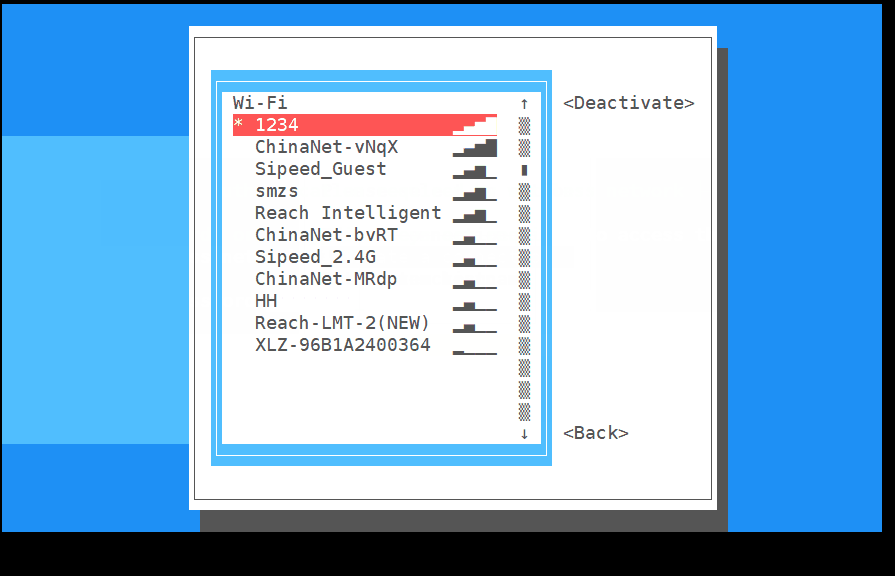
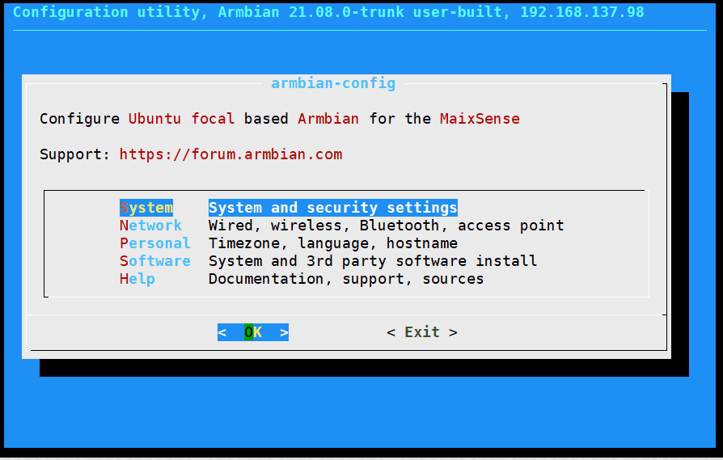
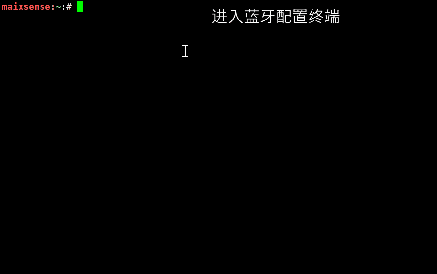
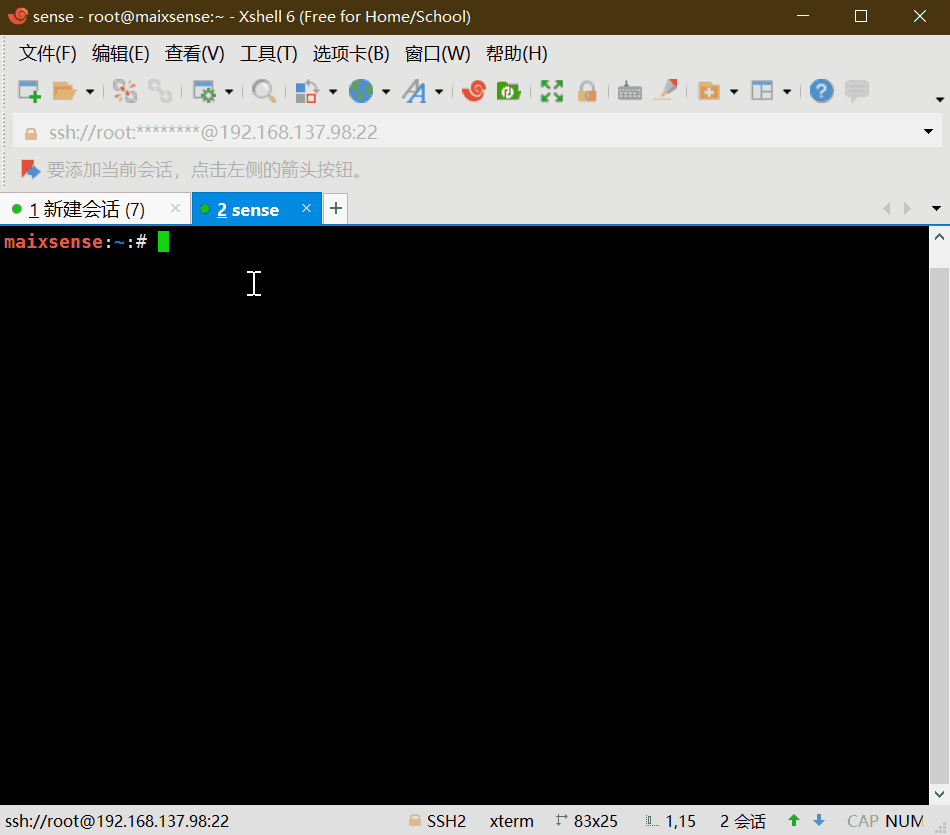

# 基本使用

进行完前面的 [配置系统](./config_system.md) 后，我们已经成功登录到板子然后可以使用命令行来操作板子了。

## 扩容系统

使用不含有 MaxiPy3 的系统镜像启动后会会自动扩容，可以跳过 `扩容系统` 这一步。

使用内置 MaxiPy3 的镜像系统不会自动扩充系统容量到最大值，因此需要执行一下 `/usr/lib/armbian/armbian-resize-filesystem start` 命令来扩容一下系统大小，会花费一下时间；执行时不要强行退出，执行完毕后会自动退回到终端

## 连接网络

这里我们使用 `nmtui` 命令来配置 wifi


<details>
<summary><font color="#4F84FF">点开查看图文版操作</font></summary>
<p>命令行中输入 nmtui 来打开可视化 wifi 连接界面</p>


<p>如上图所示我们选择 Activate a connection 来设置连接</p>
<p>先择目标 wifi </p>


<p>输入正确的密码</p>

<p>会显示 connecting</p>

<p>成功后会发现右边的 active 变成了 Deactive，到此基本说明已经连上了 wifi</p>
<p>连接失败的话重新输入正确的 wifi 密码再尝试连接</p>

<p>然后我们重新退出回命令行终端</p>


<p>可以使用 ifconfig 命令来查看板子的 IP</p>


<p>到这里看到了 IP 就说明已经连接上了(上图中的红框位置)</p>
</details>

## 新建用户

一般来说不建议使用 root 来登录 linux 系统，因为这样很容易把系统玩崩了。
我们来新建一个用户来进行日常使用。这里我们使用 `adduser` 这个命令来添加用户。

添加用户名为 `xxx` 的用户

```bash
adduser xxx
```
一些 log 显示完后会让我们设置密码：
```bash
New password:
Retype new password:
```
成功设置密码后所显示的 log 会包括下面的内容。
```bash
passwd: password updated successfully
```
接下来所有的都使用默认的即可（全部都 回车 确定就行）
```bash
Enter the new value, or press ENTER for the default
        Full Name []:
        Room Number []:
        Work Phone []:
        Home Phone []:
        Other []:
Is the information correct? [Y/n]
```
到这里我们就已经成功创建名称为 xxx 的用户了。

使用命令 login 来登录刚刚新建的用户:
```bash
login xxx
```
想要退出登录的话使用命令 `logout` 就可以
```bash
logout
```
### 授予管理员权限

有时候新建的用户需要使用到管理员权限来执行一些操作，下面内容就是授予用户管理员权限。

这里我们编辑 `/etc` 目录下的 `sudoers` 文件就可以修改相关权限。

```bash
sudo nano /etc/sudoers
```

在文件里找到下面的内容

```vim
# User privilege specification
root    ALL=(ALL:ALL) ALL
```

在里面添加上 `xxx     ALL=(ALL:ALL) ALL`（其中xxx是你之前添加的用户名）

```vim
# User privilege specification
root    ALL=(ALL:ALL) ALL
xxx     ALL=(ALL:ALL) ALL
```

接着保存后退出即可。

## 安装应用

这里我们使用安装 `armbian-config` 为例。直接执行下面的命令即可

```bash
sudo apt install armbian-config -y
```

上面的命令的意思是使用 root 权限来运行 apt 应用的 install 命令来安装 armbian-config 且后面所有需要选择的内容均为 yes 选项

## 设置时区

命令行中输入 `armbian-config`，选中 Personal，再选择 Timezone -> Asia ->Shanghai 设置上海时间（Debian中没有北京时间），按住 TAB 键切换到 ok 后，保存即可。

在 `armbian-config` 设置界面中一直按键盘上的 `Esc` 键也能有退出的效果。


## 设置中文显示

命令行中输入`armbian-config`，选中Personal -> Locales，下滑到最下面（可以试着使用键盘上的 `PageDown` 按键加快下滑），使用键盘空格键来选中 zh.GBK 和 zh.UTF-8 ，回车确认后再选择 zh_CN.UTF8 为系统默认语言，然后多次按下 `Esc` 键来退回到命令行终端界面。<!-- 执行命令 `sudo apt install fonts-wqy-zenhei` 来下载中文字体， --> 然后使用 `reboot` 命令来重启后系统后就会发现命令行终端有中文显示了。


## 配置蓝牙

打开 `armbian-config`，选中 Network，选择 BTinstall 安装蓝牙支持包。



然后就可以使用 Bluetoothctl 配置蓝牙。

<html>
<details>
  <summary><font color="#4F84FF">点开查看常用命令</font></summary>
    <pre  class="line-numbers language-bash">
devices                     列出活动的蓝牙设备
paired-devices              列出已配对蓝牙设备
pairable &lt;on/off&gt;           是否允许配对
discoverable &lt;on/off&gt;       是否允许被发现
discoverable-timeout [value]设置暴露时间
pair [dev]                  配对设备
trust [dev]                 信任设备
untrust [dev]               取消设备信任
remove &lt;dev&gt;                移除设备
connect &lt;dev&gt;               连接设备
disconnect [dev]            断开设备连接                      
quit                        退出
help                        查看帮助
</pre>
</details>
</html>

### 连接蓝牙设备

使用 `bluetoothctl` 连接蓝牙设备。

```bash
scan on             #扫描设备
scan off            #停止扫描
trust XX:XX:XX:XX   #信任设备
pair XX:XX:XX:XX    #配对设备
connect XX:XX:XX:XX #连接设备
```



### 设置蓝牙音频输入/输出

启用蓝牙音频前，需要先安装 `pulseaudio` 和蓝牙组件

```bash
sudo apt install pulseaudio
sudo apt install pulseaudio-module-bluetooth
```

然后使用 pactl 命令查看是否有蓝牙输出设备

```bash
pactl list short sinks
```

切换音频输出到蓝牙，下面的 `<dev>` 在此处应该为 `2`

```bash
pactl set-default-sink <dev>
```

log 如下：

```bash
maixsense:~:# apt install pulseaudio
maixsense:~:# apt install pulseaudio-module-bluetooth
maixsense:~:# pactl list short sinks
0	alsa_output.platform-7032000.codec.stereo-fallback	module-alsa-card.c	s16le 2ch 44100Hz	SUSPENDED
2	bluez_sink.00_26_04_00_73_B1.a2dp_sink	module-bluez5-device.c	s16le 2ch 44100Hz	SUSPENDED
maixsense:~:# pactl set-default-sink 2 
```


然后就可以播放音频到蓝牙设备，或者通过蓝牙连接手机当作蓝牙音箱使用。

## 配置音量

这里使用 `alsamixer` 这个应用来改变音量



<html>
<details>
  <summary><font color="#4F84FF">点开查看常用命令</font></summary>
    <pre>
------------------- Help-----------------------
xxEsc        离开                             ▒x
xxF1 ? H     帮助                             ▒x
xxF2 /       系统信息                         ▒x
xxF3         回放控制                         ▒x
xxF4         捕获控制                         ▒x
xxF5         所有控制                         ▒x
xxTab        切换显示模式                     ▒x
xxF6 S       选择声卡                         ▒x
xxL          刷新屏幕                         ▒x
xxLeft       移动到上一个的控制               ▒x
xxRight      移动到下一个的控制               ▒x
xxUp/Down    改变音量                         ▒x
xx+ -        改变音量                         ▒x
xxPage Up/Dn 大幅改变音量                     ▒x
xxEnd        设置音量为0                      ▒x
xx0-9        从0到9依次设置音量               ▒x
xxQ W E      增加 左/全部/右声道音量          ▒x
xxZ X C      减少 左/全部/右声道音量          ▒x
xxB          左右声道平衡                     ▒x
xxM          切换静音                         ▒x
x< >         切换左/右静音                    ▒x
xxSpace      切换捕获                         ▒x
xx; '        切换左/右捕获                    ▒x
-----------------------------------------------
</pre>
</details>
</html>

如果需要控制蓝牙设备音量，需要使用 `pactl` 。
因为 `pcatl` 也支持控制声卡，所以建议使用这个应用来控制音量。

```bash
##查看输入/输出设备索引
pactl list short sources/sinks
##设置输入/输出音量
pactl set-source/sink-volume index volume
pactl set-default-source/sink
##设置默认输入/输出
```

示例，设置蓝牙耳机为输出设备，音量为10%,然后增加20%，最后减少30%

```bash
maixsense:~:# pactl list short sinks
0	alsa_output.platform-7032000.codec.stereo-fallback	module-alsa-card.c	s16le 2ch 44100Hz	SUSPENDED
2	bluez_sink.00_26_04_00_73_B1.a2dp_sink	module-bluez5-device.c	s16le 2ch 44100Hz	RUNNING
##蓝牙设备一般为bluez_sink
maixsense:~:# pactl set-default-sink 2
maixsense:~:# pactl set-sink-volume 2 10%  
maixsense:~:# pactl set-sink-volume 2 +8192  
maixsense:~:# pactl set-sink-volume 2 -0x3000
##可选 百分比，十进制数，十六进制数控制，效果相同，并且可以超过100%
```

## 媒体播放

媒体播放常用 mplayer 这个应用。

- 下载 mplayer 
  
```bash
sudo apt install mplayer -y
```

安装后我们需要把想要播放的文件传到板子上。

文件可以在[下载站](https://dl.sipeed.com/shareURL/MaixII/MaixII-Dock/example)获取到下面的示例文件

这里可以用 [mobaxterm](../M2/tools/mobaxterm.md) 软件来使用无线网络把文件传输到板子上。
  
然后执行 `sudo mplayer badapple_240_60fps.mp4 -vo fbdev2` 来播放视频或者 `sudo mplayer Short.mp3` 播放音频

```bash
mplayer badapple_240_60fps.mp4 -vo fbdev2
```

想要退出的话使用键盘上的 `Ctrl+C` 组合键来退出。

也在在命令行后面加上`< /dev/null > /dev/null 2>1 &`以便在后台播放

```bash
mplayer badapple_240_60fps.mp4 -vo fbdev2  < /dev/null > /dev/null 2>1 &
```

上面的指令是在后台播放的。想要停止的话可以先使用 `fg` 命令来切换到任务，再使用 `Ctrl+C` 来终止程序


如果没播放成功的话，尝试增加设备音量（前文提过alsamixer）或者确认一下文件路径是否正确

## 编写c代码

一般命令行都是用 vim 来作为编辑器。有兴趣的可以额外学习一下这款强大的编辑器

如果提示没有安装 vim 的话，可以使用命令 `sudo apt install vim -y` 来安装 vim。

然后我们使用 vim 来新建一个名为 `helloworld.c` 的源文件

```bash
vim helloworld.c
```

vim 有命令模式（Command mode） ， 输入模式（Insert mode） 和 底线命令模式（Last line mode）。

新建文件后默认的模式为 命令模式，此时我们按下键盘上的 `i` 键可进入输入模式。

将下面的代码正常输入到文件内容中。

```c
#include <stdio.h>
int main()
{
    printf("Hello, world\n");
    return 0;
}
```

然后使用键盘上的 esc 键来退出输入模式到命令模式，

然后使用 `:` 来进入底线命令模式，接着输入 `wq` 来保存文件且退出到命令行

然后接可以在命令行中使用 gcc 来编译我们的代码了。
如果没有 gcc 的话使用 apt 命令来安装一下。
有关 gcc 的详细说明请自行搜索。

```bash
gcc hello.c -o hello.o
```

结束编译后直接运行即可

```bash
./hello.o
```


## 编写python代码

- 详细解释看上面的C代码样例

```bash
vim helloworld.py       #新建一个python文件并且用vim打开
i
print("hello world!\n")
esc
:wq
python3 helloworld.py
```


## 使用 python 点亮第一个灯

首先安装 GPIO 的 python 支持库

```bash
pip install gpiod
```

把 led 正极插入 PH5,负极插入 GND

创建 `led.py` 文件

``` bash
vim led.py
```

将下面代码输入到所创建的文件中

```python
import time
import gpiod as gpio
PH_BASE = (8-1)*32 # "PH"
gpiochip1 = gpio.chip("gpiochip1")
led = gpiochip1.get_line((PH_BASE + 5)) # "PH5"
config = gpio.line_request()
config.request_type = gpio.line_request.DIRECTION_OUTPUT
led.request(config)

while led:
    led.set_value(0)
    time.sleep(1)
    print("led on")
    led.set_value(1)
    time.sleep(1)
    print("led off")
```

保存退出到命令行终端后执行代码

 ```bash
 python3 led.py
 ```

效果如下：


## 设置开机启动

需要会一些脚本语言。

首先启用开机自启动脚本，这里我们来编辑相关文件就可以修改相关设置。

```bash
vim /lib/systemd/system/rc-local.service
```

在最后面添加

```bash
[Install]
WantedBy=multi-user.target
Alias=rc.local.service
```

这样就成功启用了开机自启动脚本

接下来我们只需要把想要开机运行的内容添加到 rc.local 文件就可以了

编辑自启动脚本

 ```bash
 vim /etc/rc.local
 ```

在`exit 0`前面添加需要启动的服务

```bash
echo "hello world!"
```

然后重启即可。

例如进行上面的修改后，此脚本会在用户登录前执行，执行示例日志如下

```bash
[  OK  ] Finished Permit User Sessions.
[  38.569457] rc.local[1322]: hello world!
```

要注意的是在开机脚本里面最好不要循环占用串口，这会导致我们无法再通过串口来操作板子。

## 更多的使用方法

请到[MaixPy3](/soft/maixpy3/zh/readme.md)和[极术社区](https://aijishu.com/a/1060000000221780)中自行查看