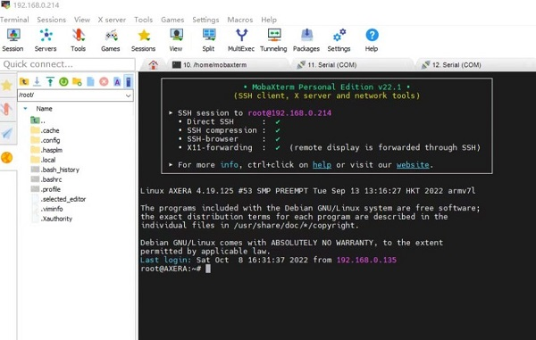

> 本文假定你是一名不了解 linux 系统的开发方式的开发者，但知道 gcc 和 make 命令使用的相关专业工程师，如果你不了解 gcc 编译程序，可以先学习[Linux中gcc/g++ gdb make/Make 的基本使用和理解](https://blog.csdn.net/m0_46606290/article/details/123083945) 。

## 准备工作

欲善其事，必先利其器。在开始开发之前，需要准备好开发板、开发环境、开发工具等。

根据前面的章节，你掌握了开发板的 烧录系统 和 登录系统 等一系列 Linux 基础操作，这可以帮助你在开发过程中排查设备问题或调试驱动代码。

但接下来要开发程序就需要准备好开发环境和开发工具了，以下是给从来没接触过嵌入式 linux 系统开发的同学了解的内容，如软件工程的同学。

首先认识一下什么是交叉编译，通常来说，编译程序有交叉编译和本地编译两种情况，本地编译就是在本机上使用 gcc 进行编译运行程序（例如在 Visual Studio 上编译运行 hello world ），而交叉编译就是本机没有编译环境，需要在另一台机器上完成编译再送进来运行（例如在 Android Studio 上编译 apk 送到手机里安装程序运行）。

> 交叉编译是指在一种计算机架构上编译出另一种计算机架构的可执行程序。交叉编译的目的是为了在一种计算机架构上运行另一种计算机架构的程序。例如，可以在 x86 架构的计算机上编译出 ARM 架构的可执行程序，或者在 ARM 架构的计算机上编译出 x86 架构的可执行程序。交叉编译的目的是为了在一种计算机架构上运行另一种计算机架构的程序。例如，可以在 x86 架构的计算机上编译出 ARM 架构的可执行程序，或者在 ARM 架构的计算机上编译出 x86 架构的可执行程序。

两者的区别在于编译一些复杂大型软件，本机性能太弱内存又少，导致编译出来的时间太长，所以需要交叉编译来完成，比如 ax-sample 在本机完整编译需要十几分钟，而在一台高性能的桌面计算机上只需要数十秒即可。

所以从开发的角度来说，本机编译只是为了快速应用查看效果，真正得开发起来还是得交叉编译，就像原厂提供的 bsp sdk 一样，在计算机上完成编译后，再送进板子中运行。

## 板子与电脑的文件互传

在编译程序之前，你需要了解一些拷贝文件到板子或电脑的方法，免得交叉编译完程序不知道怎么传文件进去板子里运行。

- ssh 相关的远程工具需要，你知道板子的 IP 地址，可以从 ifconfig 得知。
- serial 相关的有线串口工具，需要你接好线配置好参数连上板子。

如何登录板子均可以从前文【系统使用手册】中得知。

### 使用 ssh 远程管理工具

在 windows 上有许多远程管理 linux 服务器的工具都提供了文件传输的功能，这里只推荐免费绿色好用的 mobaxterm 工具。

- [利用MobaXterm实现linux和windows之间传输文件](https://jingyan.baidu.com/article/9f63fb91e2bc6688400f0e93.html)

- [用MobaXterm 在linux和windows之间上传/下载文件](https://blog.csdn.net/unforgettable2010/article/details/123930796)

> [如何使用 mobaxterm](https://wiki.sipeed.com/hardware/zh/maixII/M2/tools/mobaxterm.html)

想了解更多可以看 [推荐7款超级好用的终端工具 —— SSH+FTP](https://zhuanlan.zhihu.com/p/301653835) ，而其他系统都提供了好用的命令行终端，支持 ssh 、 scp 等命令直接执行。

### 使用 scp 命令复制文件

和 cp 复制文件等命令一样，它就是 ssh + cp = scp 这个意思。

- [linux操作系统scp命令使用方法](https://cloud.tencent.com/developer/article/1876623)

###  使用读卡器物理拷贝文件

由于 linux 系统采用 ext4 分区在 Windows / Mac 默认系统上看不到，需要额外安装增强工具才能读取到具体的分区。

- [如何在 Windows 下访问 ext4 格式的硬盘？](https://zhuanlan.zhihu.com/p/448535639)

- [[macOS] 在 macOS 上挂载 Linux 的 ext/ext3/ext4 文件系统](https://blog.twofei.com/773/)

Linux 系统可以直接看到卡里的分区和内容，实在不行也可以把读卡器接到安卓设备通过 otg 转接头实现文件拷贝。

### 使用有线串口互传文件

接好串口连上设备，安装 `apt-get install lrzsz` 工具后参考以下文章：

- 使用 命令行工具  `minicom -D /dev/ttyUSB0 -b 115200` 可以看[ubuntu中使用 minicom 玩转文件的上传与下载](https://blog.csdn.net/wanyeye/article/details/42002377)。

- 使用 mobaxterm 可以看 [MobaXterm 使用 rz/sz 传送文件](https://blog.csdn.net/qq_28837389/article/details/120073720)

其他的可以自行百度。

## 本机编译可直接运行程序

这里把 m3axpi 板子当作一台本地的微型 linux 服务器的角色来看待，使用 vscode remote 或 mobaxterm 这类远程开发工具连接到板子里，这样就可以得到一个和在 linux 服务器一样的本地开发环境，可以在本地编辑代码后直接编译运行程序。

### vscode remote

vscode remote 是 vscode 的一个插件，可以直接连接到远程的 linux 服务器，然后在本地编辑代码，同步到远程服务器上编译运行，这里以一台 ubuntu20.04 的桌面计算机系统为例，只要能安装 vscode 编辑器软件计算机都行，这里只是为了示意如何连接到板子里。

安装插件：

```bash
sudo apt install code
code --install-extension ms-vscode-remote.remote-ssh
```

<!-- [附图] -->

连接到板子：

```bash
ssh root@192.168.233.1
```

<!-- [附图] -->

不想输入密码可以用 sshpass 命令省略。

```bash
sshpass -p root ssh root@192.168.233.1
```

接着就可以在 vscode 里编译运行 linux 系统的程序了，幸运的是在 debian 系统上可以直接通过 apt 得到本机的编译工具链，而不用交叉编译就可以直接编译运行程序，这些都已经提前准备好了，对用户来说可以节省不少搭建内部开发环境的时间。

所以可以直接在板子里编译运行 libmaix 项目：

```bash
cd /home/libmaix/examples/axpi/
python3 project.py build
fbon
./dist/start_app.sh
```

> 按 ctrl + c 中断停止程序直到退出。

<!-- 附图： -->

### mobaxterm

在 Windows 上可以用 mobaxterm 这样的工具连接到板子进行 linux 服务器管理，但编译还是需要在 linux 系统上进行。



## 交叉编译上传程序再运行

在这之前需要有本地编译的认知，然后发现本地内存和性能不能满足自身开发需求的时候，就要准备交叉编译程序了，此时程序是在另一台更强的 x86 linux 系统上完成的，并且编译出来的程序需要拷贝到板子里运行。

> **[20221010 现提供一种借助 docker qemu arm 虚拟机来实现在 x86 机器上实现本地编译 arm 程序的方法，这种方法既提高了编译效率又不用配环境的方法值得一试！](https://www.cnblogs.com/juwan/p/16769237.html)**

首先得有一台 linux 系统，如 ubuntu20.04 这样的桌面计算机，接着和上面一样，也可以在这台计算机上安装 vscode remote 或 idea clion 这类开发工具直接连接到板子里，这可以方便你编辑代码或传输文件。

想要在 x86 的机器上编译出 arm 架构的程序，想要先配置专用的交叉编译工具链，例如这里使用的是 arm-linux-gnueabihf 这个工具链，这个编译链可以直接通过 apt 安装。

- `sudo apt install gcc-arm-linux-gnueabihf`

安装完成后，可以在 /usr/bin 目录下找到 `arm-linux-gnueabihf-gcc` 这个交叉编译工具，这个工具可以用来编译 linux 系统的程序。

```bash
juwan@juwan-n85-dls:~$ /usr/bin/arm-linux-gnueabihf-gcc -v
Using built-in specs.
COLLECT_GCC=arm-linux-gnueabihf-gcc
COLLECT_LTO_WRAPPER=/usr/lib/gcc-cross/arm-linux-gnueabihf/9/lto-wrapper
Target: arm-linux-gnueabihf
Configured with: ../src/configure -v --with-pkgversion='Ubuntu 9.4.0-1ubuntu1~20.04.1' --with-bugurl=file:///usr/share/doc/gcc-9/README.Bugs --enable-languages=c,ada,c++,go,d,fortran,objc,obj-c++,gm2 --prefix=/usr --with-gcc-major-version-only --program-suffix=-9 --enable-shared --enable-linker-build-id --libexecdir=/usr/lib --without-included-gettext --enable-threads=posix --libdir=/usr/lib --enable-nls --with-sysroot=/ --enable-clocale=gnu --enable-libstdcxx-debug --enable-libstdcxx-time=yes --with-default-libstdcxx-abi=new --enable-gnu-unique-object --disable-libitm --disable-libquadmath --disable-libquadmath-support --enable-plugin --enable-default-pie --with-system-zlib --without-target-system-zlib --enable-libpth-m2 --enable-multiarch --enable-multilib --disable-sjlj-exceptions --with-arch=armv7-a --with-fpu=vfpv3-d16 --with-float=hard --with-mode=thumb --disable-werror --enable-multilib --enable-checking=release --build=x86_64-linux-gnu --host=x86_64-linux-gnu --target=arm-linux-gnueabihf --program-prefix=arm-linux-gnueabihf- --includedir=/usr/arm-linux-gnueabihf/include
Thread model: posix
gcc version 9.4.0 (Ubuntu 9.4.0-1ubuntu1~20.04.1)
```


本地与交叉编译唯一不同的地方就是需要把将编译出来的程序，上传到板子运行，而不能直接运行程序。

以 libmaix 这个项目为例：在 x86 的机器上编译时需要修改本机的交叉编译链，如：python3 project.py --board=axpi --toolchain /usr/bin --toolchain-prefix arm-linux-gnueabihf- config 之中的编译链可能会发生改变，这里需要根据你的实际情况进行修改，比如本机环境下可能有多个编译链，但一般来说是不需要修改的。

除了修改交叉编译链，如果出现编译失败，还需要修改编译配置中所需要的依赖文件或头文件的路径：

```
        list(APPEND ADD_INCLUDE "lib/arch/axpi/joint"
                                "lib/arch/axpi/opt/include"
                                "lib/arch/axpi/opt/include/opencv4"
        )
        "/lib/aarch64-linux-gnu/libm.so"
        "/lib/aarch64-linux-gnu/libpthread.so"
        "/lib/aarch64-linux-gnu/libopencv_videoio.so"
        "/lib/aarch64-linux-gnu/libopencv_highgui.so"
        "/lib/aarch64-linux-gnu/libopencv_imgcodecs.so"
        "/lib/aarch64-linux-gnu/libopencv_imgproc.so"
        "/lib/aarch64-linux-gnu/libopencv_core.so"
        "/lib/aarch64-linux-gnu/libopencv_freetype.so"
```

当换了编译链后也要修改到其他路径下的链接库：

```
        list(APPEND ADD_INCLUDE "lib/arch/axpi/joint"
                                "/opt/include"
                                "/usr//local/include/opencv4"
        )
        "/lib/arm-linux-gnueabihf/libm.so"
        "/lib/arm-linux-gnueabihf/libpthread.so"
        "/lib/arm-linux-gnueabihf/libopencv_videoio.so"
        "/lib/arm-linux-gnueabihf/libopencv_highgui.so"
        "/lib/arm-linux-gnueabihf/libopencv_imgcodecs.so"
        "/lib/arm-linux-gnueabihf/libopencv_imgproc.so"
        "/lib/arm-linux-gnueabihf/libopencv_core.so"
        "/lib/arm-linux-gnueabihf/libopencv_freetype.so"
```

简而言之，更换了桌面系统和编译链，那源码中对应的一些依赖文件肯定也会发生改变，这需要看所用的 sdk 是如何解决这个问题的，通常来说只需要换交叉编译链和修改链接目录即可。

上文介绍了如何在 linux 系统上编译运行 libmaix 项目，以及如何在 linux 系统上交叉编译 libmaix 项目，希望对大家有所帮助，只要掌握了如何管理开发环境和如何编译运行 linux 的程序，接下来就可以基于我们提供的 sdk 开发属于自己的项目了。

在这里「大佬鼠」推荐自己的开发流程和方法，最开始就是先在板子上本地编译测试现有的代码和功能，然后根据 [[maixpy3 axpi] 编辑发布 debian 镜像与在 PC 上交叉编译程序 ](https://www.cnblogs.com/juwan/p/16769237.html) 来安装 docker arm 虚拟机。

接着，将之前烧录到板子里的根文件系统（.img）通过 losetup + mount + chroot 挂载（.img）出来，这时候你就会得到和板子一样的 arm 虚拟机环境，就可以直接本地编译啦！不过，这个方法需要学习 docker 的安装喔，包括后面的模型开发也上会用到 docker 的。

> 如果你不嫌麻烦的话，可以选择配置交叉编译链、板子依赖的头文件、第三方链接库后才能进行程序的编译，但这个 docker arm 虚拟机的方法是最省事的，甚至还可以通过读卡器（或网络）挂载板子里的根文件系统进行编译。

* [什么是交叉编译？](https://cn.bing.com/search?q=%E4%BB%80%E4%B9%88%E6%98%AF%E4%BA%A4%E5%8F%89%E7%BC%96%E8%AF%91%EF%BC%9F)
* [超详细解答vscode如何远程连接Linux以及可能会出现的一些问题](https://blog.csdn.net/cxn15335120506/article/details/123238233)
* [vscode remote](https://code.visualstudio.com/docs/remote/remote-overview)
* [ssh scp 是什么？](https://cn.bing.com/search?q=ssh+scp+%E6%98%AF%E4%BB%80%E4%B9%88%EF%BC%9F)
* [libmaix](https://github.com/sipeed/libmaix)
* [mobaxterm](https://mobaxterm.mobatek.net)
* [arm-linux-gnueabihf-gcc](https://packages.ubuntu.com/focal/gcc-arm-linux-gnueabihf)

## 获取 SDK 源码

前文介绍了基础的开发环境搭建和使用方法，你应该了解什么是本地编译和交叉编译，下面开始介绍如何使用这些 sdk 源码开发程序。

- [libmaix](https://github.com/sipeed/libmaix)

由 sipeed 提供在 linux 平台统一的嵌入式开发环境，主要有摄像头、屏幕、视觉、图像处理、NPU pipiline 相关的实机部署例程，适合刚入门嵌入式 linux 开发的同学使用。

- [ax-sample](https://github.com/AXERA-TECH/ax-samples)

由爱芯提供 AI 模型的开发与评估验证，提供给有经验的 AI 开发者使用，不涉及任何硬件外设有关的内容。

- [axpi_bsp_sdk](https://github.com/sipeed/axpi_bsp_sdk)

芯片商用时所用的 bsp 开发包，这里主要提供的是芯片的原始开发资料，如 uboot 、 linux 、 msp 、msp 等工程代码，这个部分是逐步开源的，你可以从这里得到商业评估用的代码，例如 ipcdemo 这样的程序，但这些代码会很复杂且高耦合，适合有经验的同行出于商业落地的目的使用。

- [ax-pipeline](https://github.com/AXERA-TECH/ax-pipeline)

基于 axpi_bsp_sdk 制作的 AI 部署高性能仓库，在这里主要用于该项目基于 AXera-Pi 展示 ISP、图像处理、NPU、编码、显示 等功能模块软件调用方法，方便社区开发者进行快速评估和二次开发自己的多媒体应用。

### libmaix

这是一个适用于 sipeed 所用 linux 芯片开发的 C/C++ 基础开发框架，使用 cmake 构建，提供了许多开箱参考的案例，还有一些第三方库代码的链接，如 opencv openmv 这些视觉库的链接。

SDK 源码在 [libmaix](https://github.com/sipeed/libmaix)， 需要使用 git 命令下载：

```bash
git clone https://github.com/sipeed/libmaix.git --recursive
```
>! 注意这里`--recursive` 参数是必须的，用来下载仓库里面的子模块，如果没有这个参数，代码会不完整，导致编译出错。

> 中国国内可能下载速度较慢，可以多取消重试几次，可能会遇到速度快的节点，当然最好还是通过设置代理来加速下载。

另外， AI 模型及例程在 [MaixHub 模型库](https://maixhub.com/model/zoo) 可以找到， 以及 [AXERA-TECH/ax-samples](https://github.com/AXERA-TECH/ax-samples) 仓库。

## 编译 SDK 源码

回顾一下前文的内容，编译有两种方式：

* 直接在开发板上编译：编译速度较慢，但是不需要额外的环境配置。
* 在 PC 上编译，然后拷贝可执行文件到开发板，也就是交叉编译： 编译速度更快，但是需要额外的环境配置。

### [libmaix](https://github.com/sipeed/libmaix)

> /home/ 目录已预置，可以 git pull 联网拉取更新。

对于 `libmaix`， 按照其`README.md` 文件描述的方法编译即可， 不过需要在`menuconfig`命令中选择 `AXera-Pi` 作为编译目标。

这里简要介绍一下编译过程（libmaix 目前还未稳定，未来可能会有大的更新），实际以[libmaix 仓库](https://github.com/sipeed/libmaix)代码和说明为准。

* 先安装依赖
```
apt install build-essential cmake python3 sshpass git
```
> sshpass 也可以不安装， build-essential, cmake, git, python3 必须安装

* 克隆仓库到本地或者开发板
```
git clone https://github.com/sipeed/libmaix --recursive
```
>! 注意 `--recursive` 参数是必须的，用以克隆子模块，否则会缺代码。

这里以在开发板上编译为例：

```bash
cd /home/libmaix # git clone https://github.com/sipeed/libmaix --recursive
cd examples/axpi
python3 project.py distclean
# python3 project.py menuconfig # 可以配置相关参数
python3 project.py build        # 如果增加文件了，需要 python3 project.py rebuild 命令
./dist/start_app.sh             # 运行示例程序
```

### [ax-samples](https://github.com/AXERA-TECH/ax-samples)

> /home/ 目录已预置，可以 git pull 联网拉取更新。

[ax-samples](https://github.com/AXERA-TECH/ax-samples) 是爱芯官方提供的例程，包含了一些 AI 模型和运行代码，编译完能直接在开发板上运行，只不过输入是图片，不是摄像头。
进入开发板终端，执行以下代码：

```bash
cd /home/ax-samples # git clone https://github.com/AXERA-TECH/ax-samples.git
mkdir build
cd build
cmake ..
make install
```

然后就能在`ax-samples/build/install/bin/`目录下找到编译好的可执行文件。

### [axpi_bsp_sdk](https://github.com/sipeed/axpi_bsp_sdk)

回到芯片原厂开发的环境，这需要有经验的嵌入式 Linux 开发者来操作，直接看 readme 进行操作，文档在 docs 目录下。

#### What is this?

this is a ax620 linux bsp sdk form AX620_R1.22.2801_Sipeed. currently it is application layer open source.

```bash
juwan@juwan-n85-dls:~/GIT_AX620_SDK_V0.31.0_P23/sipeed/axpi_bsp_sdk$ tree -L 1
.
├── app
├── build
├── msp
├── readme.md
├── rootfs
└── third-party

5 directories, 1 file
```

#### ready arm gcc

```bash
git clone https://github.com/sipeed/axpi_bsp_sdk.git

cd axpi_bsp_sdk

wget http://releases.linaro.org/components/toolchain/binaries/latest-7/arm-linux-gnueabihf/gcc-linaro-7.5.0-2019.12-x86_64_arm-linux-gnueabihf.tar.xz

sudo tar -xvf gcc-linaro-7.5.0-2019.12-x86_64_arm-linux-gnueabihf.tar.xz -C /opt/

```

#### how to compile

- bsp msp sample

```bash

cd msp/sample/

export PATH="/opt/gcc-linaro-7.5.0-2019.12-x86_64_arm-linux-gnueabihf/bin/:$PATH" && make p=AX620_demo all install

```

- third-party libs

```bash

cd third-party

export PATH="/opt/gcc-linaro-7.5.0-2019.12-x86_64_arm-linux-gnueabihf/bin/:$PATH" && make p=AX620_demo all install

```

- bsp app ipcdemo

```bash

cd app/

export PATH="/opt/gcc-linaro-7.5.0-2019.12-x86_64_arm-linux-gnueabihf/bin/:$PATH" && make p=AX620_demo all install

```

- bsp msp component lib, such as `cd app/msp/component/common && make xxxx`.

```
juwan@juwan-n85-dls:~/GIT_AX620_SDK_V0.31.0_P23/sipeed/axpi_bsp_sdk/msp/component$ tree -L 1
.
├── axsyslog
├── common
└── thermal

4 directories, 0 files
```

#### run your program

- on pc

```
sshpass -p root scp ./vo_fb/sample_vo_fb root@192.168.233.1:/opt/bin/sample_vo_fb
```

- on board

```

chmod 777 /opt/bin/sample_vo_fb

/opt/bin/sample_vo_fb -v dsi0@480x854@60 -m 0 &

fbv /home/examples/480x360.jpg

killall sample_vo_fb

```

## 组合 SDK 和 AI 模型例程

比如我们要跑一个视觉 AI 模型，需要用到摄像头，屏幕，还有 AI 模型，你需要借助以下仓库代码完成这个目标。

### 借助 libmaix 实现（开发难度最小，适合验证）

基于 libmaix 的 axpi 项目进行开源快速验证效果，代码简单易懂，基于在线服务完成模型部署，只用于新手上路，与 ax-sample 的模型一起被支持。

- [axpi](https://github.com/sipeed/libmaix/tree/release/examples/axpi)
- [axpi_classification_cam](https://github.com/sipeed/libmaix/tree/release/examples/axpi_classification_cam)
- [axpi_yolov5_cam](https://github.com/sipeed/libmaix/tree/release/examples/axpi_yolov5_cam)

> 20221113 目前仓库只保证用户初次上手时能够不报错的安全调用 AI 模型，不代表芯片的最好效果。

### 借助 ax-pipeline 实现（开发难度适中，适合优化）

到了这里要有基本的芯片 bsp sdk 开发的基础（axpi_bsp_sdk），这部分会略显专业一些，这个仓库目前追求最高性能的效果。

- [准备编译环境](https://github.com/AXERA-TECH/ax-pipeline/blob/main/docs/compile.md)
- [如何更换自己训练的 yolov5 模型？](https://github.com/AXERA-TECH/ax-pipeline/blob/main/docs/how_to_deploy_custom_yolov5_model.md)
- [如何部署自己的其他模型](https://github.com/AXERA-TECH/ax-pipeline/blob/main/docs/how_to_deploy_custom_model.md)

### 借助 ipcdemo 实现（开发难度最大，适合落地）

基于 axpi_bsp_sdk 的 ipcdemo 商用视频推流应用，由于源码过于复杂，需要有上述基础才能介入。

- [axpi_bsp_sdk/app/IPCDemo](https://github.com/sipeed/axpi_bsp_sdk/tree/main/app/IPCDemo)