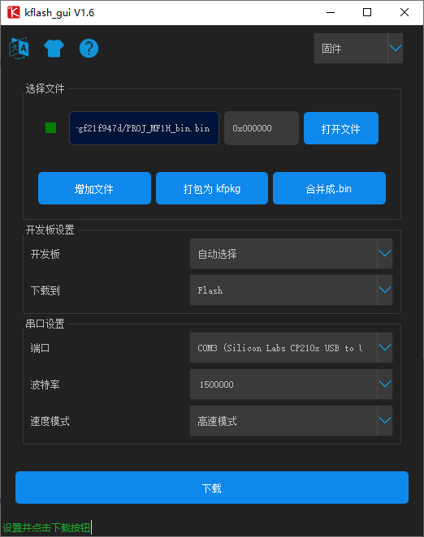

# MF 固件相关升级说明

在使用 **MF 人脸识别模块**过程中，如果存在固件存在 bug、有新功能固件 release、误擦除固件、字体资源、图片资源，那么就需要通过烧录还原固件。

## MF 人脸识别模块固件、资源说明

**MF 人脸识别模块** 固件、字体资源、图片资源、说明如下：

| 类型     | 烧录地址 | 长度  | 说明 |
| -------- | -------- | ----- | ---- |
| 固件     | 0x000000 |       |      |
| 人脸模型 |          |       |      |
| 字体资源 |          |       |      |
| 图片资源 |          |       |      |
| 板级配置 | 0x7FF000 | 4 KB  |      |
| 人脸信息 | 0x800000 | 64 KB |      |
|          |          |       |      |

> 一般开发者在拿到 MF 模块之后，不需要关心该资源分布

- MF 固件说明

| 固件分类        | 方向       | 协议     | 识别方式 | wechat | 固件类型数量 |
| --------------- | ---------- | -------- | -------- | ------ | ------------ |
| MF0 体验版模块  | 横版, 竖版 | bin      | vis      |        | 2            |
| MF1 离线版模块  | 横版，竖版 | bin/json | vis+ir   |        | 8            |
| MF1_to_MF2  | 横版，竖版 | bin/json | vis+ir   |        | 8            |
| MF2 微信半成品  | 横版，竖版 | bin      | vis      | 支持   | 2            |
| MF4 微信 (成品) | 竖版       | bin      | vis      | 支持   | 1            |
| MF5 微信 (成品) | 竖版       | bin/json | vis      | 支持   | 2            |

- 字体资源
- 图片资源
- 清除配信息

## MF1 固件烧录(升级，还原出厂配置)步骤

在使用 **MF 人脸识别模块**过程中，如果存在固件存在 bug、有新功能固件 release、误擦除固件、字体资源、图片资源，那么就需要通过烧录还原固件。

烧录步骤：

1. 烧录 key_gen.bin 获取 key

2. 通过 support@sipeed.com 获取模型文件

3. 烧录模型文件

4. 烧录图片，字体资源，

### 准备：

在升级，还原出厂配置**MF 人脸识别模块** 之前我们需要准备软硬件。

**硬件准备：**

 - **MF 人脸识别模块**

 - USB Type-C 数据线

**软件准备：**

  - 烧录软件： kflash_gui(这里使用 kflash_gui v1.6.5 版本)

    下载链接:
    - Github: [kflash_gui](https://github.com/Sipeed/kflash_gui)
    - Sipeed: [Sipeed 官方下载站 - kflash_gui](https://dl.sipeed.com/MAIX/tools/kflash_gui/kflash_gui_v1.6.5)

  - 烧录资源文件(根据情况烧录)：**MF 人脸识别模块固件**、算法模型文件、字体资源文件、图片资源文件

    资源文件获取统一发送邮件到: Email: Support@sipeed.com

      推荐发送邮件格式如下:

      > 问题类型: [MF 固件资源获取/（简短描述你的问题）]
      >
      > 使用硬件/固件版本: [MF0/MF1/MF2/MF4/MF5(这里标注使用的究竟是哪个模块、产品)]
      >
      > 内容: [最新固件获取/固件丢失/模型丢失(描述相关情况)]
      >
      > 机器码: [xxxxxxxxxxxxxxxxxxxxx(只有模型丢失时需要)]

### 烧录固件,资源文件

使用USB Type-C 数据线 将**MF 人脸识别模块** 连接 电脑

打开 Kflash_gui 选择需要烧录的文件，选择版型(默认选择`自动选择`， 如果烧录失败则选择 `MaixDuino`)，选择串口号(CH522 有两个串口，失败则尝试另外一个)，配置波特率(默认选择 `150000`, 如果烧录失败则适当减低波特率,如 `115200`)

## 怎么获取 Key(机器码)

在使用过程中,如果模块的模型丢失或需要更换,需要发送 `Key` 到 <Support@sipeed.com>

推荐发送邮件格式如下:

首先下载 [key_gen.bin](https://fdvad021asfd8q.oss-cn-hangzhou.aliyuncs.com/Sipeed_M1/firmware/key_gen_v1.2.bin)

使用 `kflash_gui` 将固件 `key_gen.bin` 烧录到模块中之后,打开串口,波特率为`115200,8,N,1`

> **[kflash_gui](https://github.com/Sipeed/kflash_gui/releases)** 为 K210 固件烧录工具, 源码: [**Sipeed/kflash_gui**](https://github.com/Sipeed/kflash_gui)

建议使用 [`XCOM`](tools/XCOM_V2.6.exe) 来看串口信息

轻点 `DTR` ,再松开,即可使模块复位,看到启动信息

## MF 固件横竖版说明

由于采用的摄像头成像方向不同，相差 90度，摄像头寄存器无法配置旋转（软件旋转降低效率），故有横竖版两种固件；

如何确认摄像头对应的固件：（通过摄像头丝印区分）

| 横板 | 竖版 |
| --- | --- |
|  |  |
