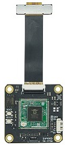
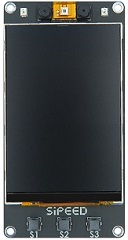

> 本产品不对个人技术支持，个人需求请购买 [M1s 模组](./../../maix/m1s/m1s_module.md)

## 产品概述

MF-ST40 人脸识别模组基于博流 BL808 芯片设计，模组内部预留了 WIFI 功能、 SPI 屏幕接口、多路 UART 接口和 RTC 电路，较大地提高了用户整机产品的集成度。

购买链接：[淘宝](https://item.taobao.com/item.htm?id=690754113762)

---

产品图片：

<table>
    <tr>
    <th align="center">模组图片</th>
    <th align="center">演示机图片</th>
    </tr>
    <tr>
    <td>
    <table>
        <tr>
        <td align="center">正面图</td>
        <td align="center">背部图</td>
        </tr>
        <tr>
        <td></td>
        <td></td>
        </tr>
    </table>
    </td>
    <td>
    <table>
      <tr>
      <td align="center">正面图</td>
      <td align="center">背部图</td>
      </tr>
      <tr>
      <td></td>
      <td></td>
      </tr>
    </table>
    </td>
    </tr>
<table>

## 关键特性

- 主处理器：博流 808 双核 AI 芯片
- 核心算法：活体人脸识别
- 识别距离：0.35-0.9m
- 识别速度：上电到解锁 1.0 秒内
- 识别角度：H50° V70°
- 识别环境：无环境光也可以识别
- 功耗：单次解锁 0.36mWh
- 兼容主流锁孔、可选电子猫眼、可选音视频对讲
- 应用：门锁、考勤机、其他人脸识别终端产品

## 相关资料

详细说明请查阅下方的 [规格书](https://dl.sipeed.com/shareURL/MaixFace/MF-SF40/1_Specification)

- [规格书](https://dl.sipeed.com/shareURL/MaixFace/MF-SF40/1_Specification)
- [原理图](https://dl.sipeed.com/shareURL/MaixFace/MF-SF40/2_Schematic)
- [点位图](https://dl.sipeed.com/shareURL/MaixFace/MF-SF40/3_Bit_number_map)
- [尺寸图](https://dl.sipeed.com/shareURL/MaixFace/MF-SF40/4_Dimensional_drawing)
- [3D 模型文件](https://dl.sipeed.com/shareURL/MaixFace/MF-SF40/5_3D_file)
- [芯片手册](https://dl.sipeed.com/shareURL/MaixFace/MF-SF40/6_Chip_Manual)

## 注意事项

<table>
    <tr>
        <th>项目</th>
        <th>注意事项</th>
    </tr>
    <tr>
        <td>静电防护</td>
        <td>请避免静电打到 PCBA 上；接触 PCBA 之前请把手的静电释放掉</td>
    </tr>
    <tr>
        <td>容忍电压</td>
        <td> 每个 GPIO 的工作电压已经在原理图中标注出来，请不要让 GPIO 的实际工作的电压超过额定值，否则会引起 PCBA 的永久性损坏 </td>
    </tr>
    <tr>
        <td>FPC 座子</td>
        <td>在连接 FPC 软排线的时候，谲确保排线无偏侈地完整地插入到排线中</td>
    </tr>
    <tr>
        <td>插拔</td>
        <td>请完全断电后才进行插拔操作</td>
    </tr>
    <tr>
        <td>避免短路</td>
        <td>请在上电过程中，避免任何液体和金属触碰到 PCBA 上的元件的焊盘，否则会导致路，烧毁 PCBA</td>
    </tr>
</table>

## 技术支持

MF-ST40 为商业合作产品，不对个人用户进行技术支持，个人用户建议使用 [M1s 模组](./../../maix/m1s/m1s_module.md)。
联系邮箱: `support@sipeed.com`