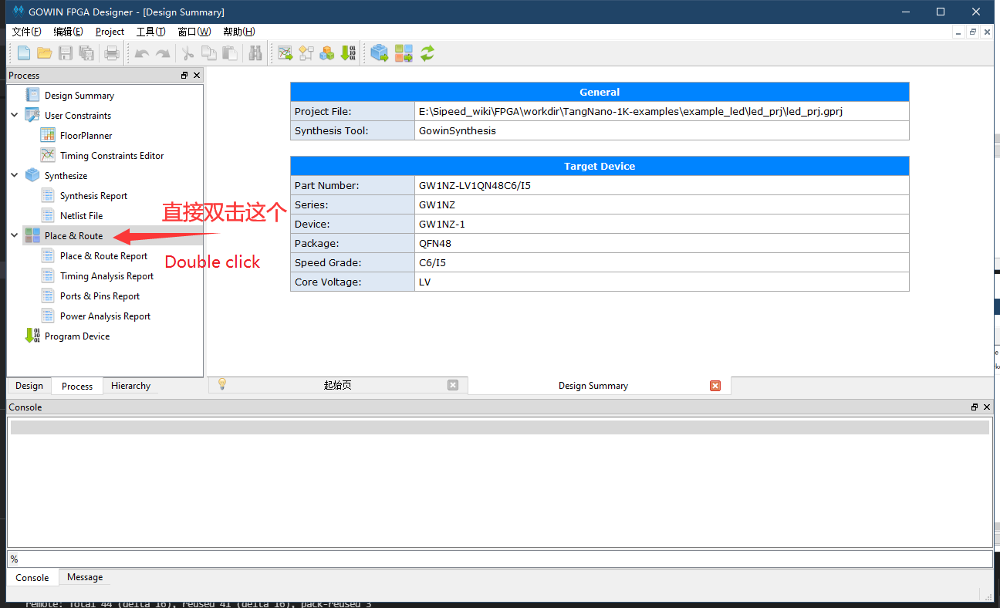
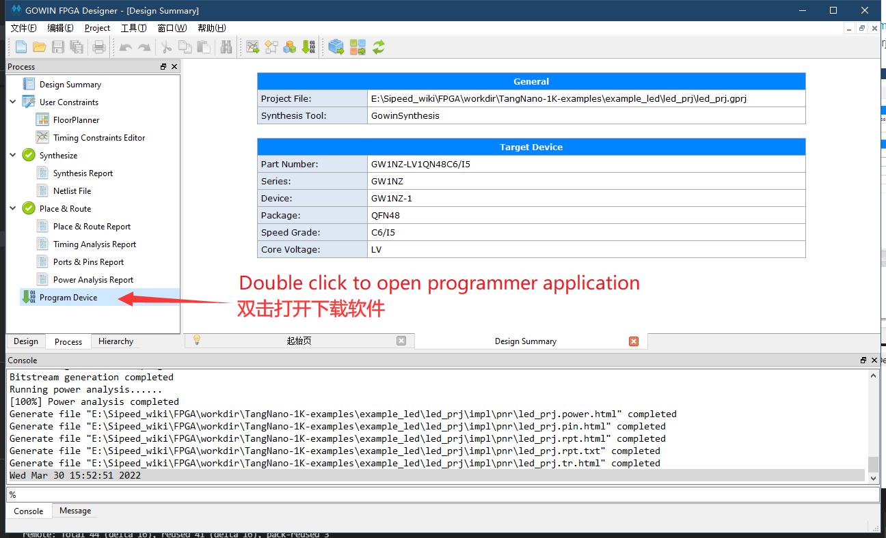
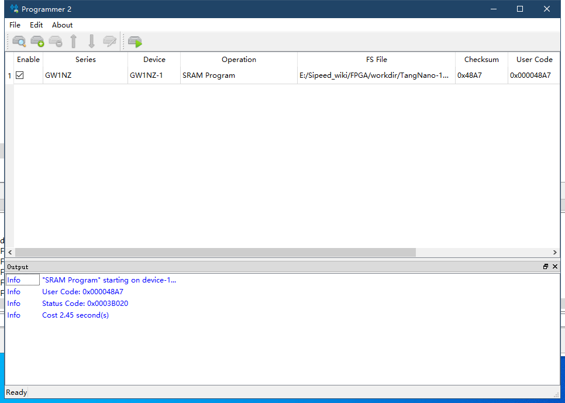

- 首先获得仓库文件 https://github.com/sipeed/TangNano-1K-examples

- 打开 TangNano-1K-examples\example_led\led_prj 目录下的 led_prj.gprj 文件
  
- 在process界面直接双击  Place&Route
    
    
- 然后是进行连接板子，烧录固件。在Process界面双击`Program Device` 后打开烧录工具
    

- 接下来选择sram烧录即可验证程序。
    

    <a href="#" onClick="javascript :history.back(-1);">返回上一页(Back)</a>

