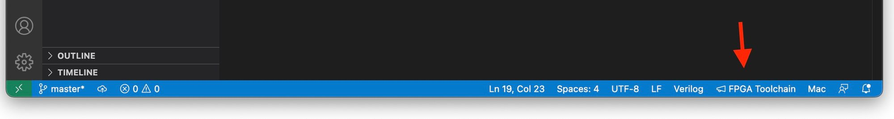
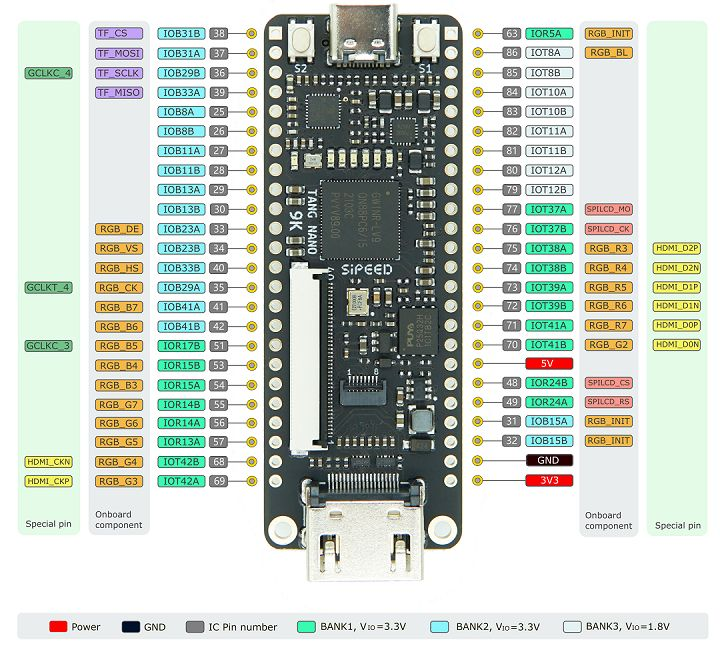
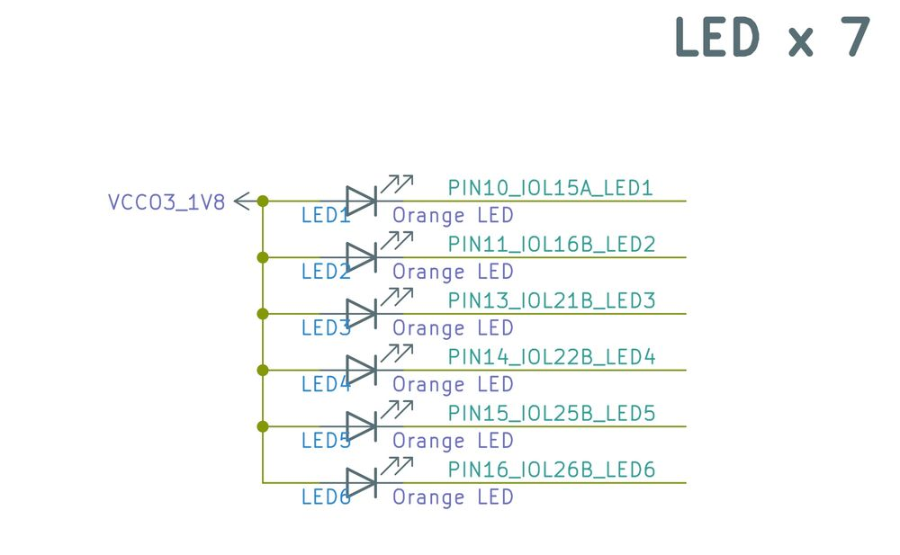
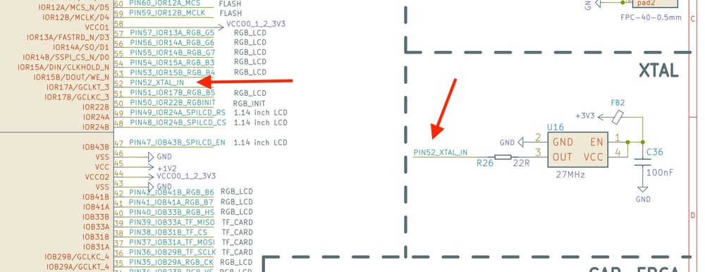
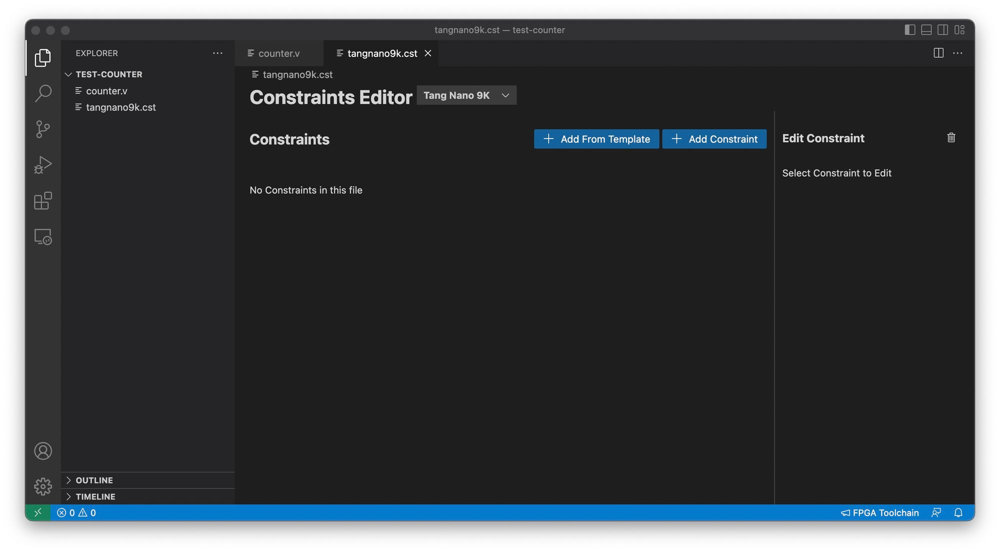
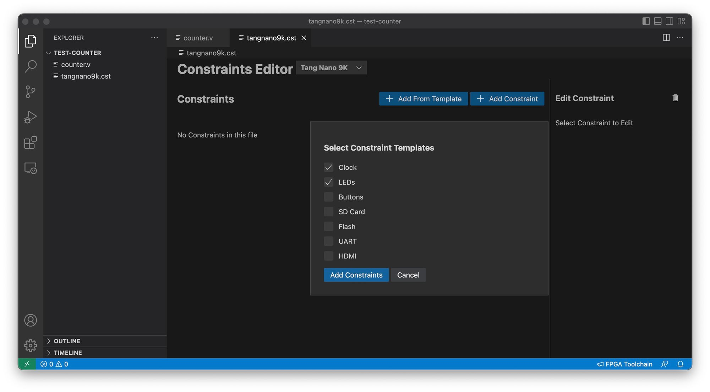
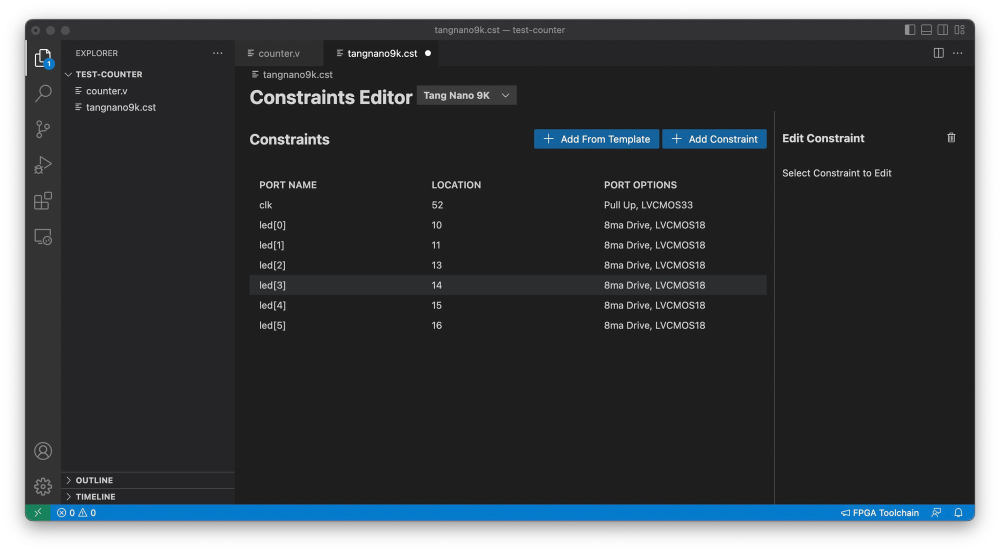
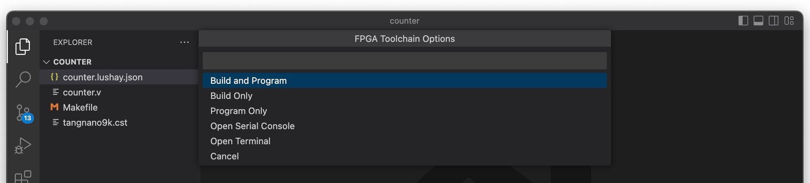
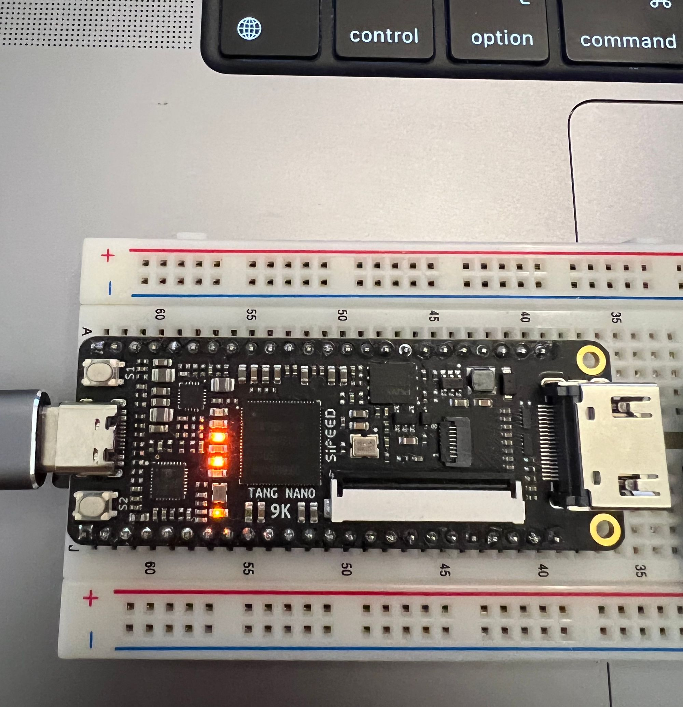

原文链接：[https://learn.lushaylabs.com/tang-nano-series/](https://learn.lushaylabs.com/getting-setup-with-the-tang-nano-9k/)

In this article we will be going over how to get started developing for the Tang Nano FPGA using a fully open source toolchain. We will start with an overview of FPGAs and the toolchain required to develop them, we will then go through setting up your development environment and finish off with a simple example so we can test and verify that everything is working.

## What's an FPGA ?

An FPGA is a type of IC that you "program" with digital hardware circuits as apposed to microcontrollers or CPUs that you program with software. A CPU has a fixed internal architecture and only understands how to process its own machine codes / assembly language. Developers then compile programming languages into these machine codes and the CPU will run them as it goes through the code. 

With FPGAs the internal architecture is a blank canvas, you can choose to create a CPU type architecture and design your own assembly language if you like - there are even open-source architectures like RISC-V - but you can also decide to custom build your own application specific circuit (ASIC) developing your application in hardware instead of software.

A general purpose CPU is convenient in the sense that one design can be used to perform a lot of different tasks - its general purpose - but the downside is its not very efficient for any specific task. Take for example a single-core 2 ghz CPU, even though the clock pulses 2 billion times per second it doesn't mean you can actually do 2 billion things in your application. Each line of code will get converted to many assembly instructions, each of which will be handled serially - one at a time - and each can take multiple clock cycles. Modern CPUs try to pipeline or parallelize these multiple clock cycles but for the most part you have a lot of overhead. Add on top of that you usually have other things that are running like an operating system which also are scheduled and take clock cycles. 

On the other hand with FPGAs you are programming your application in hardware, you can react to every clock pulse directly. There is no central processing unit, each part of the application can be handled in parallel, so not only do you actually get the full clock speed, but you get the effect of having as many parallel cores as needed.

This also means that with a microcontroller for example, each extra operation that you would like to add to your application will negatively effect all the current operations since they are all fighting for the same resources. In an FPGA - unless you specifically want it to block - adding new cores / applications to your FPGA has no effect on the existing cores as they are completely separate hardware.

So how does it work ? How can an FPGA dynamically reprogram its internal hardware ? 

At its core an FPGA is made up of lookup tables, flip-flops and multiplexers. A lookup table can be thought of as a reconfigurable logic gate, its a prebuilt table where for each set of inputs there is a predefined output. For example a lookup table for an AND gate would look something like this:

AND Gate:
<table>
<tbody>
    <tr>
        <th>Input 1</th>
        <th>Input 2</th>
        <th>Output</th>
    </tr>
    <tr>
        <td>0</td>
        <td>0</td>
        <td>0</td>
    </tr>
    <tr>
        <td>1</td>
        <td>0</td>
        <td>0</td>
    </tr>
    <tr>
        <td>0</td>
        <td>1</td>
        <td>0</td>
    </tr>
    <tr>
        <td>1</td>
        <td>1</td>
        <td>1</td>
    </tr>
</tbody>
</table>

Usually the lookup tables (LUTs) in an FPGA have more inputs and outputs so they are a bit bigger, but by being able to reprogram these tables you can change the AND gate into an OR gate as follows:

OR gate:
<table>
    <tbody><tr>
        <th>Input 1</th>
        <th>Input 2</th>
        <th>Output</th>
    </tr>
    <tr>
        <td>0</td>
        <td>0</td>
        <td>0</td>
    </tr>
    <tr>
        <td>1</td>
        <td>0</td>
        <td>1</td>
    </tr>
    <tr>
        <td>0</td>
        <td>1</td>
        <td>1</td>
    </tr>
    <tr>
        <td>1</td>
        <td>1</td>
        <td>1</td>
    </tr>
</tbody>
</table>

So as you can see in this example by just changing two of the outputs you "changed" the internal hardware from an AND gate to an OR gate.

Combine these reprogrammable gates with flip-flops which allow for storing data and multiplexers which allow for routing connections and you have a method of dynamically "programming" the internal electrical circuit.

This is a bit of a simplified view, usually FPGAs also come with built in memory/ram, DSPs or even dedicated math functions but at a high level I think the parts that LUTs, flip-flops and multiplexers are the core.

## Tang Nano 9K

In this series we will be focusing on the Tang Nano 9K FPGA development board (<a href="https://item.taobao.com/item.htm?id=666055424174">available in our store</a>) which includes an FPGA from Gowin's LittleBee family the GW1NR-9. This board IMHO currently provides the best bang for your buck both in terms of the FPGA itself number of LUTs / Flip-flops / ram and also the development board exposes a good number of IOs and has on-board LEDs, buttons and a built-in UART debugger and other peripherals. The open-source toolchain support is also very good supporting all the features we will be using.

Open source toolchain Supported Features by FPGA family：


For all these reasons, and because of its relatively low price the tang nano 9K has been chosen for this series.

## The Programming Process

The process of programming your own core onto an FPGA goes through 3 stages:

<ol><li>Synthesis</li><li>Place and Route</li><li>Bitstream Generation</li></ol>

### Synthesis

The first step is to take a design written in an HDL (Hardware description language) like Verilog and convert it into primitives which make up the FPGA.

In verilog you write your program in terms of modules with registers / connections and logic gates you also have abstractions like conditional statements or math operations. The job of the synthesis tool is to take all this and convert it to primitives like LUTs and flip-flops.

### Place and Route

Once you have a list of connections and FPGA primitives from the synthesis stage the next step - like the name suggests - is to map each of the primitives to their physical counterpart. Like to map each of the generated look up tables to one of the physical 8640 internal luts.

This step must take into account all the routing requirements when selecting where to place each component, the output of this stage is similar to the output of the synthesis stage, except each of the components are physically mapped.

### Bitstream Generation

The third and final step is generating the bits required so that the FPGA itself understands the layout the the place and route stage generated. Each FPGA manufacturer has their own internal format which open-source toolchains need to reverse engineer in-order to understand the exact format required to program the FPGA.

After running these three stages you will have a file which can be programmed onto the FPGA which will reconfigure the internal hardware to match your design

## The Open-Source Toolchain

The open source toolchain is a collection of open-source tools for each of the steps mentioned in the previous section. We have Yosys for synthesis, NextPnR for placing and routing and Apicula which reverse-engineered the Gowin architecture and provides the bitstream generation tools. We will also be using openFPGALoader for programming the final bitstream onto the FPGA.

We recommend setting up the toolchain with OSS-CAD-Suite and our VS code extension. OSS-CAD-Suite is a project maintained by the yosys team which provides pre-built binaries for MacOSX, Windows and Linux. Our extensions is a wrapper around these pre-built binaries allowing you to visually configure and run the OS toolchain.

> If you would prefer to install and use the toolchain manually we have the instructions for that <a href="https://learn.lushaylabs.com/os-toolchain-manual-installation/">here</a>.


The first step to get this setup is to download and install Visual Studio Code:

### VSCode

This is a popular lightweight cross-platform editor with many plugins some of which specifically for FPGA development. The editor itself can be downloaded from <a href="https://code.visualstudio.com/">here</a>.

Once installed, you can open it up and go to the Extensions tab to install plugins. To install our plugin you can search for "Lushay Code" or by going to the following <a href="https://marketplace.visualstudio.com/items?itemName=lushay-labs.lushay-code&amp;ssr=false">link</a>. 

Besides for that we also recommend these two plugins, although not mandatory we find these useful.
1. <a href="https://marketplace.visualstudio.com/items?itemName=mshr-h.VerilogHDL">Verilog-HDL/SystemVerilog </a> - provides syntax highlighting support for Verilog
2. <a href="https://marketplace.visualstudio.com/items?itemName=wavetrace.wavetrace">WaveTrace</a> - provides built in waveform viewing which can be used for debugging.

With VsCode and the 3 extensions installed the next thing we need is OSS-Cad-Suite, you can find the latest version download from <a href="https://github.com/YosysHQ/oss-cad-suite-build/releases">here</a>.

On the release page there are several different versions depending on your OS and CPU architecture. For OS, linux and windows are just called windows and linux, and for MacOSX you need the darwin version. Next you have the architecture, usually either arm or x64, arm is for apple silicon or an arm-based linux, x64 is for a standard intel / amd cpus.

Download the file for your OS and then extract it somewhere you should now have a folder called `oss-cad-suite` on your computer. Place this folder wherever you want to keep the toolchain. It is worth noting on windows you don't download a zip but rather a self-extracting executable, but it is the same, you just double click it to extract it as a folder called `oss-cad-suite`.

With the folder ready open up VSCode and click on the button on the bottom right hand side called "FPGA Toolchain":



You should receive a popup that says the OSS-CAD-Suite path is not setup, click on the "Setup Now" button and a file browser will appear, you need to select the OSS-CAD-Suite folder we just extracted you should select the actual folder called `oss-cad-suite` (the one with the `bin` folder inside).

Once selected you have successfully setup the toolchain.

### Ubuntu USB Permission Fix

On Ubuntu you will need to give permissions to you user so that we can run openFPGALoader without being root. To do this you need to run the following from a terminal:

```bash
curl -sSL https://raw.githubusercontent.com/lushaylabs/openfpgaloader-ubuntufix/main/setup.sh | sh`
```

And then once completed you will need to log-out and log back in so that the user permissions take effect and you will need to unplug and replug in the tang nano board.

### Windows USB Driver Fix

On windows the default driver does not work with `openFPGALoader` so to get it to work we need to replace the default driver. To do this you need a program called Zadig which can be downloaded <a href="https://zadig.akeo.ie/">here</a>.

Download the tool and then open it up, once open you need to select "Options" &gt; "List All Devices" from the top menu to show all connected usb devices. Next in the dropdown you should see two devices:

1. JTAG Debugger (Interface 0)

2. JTAG Debugger (Interface 1)

Interface 0 is the JTAG interface `openFPGALoader` needs to program the Tang Nano while Interface 1 is the serial interface used for the UART communication. 

It is important to leave interface 1 as-is and only replace interface 0 here.

So select "JTAG Debugger (Interface 0)" and underneath you should see it show that it will change the driver to "WinUSB" if WinUSB is not selected you can use the up/down arrows to select it.

Once selected just the replace driver button and wait a minute or two, once done it should work in openFPGALoader.

If you ever want to uninstall this driver and go back to the default driver (for example to use the official gowin IDE) all you have to do is go to "Device Manager" select the device called "JTAG Debugger" under "Universal Serial Bus devices" right-click on it and press "uninstall device" from the popup also select the checkbox to attempt to remove the driver. Once removed right click on any item in the device manager window and press "Scan for hardware changes" this should reconnect the device back with the original driver.

## Other Recommended Software

Besides for the toolchain itself there is some other software which can aid in the development of FPGA cores, and will be used throughout this series.

### Node.js

During the course of development you may find yourself needing to prepare / convert data or even communicate with the FPGA from your computer. Node.js is just my personal preference and is what I will be using in this series, but any programming language will probably have a way to do the same things if you have a different preference.

To install node.js you can either grab the official installer from the <a href="https://nodejs.org/en/">node.js site</a> or install using a node version manager like so:

**Mac / Ubuntu / Windows WSL**

```bash
curl -o- https://raw.githubusercontent.com/nvm-sh/nvm/v0.39.1/install.sh | bash
nvm install v17.0.1
nvm use v17.0.1
nvm alias default v17.0.1`
```

### Tabby

Tabby is a cross-platform terminal which has support for serial terminal which will allow us to communicate over UART with the tangnano9k. Here as-well it is a matter of personal preference, I chose to mention tabby since it supports all operating systems and has some extra features like choosing how the data will be read / shown (ascii, hex) and each side can be configured independently.

Tabby can be downloaded <a href="https://tabby.sh/">here</a>

If you only need basic serial support, the Lushay Code extension comes with a basic built-in serial console. But I still recommend Tabby since the extra features can be nice.

## Creating a New Project

We should now have everything we need to effectively develop an FPGA core. To get started open up your editor (VSCode), from the explorer tab you will have a button to open a folder, click it to choose a new directory that we can use for this project. 

Once inside you should see your folder in the explorer tab and we can now create some files.

Every FPGA project needs at least two files:
1. A file that describes your circuit (in our case a verilog `.v` file)
2. A file that describes the connection between your circuit and your physical board. (in our case a physical constraints `.cst` file)

Verilog is an HDL language which is what get's synthesized. Inside the code you will usually want to use specific pins from the actual FPGA, to do this in verilog you create a name for the pin (it can be whatever you want), and then in the `.cst` file you define the mapping of pin name to pin along with other configuration for the pin.

So let's start with a simple example which display a binary counter using the on-board LEDs.

Now onboard we have 6 leds and if each will represent one bit in our counter then it means we can count up from 0 to 63 (binary `111111`). Now our onboard clock frequency is 27 Mhz so counting up every clock pulse would mean the counter would cycle through all the options 428 million times a second, t0o fast to be able to see the counting. So let's say we want it to count once every half a second. Then we would need to wait 13,500,000 clock cycles between incrementing the counter.

We can also say that our counting module will require the clock signal on-board as input since we will need it to react to clock cycles and we know we want our output to be the status of the 6 leds.

So now that we have a general plan, let's create a verilog file called `counter.v` and we can start off with what we know.

```v
module top
(
    input clk,
    output [5:0] led
);

localparam WAIT_TIME = 13500000;
reg [5:0] ledCounter = 0;

endmodule
```

This code defines a new module called top with an input called `clk` for the clock signal and 6 outputs called `led`. Again the names here for the inputs and outputs will be mapped to actual pins in the `.cst` file later, so the names can be anything you like.

The format for defining an array's size or accessing a group of bits in general is `[MSB:LSB]` which is why 6 bits can be represented as `[5:0]` meaning bit 5 is the most significant bit and bit 0 is the least significant bit, totaling 6 bits.

The next line defines a local constant which will be used at compile time, we have already calculated that we will need 13.5 million clock cycles per counter increment in-order to reach the desired half second delay.

The final line is our actual counter again using the same notation with the `[5:0]` to say it will be a 6 bit wide register.

We will also need a counter for the clock cycles. Looking at the binary representation of 13,500,000 we see it needs 24 bits to contain so we can create a counter with the signature `[23:0]` for 24 bits.

```v
reg [23:0] clockCounter = 0;
```

The next thing we need to do is increment our counters on every clock pulse. This can be done with an `always` block:

```v
always @(posedge clk) begin
    clockCounter <= clockCounter + 1;
    if (clockCounter == WAIT_TIME) begin
        clockCounter <= 0;
        ledCounter <= ledCounter + 1;
    end
end
```

The always block starts with it's trigger list or sensitivity list. Essentially what needs to happen for the circuit defined inside to occur. In our case we are saying whenever there is a positive edge on the clock pin (a.k.a clock rise) we want the following to happen.

First we will increment the clock counter and then check if we have reached the wait time defined above. If we have reached the wait time then we would like to reset the clock counter to zero and increment the led counter.

We don't need to deal with ever resetting the led counter as it has exactly the number of bits as the desired counter so it will automatically roll over back to 0 once it increments 63. 

It is also worth noting that the `&lt;=` operator is not like a standard assignment operator from most programming languages. This operator sets the value for the input of the flip-flop which will only propagate to the output on the next clock signal. This means that even though we increment it on the first line of the block, the value of `clockCounter` will only equal 1 on the next clock pulse, and for the remainder of the current block the value will still be 0. Same thing when we increment the ledCounter, The change will only be seen on the next clock signal.

There is a way to immediately assign a value using the blocking `=` operator instead, but I like to stick only with the non-blocking assignment operator `&lt;=` when working with registers, both for simplicity, consistency and I think it is a better practice.

The last and final thing to finish our verilog module is to connect the value of our register to the leds.

```v
assign led = ledCounter;
```

Outside the always block we use the `assign` and `=` to define the value of wires. Wires (which is the default input/output type) unlike registers don't store values so we need to simply define what they are connected to and they will always equal that value (since they will be physically connected to them).

The final code should look like the following:

```v
module top
(
    input clk,
    output [5:0] led
);

localparam WAIT_TIME = 13500000;
reg [5:0] ledCounter = 0;
reg [23:0] clockCounter = 0;

always @(posedge clk) begin
    clockCounter <= clockCounter + 1;
    if (clockCounter == WAIT_TIME) begin
        clockCounter <= 0;
        ledCounter <= ledCounter + 1;
    end
end

assign led = ledCounter;
endmodule
```

The next file we need to create is the `.cst` file where we will need to define the I/Os we used `clk` and `led`. First we will take a look at doing it manually so you can get a sense for how it works under the hood, and then we will take a look at doing it through our VScode extension.

To do this manually we need to know some information about the pins. First of all we need to know the pin number. For the GPIO of the board its pretty easy, all the pins are listed in the following image:



So for example the top left pin's number is 38 (IOB31B) and the top right pin (IOR5A) is pin 63, and so on. It's worth noting also that most GPIO are 3.3V but to pay attention that all the BANK3 pins (pin 79-86) are 1.8V pins and should only be used with devices or sources working with 1.8v.

But with all that said, in our example we are not using any of the GPIO pins we are using pins of the FPGA which are routed to on-board components (the clock and LEDs).

Tang Nano 9K Schematic: [Click me](https://dl.sipeed.com/shareURL/TANG/Nano%209K/2_Schematic)

Opening up the file we can see a section called "LED x 6" defining how the 6 LEDs are connected.



A side note - something thing that can be seen here is that the LEDs are common anode all being supplied power directly from the 1.8 voltage source which means we need to pull our pin down to low (0) in order for the led to light up.

But back to what we are looking for. We see the names defined to the connections and then we can see where these references end up on the actual FPGA chip. Above this section we have the FPGA chip itself and we can see they end up as part of bank 3's pins:


More specifically we can see they are pins 10,11,13,14,15,16. Using the same process we can find the clock pin in the xtal (crystal oscillator) section.



Showing that the pin is pin 52.

With that mini investigation complete we would need to create a cst file where we would define the pins like so:

```v
IO_LOC "clk" 52;
IO_PORT "clk" PULL_MODE=UP;
IO_LOC "led[0]" 10;
IO_LOC "led[1]" 11;
IO_LOC "led[2]" 13;
IO_LOC "led[3]" 14;
IO_LOC "led[4]" 15;
IO_LOC "led[5]" 16;
```

IO_LOC defines a location constraint, meaning we are defining that when placing and routing our design the io called clk must be placed on a specific pin defining its specific location.

IO_PORT defines port level constraints like pull ups / pull downs, logic types drive strength etc.

Going through our file we define `clk` to be pin 52 with a pull up resistor, and we are defining the 6 bits of our `led` output using the pin numbers we found. 

It's worth noting we are adding the bit index to them only for convenience so that we can receive them all together instead of 6 separate outputs in verilog. But if we wanted we could have written `IO_LOC "led1" 10;` and then in verilog have each LED as a separate output. 

You can view a little bit more information about this format from the official physical constraints document from Gowin Appendix A.

[Gowin Appendix A](http://cdn.gowinsemi.com.cn/UG289.pdf)

Or more in-depth by searching for the system IO and GPIO specification documents if you would like a more in-depth read. To some extent you can also view some of the options in the apicula longvals documentation <a href="https://github.com/YosysHQ/apicula/blob/master/doc/longval-tables.md">here</a>.

### Constraints with LushayCode

With the extension simply create a new file in vscode for example `tangnano9k.cst` and clicking on it you should see something like the following:



Since both the LEDs and the clock are part of the development board they have an included template, so we can simply press "Add From Template" and select both the clock and leds.



Clicking on "Add Constraints" will add them to the current file and you will see them in the table:



Just save the file and we are done with the constraints. You can see that the pin numbers are the same as we saw when doing the manual investigation.

## Running the Example

Our project is now ready so how do we compile it with the toolchain. To do this you can click again on the "FPGA Toolchain" button from our VSCode extension and you should get a dropdown with the different options:



Select "Build and Program" and if all went well you should now see the tangnano counting up over it's LEDs.



The only thing is that the counter is inverted. This is due to the fact that the LEDs use a common anode and a value of 0 means to light up not a value of 1. To fix this we can make a small change to our code.

To update the verilog code in our example invert the counter so that the leds match the bit status using the `~` operator. The final line of our module should be:

```v
assign led = ~ledCounter;
```

Re-click on "Build and Program" from the "FPGA Toolchain" button to rebuild and program the FPGA with our fix.

## Conclusion

In this article we went through a lot of different topics getting the development environment setup and running a basic example. In the next part of this series we will go more in depth on debugging FPGA projects in-order to visually see what's going on internally.

All the code from the example is also available on in lushaylabs github repo <a href="https://github.com/lushaylabs/tangnano9k-series-examples">here</a>. And if you have any questions or comments feel free to leave them below or contact me on twitter <a href="https://twitter.com/LushayLabs">@LushayLabs</a>.