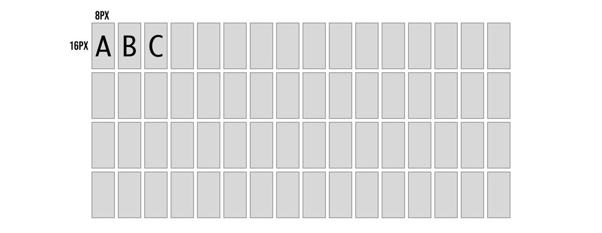
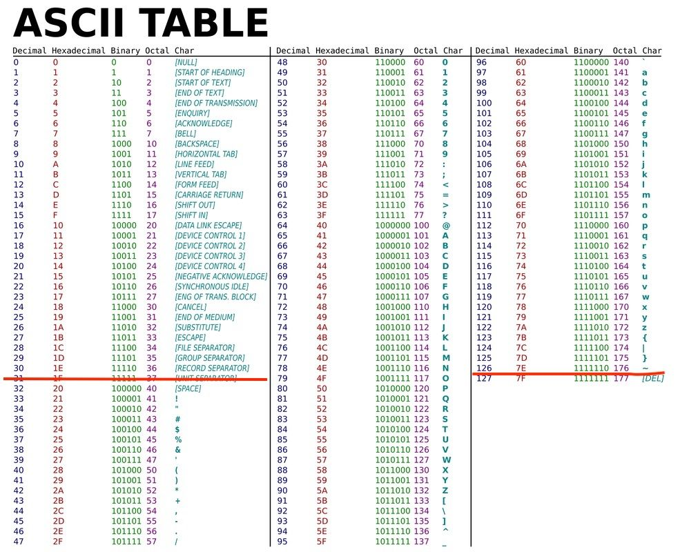
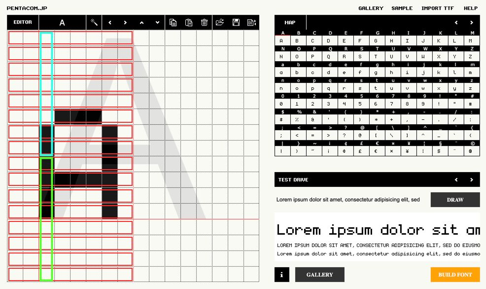
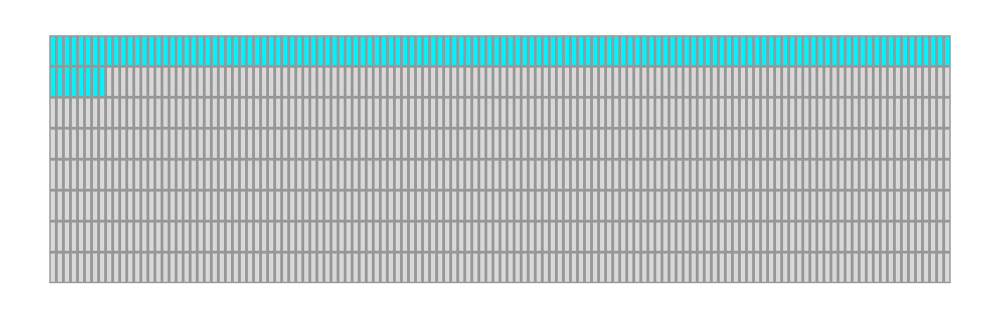
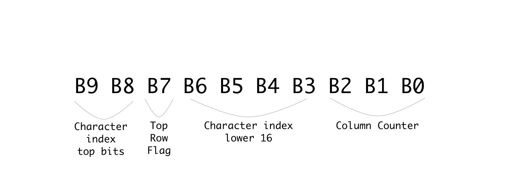
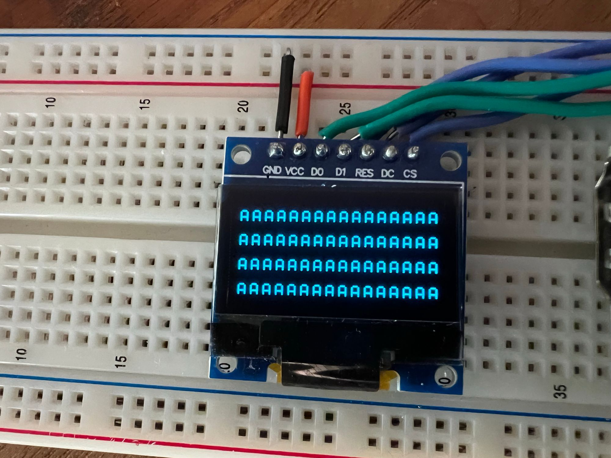
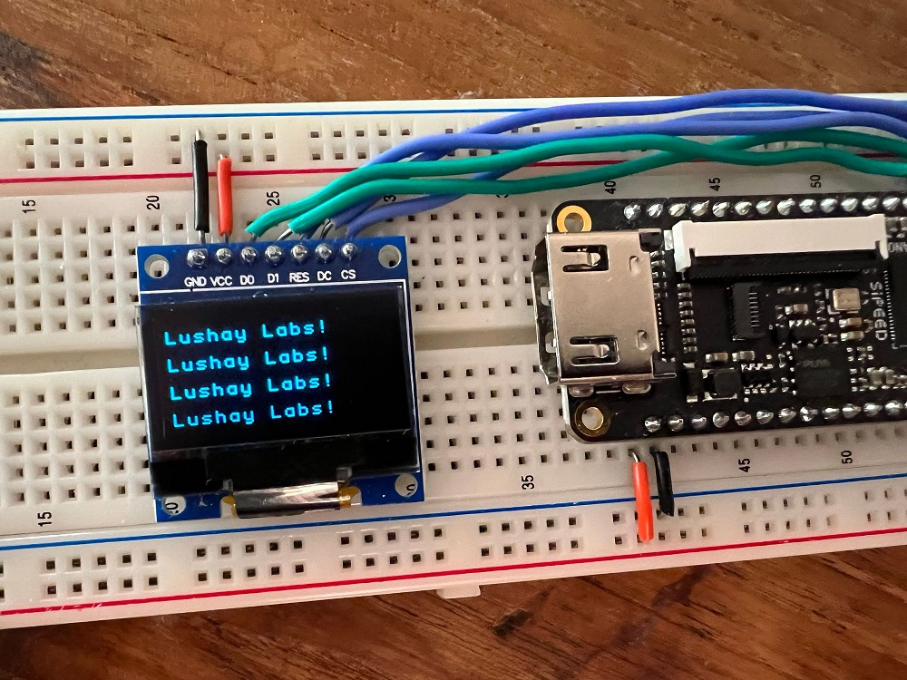

[原文链接](https://learn.lushaylabs.com/tang-nano-9k-creating-a-text-engine/)

In the previous article ([here](./../3_oled_101/oled_101.md)) we developed a screen driver core which allows us to render pixels onto an OLED screen. In this article we will be building a text engine on top of our pixel driver to give us an easy abstraction for rendering text to pixels.

## Drawing Text

In-order to draw text we need two things:
1. a way to map characters to screen pixel positions 
2. some conversion between letters and pixels or how the letters look.

For mapping characters to the screen we can decide on any arbitrary mapping, our OLED panel is 64 pixels tall and we store data in 8 bit vertical bytes so to make things easy we can say we have 8 rows to work with. Going smaller than this means that a single byte update to the screen may contain multiple rows of text which would complicate the design a bit. Even 8 rows would make the text pretty small, so for our example let's divide the screen into 4 rows of text this would mean that each character could be up to 16 pixels tall.

As for the width of each character we have a total of 128 pixels so if we make each character 8 bits wide we can store a maximum of 16 characters per row.



So now with the mapping decided on, if we wanted to put the letter D in the 4th character position on the first row we know the top row of the character is 8px * 4th character maps to pixel columns 31-39 and the bottom row is pixel columns 159-167 (add 128 since we need to go down one full line). Each character will be drawn in two OLED pixel rows where in each row we update 8 of the 16 vertical pixels in a column. 

We now know which columns to put the letter D in now but what is the actual column of pixels we would like to send to draw the letter D. We need to decide on how the characters look to know how which pixels need to light up.

## Designing the Letters

A computer knows how to render letters by using font files. Fonts can either be vector fonts where the contents describe vectors to recreate the letter's shape at any size, or they can be bitmap fonts (pixel fonts) where we store a pixel representation of each character at a specific size / sizes.

To keep things simple let's use the bitmap option so we don't have to calculate vectors, also we are designing for a specific OLED panel with a specific resolution so we don't need the scalability.

Kind of like in the previous example where we drew an image to the screen by storing its pixels into memory here we need to store the pixels for each character into memory. The difference between the two examples is that over there our memory represented the actual screen and stored each individual pixel exactly where it should show up on the screen, we were storing an image.

In the case of our font, we are storing the pixels for each character unconnected to the screen dimensions and positioning, and then the mapping logic we discussed above will be in charge of mapping it to the screen. By having this mapping disconnected we are able to dynamically decide what text to draw to the screen and for example reuse the same letter multiple times.

Luckily we don't need to create these fonts ourselves and pixel font tools like <a href="https://www.pentacom.jp/pentacom/bitfontmaker2/editfont.php?id=4677&amp;ref=lushay-labs">bitfontmaker2</a> have galleries of fonts created by talented designers and artists. We will be using the amazing <a href="https://datagoblin.itch.io/monogram?ref=lushay-labs">monogram font</a> which is created by <a href="https://twitter.com/vmenezio?ref=lushay-labs">Vinícius Menézio (Twitter)</a> and made free to use by him.

**monogram in bitfontmaker2:**


If you choose another font while following along just make sure it fits into our constrains of 16 px height and 8px width, otherwise you will need to adjust our mapping logic.

Exporting a font from bitfontmaker will provide a JSON file where for each ascii code we have an array of numbers. Each number represents a horizontal row of pixels, LSB is the left hand side of the image and starting from the top going down. So for example the bottom of this letter "A" from the image above would be 68 since it is 1000100 in binary again where the LSB (right most bit) is the left most pixel.

## Converting the Font

We have a font JSON file, but the format is not very convenient for us to use as-is. These font files store horizontal rows and we need to send the OLED vertical columns. We can create a small node.js script to remap each horizontal row into 8 vertical columns where we store 2 bytes per column giving us the full 16 pixels.

```javascript
const fs = require('fs');

const bitmaps = fs.readFileSync('./fonts/monogram.json');
const json = JSON.parse(bitmaps.toString());

const memory = [];
for (var i = 32; i <= 126; i += 1) {
  const key = i.toString()
  const horizontalBytes = json[key];
  const verticalBytes = [];

  for (let x = 0; x < 8; x += 1) {
    let b1 = 0;
    let b2 = 0;
    for (let y = 0; y < 8; y += 1) {
      if (!horizontalBytes) { continue; }
      const num1 = horizontalBytes[y];
      const num2 = horizontalBytes[y+8] || 0;
      const bit = (1 << x);
      if ((num1 & bit) !== 0) {
        b1 = b1 | (1 << y);
      }
      if ((num2 & bit) !== 0) {
        b2 = b2 | (1 << y);
      }
    }
    memory.push(b1.toString(16).padStart(2, '0'));
    memory.push(b2.toString(16).padStart(2, '0'));
  }
}
fs.writeFileSync('font.hex', memory.join(' '));
```

We start off by loading the JSON font file and parsing it into a javascript object. We then loop over all the characters codes we want to include, which looking at an ascii table we can see that 32-126 is all the standard visible characters including space.



Inside the outer loop which is iterating over characters, we have a for loop to go over each of the 8 columns, and then a for loop for each column to calculate the two vertical bytes. Inside we focus on a specific bit and go over each horizontal row to build up the vertical column. For example we focus on the 3rd bit in each horizontal row which all-together form the vertical bytes for the 3rd column.



If each of the red boxes is the horizontal rows then the blue box is an example of the top byte for column index 2 and the green box is the second vertical byte for column index 2. After going through all the rows and completing a single column we store the 2 bytes and move onto the next vertical column again going through each of the rows just on the next bit to the right.

We already store the bytes in the `memory` array in hex format so the last line simply needs to save it all to a file, in our example called `font.hex`.

## Designing the Text Engine

Before we start getting into the actual verilog module, let's go over the general plan for how we can implement this.

In the previous article we had a `pixelCounter` register which would go through each of the bytes we needed to update on the screen, and this would act as the address in memory to lookup the relevant byte from our image. There is nothing memory specific though about the implementation. At a high level you can think of it as the screen driver asking for a specific byte by setting the pixel counter (address) and expecting to receive back the byte it needs to send. 

Memory is one way of mapping an address to a byte, but in our case we will implement a custom module which will take this address and dynamically return a byte, "dynamically" creating the image. 

As we saw in the previous article in-order to fully update the screen we need to send it 1024 bytes, which means our pixel counter / address needs to be 10 bits long. For each of the values between 0-1023 we need to know how to decipher: 

1. which text row we are on
2. which character in the row 
3. which column of the character 
4. if we are on the top half of the column or bottom half (again because each vertical column is 16 pixels or 2 bytes).

This can be accomplished using our mapping logic and a little understanding of binary.

## Deciphering the Address

Before we start splitting characters into rows I think it is more convenient to think of all 4 rows as a single 64 character wide array. So for each OLED pixel address we need to think about which character out of the 64 possible character positions it belongs to. 

Looking back at the order the OLED pixel counter updates:



We can see that we go left to right then drop down to the next row, each two rows is one character we know that the character index has to repeat the last 16 indices twice once for the top row and once for the bottom row.

The pattern for character index has to be like the following:

```text
 0,  1,  2,  3,  4,  5,  6,  7,  8,  9, 10, 11, 12, 13, 14, 15,
 0,  1,  2,  3,  4,  5,  6,  7,  8,  9, 10, 11, 12, 13, 14, 15,
16, 17, 18, 19, 20, 21, 22, 23, 24, 25, 26, 27, 28, 29, 30, 31,
16, 17, 18, 19, 20, 21, 22, 23, 24, 25, 26, 27, 28, 29, 30, 31,
32, 33, 34, 35, 36, 37, 38, 39, 40, 41, 42, 43, 44, 45, 46, 47,
32, 33, 34, 35, 36, 37, 38, 39, 40, 41, 42, 43, 44, 45, 46, 47,
48, 49, 50, 51, 52, 53, 54, 55, 56, 57, 58, 59, 60, 61, 62, 63,
48, 49, 50, 51, 52, 53, 54, 55, 56, 57, 58, 59, 60, 61, 62, 63
```

Where each number represents the value for 8 columns. The top row maps to the characters 0-15 then wraps around again to the same numbers to do the bottom row of those characters, then we continue counting the next 16.

To accomplish this we need a sub counter for the 8 columns, which once it completes it increments the character index, then after 16 times increments it repeats the same 16 only after which it continues to the next 16.

Because all the key numbers are powers of 2 we can simply use the bits of the address to accomplish this.



In binary each bit represents a power of 2, and whenever you have a group of bits that are all 1, and you increment, it overflows to the next bit over and repeats the same cycle over.

In our case we want a cycle of 8 for the columns, then for that to repeat in a second cycle of 16, then we need for the entire 16x8 cycle to happen again but without changing the character index, so the next bit after the 16 cannot be connected to character index, and finally we want that hole cycle of 2x16x8 to happen 4 times.

So by dividing the bits as-per the repeat pattern, we let the natural bit overflow of counting handle everything for us.

Just as an example if we take the pixel address of 569 we would get the binary number: 1000111001

splitting it up based on the division above would give us:

```text
columnCounter = 001 or 1 in decimal
characterIndex = 100111 or 39 in decimal
topRow = 0 meaning it is the top row 
```

and because there are 16 characters per row we know that character index 39 is the 8th character in the 3rd row.

Another way to think of it is that the lower 16 bits of character index are the character number in a row and the top two bits are the row number.

## Implementing the Text Engine

Let's start by making some changes to the current screen module to make it receive the data from an outside module instead of from `screenBuffer`. To do this we will output from the module the pixel byte address and we will input the desired pixel data for that address:

```verilog
output [9:0] pixelAddress,
input [7:0] pixelData
```
For the pixel address we already have the `pixelCounter` variable so we can just connect them:

```verilog
assign pixelAddress = pixelCounter;
```
And the only other change we need is to update the load data state to take the data from the input parameter instead of from the `screenBuffer`:

```verilog
    STATE_LOAD_DATA: begin
        pixelCounter <= pixelCounter + 1;
        cs <= 0;
        dc <= 1;
        bitNumber <= 3'd7;
        state <= STATE_SEND;
        dataToSend <= pixelData;
      end
```

The last line is the new change which sets the `dataToSend` to the data we receive over the new `pixelData` input. Other than that you can delete the two lines we had for the screen buffer:

```verilog
reg [7:0] screenBuffer [1023:0];
initial $readmemh("image.hex", screenBuffer);
```

As we no longer need it or the image we were loading. Our screen module is now ready to interface with other modules. So let's get started on the text engine module. Create a new file called `text.v` with the following:

```verilog
module textEngine (
    input clk,
    input [9:0] pixelAddress,
    output [7:0] pixelData
);
    reg [7:0] fontBuffer [1519:0];
    initial $readmemh("font.hex", fontBuffer);
    
endmodule
```

Its inputs are the opposite of what we just defined so that they can connect. Here we are receiving the `pixelAddress` and need to output the data for that pixel.

Inside the module we are creating a memory for our font where each index stores a single byte and we have 1520 bytes which is 16 bytes for each of the 95 characters. The next lines loads the `font.hex` file we generated at the beginning into this memory.

Next we know how to split up the address from a pixel index to the desired character index column and whether or not we are on the top row:

```verilog
wire [5:0] charAddress;    
wire [2:0] columnAddress;    
wire topRow;    

reg [7:0] outputBuffer;
```

We also need a buffer to store the output byte. Connecting these up is simple now that we understand the mapping:

```verilog
assign charAddress = {pixelAddress[9:8],pixelAddress[6:3]};
assign columnAddress = pixelAddress[2:0];
assign topRow = !pixelAddress[7];

assign pixelData = outputBuffer;
```

The column address is the last 3 bits, the character address is made up of a lower 16 counter and the higher 4 counter for the rows. For the flag which indicates whether we are on the top row or bottom row we can just take a look at bit number 8 where it will be 0 if we are on the top row and 1 if it is the second iteration and we are on the bottom, so we invert it to match the flag name. Last but not least we hookup the `outputBuffer` to the `pixelData` output wires.

With all the mapping out of the way let's take a look at how we now convert a letter to pixels.

### Converting a Letter to Pixels

Without getting into how we will get the current letter, let's take a look at how we would convert a letter using all the mapping data we just prepared.

To get started we can create some more wires to store the current char and the current char we want to display.

```verilog
wire [7:0] charOutput, chosenChar;
```

We have two variables for this because our font memory only has values for the character codes 32-126 other character codes would give an undefined behavior. So `charOutput` will be the actual character we want to output, and `chosenChar` will check if it is in range and if not replace the character with a space (character code 32) so it will simply be blank:

```verilog
assign chosenChar = (charOutput >= 32 && charOutput <= 126) ? charOutput : 32;
```

If we look back at how we stored our font data, we stored the first column top byte then the first column second byte then the next column top byte and so on.

So if we want the letter "A" in memory, we know that its ascii code is 65 and our memory starts from ascii code 32 subtracting them gives us the number of characters from the start of memory we need to skip which in this case is 33. We need to multiply this number by 16 as each character is 16 bytes long giving us 528 bytes. Next if we wanted column index 3 we know each column is 2 bytes so we would need to skip another 6 bytes. Lastly once at the column boundary we know the first byte is for the top row and the second byte is for the bottom row of the character, so depending on which we need we optionally skip another byte.

In code this looks something like the following:

```verilog
((chosenChar-8'd32) << 4) + (columnAddress << 1) + (topRow ? 0 : 1)
```

We take the character we want to display, subtract 32 to get the offset from start of memory. Multiply by 16 (by shifting left 4 times) to get the start of the character. Add to this the column address multiplied by 2 (again by shifting left by 1) and optionally adding another 1 if we are on the bottom row.

This can be used to access the exact byte from the font memory needed:

```verilog
always @(posedge clk) begin
    outputBuffer <= fontBuffer[((chosenChar-8'd32) << 4) + (columnAddress << 1) + (topRow ? 0 : 1)];
end
```

With this one line we are mapping the desired character to the exact pixels for the specific column and row. The only thing missing is to know which character to output, but for now if we just add:

```verilog
assign charOutput = "A";
```

It should simply display the letter A for all character positions.

### Building the project

In-order to build the project we need another module which will connect our two modules together, let's create a new file called `top.v` which will be our top module:

```verilog
module top
(
    input clk,
    output ioSclk,
    output ioSdin,
    output ioCs,
    output ioDc,
    output ioReset
);
    wire [9:0] pixelAddress;
    wire [7:0] pixelData;

    screen scr(
        clk, 
        ioSclk, 
        ioSdin, 
        ioCs, 
        ioDc, 
        ioReset, 
        pixelAddress,
        pixelData
    );

    textEngine te(
        clk,
        pixelAddress,
        pixelData
    );
endmodule
```

As the new top module it needs to receive all the inputs from the constraints file. We then create wires for both the address and data so we can connect them between the two modules.

The first module we are defining is an instance of our screen module, and the second is our new text engine. The order doesn't really matter you just need to pass it the parameters in the correct order. By using the same wire variable for both modules it creates the connection between them and allows them to communicate.

If using the toolchain manually you can update your `Makefile` to add the new files:

```makefile
BOARD=tangnano9k
FAMILY=GW1N-9C
DEVICE=GW1NR-LV9QN88PC6/I5

all: text.fs

# Synthesis
text.json: top.v text.v screen.v
	yosys -p "read_verilog screen.v text.v top.v; synth_gowin -top top -json text.json"

# Place and Route
text_pnr.json: text.json
	nextpnr-gowin --json text.json --freq 27 --write text_pnr.json --device ${DEVICE} --family ${FAMILY} --cst ${BOARD}.cst

# Generate Bitstream
text.fs: text_pnr.json
	gowin_pack -d ${FAMILY} -o text.fs text_pnr.json

# Program Board
load: text.fs
	openFPGALoader -b ${BOARD} text.fs -f

# Generate Simulation
text_test.o: text.v text_tb.v top.v screen.v
	iverilog -o text_test.o -s test text.v text_tb.v top.v screen.v

# Run Simulation
test: text_test.o
	vvp text_test.o

# Generate Font
font: font.hex
font.hex:
	node ./scripts/generate_font.js

# Cleanup build artifacts
clean:
	rm text.vcd text.fs text_test.o

.PHONY: load clean test
.INTERMEDIATE: text_pnr.json text.json text_test.o
```

To make it compile multiple files we basically just need to add the files wherever we had the previous verilog files. So for example when compiling the JSON in the synthesis stage, `read_verilog` used to only receive the `screen.v` file, now it has all three of our verilog files. The rest of the file is as per our standard template just with the added method for generating the font hex file.

Running the project now after you generated your `font.hex` file (with `node ./scripts/generate_font.js`) should give you something like the following:



### Displaying Specific Characters

We are on the home stretch, we can now display any of the 95 characters, we just need a way to store which character is in each character position.

We could do this with a 64 byte memory one byte for each character on the screen, but for cases where you may want multiple modules updating the screen at the same time it is sometimes better to have multiple smaller memories then one big one, allowing different parts of your project to work in parallel.

So in our example let's create a module which will represent a single row of text and then we can just instantiate 4 of them to fill up the screen.

```verilog
module textRow #(
    parameter ADDRESS_OFFSET = 8'd0
) (
    input clk,
    input [7:0] readAddress,
    output [7:0] outByte
);
    reg [7:0] textBuffer [15:0];

    assign outByte = textBuffer[(readAddress-ADDRESS_OFFSET)];
endmodule
```

So in the same file we can add this module which receives a character address (0-63) and needs to return a byte (representing 1 character) from the 16 bytes in the `textBuffer` for its row. We also have a parameter `ADDRESS_OFFSET` which will allow us to offset the rows by 16 characters. So the first row will output character 0-15 from the buffer for character address 0-15, but the second row needs to output 0-15 while character index will be 16-31 so we will send it 16 as the `ADDRESS_OFFSET` to subtract this difference.

The final thing we need here is to initialize the memory. So far we have been loading a file into each of the memories we created, but here we don't have such a file so we need to initialize it manually.

```verilog
integer i;
initial begin
    for (i=0; i<15; i=i+1) begin
        textBuffer[i] = 48 + ADDRESS_OFFSET + i;
    end
end
```

This will loop through all 16 characters and set an initial value allowing for the toolchain to know what to preprogram into the memory created.

We can now go back to our `textEngine` module and add the following instances of our text row:

```verilog
wire [7:0] charOutput1, charOutput2, charOutput3, charOutput4;

textRow #(6'd0) t1(
    clk,
    charAddress,
    charOutput1
);
textRow #(6'd16) t2(
    clk,
    charAddress,
    charOutput2
);
textRow #(6'd32) t3(
    clk,
    charAddress,
    charOutput3
);
textRow #(6'd48) t4(
    clk,
    charAddress,
    charOutput4
);
```

We create 4 instances each offset 16 from the previous and we pass each one it's own output line for the character it thinks should be on screen. We can then replace the old assignment to `charOutput` with the following:

```verilog
assign charOutput = (charAddress[5] && charAddress[4]) ? charOutput4 : ((charAddress[5]) ? charOutput3 : ((charAddress[4]) ? charOutput2 : charOutput1));
```

Here we are multiplexing the 4 values and only looking at the value from the current row. We have already seen that the top two bits of the character address represent the row number. So if they equal 3 (row index 3 which means both bits are 1) then it is row 4, if the bits are 10 then it is row 3, 01 is row 2 and finally 00 is row 1.

Running this now we should see all the rows filled with different characters.


We can even change the initialization of `textRow` to something specific to better show that each row is handled separately:

```verilog
integer i;
initial begin
    for (i=0; i<15; i=i+1) begin
        textBuffer[i] = 0;
    end
    textBuffer[0] = "L";
    textBuffer[1] = "u";
    textBuffer[2] = "s";
    textBuffer[3] = "h";
    textBuffer[4] = "a";
    textBuffer[5] = "y";
    textBuffer[6] = " ";
    textBuffer[7] = "L";
    textBuffer[8] = "a";
    textBuffer[9] = "b";
    textBuffer[10] = "s";
    textBuffer[11] = "!";
end
```

Running this would give us:



## Conclusion

In this article we created a text engine to let us dynamically write strings of text to the screen converting the desired characters to pixels using fonts and mapping the position of each character to the screen pixel positions.

With all that said, as dynamic as it converts strings to pixels, the text itself we are displaying is still pretty static. In the next article we will expand on this mini project and go over some methods to dynamically create strings from values and data.

Thank you for reading, I hope you enjoyed, if you have any questions or comments feel free to leave a comment below or contact us on twitter <a href="https://twitter.com/LushayLabs?ref=lushay-labs">here</a>.

If you would like to purchase any of the components used in this article and support the site you can get them from our store <a href="https://store.lushaylabs.com/collections/all-products?ref=lushay-labs">here</a>.

And as always all the source code for this entire series can be found on github <a href="https://github.com/lushaylabs/tangnano9k-series-examples?ref=lushay-labs">here</a>.