## 安装 IDE

参考 [安装IDE](https://wiki.sipeed.com/hardware/zh/tang/Tang-Nano-Doc/get_started/install-the-ide.html) 来完成我们需要准备的软件环境。

Windows 用户建议额外下载一次高云教育版的编程器软件，这样可以避免烧录时因为 Programmer 软件版本不兼容 BL702 下载器而导致的奇怪问题。

对于 Linux 用户的话建议使用 [openfpgaLoader](https://wiki.sipeed.com/hardware/zh/tang/Tang-Nano-Doc/get_started/flash_in_linux.html) 这软件来烧录这款板子。

## 新建工程

文件 -> 新建 -> FPGA Design -> Project

<div>
    
    
</div>

设置工程名称，要求只用英文的下划线命名，存放路径中不要有中文字符或者空格等。

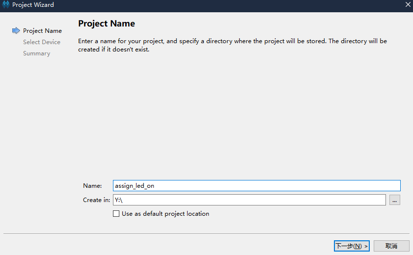

然后在下面的芯片型号中选择 GW2A-LV18PG256C8/I7，使用上面的筛选能够更快地选择到正确的型号。注意 Device 那一栏为 GW2A-18C


然后点击确定后就可以进行最终项目预览了。确认无误后就完成工程创建了。

## 编写代码

### 新建文件

高云半导体 IDE 提供了三种新建文件的方法。在此我们直接使用快捷键 `Ctrl + N` 来新建文件，其他两种不在此讲述。

在弹出的窗口中选择 `Verilog File`，会 VHDL 的也可以选择下面的 `VHDL File`，这篇文章只用 Verilog 来做点灯示例。


    
点击 OK 之后会提示让我们输入文件名称，此处以 `led` 为文件名做示范。

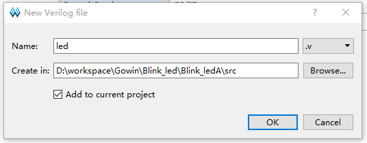

到这里我们就完成文件的创建了，可以直接编写代码了。

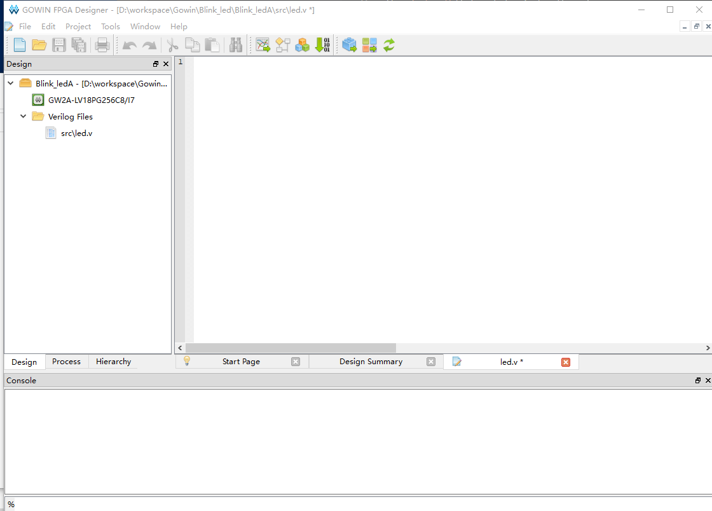

### Verilog 简单说明

Verilog 是一种硬件描述语言，用来对数字电路进行抽象化描述。

Verilog 的基本设计单元是“模块”(module)。

一个模块是由两部分组成的：一部分描述接口，另一部分描述内部逻辑功能，即定义输入是如何影响输出的。

一个模块长成这样：

```v
module module_name
#(parameter)
(port) ;
    function   
endmodule
```

模块整体结构由 module 和 endmodule 组成，module 后面跟着的是模块的名称(module_name)，可传递变量参数(parameter)，端口及其方向的申明(port)，紧接着就是内部逻辑功能描述(function) ,最后用 endmodule 来表示这一个模块，描述完毕。

内部逻辑功能通常由 assign 和 always 块完成；其中 assign 语句描述逻辑功能，always 块常用于描述时序功能。

### 代码思路

根据我们的 Dock 底板 [原理图](https://dl.sipeed.com/shareURL/TANG/Primer_20K/02_Schematic)，可以看到我们将 IO 控制为底的时候，LED 会亮起来。

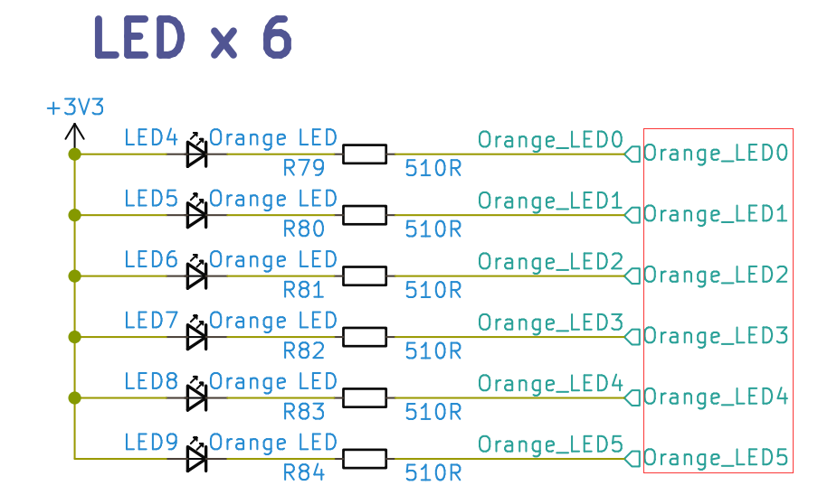

知道怎么样能让灯亮起来后，就快点编写代码吧

### 代码描述

```v
module assign_led_on(
    output led_voltage_level
);
    assign led_voltage_level = 1'b0 ;
endmodule
```

上面的代码，定义了一个名为 assign_led_on 得模块，一个名为 led_voltage_level 的输出端口。 `assign` 语句约束了 led_voltage_level 的值，使其值保持为 0。后面再将这个端口绑定到 FPGA 芯片的引脚上后，就可以得到一个电平状态为低电平的引脚，借此来使 LED 亮起来。

## 综合、约束、布局布线

### 综合

代码保存后，可以双击 IDE 内部的 Process -> Synthesize 来进行代码综合，将 verilog 代码内容转换为综合网表。

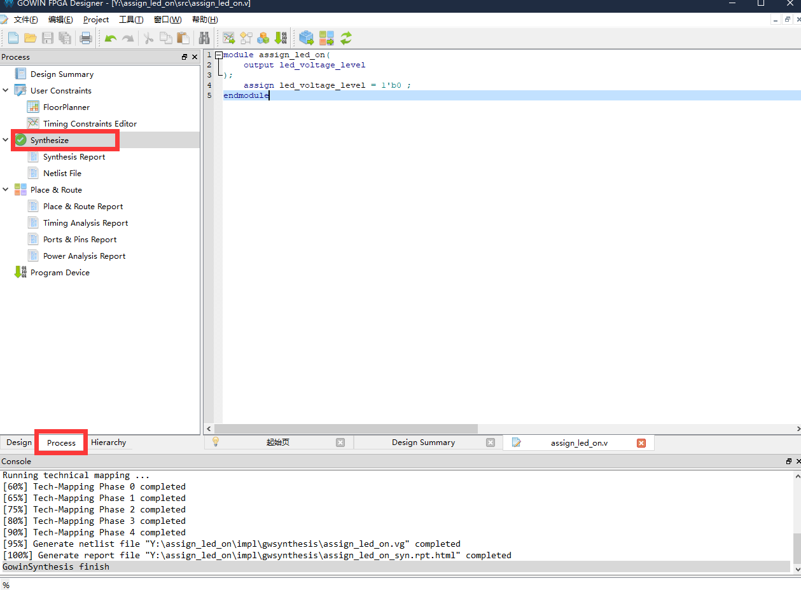

关于网表有兴趣的可以自己去查阅相关资料，此处不再额外说明。

### 约束

综合完之后我们需要进行管脚约束，才能将所编写的模块端口与 FPGA 引脚相对应，并且实现模块的功能。

点击上图 Synthesize 上面的 FloorPlanner 来进行管脚约束。


由于是首次创建，所以会弹出下面的对话框，点击 OK 后就弹出了图形化约束交互界面。

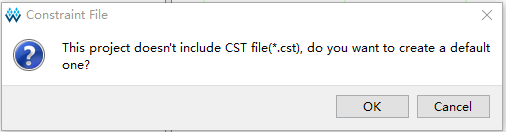


关于约束的方法可以查看 [SUG935-1.3_Gowin设计物理约束用户指南.pdf](http://cdn.gowinsemi.com.cn/SUG935-1.3_Gowin%E8%AE%BE%E8%AE%A1%E7%89%A9%E7%90%86%E7%BA%A6%E6%9D%9F%E7%94%A8%E6%88%B7%E6%8C%87%E5%8D%97.pdf)

此处因个人喜所以仅使用下图中 IO Constranins 方法来约束引脚：

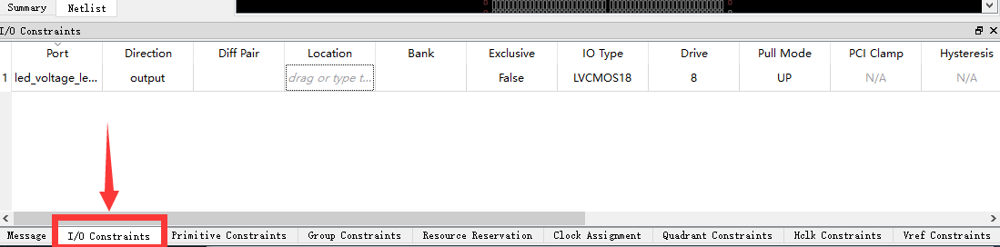

根据下面 Dock 底板原理图，决定点亮 LED4，对应在 FPGA 上的引脚为 L14。


因此对于在 FloorPlanner 交互窗口下面的 IO Constranins 中将 PORT（端口）与 Location（引脚） 分别填入下面的值：

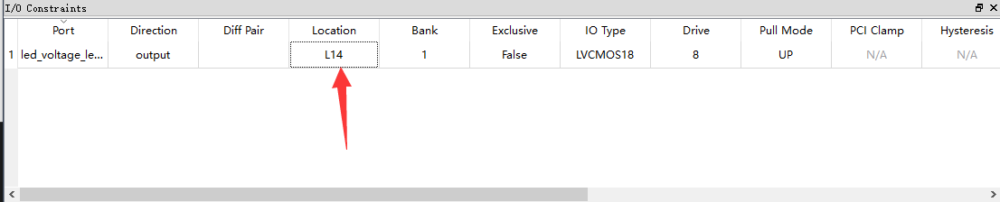

输入完毕后快捷键 Ctrl + S 来保存一下引脚约束，然后接可以关闭 FloorPlanner 的交互图形界面了。

接着发现在工程项目里面多出来刚刚创建的 cst 文件了，里面的内容也比较好理解。

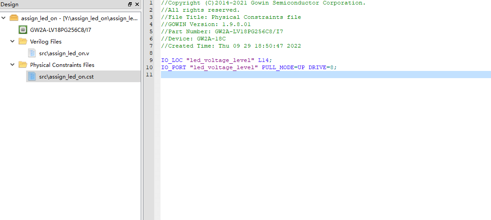

### 布局布线

完成约束后就要开始运行布局布线了，目的是为了把综合所生成的网表与我们自己定义的约束来通过 IDE 算出最优解然后将资源合理地分配在 FPGA 芯片上。

双击下图红框处的 Place&Route 就开始运行了。

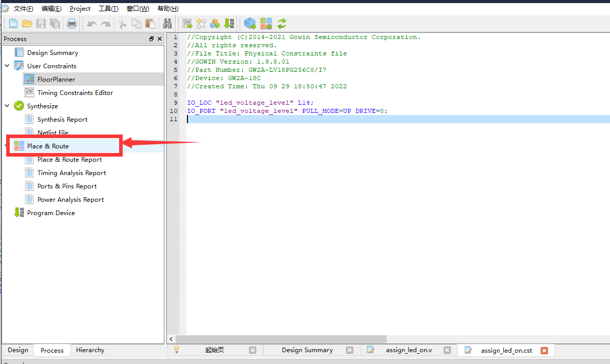

紧接着没有报错，全部通过。就可以开始进行烧录了。

## 烧录固件

Dock 板载了下载器，在 [安装IDE](https://wiki.sipeed.com/hardware/zh/tang/Tang-Nano-Doc/get_started/install-the-ide.html) 的时候我们已经安装了驱动。因此我们将板子与电脑连接起来就行。

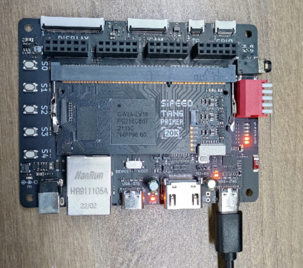

对于 Programmer 软件建议使用高云官网下载到 [点我跳转](http://www.gowinsemi.com.cn/faq.aspx) ，下载下图所示的高云云源编程器软件即可。

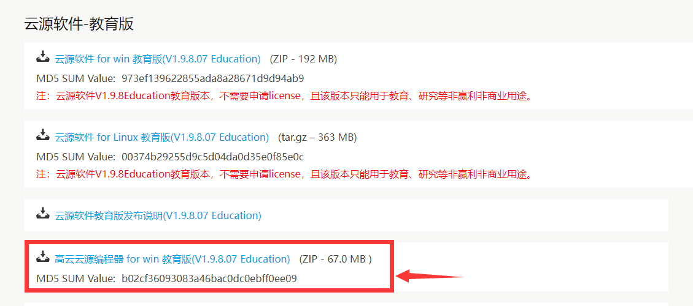

### 扫描设备

在使用 Dock 底板的时候不要忘记使能核心板，按下 1 号拨码开关即可。


双击下图中的下载程序(Program Device) 来运行 Programmer 软件

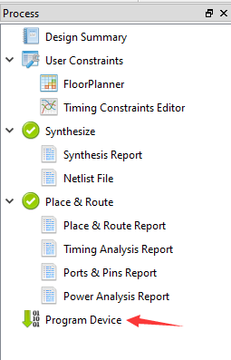

然后在打开的页面中点击一下 scan_device 来扫描到我们的设备。


点击 OK 后就可以进行烧录操作了。

烧录相关的文档可以参考 [SUG502-1.3_Gowin_Programmer用户指南.pdf](http://cdn.gowinsemi.com.cn/SUG502-1.3_Gowin_Programmer%E7%94%A8%E6%88%B7%E6%8C%87%E5%8D%97.pdf)

有问题的话可以前往 [常见问题](https://wiki.sipeed.com/hardware/zh/tang/Tang-Nano-Doc/questions.html) 自行排查。

### 下载到 SRAM

一般来说这个模式是以用来快速验证所生成的固件是否满足自己目的的。

因为其烧录快的特性所以使用的较多，然是当然断电会丢失数据，所以如果想上电运行程序的话是不能选这个的。

点击 Operation 下面的功能框来打开设备设置界面，接着在 Operation 框中选择 SRAM Program 选项来设置为下载到 SRAM ，最后点击下面的那三个点点框来选择我们所生成的 .fs 下载固件。通常来说下载固件生成与工程文件目录下的 impl -> pnr 目录下。

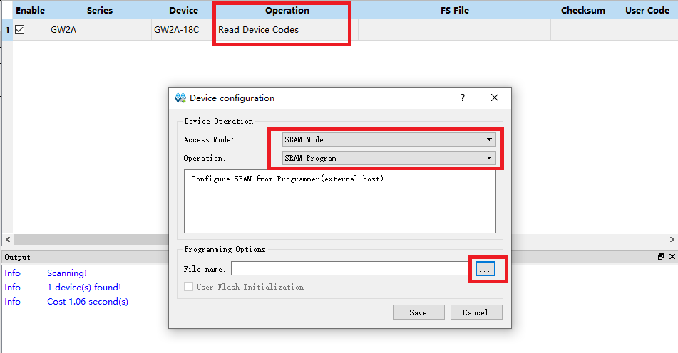

接着来点击红框处开始进行烧录 

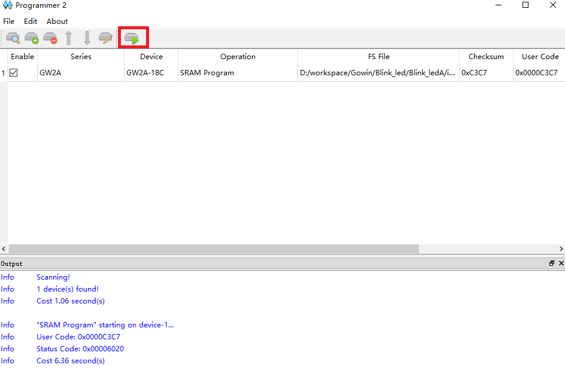

有问题的话可以前往 [常见问题](https://wiki.sipeed.com/hardware/zh/tang/Tang-Nano-Doc/questions.html) 自行排查。

到这里就下载完成了。

### 下载到 Flash

上面说过下载到 SRAM 是为了快速验证，但是不能上电运行程序。
所以想要上电运行的话我们需要设置下载到 Flash。

和上面下载到 SRAM 的步骤几乎类似，先点开 Operation 下面的功能框来打开设备设置界面，接着在 Operation 框中选择 External Flash Mode 选项来设置为下载到外部 Flash ，最后点击下面的那三个点点框来选择我们所生成的 .fs 下载固件，通常来说下载固件生成与工程文件目录下的 impl -> pnr 目录下。最后在下面的外部 Flash 选项中选择设备为 Generic Flash 。

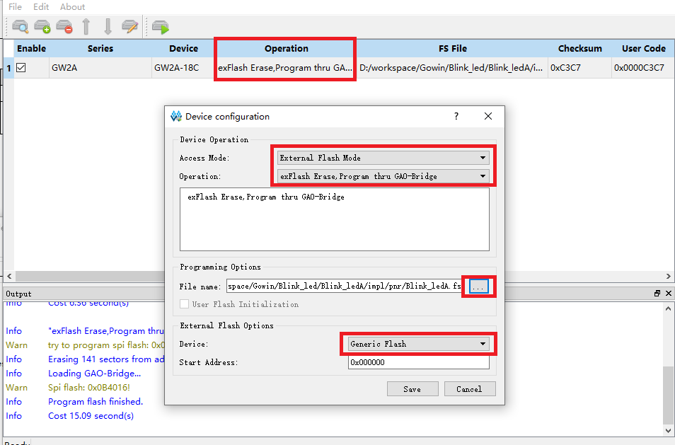

接着来点击红框处开始进行烧录 

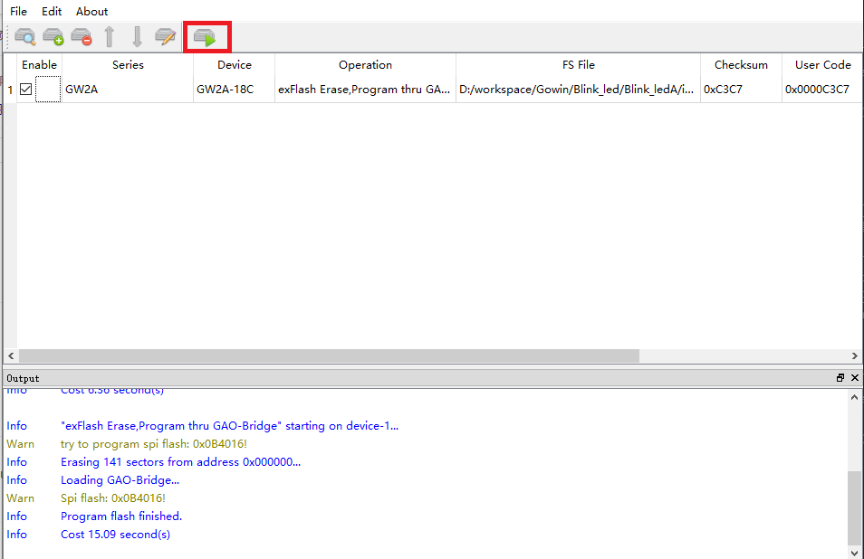

然后我们的程序重新上电也能照样运行了。

有问题的话可以前往 [常见问题](https://wiki.sipeed.com/hardware/zh/tang/Tang-Nano-Doc/questions.html) 自行排查。

## 代码结果

如图所示，只有 LED4 亮着。

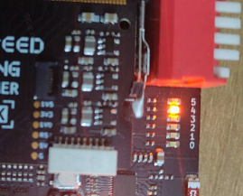

## 结语

到这里我们就已经完成了 FPGA 的 “Hello world” 了。以后的示例工程不会再叙述新建文件等操作了。

## 常见问题

### No Cable found

检查设备管理器里有没有下图这两个，没有的话需要安装 Programmer 驱动。

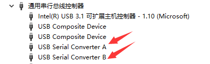

### No gowin device found

确认自己使能了核心板。

### 成功烧录过一次外部 Flash 后 Programmer 软件无法再烧录

注意描述是成功烧录过一次 Flash。
这种情况默认为启用了错误的引脚复用而导致下载器不能再识别到 FPGA 的 JTAG。可以短接 Flash 的 1、4 引脚，让芯片上电时不能正常读 FLASH 。

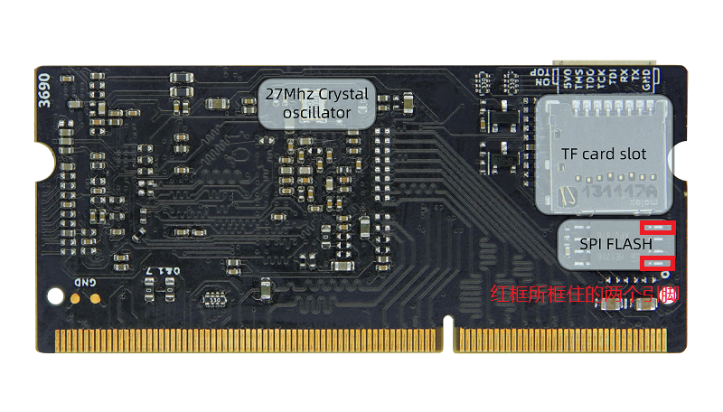

### 更多问题及其解决办法前往[相关问题](./../Tang-Nano-Doc/questions.md)查看