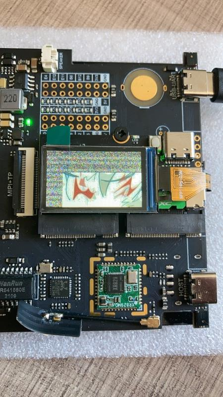
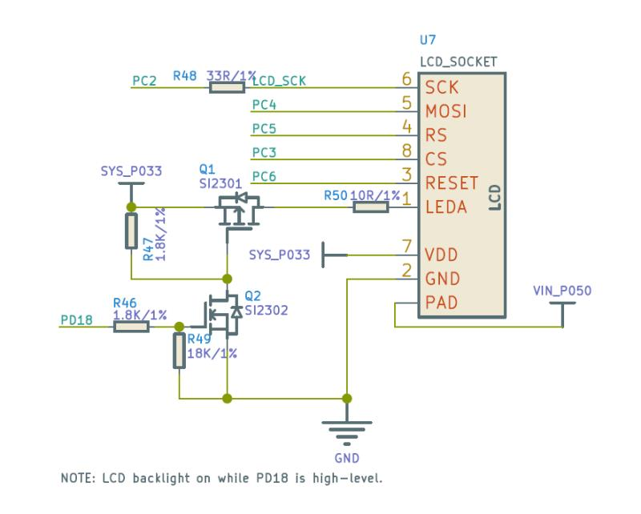
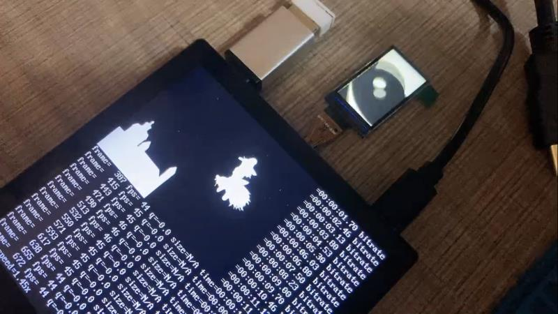

> 编辑于2022年3月28日

[原文链接](http://www.gloomyghost.com/live/20220131.aspx) [原文作者空间](http://www.gloomyghost.com/) 
原创时间: 2022年1月31日

Tina 提供了2种 SPI TFT 显示屏的驱动方式。
- 第一种是官方推荐的 fbdev 方式，使用 Framebuffer implementaion without display hardware of AW 进行 SPI屏幕的驱动。
- 另外一种是使用 fbtft 进行 SPI 屏幕驱动。
 
fbdev 方式由于 pinctrl 在新内核中调用方式出现修改，所以暂时无法使用。修改难度较大。
fbtft 虽然官方wiki表明不建议在 Linux 5.4 中使用，但是其实也是可以使用的，只需要修改一下 GPIO 的注册方式就行。

## 环境搭建

下面三种方法选择一种即可


- [使用sipeed提供的docker](./sipeed_D1_docker.md)
- [使用原文作者的环境](./environment.md)
- [使用D1官方环境](https://d1.docs.aw-ol.com/study/study_2getsdk/)

## 先驱动 SPI 屏幕

这里驱动的屏幕所选择的是 ST7789V SPI

### 修改 FBTFT 驱动

进入 tina-d1-open/lichee/linux-5.4/drivers/staging/fbtft 找到 fbtft-core.c
首先加入将要使用到的头文件

```c
#include <linux/gpio.h>
#include <linux/of_gpio.h>
```

然后找到 static int fbtft_request_one_gpio() 函数，将已经弃用的端口绑定方法改为以下内容

```c
static int fbtft_request_one_gpio(struct fbtft_par *par,
                  const char *name, int index,
                  struct gpio_desc **gpiop)
{
    struct device *dev = par->info->device;
    struct device_node *node = dev->of_node;
    int gpio, flags, ret = 0;
    enum of_gpio_flags of_flags;

    if (of_find_property(node, name, NULL)) {
        gpio = of_get_named_gpio_flags(node, name, index, &of_flags);
        if (gpio == -ENOENT)
            return 0;
        if (gpio == -EPROBE_DEFER)
            return gpio;
        if (gpio < 0) {
            dev_err(dev,
                "failed to get '%s' from DT\n", name);
            return gpio;
        }
        flags = (of_flags & OF_GPIO_ACTIVE_LOW) ? GPIOF_OUT_INIT_LOW :
                            GPIOF_OUT_INIT_HIGH;
        ret = devm_gpio_request_one(dev, gpio, flags,
                        dev->driver->name);
        if (ret) {
            dev_err(dev,
                "gpio_request_one('%s'=%d) failed with %d\n",
                name, gpio, ret);
            return ret;
        }

        *gpiop = gpio_to_desc(gpio);
        fbtft_par_dbg(DEBUG_REQUEST_GPIOS, par, "%s: '%s' = GPIO%d\n",
                            __func__, name, gpio);
    }

    return ret;
}
```

找到 static void fbtft_reset() 函数，将 RST 信号最后拉高

```c
static void fbtft_reset(struct fbtft_par *par)
{
    if (!par->gpio.reset)
        return;
    fbtft_par_dbg(DEBUG_RESET, par, "%s()\n", __func__);
    gpiod_set_value_cansleep(par->gpio.reset, 1);
    msleep(10);
    gpiod_set_value_cansleep(par->gpio.reset, 0);
    msleep(200);
    gpiod_set_value_cansleep(par->gpio.reset, 1);
    msleep(10);
}

```

找到 static void fbtft_set_addr_win() 函数，添加地址偏移。否则会出现下图部分雪花屏现象。



```c
static void fbtft_set_addr_win(struct fbtft_par *par, int xs, int ys, int xe,
			       int ye)
{
	switch(par->info->var.rotate)
	{
		case   0: xs+=53;xe+=53;ys+=40;ye+=40;
				 break;
		case  90: xs+=40;xe+=40;ys+=53;ye+=53;
				 break;
		case 180: xs+=53;xe+=53;ys+=40;ye+=40;
				 break;
		case 270: xs+=40;xe+=40;ys+=53;ye+=53;
				 break;
		default :
				 break;
	}

	write_reg(par, MIPI_DCS_SET_COLUMN_ADDRESS,
		  (xs >> 8) & 0xFF, xs & 0xFF, (xe >> 8) & 0xFF, xe & 0xFF);

	write_reg(par, MIPI_DCS_SET_PAGE_ADDRESS,
		  (ys >> 8) & 0xFF, ys & 0xFF, (ye >> 8) & 0xFF, ye & 0xFF);

	write_reg(par, MIPI_DCS_WRITE_MEMORY_START);
}
```

当前目录下找到 fb_st7789v.c，参照STM32的初始化函数对初始化部分进行修改。

```c
static int init_display(struct fbtft_par *par)
{
    par->fbtftops.reset(par);
    mdelay(50);
    write_reg(par,0x36,0x00);
    write_reg(par,0x3A,0x05);
    write_reg(par,0xB2,0x0C,0x0C,0x00,0x33,0x33);
    write_reg(par,0xB7,0x35);
    write_reg(par,0xBB,0x19);
    write_reg(par,0xC0,0x2C);
    write_reg(par,0xC2,0x01);
    write_reg(par,0xC3,0x12);
    write_reg(par,0xC4,0x20);
    write_reg(par,0xC6,0x0F);
    write_reg(par,0xD0,0xA4,0xA1);
    write_reg(par,0xE0,0xD0,0x04,0x0D,0x11,0x13,0x2B,0x3F,0x54,0x4C,0x18,0x0D,0x0B,0x1F,0x23);
    write_reg(par,0xE1,0xD0,0x04,0x0C,0x11,0x13,0x2C,0x3F,0x44,0x51,0x2F,0x1F,0x1F,0x20,0x23);
    write_reg(par,0x21);
    write_reg(par,0x11);
    mdelay(50);
    write_reg(par,0x29);
    mdelay(200);
    return 0;
}
```

将相关参数配置为屏幕实际大小

```c
static struct fbtft_display display = {
	.regwidth = 8,
	.width = 135,
	.height = 240,
	.gamma_num = 2,
	.gamma_len = 14,
	.gamma = DEFAULT_GAMMA,
	.fbtftops = {
		.init_display = init_display,
		.set_var = set_var,
		.set_gamma = set_gamma,
		.blank = blank,
	},
};
```

### 设备树修改

首先打开电路图，找到 SPI 屏幕的电路。



根据电路，在 tina-d1-open_new/device/config/chips/d1/configs/nezha/board.dts0 文件中 找到 pio 节点，添加 SPI0 所用引脚；spi0_pins_a 作为数据时钟绑定，spi0_pins_b 作为 CS 的绑定，并上拉。RST、DC、背光引脚在这里不做声明。

```dts
&spi0 {
	clock-frequency = <100000000>;
	pinctrl-0 = <&spi0_pins_a &spi0_pins_b>;
	status = "okay";
    
    st7789v@0 {
    	status = "okay";
    	compatible = "sitronix,st7789v";
        reg = <0>;
        spi-max-frequency = <32000000>;
        rotate = <90>;
        rgb;
        fps = <30>;
        buswidth = <8>;
		reset = <&pio PC 6 GPIO_ACTIVE_LOW>;
	    dc = <&pio PC 5 GPIO_ACTIVE_LOW>;
		led = <&pio PD 18 GPIO_ACTIVE_HIGH>;
        debug = <1>;
    };
};
```

最后，将不需要的屏幕关闭，方便调试

```dts
&disp {
	disp_init_enable = <0>;
    ......
}

&lcd0 {
	lcd_used = <0>;
    ......
}

&hdmi {
	hdmi_used = <0>;
    ......
}
```
### 内核配置
进入 kernel_menuconfig ，开启 FBTFT，关闭 RGB、MIPI 所使用的 DISP Driver Support(sunxi-disp2) 输出。

```menuconfig
Device Drivers  --->
	 Graphics support  --->
	 	Frame buffer Devices  --->
	 		 <*> Support for frame buffer devices  --->
	 		 Video support for sunxi  --->
	 		 	 < > DISP Driver Support(sunxi-disp2)
	 [*] Staging drivers  --->
	 	 <*>   Support for small TFT LCD display modules  --->
	 	 	  <*>   FB driver for the ST7789V LCD Controller
```

由于上面配置关闭了 DISP Driver Support(sunxi-disp2) ，所用需要在 menuconfig 里将内核模块关闭，否则会出现找不到驱动的错误。

```menuconfig
Kernel modules  --->
	Video Support  --->
		 < > kmod-sunxi-disp....................................... sunxi-disp support
         < > kmod-sunxi-g2d......................................... sunxi-g2d support 
         < > kmod-sunxi-hdmi....................................... sunxi-hdmi support
         < > kmod-sunxi-uvc......................................... sunxi-uvc support
```

编译，打包，使用 fbviewer 进行测试

```bash
make -j65535
pack

fbviewer Yuzuki.jpg
```


## 修改为双屏驱动

修改双屏也很简单，SPI 屏幕调试完成之后，将刚才关闭的各类驱动打开即可。

### 配置设备树

找到 SPI0 节点，将背光 led 注释掉，查看电路图可知 RGB 屏幕和 SPI 屏幕使用的背光是同一个，这里不需要分开注册。
```dts
&spi0 {
	clock-frequency = <100000000>;
	pinctrl-0 = <&spi0_pins_a &spi0_pins_b>;
	status = "okay";
    
    st7789v@0 {
    	status = "okay";
    	compatible = "sitronix,st7789v";
        reg = <0>;
        spi-max-frequency = <32000000>;
        rotate = <90>;
        rgb;
        fps = <30>;
        buswidth = <8>;
		reset = <&pio PC 6 GPIO_ACTIVE_LOW>;
	    dc = <&pio PC 5 GPIO_ACTIVE_LOW>;
//		led = <&pio PD 18 GPIO_ACTIVE_HIGH>;
        debug = <1>;
    };
};
```

把之前关闭的显示输出重新打开
```dts
&disp {
	disp_init_enable = <1>;
    ......
}

&lcd0 {
	lcd_used = <1>;
    ......
}

&hdmi {
	hdmi_used = <1>;
    ......
}
```
### 配置内核
进入 kernel_menuconfig ，开启 DISP Driver Support(sunxi-disp2) 输出，并选择面板驱动。
```menucnfig
Device Drivers  --->
	 Graphics support  --->
	 	Frame buffer Devices  --->
	 		 <*> Support for frame buffer devices  --->
	 		 Video support for sunxi  --->
	 		 	 <*> DISP Driver Support(sunxi-disp2)
	 		 	 <*> HDMI2.0 Driver Support(sunxi-disp2)
	 		 	 	 HDMI2.0 PHY SELECT. (Allwinner PHY)  --->
	 		 	     LCD panels select  --->
	 		 	 		 [*] LCD support ST7701S RGB panel
	 [*] Staging drivers  --->
	 	 <*>   Support for small TFT LCD display modules  --->
	 	 	  <*>   FB driver for the ST7789V LCD Controller
```
在 menuconfig 里将内核模块重新打开。
```menuconfig
Kernel modules  --->
	Video Support  --->
		 <*> kmod-sunxi-disp....................................... sunxi-disp support
         <*> kmod-sunxi-g2d......................................... sunxi-g2d support 
         <*> kmod-sunxi-hdmi....................................... sunxi-hdmi support
         <*> kmod-sunxi-uvc......................................... sunxi-uvc support
```
编译，打包，测试。这里使用 ffmpeg 进行双屏播放 badapple.mp4


附录：部分设备树完整参考（配置双屏后，HDMI禁用了）
```dts
&pio {
	...前略...
	spdif_pins_b: spdif_sleep@0 {
		pins = "PB0";
		function = "io_disabled";
		drive-strength = <20>;
		bias-disable;
	};

	spi0_pins_a: spi0@0 {
		pins = "PC2", "PC4"; /*clk mosi*/
		function = "spi0";
		drive-strength = <10>;
	};

	spi0_pins_b: spi0@1 {
		pins = "PC3";
		function = "spi0";
		drive-strength = <10>;
		bias-pull-up;   // only CS should be pulled up
	};

	spi1_pins_a: spi1@0 {
		pins = "PD11", "PD12", "PD13","PD14", "PD15"; /*clk mosi miso hold wp*/
		function = "spi1";
		drive-strength = <10>;
	};

	spi1_pins_b: spi1@1 {
		pins = "PD10";
		function = "spi1";
		drive-strength = <10>;
		bias-pull-up;   // only CS should be pulled up
	};

	spi1_pins_c: spi1@2 {
		pins = "PD10", "PD11", "PD12", "PD13","PD14", "PD15";
		function = "gpio_in";
		drive-strength = <10>;
	};

	ledc_pins_a: ledc@0 {
		pins = "PC0";
		function = "ledc";
		drive-strength = <10>;
	};

	ledc_pins_b: ledc@1 {
		pins = "PC0";
		function = "gpio_in";
	};
	
	...后略...
}；

&spi0 {
	clock-frequency = <100000000>;
	pinctrl-0 = <&spi0_pins_a &spi0_pins_b>;
	status = "okay";

    st7789v@0 {
    	status = "okay";
    	compatible = "sitronix,st7789v";
        reg = <0>;
        spi-max-frequency = <32000000>;
        rotate = <90>;
        rgb;
        fps = <30>;
        buswidth = <8>;
		reset = <&pio PC 6 GPIO_ACTIVE_LOW>;
	    dc = <&pio PC 5 GPIO_ACTIVE_LOW>;
//		led = <&pio PD 18 GPIO_ACTIVE_HIGH>;
        debug = <1>;
    };
};

/*----------------------------------------------------------------------------------
disp init configuration

disp_mode             (0:screen0<screen0,fb0>)
screenx_output_type   (0:none; 1:lcd; 2:tv; 3:hdmi;5:vdpo)
screenx_output_mode   (used for hdmi output, 0:480i 1:576i 2:480p 3:576p 4:720p50)
                      (5:720p60 6:1080i50 7:1080i60 8:1080p24 9:1080p50 10:1080p60)
screenx_output_format (for hdmi, 0:RGB 1:yuv444 2:yuv422 3:yuv420)
screenx_output_bits   (for hdmi, 0:8bit 1:10bit 2:12bit 2:16bit)
screenx_output_eotf   (for hdmi, 0:reserve 4:SDR 16:HDR10 18:HLG)
screenx_output_cs     (for hdmi, 0:undefined  257:BT709 260:BT601  263:BT2020)
screenx_output_dvi_hdmi (for hdmi, 0:undefined 1:dvi mode 2:hdmi mode)
screen0_output_range   (for hdmi, 0:default 1:full 2:limited)
screen0_output_scan    (for hdmi, 0:no data 1:overscan 2:underscan)
screen0_output_aspect_ratio  (for hdmi, 8-same as original picture 9-4:3 10-16:9 11-14:9)
fbx format            (4:RGB655 5:RGB565 6:RGB556 7:ARGB1555 8:RGBA5551 9:RGB888 10:ARGB8888 12:ARGB4444)
fbx pixel sequence    (0:ARGB 1:BGRA 2:ABGR 3:RGBA)
fb0_scaler_mode_enable(scaler mode enable, used FE)
fbx_width,fbx_height  (framebuffer horizontal/vertical pixels, fix to output resolution while equal 0)
lcdx_backlight        (lcd init backlight,the range:[0,256],default:197
lcdx_yy               (lcd init screen bright/contrast/saturation/hue, value:0~100, default:50/50/57/50)
lcd0_contrast         (LCD contrast, 0~100)
lcd0_saturation       (LCD saturation, 0~100)
lcd0_hue              (LCD hue, 0~100)
framebuffer software rotation setting:
disp_rotation_used:   (0:disable; 1:enable,you must set fbX_width to lcd_y,
set fbX_height to lcd_x)
degreeX:              (X:screen index; 0:0 degree; 1:90 degree; 3:270 degree)
degreeX_Y:            (X:screen index; Y:layer index 0~15; 0:0 degree; 1:90 degree; 3:270 degree)
devX_output_type : config output type in bootGUI framework in UBOOT-2018.
				   (0:none; 1:lcd; 2:tv; 4:hdmi;)
devX_output_mode : config output resolution(see include/video/sunxi_display2.h) of bootGUI framework in UBOOT-2018
devX_screen_id   : config display index of bootGUI framework in UBOOT-2018
devX_do_hpd      : whether do hpd detectation or not in UBOOT-2018
chn_cfg_mode     : Hardware DE channel allocation config. 0:single display with 6
				   channel, 1:dual display with 4 channel in main display and 2 channel in second
                   display, 2:dual display with 3 channel in main display and 3 channel in second
                   in display.
----------------------------------------------------------------------------------*/
&disp {
	disp_init_enable         = <1>;
	disp_mode                = <0>;

	screen0_output_type      = <1>;
	screen0_output_mode      = <4>;

	screen1_output_type      = <3>;
	screen1_output_mode      = <10>;

	screen1_output_format    = <0>;
	screen1_output_bits      = <0>;
	screen1_output_eotf      = <4>;
	screen1_output_cs        = <257>;
	screen1_output_dvi_hdmi  = <2>;
	screen1_output_range     = <2>;
	screen1_output_scan      = <0>;
	screen1_output_aspect_ratio = <8>;

	dev0_output_type         = <1>;
	dev0_output_mode         = <4>;
	dev0_screen_id           = <0>;
	dev0_do_hpd              = <0>;

	dev1_output_type         = <4>;
	dev1_output_mode         = <10>;
	dev1_screen_id           = <1>;
	dev1_do_hpd              = <1>;

	def_output_dev           = <0>;
	hdmi_mode_check          = <1>;

	fb0_format               = <0>;
	fb0_width                = <0>;
	fb0_height               = <0>;

	fb1_format               = <0>;
	fb1_width                = <0>;
	fb1_height               = <0>;
	chn_cfg_mode             = <1>;

	disp_para_zone           = <1>;
	/*VCC-LCD*/
/*	dc1sw-supply = <&reg_dc1sw>;*/
	/*VCC-DSI*/
/*	eldo3-supply = <&reg_eldo3>;*/
	/*VCC-PD*/
/*	dcdc1-supply = <&reg_dcdc1>;*/
};

/*----------------------------------------------------------------------------------
;lcd0 configuration

;lcd_if:               0:hv(sync+de); 1:8080; 2:ttl; 3:lvds; 4:dsi; 5:edp; 6:extend dsi
;lcd_hv_if             0:Parallel RGB; 8:Serial RGB; 10:Dummy RGB; 11: RGB Dummy;12:CCIR656
;lcd_hv_clk_phase      0:0 degree;1:90 degree;2:180 degree;3:270 degree
;lcd_hv_sync_polarity  0:vs low,hs low; 1:vs high,hslow; 2:vs low,hs high; 3:vs high,hs high
;lcd_hv_syuv_seq       0:YUYV; 1:YVYU; 2:UYVY; 3:VYUY
;lcd_cpu_if            0:18bit/1 cycle parallel(RGB666); 4:16bit/1cycle parallel (RGB565)
;                      6:18bit/3 cycle parallel(RGB666); 7:16bit/2cycle parallel (RGB565)
;lcd_cpu_te            0:frame auto trigger; 1:frame triggered by te rising edge; 2:frame triggered by te falling edge;
;lcd_dsi_if            0:video mode; 1: Command mode; 2:video burst mode
;lcd_dsi_te            0:frame auto trigger; 1:frame triggered by te rising edge; 2:frame triggered by te falling edge;
;lcd_x:                lcd horizontal resolution
;lcd_y:                lcd vertical resolution
;lcd_width:            width of lcd in mm
;lcd_height:           height of lcd in mm
;lcd_dclk_freq:        in MHZ unit
;lcd_pwm_freq:         in HZ unit
;lcd_pwm_pol:          lcd backlight PWM polarity
;lcd_pwm_max_limit     lcd backlight PWM max limit(<=255)
;lcd_hbp:              hsync back porch(pixel) + hsync plus width(pixel);
;lcd_ht:               hsync total cycle(pixel)
;lcd_vbp:              vsync back porch(line) + vysnc plus width(line)
;lcd_vt:               vysnc total cycle(line)
;lcd_hspw:             hsync plus width(pixel)
;lcd_vspw:             vysnc plus width(pixel)
;lcd_lvds_if:          0:single link;  1:dual link
;lcd_lvds_colordepth:  0:8bit; 1:6bit
;lcd_lvds_mode:        0:NS mode; 1:JEIDA mode
;lcd_frm:              0:disable; 1:enable rgb666 dither; 2:enable rgb656 dither
;lcd_io_phase:         0:noraml; 1:intert phase(0~3bit: vsync phase; 4~7bit:hsync phase;
;                      8~11bit:dclk phase; 12~15bit:de phase)
;lcd_gamma_en          lcd gamma correction enable
;lcd_bright_curve_en   lcd bright curve correction enable
;lcd_cmap_en           lcd color map function enable
;deu_mode              0:smoll lcd screen; 1:large lcd screen(larger than 10inch)
;lcdgamma4iep:         Smart Backlight parameter, lcd gamma vale * 10;
;                      decrease it while lcd is not bright enough; increase while lcd is too bright
;smart_color           90:normal lcd screen 65:retina lcd screen(9.7inch)
;Pin setting for special function ie.LVDS, RGB data or vsync
;   name(donot care) = port:PD12<pin function><pull up or pull down><drive ability><output level>
;Pin setting for gpio:
;   lcd_gpio_X     = port:PD12<pin function><pull up or pull down><drive ability><output level>
;Pin setting for backlight enable pin
;   lcd_bl_en     = port:PD12<pin function><pull up or pull down><drive ability><output level>
;fsync setting, pulse to csi
;lcd_fsync_en          (0:disable fsync,1:enable)
;lcd_fsync_act_time    (active time of fsync, unit:pixel)
;lcd_fsync_dis_time    (disactive time of fsync, unit:pixel)
;lcd_fsync_pol         (0:positive;1:negative)
;gpio config: <&pio for cpu or &r_pio for cpus, port, port num, pio function,
pull up or pull down(default 0), driver level(default 1), data>
;For dual link lvds: use lvds2link_pins_a  and lvds2link_pins_b instead
;For rgb24: use rgb24_pins_a  and rgb24_pins_b instead
;For lvds1: use lvds1_pins_a  and lvds1_pins_b instead
;For lvds0: use lvds0_pins_a  and lvds0_pins_b instead
;----------------------------------------------------------------------------------*/
&lcd0 {
	lcd_used        = <1>;
	lcd_driver_name = "st7701s_rgb";

	lcd_if          = <0>;
	lcd_hv_if       = <0>;

	lcd_width       = <70>;
	lcd_height      = <72>;
	lcd_x           = <480>;
	lcd_y           = <480>;
	lcd_dclk_freq   = <19>;
	lcd_hbp         = <60>;
	lcd_ht          = <612>;
	lcd_hspw        = <12>;
	lcd_vbp         = <18>;
	lcd_vt          = <520>;
	lcd_vspw        = <4>;

	lcd_backlight   = <50>;
	lcd_pwm_used    = <1>;
	lcd_pwm_ch      = <7>;
	lcd_pwm_freq    = <20000>;
	lcd_pwm_pol     = <1>;
	lcd_bright_curve_en = <0>;

	lcd_frm         = <1>;
	lcd_io_phase    = <0x0000>;
	lcd_gamma_en    = <0>;
	lcd_cmap_en     = <0>;
	lcd_hv_clk_phase= <0>;
	lcd_hv_sync_polarity= <0>;
	lcd_rb_swap          = <0>;

	lcd_power       = "vcc-lcd";
	lcd_pin_power   = "vcc-pd";
	lcd_gpio_0      = <&pio PG 13 GPIO_ACTIVE_HIGH>;
	lcd_gpio_1      = <&pio PE 14 GPIO_ACTIVE_HIGH>;
	lcd_gpio_2      = <&pio PE 12 GPIO_ACTIVE_HIGH>;
	lcd_gpio_3      = <&pio PE 15 GPIO_ACTIVE_HIGH>;
	pinctrl-0       = <&rgb18_pins_a>;
	pinctrl-1       = <&rgb18_pins_b>;
};


&hdmi {
	hdmi_used = <0>;
	hdmi_power_cnt = <0>;
	hdmi_cts_compatibility = <1>;
	hdmi_hdcp_enable = <1>;
	hdmi_hdcp22_enable = <0>;
	hdmi_cec_support = <1>;
	hdmi_cec_super_standby = <0>;

	ddc_en_io_ctrl = <0>;
	power_io_ctrl = <0>;
};
```