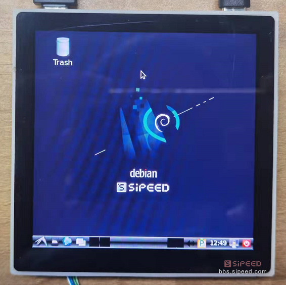
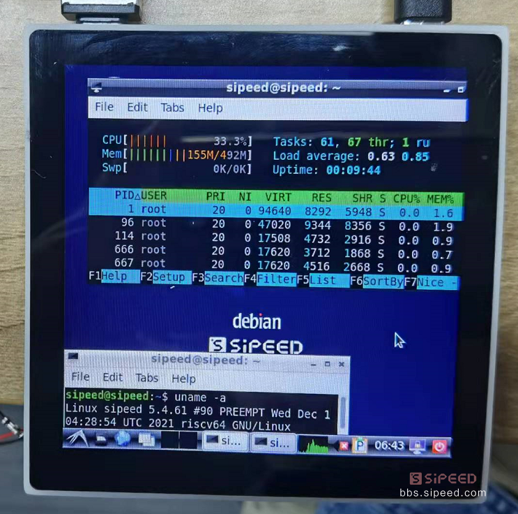
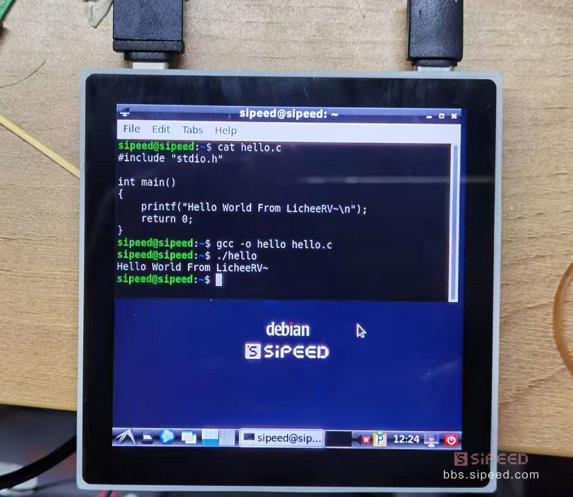

# 基础上手

## 点灯教程

当我们成功进入系统后，就可以进行基础的点灯操作啦！
（注：该教程不适用于 `86-panel`，因为对应引脚连接了外设，`86-panel` 用户可以拆下核心板来操作实验）

核心板的螺丝固定焊盘旁有一颗 LED ，查看原理图：https://dl.sipeed.com/shareURL/LICHEE/D1/HDK/Lichee_RV/2_Schematic

可知该 LED 连接的是 PC1，换算该 IO 的数字标号为：2*32+1=65，或者查看 IO 复用情况表：

```
cat /sys/kernel/debug/pinctrl/2000000.pinctrl/pinmux-pins
...
pin 64 (PC0): device 2008000.ledc function ledc group PC0
pin 65 (PC1): UNCLAIMED
pin 66 (PC2): UNCLAIMED
pin 67 (PC3): UNCLAIMED
pin 68 (PC4): UNCLAIMED
pin 69 (PC5): UNCLAIMED
pin 70 (PC6): UNCLAIMED
pin 71 (PC7): UNCLAIMED

```

我们先导出该 GPIO：

```
echo 65 > /sys/class/gpio/export
cd /sys/class/gpio/gpio65
```

然后再将该 IO 置为输出状态，即可操作其电平：

```
echo out>direction
echo 1 > value  #LED点亮
echo 0 > value  #LED熄灭
```

至此我们就成功在 RISC-V 64 D1上点灯啦~

你也可以对 串行RGB LED WS2812 进行花式点灯：

```
cd /sys/class/leds/
echo 255 > /sys/class/leds/sunxi_led0r/brightness;echo 0 > /sys/class/leds/sunxi_led0g/brightness;echo 0 > /sys/class/leds/sunxi_led0b/brightness;
echo 0 > /sys/class/leds/sunxi_led0r/brightness;echo 255 > /sys/class/leds/sunxi_led0g/brightness;echo 0 > /sys/class/leds/sunxi_led0b/brightness;
echo 0 > /sys/class/leds/sunxi_led0r/brightness;echo 0 > /sys/class/leds/sunxi_led0g/brightness;echo 255 > /sys/class/leds/sunxi_led0b/brightness;
```

## 外设功能验证

> 注意！！！
> 目前在 debian 系统下，蓝牙暂时不可以用！！

### 音频功能

录音设备查看

```
root@MaixLinux:~# arecord -l
**** List of CAPTURE Hardware Devices ****
card 0: audiocodec [audiocodec], device 0: SUNXI-CODEC 2030000.codec-0 []
  Subdevices: 1/1
  Subdevice 0: subdevice 0
card 1: snddmic [snddmic], device 0: 2031000.dmic-dmic-hifi dmic-hifi-0 []
  Subdevices: 1/1
  Subdevice 0: subdevice 0
card 2: sndhdmi [sndhdmi], device 0: 2034000.daudio-audiohdmi-dai 20340a4.hdmiaudio-0 []
  Subdevices: 1/1
  Subdevice 0: subdevice 0

```

播放设备查看

```
root@MaixLinux:~# aplay -l
**** List of PLAYBACK Hardware Devices ****
card 0: audiocodec [audiocodec], device 0: SUNXI-CODEC 2030000.codec-0 []
  Subdevices: 1/1
  Subdevice 0: subdevice 0
card 2: sndhdmi [sndhdmi], device 0: 2034000.daudio-audiohdmi-dai 20340a4.hdmiaudio-0 []
  Subdevices: 1/1
  Subdevice 0: subdevice 0

```

录放音测试：

```
arecord -D hw:1,0 -f S16_LE -t wav -d 3 t.wav 
aplay -D hw:0,0 t.wav
```

另外可以使用alsamixer 进行音量调整

### USB功能

默认内核支持外挂U盘的驱动，插上U盘后可以使用 fdisk -l 查看到新增的 /dev/sda

如果U盘没有被格式化，可以使用mkfs.vfat指令来格式化U盘，再使用mount指令挂载

默认Tina固件里的 /dev/mmcblk0p8 分区即可使用上述方式格式化后挂载，来提升可用空间

### 有线网络

LicheeRV-86 Panel 支持百兆网络，使用套餐附送的网线尾线接上网线后，执行以下指令来连接有线网络

```
ifconfig eth0 up
udhcpc -ieth0
```

### 无线网络

- **使用 Tina 系统**
  LicheeRV 底板默认使用XR829或者RTL8723BS wifi模块，可以使用以下指令进行联网操作

  先配置热点信息：

  ```
  vim /etc/wifi/wpa_supplicant.conf
  network={  
      ssid="WiFi_name"  
      psk="WiFi_password"  
  } 
  ```

  配置完成后重启，ifconfig wlan0 up; udhcpc -iwlan0 即可连上对应的wifi。连上网络后，你就可以使用ssh远程登录板卡，或者使用scp来进行文件传输啦~

- **使用 debian 系统**
  点击系统菜单--Preferenes--Connman Settings，打开 Network Settings ，查看网络属性中的 Interface 是否为 wlan0。双击网络名称，并输入 WiFi 密码进行连接

  

  连接网络成功之后，通过系统系统菜单--Preferenes--Connman Settings，查看网络属性查看网络的 IP 地址

  


### 屏显触摸

LicheeRV系列支持以下显示屏：
- SPI屏		1.14寸屏(TODO)
- RGB屏		4.3寸 480x272；5.0寸 800x480；
- RGB+SPI屏	4.0寸 480x480(st7701s); 4.0寸 720x720(nv3052c)
- MIPI屏		8.0寸 1280x720(ILI9881C)


Tina下可以通过以下指令测试屏幕显示：

  fbviewer xxx.jpg

如果需要调试屏幕驱动，可以使用以下指令查看屏幕驱动信息：

```
cat /sys/class/disp/disp/attr/sys

screen 0:
de_rate 300000000 hz, ref_fps:60
mgr0: 480x480 fmt[rgb] cs[0x204] range[full] eotf[0x4] bits[8bits] err[0] force_sync[0] unblank direct_show[false] iommu[1]
dmabuf: cache[0] cache max[0] umap skip[0] overflow[0]
	lcd output	backlight( 50)	fps:59.5	esd level(0)	freq(60)	pos(0)	reset(0)	 480x 480
	err:0	skip:184	irq:230715	vsync:0	vsync_skip:0
   BUF    enable ch[1] lyr[0] z[16] prem[N] a[globl 255] fmt[  0] fb[ 480, 480; 480, 480; 480, 480] crop[   0,   0, 480, 480] frame[   0,   0, 480, 480] addr[ffe00000,       0,       0] flags[0x       0] trd[0,0]

```

屏幕彩条测试：echo 1 > /sys/class/disp/disp/attr/colorbar

如果你购买的是86面板套餐，可以使用 ts_test进行触摸测试

> 注意触摸驱动有瑕疵，ts_test测试时松开后，光标会不动，但是终端仍会正常打印信息

### 视频播放

最终我们可以尝试在LicheeRV上播放BadApple啦~[视频下载](https://dl.sipeed.com/shareURL/LICHEE/D1/Lichee_RV/MP4)

Tina镜像中内置了ffmpeg软件包，ffmpeg是强大的多媒体库，可以用于录屏或者播放

录屏指令：ffmpeg -f fbdev -framerate 10 -i /dev/fb0 record.avi

播放指令（分别是扬声器播放音频和hdmi播放音频）：

```
ffmpeg -i /mnt/UDISK/badapple_640480_xvid.mp4 -pix_fmt bgra -f fbdev /dev/fb0 -f alsa hw:0,0  
ffmpeg -i /mnt/UDISK/badapple_640480_xvid.mp4 -pix_fmt bgra -f fbdev /dev/fb0 -f alsa hw:2,0   
```

这里由于是CPU软解，所以测试最高分辨率约为720x540， 再高会变卡

<iframe src="https://player.bilibili.com/player.html?aid=209723771&bvid=BV1xa411r7PP&cid=457742249&page=1" scrolling="no" border="0" frameborder="no" framespacing="0" allowfullscreen="true"> </iframe>

### 麦克风阵列

如果你使用的是dock板，那么还可以外接麦克风阵列版进行声场成像演示：

直接执行debian系统下内置的micarr_0609指令即可

有麦克风阵列相关的二次开发需求，可以联系support@sipeed.com

<iframe src="https://player.bilibili.com/player.html?aid=849734125&bvid=BV1HL4y1H7nv&cid=457750392&page=1" scrolling="no" border="0" frameborder="no" framespacing="0" allowfullscreen="true"> </iframe>

## Debian镜像体验

对于只接触过桌面级系统的开发者，推荐使用Debian镜像，可在上面的网盘里下载

LicheeRV_Debian_86_480p 为 480p的86盒板卡的debian镜像

LicheeRV_Debian_hdmi 为 dock的hdmi输出的debian镜像

如果是其他板卡或者屏幕，请自行使用对应的fex覆盖板级配置。

烧录完成后，插卡启动，稍等2分钟左右，屏幕上就会显示登录界面


输入用户名 sipeed，密码 licheepi，即可进入桌面 （使用USB HOST口外接键鼠输入）


进入桌面后可以进行一些基础操作



接下来让我们尝试在Debian下跑一下Hello World:



另有720P高清屏的效果对比，有米的同学可以考虑入手：


## BSP SDK 开发指南

为了方便用户自行开发，矽速整理发布了 LicheeRV 的bsp开发docker镜像，大家使用该镜像可以快速开始D1的系统级开发。

在网盘中下载对应的docker文件后，解压到tar文件后导入到docker
>docker import licheerv_d1_compile.tar licheerv_d1_compile:lastest

然后即可run该容器。用户名为`nihao`，密码为`sipeed123`

进入容器后的基础编译操作为：

```
cd ~/sdk/tina-d1-open_new/
source build/envsetup.sh
lunch   #选1
make menuconfig  #去掉里面的 alsa-plugin选项，否则编译不过
make -j8  #按实际CPU性能编译
pack  #打包
```

SDK内置了一些版型的dts，你可以自行选择编辑：
`device/config/chips/d1/configs/nezha/board_xxx.dts`

其他SDK的开发说明，可以参见全志开发平台上下载的相关文档
https://open.allwinnertech.com/
也可以加全志交流QQ群：`498263967`

如果需要自己下载SDK开发，参考全志在线相关网页：https://d1.docs.aw-ol.com/en/

## WAFT 开发指南

TODO