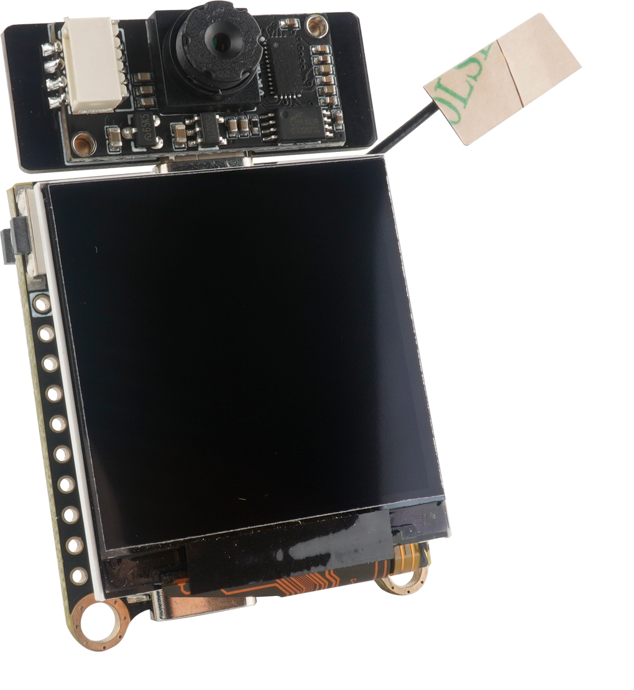

# MaixSense 简介

这个系列和之前的Maix-i系列不同，它不仅仅是一个带AI加速的MCU，还是可以运行Linux系统的开发板。

## MaixSense开发板介绍

MaixSense开发板可能是市面上最小的Linux卡片电脑, 本套件包含一个搭载全志R329的高度集成SOM核心板，以及一个多功能IO扩展底板，可以运行Linux系统, 并具备出色的扩展功能。您可以将它用于搭建个人服务器、开发智能语音助手、设计机器人等场景。它通过内置的周易AIPU处理器同时支持智能语音和视频图像处理，开发者可以直接在开发板上跑通相关CV,NLP等AI模型。

**Tina Linux**：全志科技基于Linux内核开发的针对智能硬件类产品的嵌入式软件系统。Tina Linux基于openwrt-14.07版本的软件开发包,包含了Linux系统开发用到的内核源码、驱动、工具、系统中间件与应用程序包。

但是MaixSense不只是可以运行Tina，还可以运行**armbian**，这是一个真正**完整**的linux系统，armbian是基于debian/ubuntu进行开发的。

|   名称   |               armbian               |               Tina               |
| ------ | --------------------------------- | ------------------------------ |
|   简介   | 专门用于`ARM`开发板的`Debian` |    全志深度修改OpenWRT1404的系统     |
|   特点   |        主线化Linux，功能丰富        |        厂商深度修改，软硬件契合度高        |
| 适用人群 |       极客，嵌入式入门玩家等        | 深度开发，需要自行定制等开发人员 |

## MaixSense外观预览

 

## MaixSense基本参数

<table role="table" class="center_table">
    <thead>
        <tr>
            <th colspan = "2">MaixSense基本参数</th>   
        </tr>
    </thead>
    <tbody>
    <tr>    
        <td>处理器 CPU</td>
        <td>双核 ARM CortexTM-A53, ARM v8 架构,z</td>
    </tr>
    <tr>
        <td>AIPU(NPU)</td>
        <td>搭载周易TZ1AIPU，最大支持0.25TOPS@600MHz</td>
    </tr>
    <tr>
        <td>DRAM</td>
        <td>SIP 256MB DDR3</td>
    </tr>
    <tr>
        <td>存储</td>
        <td>可使用核心板搭载的 SPINAND (默认空贴)存储 可使用底板搭载的SD卡座</td>
    </tr>
    <tr>
        <td>video Encoder 视频编码器</td>
        <td>H264/5 &JPEG,最大720p@30fps</td>
    </tr>
    <tr>
        <td>摄像头</td>
        <td>出厂默认OV9732，最高支持720P@30fps HD 采用USB-C连接器,支持正反插(可分别用作前后摄)</td>
    </tr>
    <tr>
        <td>麦克风</td>
        <td>两个模拟MEMS麦克风，平均灵敏度91dB SPL@1kHz</td>
    </tr>
    <tr>
        <td>屏幕</td>
        <td>1.5寸SPI总线屏幕,屏幕接口采用0.5mm 12P FPC，分辨率240*240</td>
    </tr>
    <tr>
        <td>按键</td>
        <td>1个复位按键和4个用户按键(ADC按键)，1个下载按键(FEL)</td>
    </tr>
    <tr>
        <td>IO引出</td>
        <td>3*10P 2.54mm 引出4个电源引脚(5V/GND)11个GPIO引脚 1个4PMX1.25插座(引出2*GPIO和5V/GND)s</td>
    </tr>
    <tr>
        <td>以太网接口</td>
        <td>在核心板以24P 0.5mm间距FPC的形式引出，用于连接相应PHY</td>
    </tr>
    </tbody>
</table>

