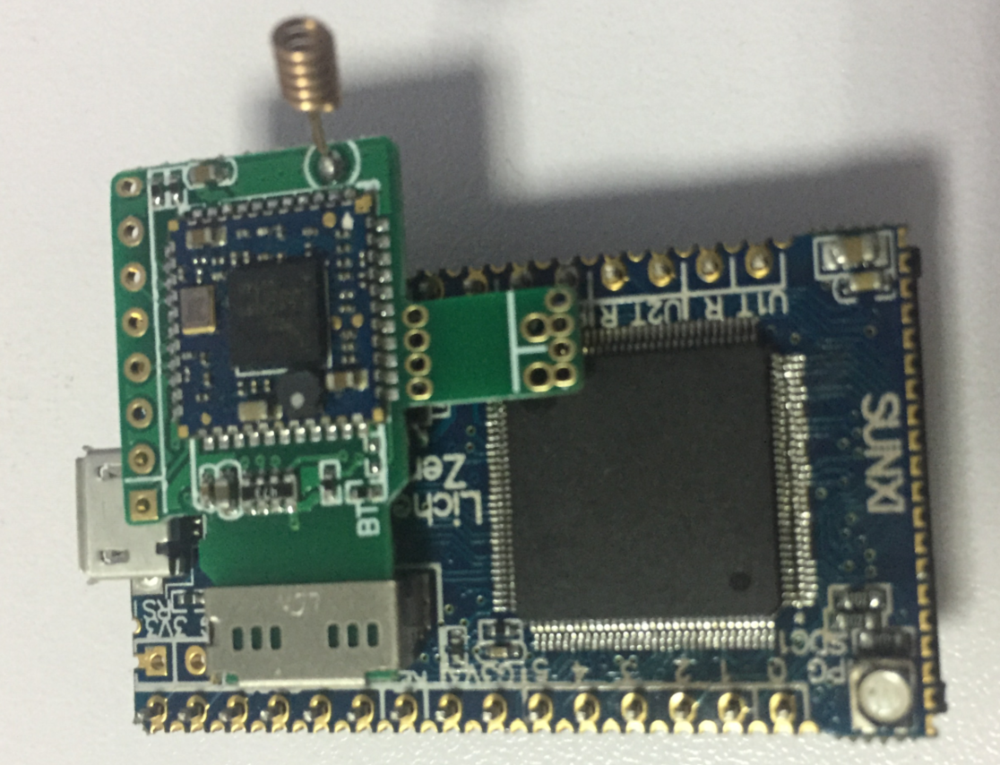
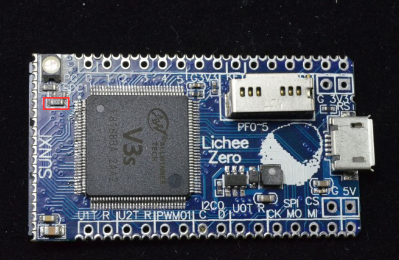
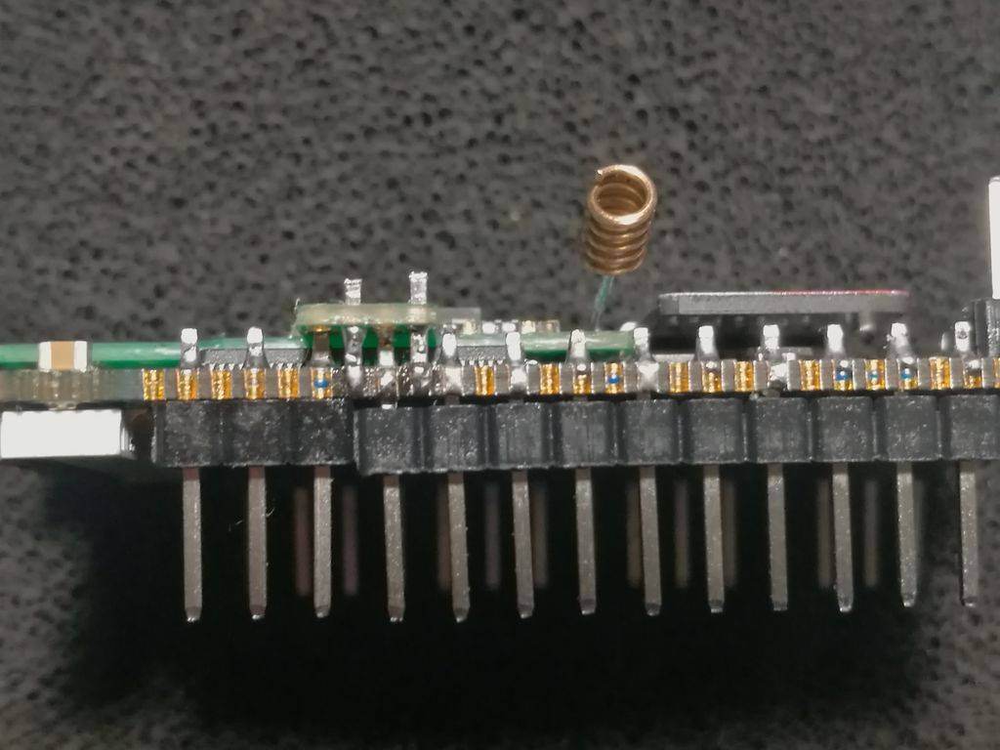

## TF WiFi的硬件安装


TF WiFi可以使用插卡形式或者堆叠形式。

### 插卡形式安装

直接在Zero上插卡形式安装，会占用SDC0接口，所以只能从SPI Flash启动。

此时，仅能使用WiFi功能，BT由于未接线而无法使用。




### 堆叠形式安装

对于小体积应用，推荐使用堆叠形式安装，有多种安装方式：

### 前置步骤

注意，初版Zero有一个阻值错误，导致WiFi无法启用，为下图红圈处电阻。
修复方法为： **去除该电阻（推荐）** ，或者更换成510欧电阻。




### 堆叠焊接于顶部

此为默认的安装形式如图所示，焊接上方SDIO
WiFi的8个引脚，下方BT的4个引脚。


TF WiFi 2.54间距的焊盘，可以直接插入插针焊接。

BT有2个1.27偏移的焊盘，建议焊接方法如下所示：

取2Pin
排针，插入焊盘，接于半孔上，焊接上下两侧，最后用剪刀或者钳子去除多余部分。




此焊接方式，可使得板子最为紧凑，但缺点是发热大户CPU和WiFi直接贴合在一起，可导致温度达到60度以上。

### 堆叠焊接于底部

堆叠焊于底部，可使散热情况优于前者，但需要注意两点:

1.  下图红圈处需要剪断，否则无法插屏幕
2.  天线要弯过来，或者重新焊接到背面。


### 堆叠插拔形式

如果不想把TF WiFi焊死上去，可以使用排座焊接到TF WiFi上，插拔使用：


## WiFi使用方法


网盘中提供的镜像的root目录下提供了r8723bs.ko, 开机后，执行

    insmod r8723bs.ko
    ifconfig wlan0 up

来启动无线接口

编辑好 `/etc/wpa_supplicant.conf` 后，执行 *connect\_wx.sh* 来连接网络。

## 蓝牙使用方法


下载或clone下面的源码，编译
<https://github.com/NextThingCo/rtl8723bs_bt>

首先在dts里使能UART：

```
uart0_pins_a: uart0@0 { pins = "PB8", "PB9";function = "uart0";bias-pull-up; };
uart1_pins_a: uart1@0 { pins = "PE21", "PE22";function = "uart1";bias-pull-up; };
uart2_pins_a: uart2@0 { pins = "PB0", "PB1";function = "uart2";bias-pull-up; };
sun8i-v3s-licheepi-zero.dts:
&uart0 { pinctrl-0 = <&uart0_pins_a>;pinctrl-names = "default";status = "okay"; };
&uart1 { pinctrl-0 = <&uart1_pins_a>;pinctrl-names = "default";status = "okay"; };
&uart2 { pinctrl-0 = <&uart2_pins_a>;pinctrl-names = "default";status = "okay"; };
```

再在内核里使能蓝牙功能：

    []Networking support->Bluetooth subsystem support
    []Networking support->Bluetooth subsystem support->Bluetooth device->
    HC UART driver->Three-wire UART (H5) protocol support

最后就可以在终端里开启蓝牙，扫描使用设备了：

```
./start_bt.sh ttyS2
hciconfig -a
hciconfig hci0 up
hcitool scan
```

## 常见WiFi错误排查


### wifi驱动加载成功，但是ifconfig -a没有wlan0


```
root@LicheePi:~# insmod r8723bs.ko 
[   37.054004] r8723bs: loading out-of-tree module taints kernel.
[   37.090084] RTL8723BS: module init start
[   37.094173] RTL8723BS: rtl8723bs v4.3.5.5_12290.20140916_BTCOEX20140507-4E40
[   37.101496] RTL8723BS: rtl8723bs BT-Coex version = BTCOEX20140507-4E40
[   37.108377] RTL8723BS: module init ret =0
root@LicheePi:~# ifconfig -a
lo        Link encap:Local Loopback  
        inet addr:127.0.0.1  Mask:255.0.0.0
        UP LOOPBACK RUNNING  MTU:65536  Metric:1
        RX packets:0 errors:0 dropped:0 overruns:0 frame:0
        TX packets:0 errors:0 dropped:0 overruns:0 carrier:0
        collisions:0 txqueuelen:1000 
        RX bytes:0 (0.0 B)  TX bytes:0 (0.0 B)

usb0      Link encap:Ethernet  HWaddr 96:c0:f5:f1:ab:22  
        BROADCAST MULTICAST  MTU:1500  Metric:1
        RX packets:0 errors:0 dropped:0 overruns:0 frame:0
        TX packets:0 errors:0 dropped:0 overruns:0 carrier:0
        collisions:0 txqueuelen:1000 
        RX bytes:0 (0.0 B)  TX bytes:0 (0.0 B)
```

检查第一分区中的boot.scr是否正确：

```
root@LicheePi:~# mount /dev/mmcblk0p1 /mnt/
root@LicheePi:~# ls /mnt/
boot.scr             sun8i-v3s-licheepi-zero-dock.dtb  zImage
sun8i-v3s-licheepi-zero-ctc.dtb  sun8i-v3s-licheepi-zero.dtb
root@LicheePi:~# cat /mnt/boot.scr 
'V·z?Xցܣ]Mڳetenv bootargs console=ttyS0,115200 panic=5 console=tty0 rootwait root=/dev/mmcblk0p2 earlyprintk rw
load mmc 0:1 0x41000000 zImage
load mmc 0:1 0x41800000 sun8i-v3s-licheepi-zero-ctc.dtb   <--这里使用了错误的dtb
bootz 0x41000000 - 0x41800000
```

从网盘中获取正确的dtb来覆盖，具有wifi功能的dtb是sun8i-v3s-licheepi-zero-dock.dtb

## wifi驱动加载失败


```
root@LicheePi:~# insmod r8723bs.ko 
insmod: ERROR: could not insert module r8723bs.ko: Invalid module format
```

使用了错误内核的wifi模块，请到网盘或者qq群文件里重新下载最新的ko文件加载。

### 间隔1s左右打印sdio RTO 0x52之类的信息

wifi模块焊接不良，或者没有去除之前提到的电阻。
