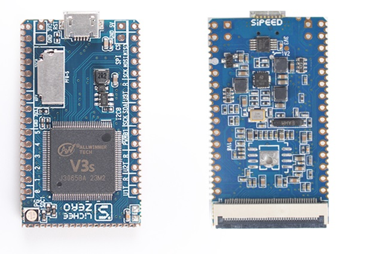

## 简介

**荔枝派Zero**（下面简称 **Zero**）是一款精致迷你的 **Cortex-A7** 核心板/开发板，可用于初学者学习linux或者商用于产品开发。 Zero 在稍长于SD卡的尺寸上（**45x26mm**）提供了丰富的外设（LCD,ETH,UART,SPI,I2C,PWM,SDIO---）和强劲的性能（**24MHZ~1.2GHZ, 64MB DDR** ）。

得益于精巧的的PCB设计，Zero 相关的开发和使用非常方便：

- 直插面包板
- 直插40P RGB LCD
- 使用OTG口进行供电和数据传输(虚拟串口，虚拟以太网等)
- 使用堆叠式的WiFi 模块联网
- 直接贴片

Zero 提供了 **Linux主线** 支持和 全志官方原生 Camdriod（适用于行车记录仪应用）SDK，可以选择你熟悉的系统来进行开发。

## Zero上手提示

对于刚入坑的小白，请先看以下几点基础说明：

1.  Zero 需要插卡启动（或者自行焊接spi flash）；请不要问为什么通电后没反应
2.  TF卡槽是下图中荔枝派logo上方的长方形插槽
3.  收到Zero后看到主芯片上有连锡请不要慌张，这是设计如此（相同的电源管脚），请参阅原理图，[点我下载](https://dl.sipeed.com/fileList/LICHEE/Zero/HDK/lichee_zero_Schematic.pdf)
4.  Zero的系统调试串口是UART0，即下图右下方的“U0T R”标识的两个引脚
5.  Zero正面的led不是上电就闪烁的，请不要认为上电后led不亮就是坏的
6.  Zero的USB是OTG USB，既可以供电，又能通信（比如作为usb虚拟网口与电脑共享网络)
7.  Zero usb口下方的“GND 5V”可以作为电源输入，使用串口小板的5V或者锂电池均可供电。
8.  推荐的两边排针焊接方式是向下焊接。“G 5V”插针推荐向上焊接。
9.  推荐的底层调试接法是：usb转串口小板接“U0T R”和“G 5V”。
10. 推荐的联网方式是：USB虚拟网口 或者 [tf wifi](./../Contribution/article_12.md)。
11. Zero毕竟是上千M主频的Cortex-A7处理器，运行时温度在40\~60℃，请不要认为芯片在此范围内的发热是短路。
12. Zero运行Linux空载电流约100mA，满载电流约150\~180mA，插上LCD电流约200\~300mA。不插卡上电电流约50\~60mA。

如果收到板子后还有其他疑问，请加 **官方交流QQ群：712961164** 。

## 功能框图

## Zero实物图

## 硬件参数

| 项目     | 参数                                                                                                                                                                                                                                              |
| -------- | ------------------------------------------------------------------------------------------------------------------------------------------------------------------------------------------------------------------------------------------------- |
| **CPU**  | 全志V3S， ARM Cortex-A7, 最高1.2GHz                                                                                                                                                                                                               |
| 存储     | - 预留SOP8 SPI Flash焊盘（可定制贴片8\~32MB SPI NorFlash,128MB Nand Flash）     -   板载 半槽TF卡座，可TF启动。                                                                                                                                |
| **内存** | 集成64MB DDR2                                                                                                                                                                                                                                     |
| 显示     | 通用 40P RGB LCD FPC座      -   可直插常见的40P 4.3/5/7寸屏幕（板载背光驱动），通过转接板可插50P 7/9寸屏       -   支持常见的272x480, 480x800,1024x600等分辨率       -   板载电阻式触摸屏芯片，支持电阻屏       -   板载RGB LED       |
| 通信接口 | -   SDIO x2，可搭配配套SDIO WiFi+BT 模块      -   SPI x1      -   I2C x2      -   UART x3      -   100M Ether x1（含EPHY）     -   OTG USB x1      -   MIPI CSI x1                                                              |
| 其它接口 | -   PWM x2      -   LRADC x1      -   Speakerx2 + Mic x1                                                                                                                                                                                    |
| 电气特性 | -   Micro USB 5V供电； 2.54mm 插针 3.3V\~5V供电； 1.27mm邮票孔供电      -   输出 3.3V 和 3.0V（AVCC），可选择输入RTC电压      -   1GHz linux空载运行电流 90\~100mA， 满载运行电流 \~180mA      -   存储温度 -40\~125℃，运行温度 -20\~70℃ |

## 其他资料

国内下载链接：
网盘地址：[https://eyun.baidu.com/s/3pLZ8hBH](https://eyun.baidu.com/s/3htTXfaG#sharelink/parent_path=%2F%E6%B7%B1%E5%9C%B3%E7%9F%BD%E9%80%9F%E7%A7%91%E6%8A%80%E6%9C%89%E9%99%90%E5%85%AC%E5%8F%B8&path=%2F%E4%B8%8B%E8%BD%BD%E7%AB%99%E6%96%87%E4%BB%B6%2FLICHEE%2FZero)
下载站：[dl.sipeed.com/shareURL/LICHEE/Zero/HDK](https://dl.sipeed.com/shareURL/LICHEE/Zero/HDK)
